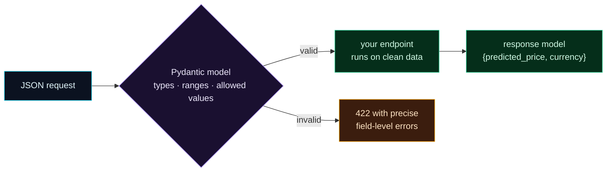

Welcome to **Day 53 of 100 Days of MLOps**. Your API works, but it accepts a raw `dict` — literally any JSON — and checks it by hand inside your function. That's fragile: every field you forget to check is a way for bad data to slip through, and your error messages are only as good as the `if` statements you remember to write. Today you replace all of that with a **Pydantic model**: a typed declaration of exactly what a valid request looks like. FastAPI then validates every request *for you*, automatically, with precise errors — and documents the schema for free.

This is the professional way to define an API's **contract**. Instead of "trust me, I'll check the inputs," you *declare* the rules once, and the framework enforces them on every request, consistently. It's the model signature from Day 35, applied at the API boundary.

> **Declare the contract; let the framework enforce it.** Types and ranges as a Pydantic model replace hand-written validation.

By the end of today you will:

- Define a **request model** with typed fields, ranges, and allowed values.
- Have FastAPI **auto-validate** every request against it.
- Get **precise, field-level 422 errors** for free.
- Define a **response model** that guarantees your output shape.

---

## The contract as a typed model

A Pydantic model is a class where each field has a **type** and optional **constraints**. FastAPI reads it, and any request that doesn't match is rejected *before your code runs* — with an error that names the exact field and problem.



**Reading this diagram:**

On the left, in **cyan**, is an incoming **JSON request**. Before it reaches your code, it hits the **purple Pydantic model** — the gate that checks *types, ranges, and allowed values*. This is the key difference from yesterday: validation happens *at the boundary*, declaratively, not inside your function.

Two outcomes branch out. **Valid** requests flow to the **green** path: your endpoint runs *on already-clean data* (no manual checks needed), and returns a **response** that's itself shaped by a model. **Invalid** requests take the **amber** path: an automatic **422** with *precise, field-level errors* — "field X is required," "value too small," "not an allowed category" — generated by Pydantic, not by you. The takeaway: **the model is the contract, and the framework enforces it every time** — consistent validation and exact errors, with zero hand-written checks.

---

## Define request and response models

Rewrite `app.py` using Pydantic. The `HouseRequest` model declares the contract; `Field` adds range constraints, and `Literal` restricts a field to specific values:

```python
"""app.py — Day 53: typed request/response with Pydantic; FastAPI auto-validates."""
import joblib, pandas as pd
from typing import Literal
from fastapi import FastAPI
from pydantic import BaseModel, Field

_pipeline = joblib.load("model.joblib")
app = FastAPI(title="House Price API")


class HouseRequest(BaseModel):                      # the request CONTRACT
    size_sqft: int = Field(ge=100, le=20000)
    bedrooms: int = Field(ge=1, le=10)
    age_years: int = Field(ge=0, le=150)
    neighborhood: Literal["downtown", "suburb", "rural"]


class PredictionResponse(BaseModel):                # the response CONTRACT
    predicted_price: float
    currency: str = "USD"


@app.post("/predict", response_model=PredictionResponse)
def predict(house: HouseRequest):
    X = pd.DataFrame([house.model_dump()])          # already validated by Pydantic
    price = _pipeline.predict(X)[0]
    return PredictionResponse(predicted_price=round(float(price), 2))
```

Look at what changed from yesterday. The endpoint takes a `HouseRequest` instead of a `dict` — so **there is no manual validation left in the function**. By the time your code runs, `house` is guaranteed valid: every field present, every number in range, `neighborhood` one of three values. And `response_model=PredictionResponse` declares the output shape. `Field(ge=100, le=20000)` means "greater-or-equal 100, less-or-equal 20000"; `Literal[...]` means "must be exactly one of these."

---

## Automatic, precise validation

Now watch FastAPI enforce the contract. A valid request works as before:

```text
valid          -> 200 {'predicted_price': 471358.3, 'currency': 'USD'}
```

But every kind of bad request is caught automatically, with a **422** that pinpoints the problem — no `if` statements required:

```text
missing field  -> 422
    ['body', 'age_years'] Field required
out of range   -> 422
    ['body', 'size_sqft'] Input should be greater than or equal to 100
bad category   -> 422
    ['body', 'neighborhood'] Input should be 'downtown', 'suburb' or 'rural'
```

Read those errors — they're *excellent*. Each names the exact field (`['body', 'age_years']`) and the exact problem in plain language. A client integrating with your API knows immediately what to fix. You wrote none of these messages; Pydantic generated them from your model. Compare this to yesterday's hand-written `"missing fields: [...]"` — same idea, but now it's automatic, consistent, and covers *every* field and constraint you declared.

**The response model earns its keep too.** `response_model=PredictionResponse` means FastAPI validates and shapes your *output*: it guarantees the response has `predicted_price` and `currency`, coerces types, and — importantly — *strips any extra fields* you didn't declare (so you never accidentally leak internal data). Both directions of the API now have a typed contract.

And it's all in the docs: open `/docs` and the Swagger UI shows the exact request schema (with ranges and allowed values) and the response schema, generated from these models. Your API is self-documenting.

---

## Common errors (and how to fix them)

**1. `422` on a request you think is valid**

That's the contract working — read the `detail`. It names the field and the rule it broke (`Field required`, `greater than or equal to`, allowed values). Fix the request, or loosen the model if the rule was wrong.

**2. A category value isn't restricted**

Plain `str` accepts anything. Use `Literal["downtown", "suburb", "rural"]` (or a Python `Enum`) so only valid categories pass — that's what caught `"seaside"` above.

**3. Ranges aren't enforced**

A bare `int` accepts any integer, including absurd ones. Add constraints with `Field(ge=..., le=..., gt=..., lt=...)` so out-of-range values are rejected at the boundary.

**4. Extra fields sneak through (or leak out)**

By default Pydantic ignores unexpected *input* fields; to reject them, add `model_config = ConfigDict(extra="forbid")`. For *output*, `response_model` strips undeclared fields automatically — rely on it so internal data doesn't leak.

**5. `ValidationError` when building the response**

Your returned data doesn't match `PredictionResponse` (wrong type or missing field). Return exactly the declared fields with matching types (`float(...)`), or FastAPI raises a server error.

**6. Optional vs required confusion**

A field with no default is **required**; give it a default (`currency: str = "USD"`) or `Optional[...] = None` to make it optional. Getting this wrong causes surprising `Field required` 422s.

---

## Recap — what you now have

Your API has a real, enforced contract:

- You defined a **request model** with types, ranges (`Field`), and allowed values (`Literal`).
- FastAPI **auto-validates** every request — no manual checks in your function.
- Bad requests get **precise, field-level 422 errors** for free.
- A **response model** guarantees and shapes your output, and `/docs` documents both.

**Your cheat sheet:**

| Piece | Code |
|-------|------|
| Request model | `class HouseRequest(BaseModel): ...` |
| Range constraint | `size_sqft: int = Field(ge=100, le=20000)` |
| Allowed values | `neighborhood: Literal["downtown", "suburb", "rural"]` |
| Use it | `def predict(house: HouseRequest):` |
| Response contract | `@app.post(..., response_model=PredictionResponse)` |

Golden rule: **declare the contract as a Pydantic model** — types, ranges, allowed values — and let FastAPI validate every request and response automatically.

---

## Coming up on Day 54

Your service runs on *your* machine with *your* Python and libraries. To ship it anywhere — a colleague's laptop, a server, the cloud — it needs to carry its whole environment with it. **Day 54 — "Dockerizing Your Model Service"** packages the API, the model, and every dependency into a **Docker image**: a self-contained unit that runs identically on any machine with Docker. You'll write a `Dockerfile` for the FastAPI service and turn "works on my machine" into "runs anywhere" — the standard way ML services are shipped.

See the full roadmap on the [100 Days of MLOps series page](/series/100-days-mlops). See you tomorrow.
