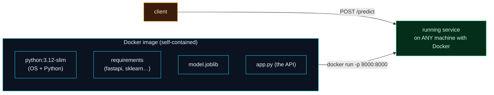

Welcome to **Day 54 of 100 Days of MLOps**. Your FastAPI service works beautifully — on *your* machine, with *your* Python and *your* installed libraries. To run it anywhere else — a teammate's laptop, a server, the cloud, a Kubernetes cluster — it has to bring its entire world with it: the OS, the Python version, every dependency, the model file, and the app. That's exactly what a **Docker image** is, and today you'll package your model service into one.

You met Docker on Day 27 for reproducible *environments*. Today is different in an important way: you're containerising a **long-running service** — a server that stays up and answers requests — not a script that runs once and exits. That changes a couple of things in the Dockerfile, and it's the standard way ML services are shipped to production.

> **Package the service, run it anywhere.** One image bundles the OS, Python, libraries, model, and app — and behaves identically on every machine with Docker.

By the end of today you will:

- Write a **Dockerfile** for a long-running FastAPI service.
- Understand **`EXPOSE`**, **`CMD`** with uvicorn, and binding to **`0.0.0.0`**.
- **Build** an image and **run** it with port mapping.
- Know why this is the unit of deployment for the modules ahead.

---

## An image is your whole service in a box

A container image stacks everything your service needs into one self-contained artifact. Run it on any machine with Docker and you get the *identical* service — same Python, same libraries, same model — reachable over a port you map to the host.



**Reading this diagram:**

The **cyan box** is the **Docker image** — and notice everything stacked inside it: the base **OS + Python** (`python:3.12-slim`), your pinned **dependencies**, the **model file**, and the **app** itself. Nothing is borrowed from the host machine; it's all sealed in. That completeness is the point — the image *is* the whole service.

The arrow shows **`docker run -p 8000:8000`** turning that image into a **green running service** — on *any* machine with Docker, identically. And the **amber client** reaches it by sending a request to the mapped port. The takeaway: **the image bundles your entire service so it runs the same everywhere** — the same idea as Day 27's reproducible environment, now wrapped around a live API that people can call.

---

## The Dockerfile for a service

Create these files alongside your `app.py` and `model.joblib`. First the pinned **`requirements.txt`**:

```text
fastapi==0.139.0
uvicorn[standard]==0.40.0
scikit-learn==1.9.0
pandas==3.0.3
joblib==1.5.3
```

Then the **`Dockerfile`**:

```dockerfile
FROM python:3.12-slim
WORKDIR /app
COPY requirements.txt .
RUN pip install --no-cache-dir -r requirements.txt
COPY . .
EXPOSE 8000
CMD ["uvicorn", "app:app", "--host", "0.0.0.0", "--port", "8000"]
```

The first four lines are familiar from Day 27 (base image, install deps *before* copying code so the install layer caches). The last two are what make it a **service**:

- **`EXPOSE 8000`** documents that the service listens on port 8000.
- **`CMD ["uvicorn", "app:app", ...]`** runs the *server* as the container's main process — it stays up, answering requests, instead of exiting.
- **`--host 0.0.0.0`** is critical: inside a container, binding to `127.0.0.1` makes the service reachable only from *inside* the container. `0.0.0.0` binds all interfaces so it's reachable from outside — this one flag trips up nearly everyone their first time.

Add a **`.dockerignore`** so junk doesn't bloat the image:

```text
__pycache__/
*.pyc
.venv/
```

---

## Build and run

Build the image (the first build downloads the base image and installs dependencies — a minute or two; later builds are cached):

```bash
docker build -t house-api .
```

Run it, mapping the container's port 8000 to your host's port 8000:

```bash
docker run -p 8000:8000 house-api
```

The `-p 8000:8000` is `host:container` — it forwards requests from your machine's port 8000 into the container's port 8000. uvicorn starts up inside the container (`Uvicorn running on http://0.0.0.0:8000`), and now you can call the service exactly as before — but it's running *inside a container*:

```bash
curl -X POST http://127.0.0.1:8000/predict \
  -H 'Content-Type: application/json' \
  -d '{"size_sqft":2000,"bedrooms":4,"age_years":5,"neighborhood":"downtown"}'
```

```text
{"predicted_price":471358.3,"currency":"USD"}
```

Same prediction, same API — but now the service carries its **own** OS, Python, libraries, and model. That `house-api` image is a single artifact you can push to a registry and run on a colleague's laptop, a cloud VM, or a Kubernetes pod, and it will behave **identically** every time. That's the whole promise: your model service is now portable.

> **This image is the unit of deployment.** Everything in the back half of the series builds on it — Module 9 runs images exactly like this on Kubernetes, with autoscaling and safe rollouts. Learning to containerise your service now is what makes all of that possible. (Note: `docker build`/`docker run` need the Docker engine running and network access to pull the base image the first time; if a build hangs at the base image, that's a connectivity issue, not your Dockerfile.)

---

## Common errors (and how to fix them)

**1. The container runs but you can't reach the service**

Almost always one of two things: you bound to `127.0.0.1` instead of **`--host 0.0.0.0`** (so it's only reachable inside the container), or you forgot **`-p 8000:8000`** (so the port isn't mapped to your host). Fix both and `curl localhost:8000` works.

**2. `docker build` hangs at `FROM python:3.12-slim`**

Docker is trying to download the base image and can't reach the network (or the engine isn't running). Start Docker Desktop, confirm you're online, and retry — the first pull needs connectivity, then it's cached.

**3. `ModuleNotFoundError` inside the container**

A dependency isn't in `requirements.txt`, so it wasn't installed in the image. The container has *only* what the Dockerfile installs — nothing from your host leaks in. Add the missing package and rebuild.

**4. The model file isn't in the image**

If `COPY . .` didn't include `model.joblib` (e.g. it was in `.dockerignore` or a different folder), loading it fails at startup. Make sure the model is in the build context and copied in.

**5. Rebuilds are slow every time**

You changed the layer order — copy `requirements.txt` and `pip install` **before** `COPY . .`, so the dependency layer caches and only your code changes trigger a fast rebuild.

**6. Using `--reload` or a single worker in production**

`--reload` is for development. In production, drop it and run multiple workers (or a process manager); we'll cover hardening and scaling when we deploy on Kubernetes.

---

## Recap — what you now have

Your model service is portable:

- You wrote a **Dockerfile** for a long-running FastAPI service.
- You understand **`EXPOSE`**, running uvicorn via **`CMD`**, and binding to **`0.0.0.0`**.
- You **build** an image and **run** it with `-p` port mapping.
- The image bundles OS + Python + libs + model + app — **runs identically anywhere**.

**Your cheat sheet:**

| Piece | Why |
|-------|-----|
| `EXPOSE 8000` | document the service port |
| `CMD ["uvicorn", "app:app", "--host", "0.0.0.0", ...]` | run the server, reachable externally |
| `docker build -t house-api .` | build the image |
| `docker run -p 8000:8000 house-api` | run it, map host→container port |
| `.dockerignore` | keep the image lean |

Golden rule: **containerise the service, bind to `0.0.0.0`, map the port** — one image runs your model API identically on every machine with Docker.

---

## Coming up on Day 55

You've built a service and packaged it — but how do you *know* it works, and stays working as you change it? **Day 55 — "Testing Your Model API"** adds automated tests: using `pytest` and FastAPI's test client, you'll write tests that hit your endpoints and assert the responses — a valid request returns a price, a bad one returns 422, the health check passes. It's how you catch a broken endpoint *before* it ships, and the foundation for the CI pipeline in Module 8.

See the full roadmap on the [100 Days of MLOps series page](/series/100-days-mlops). See you tomorrow.
