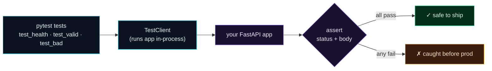

Welcome to **Day 55 of 100 Days of MLOps**. You've built a model API and packaged it into a container. But here's a question that should make you slightly nervous: how do you *know* it works — and how will you know it *still* works after your next change? Manually `curl`-ing it every time isn't a plan. Today you add **automated tests**: code that calls your endpoints and asserts the responses are correct, so a broken endpoint is caught the moment it breaks — not in production.

You'll use **pytest** (Python's standard testing tool) with **FastAPI's test client**, which runs your app *in-process* — no server to start, no network. A test is just a function that makes a request and checks the answer. Write a handful, run them in a second, and you have a safety net under your service. This is also the foundation for CI (Module 8), where these tests run automatically on every change.

> **Tests turn "I think it works" into "I know it works."** And they keep it working as you change the code.

By the end of today you will:

- Write **pytest** tests using FastAPI's **test client**.
- Assert **status codes** and **response bodies** for good and bad requests.
- Run the suite and read the results.
- Understand why API tests are your **safety net** and CI foundation.

---

## Tests are a function that calls your app

FastAPI's `TestClient` wraps your app so you can call its endpoints directly in code — `client.get("/health")`, `client.post("/predict", json=...)` — and get real responses back, without running a server. A test is a `test_*` function that makes such a call and `assert`s the result.



**Reading this diagram:**

On the left, in **cyan**, are your **pytest tests** — one per behaviour you care about. They call the **TestClient** (also cyan), which runs your **purple FastAPI app** *in-process*: no separate server, just direct calls. Each test then reaches the **assert** step — does the response have the right status code and body?

Two outcomes: if **all pass**, you land on the **green** node — safe to ship. If **any fail**, you hit the **amber** node — a problem *caught before production*, at your desk, in a second, instead of by an angry user. That's the entire value of tests: they move the moment of discovery from "in production" to "before you ship." The takeaway: **tests exercise your real app and assert its behaviour**, so regressions surface immediately.

---

## Write the tests

Create `test_app.py`. Each function tests one behaviour — health, a valid prediction, and each kind of bad request:

```python
"""test_app.py — Day 55: automated tests for the model API (pytest + TestClient)."""
from fastapi.testclient import TestClient
from app import app

client = TestClient(app)

VALID = {"size_sqft": 2000, "bedrooms": 4, "age_years": 5, "neighborhood": "downtown"}


def test_health():
    r = client.get("/health")
    assert r.status_code == 200
    assert r.json() == {"status": "ok"}


def test_valid_prediction_returns_a_price():
    r = client.post("/predict", json=VALID)
    assert r.status_code == 200
    body = r.json()
    assert body["currency"] == "USD"
    assert body["predicted_price"] > 0        # a real, positive price


def test_missing_field_is_rejected():
    bad = {"size_sqft": 2000, "bedrooms": 4}   # no age_years / neighborhood
    assert client.post("/predict", json=bad).status_code == 422


def test_out_of_range_is_rejected():
    bad = {**VALID, "size_sqft": 50}           # below the min
    assert client.post("/predict", json=bad).status_code == 422


def test_bad_category_is_rejected():
    bad = {**VALID, "neighborhood": "seaside"}  # not an allowed value
    assert client.post("/predict", json=bad).status_code == 422
```

Notice the coverage: one test confirms the **happy path** (valid input → 200 and a positive price), and three confirm the API **rejects bad input** correctly (missing field, out of range, bad category — all 422, the contract from Day 53). Together they pin down how the API is *supposed* to behave.

---

## Run the suite

pytest discovers and runs every `test_*` function:

```bash
python -m pytest -v
```

```text
test_app.py::test_health PASSED                                          [ 20%]
test_app.py::test_valid_prediction_returns_a_price PASSED               [ 40%]
test_app.py::test_missing_field_is_rejected PASSED                      [ 60%]
test_app.py::test_out_of_range_is_rejected PASSED                       [ 80%]
test_app.py::test_bad_category_is_rejected PASSED                       [100%]
========================= 5 passed, 6 warnings in 1.08s =========================
```

Five green checks in about a second — your service behaves exactly as specified. Now imagine you refactor `app.py` next week and accidentally break the validation. A test catches it instantly:

```text
FAILED test_app.py::test_bad_input... - assert 422 == 200
```

That `assert 422 == 200` tells you precisely what went wrong: the endpoint returned 200 where it should have returned 422. You'd fix it *before* shipping, not after a user sends bad data and gets a nonsense prediction. (In fact, while writing these tests, `test_health` caught a real bug — a missing `/health` endpoint returning 404. That's tests doing their job: catching what you forgot.)

**What to test for an ML API.** Today's tests check *API behaviour* — endpoints respond, status codes are right, valid input yields sensible output, bad input is rejected. That's distinct from testing *model quality* (is the model accurate enough?), which is its own thing (Day 72). Both matter; today's job is proving the *service* works. And because these run in a second with no server, they're perfect for CI — Module 8 will run this exact suite on every push, so no broken endpoint ever reaches production.

---

## Common errors (and how to fix them)

**1. `assert 404 == 200` — an endpoint isn't found**

The route doesn't exist (a typo, or you removed it). That's the test catching a real bug, exactly as it should — add or fix the endpoint. (This is the `/health` bug mentioned above.)

**2. `ImportError` / `ModuleNotFoundError: No module named 'app'`**

pytest can't import your app. Run it from the folder containing `app.py` (`python -m pytest`), and make sure `test_app.py` imports the right module.

**3. Tests fail because the model file is missing**

`app.py` loads `model.joblib` at import, so the tests need it present in the test directory. Keep the model alongside the app (or point the load path at it) so the app imports cleanly under test.

**4. `assert 422 == 200` (or vice-versa)**

A validation regression: the API returned the wrong status for that input. Read which test failed — it names the exact case. Fix the endpoint (or the Pydantic model) so the contract holds.

**5. Testing model accuracy in an API test**

Don't assert an *exact* prediction value in an API test — the model may change. Assert *shape and sanity* (`predicted_price > 0`, right fields, right status). Model-quality checks belong in dedicated model tests (Day 72).

**6. Flaky tests that pass sometimes**

Usually unfixed randomness or external state. Keep tests deterministic (fixed inputs, a fixed model), and don't depend on network or time — a test that isn't reliably green is worse than no test.

---

## Recap — what you now have

Your service has a safety net:

- You write **pytest** tests with FastAPI's **TestClient** (in-process, no server).
- You assert **status codes and bodies** for valid and invalid requests.
- You run the suite in a second and read pass/fail.
- You know API tests catch **regressions before prod** and power **CI** (Module 8).

**Your cheat sheet:**

| Piece | Code |
|-------|------|
| Test client | `client = TestClient(app)` |
| Call an endpoint | `client.post("/predict", json=...)` |
| Assert status | `assert r.status_code == 200` |
| Assert body | `assert r.json()["predicted_price"] > 0` |
| Run | `python -m pytest -v` |

Golden rule: **test the API's behaviour, not the model's accuracy** — assert status codes and response shape for good and bad inputs, and run the suite on every change.

---

## Coming up on Day 56

Your API serves one prediction per request — but sometimes you need to score *millions* of rows at once (a nightly re-scoring of every customer), and doing that one HTTP call at a time would be absurd. **Day 56 — "Batch vs Online Inference"** covers the two fundamental serving modes: **online** (one request, low latency — what you've built) and **batch** (score a whole dataset at once, efficiently). You'll build a batch scoring job from the same model, and learn when each mode is the right tool.

See the full roadmap on the [100 Days of MLOps series page](/series/100-days-mlops). See you tomorrow.
