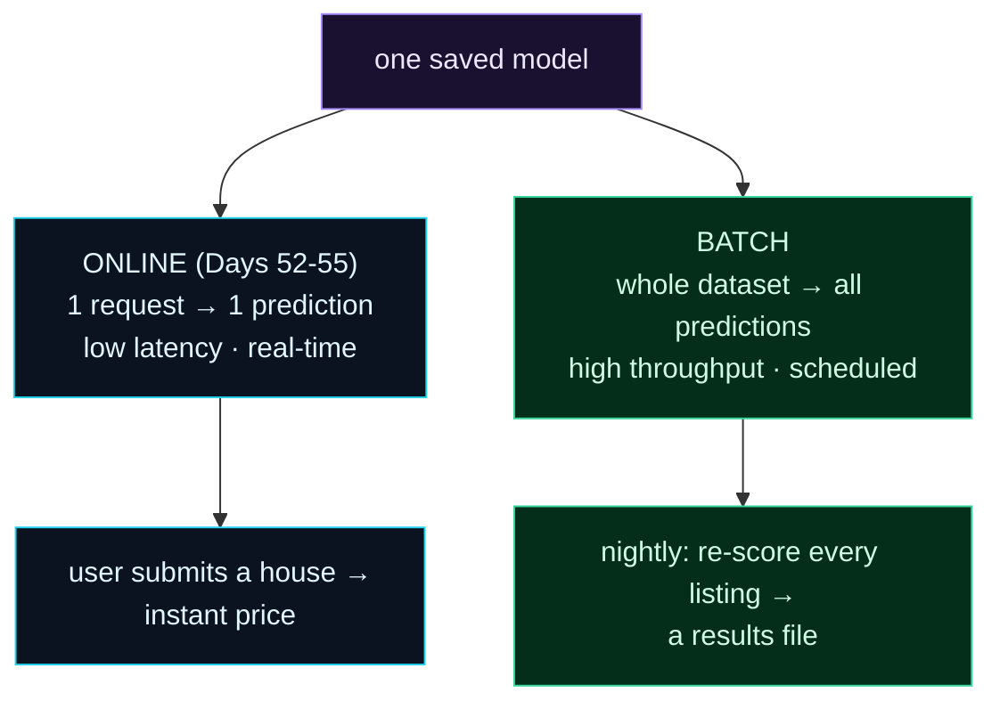

Welcome to **Day 56 of 100 Days of MLOps**. The API you built serves **one** prediction per request — perfect when a user submits a single house and wants an instant price. But what if you need to re-score *every listing* in your database overnight, or precompute predictions for a million customers before a marketing campaign? Making a million HTTP calls, one at a time, would be slow and wasteful. That job needs the *other* serving mode: **batch inference**.

Today you'll learn both modes — **online** (single, real-time, low-latency — what you've built) and **batch** (a whole dataset scored at once, high-throughput) — and build a batch scoring job from the exact same model. The speed difference will surprise you: scoring in a batch is *thousands* of times faster per row than one at a time. Knowing which mode fits which job is a core serving skill.

> **One model, two serving modes.** Online for real-time single requests; batch for scoring a dataset efficiently.

By the end of today you will:

- Understand **online vs batch** inference and when each fits.
- Build a **batch scoring job** that scores a whole file at once.
- See why batch is **dramatically faster** than looping predictions.
- Know to reuse **one model** for both modes (no skew).

---

## Two ways to serve one model

The same trained model can answer predictions two very different ways. **Online** inference handles one request at a time, fast, in real time — a user action triggers a single prediction. **Batch** inference scores a whole dataset in one go — read many rows, predict them all, write the results — usually on a schedule, where total throughput matters more than the latency of any single row.



**Reading this diagram:**

At the top, in **purple**, is **one saved model** — the same artifact for both paths (crucial: reusing it means no training/serving skew, Day 49). It branches into two serving modes. The **cyan online** branch is what you've built: one request, one prediction, low latency, real time — a user submits a house and gets an **instant price**. The **green batch** branch is today's addition: the *whole dataset* goes in, *all* predictions come out at once, optimised for throughput and run on a schedule — for example, **nightly re-scoring of every listing** into a results file.

The key contrast is the *access pattern*, not the model. Online cares about *how fast one answer comes back*; batch cares about *how many answers per second overall*. The takeaway: **pick the serving mode by the use case** — real-time single requests go online, bulk scoring goes batch — and both run off the identical model.

---

## Build a batch scoring job

Batch inference is refreshingly simple: load the model, read the data, predict the whole thing in **one vectorized call**, write the output. Create `batch_score.py`:

```python
"""batch_score.py — Day 56: score a whole dataset at once (batch inference)."""
import time, joblib, pandas as pd

model = joblib.load("model.joblib")
df = pd.read_csv("to_score.csv")
feats = ["size_sqft", "bedrooms", "age_years", "neighborhood"]

# BATCH: one vectorized predict() call for ALL rows.
t0 = time.perf_counter()
df["predicted_price"] = model.predict(df[feats]).round(2)
batch_secs = time.perf_counter() - t0

df.to_csv("scored.csv", index=False)
print(f"BATCH  : scored {len(df):,} houses in {batch_secs:.3f}s "
      f"({len(df)/batch_secs:,.0f} rows/sec) -> scored.csv")

# ONLINE-style: predict one row at a time (like N separate API calls) — much slower.
sample = df.head(2000)
t0 = time.perf_counter()
for _, row in sample.iterrows():
    model.predict(pd.DataFrame([row[feats]]))
loop_secs = time.perf_counter() - t0
print(f"ONE-BY-ONE: {len(sample):,} houses in {loop_secs:.3f}s "
      f"({len(sample)/loop_secs:,.0f} rows/sec)")
print(f"\n-> batch is ~{(loop_secs/len(sample))/(batch_secs/len(df)):,.0f}x faster per row")
```

Point it at a CSV of 100,000 houses and run:

```bash
python batch_score.py
```

```text
BATCH  : scored 100,000 houses in 0.026s (3,813,174 rows/sec) -> scored.csv
ONE-BY-ONE: 2,000 houses in 2.199s (910 rows/sec)

-> batch is ~4,192x faster per row
```

The numbers are striking. Scoring **100,000** houses as a batch took **0.026 seconds** — nearly *4 million rows per second*. Doing it one row at a time managed only **910 rows/second** — over **four thousand times slower per row**. Same model, same predictions; the *only* difference is batch vs one-at-a-time.

---

## Why batch is so much faster

Two reasons, and both are worth internalising:

- **Vectorization.** `model.predict(df)` does the math on the *entire* array at once, using optimised NumPy/BLAS operations under the hood. A Python `for` loop, by contrast, pays the interpreter's overhead on every single row.
- **No per-call overhead.** Each "one-by-one" prediction rebuilds a DataFrame and re-enters the model's predict machinery. Across a million rows, that fixed cost dominates.

The practical rule: **never loop predictions when you can batch them.** If you have many rows to score, hand the model *all* of them in one `predict` call — it's the difference between a job finishing in seconds versus hours. (This is exactly why calling your *online* API a million times to score a dataset is the wrong tool — each HTTP request adds even more overhead on top.)

**So which mode when?**

| Use **online** when… | Use **batch** when… |
|----------------------|---------------------|
| A user needs an answer *now* | You're scoring a whole dataset |
| Predictions are triggered by events | The job runs on a schedule (nightly) |
| Low latency per request matters | Total throughput matters |
| e.g. price a house on form submit | e.g. re-score every listing, precompute a dashboard |

Many real systems do **both** from one model: an online API for real-time requests, and a scheduled batch job for bulk scoring. That batch job is a natural fit for the orchestration you'll learn in Module 7 (a Prefect flow that scores nightly).

---

## Common errors (and how to fix them)

**1. Looping `predict()` per row on a big dataset**

The classic performance killer (2,000 rows took 2.2s above). Pass the *whole* DataFrame to `predict` in one call — vectorized batch inference is thousands of times faster.

**2. Calling your online API to score a dataset**

Sending a million HTTP requests to your `/predict` endpoint is even slower than a local loop (network overhead per call). For bulk scoring, run a **batch job** against the model directly, not the API.

**3. Loading the model inside the loop**

`joblib.load` per row (or per request) is wasteful. Load the model **once**, then predict many times — as `batch_score.py` does.

**4. Running out of memory on a huge batch**

A 100-million-row file may not fit in memory. Process it in **chunks** (`pd.read_csv(..., chunksize=...)`), predicting each chunk and appending results — you keep batch's speed without loading everything at once.

**5. Batch and online give different predictions**

If they disagree, you're computing features differently on each path (Day 49 skew). Use the **same saved pipeline** for both — the batch job and the API must load the identical model artifact.

**6. Using batch when you need real-time (or vice-versa)**

Batch predictions are computed on a schedule, so they're *stale* between runs — wrong for a request that needs the latest answer *now*. And online is too slow for bulk. Match the mode to the latency requirement.

---

## Recap — what you now have

You can serve a model both ways:

- You understand **online** (single, real-time) vs **batch** (whole dataset, high-throughput).
- You built a **batch scoring job** — one vectorized `predict` over a whole file.
- You saw batch run **~4,000× faster per row** than looping predictions.
- You reuse **one model** for both modes, keeping predictions consistent.

**Your cheat sheet:**

| Mode | How | For |
|------|-----|-----|
| Online | FastAPI `/predict`, one request | real-time single predictions |
| Batch | `model.predict(whole_df)` → file | bulk, scheduled scoring |
| Big data | `pd.read_csv(chunksize=...)` | batches too big for memory |
| Golden rule | never loop `predict()` per row | vectorize the whole batch |

Golden rule: **batch when you can, online when you must** — score whole datasets in one vectorized call, and reserve the low-latency API for real-time single requests.

---

## Coming up on Day 57

FastAPI + Docker is a great, general way to serve models — but there's a tool built *specifically* for ML serving that handles a lot of the boilerplate for you. **Day 57 — "Model Serving with BentoML"** introduces BentoML: you'll wrap your model in a "Service," serve it with one command, and package it as a "Bento" — a standardised, deployable bundle of model + code + dependencies. It's a more ML-native path to the same goal, with batching, adaptive optimisation, and containerisation built in.

See the full roadmap on the [100 Days of MLOps series page](/series/100-days-mlops). See you tomorrow.
