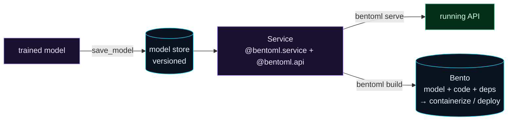

Welcome to **Day 57 of 100 Days of MLOps**. You've served a model the general way — FastAPI for the API, a hand-written Dockerfile for packaging. That's flexible and worth knowing. But there's a tool built *specifically* for serving ML models that handles a lot of that boilerplate for you: **BentoML**. It gives you a versioned model store, a clean Service abstraction, one-command serving, and — its signature feature — the **Bento**: a standardised, deployable bundle of your model, code, and dependencies that turns into a Docker image with a single command.

BentoML is a more *ML-native* path to the same destination. Where FastAPI + Docker asks you to wire everything yourself, BentoML has opinions and conventions purpose-built for model serving. Today you'll serve your model with it and package a Bento.

> **The same goal, ML-purpose-built.** Save, serve, and package a model with conventions designed for ML — less boilerplate, more built in.

By the end of today you will:

- Save a model to BentoML's **versioned model store**.
- Wrap it in a **Service** and serve it with `bentoml serve`.
- Package everything into a **Bento** with `bentoml build`.
- Know what BentoML adds over FastAPI + Docker.

---

## Store, service, Bento

BentoML has three core pieces. The **model store** versions your saved models (like a mini model registry). A **Service** is a class that loads a model and exposes prediction methods as API endpoints. And a **Bento** is the packaged result — model + code + dependencies bundled into one deployable unit that can be served or containerized.



**Reading this diagram:**

On the left, in **purple**, is your **trained model**. `save_model` puts it into the **cyan model store**, which *versions* it — every save gets a unique tag, so you always know exactly which model is which. From the store, you define a **Service** (purple) — a class that loads the model and marks methods as API endpoints with `@bentoml.api`.

That one Service powers two outputs. **`bentoml serve`** turns it into a **running API** (green) instantly — no server code to write. And **`bentoml build`** packages it into a **Bento** (cyan cylinder): a self-contained bundle of the model, your code, and the dependencies, ready to *containerize* or *deploy*. The takeaway: **BentoML gives you a store → service → Bento pipeline** where each step is one command, purpose-built for getting a model from "trained" to "deployable."

---

## Save the model and define a service

Install it (`pip install bentoml`). First, save your trained model into BentoML's store:

```python
import joblib, bentoml
pipe = joblib.load("model.joblib")
saved = bentoml.sklearn.save_model("house_price", pipe)
print("saved model to store:", saved.tag)
```

```text
saved model to store: house_price:q253dyt5j6edr7ri
```

That `house_price:q253dyt5j6edr7ri` tag is a **versioned** reference — every save produces a new one, so deployments always pin an exact model. Now the Service. Create `service.py`:

```python
"""service.py — Day 57: a BentoML Service wrapping the model."""
import bentoml, pandas as pd
from typing import Literal

@bentoml.service(name="house_price_service")
class HousePriceService:
    # BentoML injects the model from its store, versioned + tracked.
    bento_model = bentoml.models.BentoModel("house_price:latest")

    def __init__(self):
        self.model = bentoml.sklearn.load_model(self.bento_model)

    @bentoml.api
    def predict(self, size_sqft: int, bedrooms: int, age_years: int,
                neighborhood: Literal["downtown", "suburb", "rural"]) -> dict:
        X = pd.DataFrame([{"size_sqft": size_sqft, "bedrooms": bedrooms,
                           "age_years": age_years, "neighborhood": neighborhood}])
        price = self.model.predict(X)[0]
        return {"predicted_price": round(float(price), 2), "currency": "USD"}
```

Notice how much is handled for you: the `@bentoml.service` decorator makes the class a servable API, `@bentoml.api` turns `predict` into an endpoint, and the type hints (including a `Literal` for the category, just like Day 53's Pydantic) become **automatic request validation**. The model comes from the versioned store, not a loose file.

---

## Serve it

One command runs the service as a live API:

```bash
bentoml serve service:HousePriceService
```

It starts on `http://127.0.0.1:3000`. Call the `/predict` endpoint:

```bash
curl -X POST http://127.0.0.1:3000/predict \
  -H 'Content-Type: application/json' \
  -d '{"size_sqft":2000,"bedrooms":4,"age_years":5,"neighborhood":"downtown"}'
```

```text
{"predicted_price": 471358.3, "currency": "USD"}
```

Same prediction as your FastAPI service — but you wrote no server code, and you get automatic docs (at `/`), input validation, and adaptive request batching for free. The model is served straight from the versioned store.

---

## Package it as a Bento

Now the signature feature. A **`bentofile.yaml`** declares what goes in the bundle:

```yaml
service: "service:HousePriceService"
include:
  - "*.py"
python:
  packages:
    - scikit-learn
    - pandas
```

Then `bentoml build` packages the model, your code, and dependencies into a **Bento**:

```bash
bentoml build
```

```text
Successfully built Bento(tag="house_price_service:s7s55st5j652j7ri").
* Containerize your Bento with `bentoml containerize`:
    $ bentoml containerize house_price_service:s7s55st5j652j7ri
```

```bash
bentoml list
```

```text
 Tag                                 Size       Model Size  Creation Time
 house_price_service:s7s55st5...     20.57 KiB  3.44 KiB    2026-07-11 23:10:27
```

You now have a versioned, deployable **Bento** — a standardised bundle you can move around and run anywhere. And here's the payoff over Day 54: instead of hand-writing a Dockerfile, **`bentoml containerize house_price_service:...`** builds a production-ready Docker image *for* you — BentoML generates the Dockerfile, installs the pinned dependencies, and wires up the server. (Like Day 54, that image build needs the Docker engine and network to pull a base image; the Bento itself is built and ready regardless.)

---

## BentoML or FastAPI + Docker?

Both get a model served; they trade flexibility for convenience:

| | FastAPI + Docker (Days 52–54) | BentoML |
|---|---|---|
| Style | general web framework, DIY | ML-purpose-built, opinionated |
| Model versioning | you manage files | built-in model store |
| Containerize | write your own Dockerfile | `bentoml containerize` (auto) |
| Batching | manual | adaptive batching built in |
| Best for | full control, non-ML endpoints too | fast, standardised ML serving |

Reach for **FastAPI** when you want maximum control or the service does more than serve a model; reach for **BentoML** when you want the ML-serving happy path — store, service, Bento, container — with far less plumbing. Knowing both means you can pick the right tool per project.

---

## Common errors (and how to fix them)

**1. `model not found in store`**

The Service references a model tag that isn't saved. Run `bentoml.sklearn.save_model("house_price", pipe)` first, and reference `house_price:latest` (or a specific tag) in the service.

**2. `bentoml serve` can't find the service**

The argument is `module:ClassName` — `bentoml serve service:HousePriceService` (file `service.py`, class `HousePriceService`). A typo in either half fails to load it.

**3. Missing dependencies in the built Bento**

If the containerized Bento fails on import, a package wasn't declared. List every dependency your code needs under `python: packages:` in `bentofile.yaml`, then rebuild.

**4. `bentoml containerize` fails or hangs**

It builds a Docker image, so it needs the Docker engine running and network access to pull a base image — same requirement as Day 54. The `bentoml build` step (the Bento itself) works without Docker; only `containerize` needs it.

**5. `Address already in use` on port 3000**

Another process holds BentoML's default port. Serve on another: `bentoml serve service:HousePriceService --port 3001`.

**6. Input validation isn't happening**

BentoML derives validation from your API method's type hints. Type your parameters (and use `Literal`/Pydantic models for constraints) so requests are validated automatically.

---

## Recap — what you now have

You can serve and package models the ML-native way:

- You saved a model to BentoML's **versioned store**.
- You wrapped it in a **Service** and served it with `bentoml serve`.
- You packaged a **Bento** with `bentoml build` (and know `containerize` builds the image).
- You know **when to choose** BentoML vs FastAPI + Docker.

**Your cheat sheet:**

| Task | Command |
|------|---------|
| Save to store | `bentoml.sklearn.save_model("house_price", pipe)` |
| Define a service | `@bentoml.service` class + `@bentoml.api` methods |
| Serve | `bentoml serve service:HousePriceService` |
| Package | `bentoml build` (uses `bentofile.yaml`) |
| Containerize | `bentoml containerize <bento:tag>` |

Golden rule: **BentoML turns a model into a deployable Bento with conventions built for ML** — store it, wrap it in a Service, build the Bento, containerize with one command.

---

## Coming up on Day 58

Your service works — but how many requests can it handle, and how fast? You can't tune what you don't measure. **Day 58 — "Latency & Load Testing"** puts your API under real load with **Locust**: you'll simulate many concurrent users hitting `/predict`, watch the requests-per-second and latency percentiles climb, and find the point where the service starts to strain. It's how you learn a service's real capacity *before* production traffic finds its limits for you.

See the full roadmap on the [100 Days of MLOps series page](/series/100-days-mlops). See you tomorrow.
