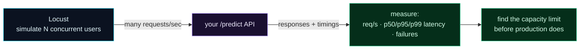

Welcome to **Day 58 of 100 Days of MLOps**. Your model API works when *you* poke it with one `curl`. But production doesn't send one request — it sends hundreds or thousands per second, from many users at once. Two questions decide whether your service survives: **how many requests can it handle**, and **how fast does it respond under load?** You can't guess these, and you *really* don't want production traffic to discover the answer for you. So you **load test**: simulate heavy traffic and measure. Today you'll do it with **Locust**.

Load testing turns "I think it's fast enough" into hard numbers — requests per second, and latency percentiles that reveal how the *slowest* users experience your service. Those numbers tell you your capacity, let you set realistic performance targets, and — crucially for Module 9 — tell you how much infrastructure you'll actually need.

> **Measure before production does.** Simulate load, read the throughput and latency, and find the limit on your terms.

By the end of today you will:

- Write a **Locust** load test that hammers your `/predict` endpoint.
- Run it against your live API with many concurrent users.
- Read **requests/sec** and **latency percentiles** (median, p95, p99).
- Understand why percentiles matter more than averages.

---

## What load testing measures

A load test spins up many simulated users, all making requests as fast as they can, and records what happens. Three numbers matter: **throughput** (requests per second the service sustains), **latency** (how long each request takes — reported as percentiles), and **failures** (requests that errored or timed out).



**Reading this diagram:**

On the left, in **cyan**, is **Locust** simulating *N concurrent users* — each firing requests at your API as fast as its settings allow. That flood of requests hits your **purple `/predict` API**, which sends back responses, and Locust records every response *and* how long it took. Those timings flow to the **green metrics** node: requests per second, latency percentiles (p50/p95/p99), and failure count.

From those numbers you reach the second **green** node: the **capacity limit**. Push the user count up and watch — at some point latency spikes or failures appear, and that's where your service starts to strain. The takeaway: **load testing generates the numbers that define your service's real limits**, so you learn them at your desk instead of during a production incident.

---

## Write and run the load test

Install Locust (`pip install locust`). A Locust test is a `locustfile.py` describing a simulated user and what they do. Create it:

```python
"""locustfile.py — Day 58: simulate concurrent users hitting /predict."""
from locust import HttpUser, task, between

class HousePriceUser(HttpUser):
    wait_time = between(0.0, 0.05)      # near-constant load

    @task
    def predict(self):
        self.client.post("/predict", json={
            "size_sqft": 2000, "bedrooms": 4, "age_years": 5, "neighborhood": "downtown",
        })
```

Each simulated `HousePriceUser` repeatedly POSTs a house to `/predict`; `wait_time` is the pause between a user's requests (near-zero here for maximum load). Now start your API in one terminal (`uvicorn app:app --port 8000`), and run Locust against it. In **headless** mode you set the users and duration on the command line:

```bash
locust -f locustfile.py --headless -u 50 -r 50 -t 8s --host http://127.0.0.1:8000
```

That's `-u 50` (50 concurrent users), `-r 50` (spawn them at 50/sec), `-t 8s` (run for 8 seconds). Locust reports:

```text
/predict     5214 reqs | 744 req/s | 0 fails
             median=40ms  p95=63ms  p99=87ms
```

In 8 seconds, 50 users sent **5,214 requests** — about **744 per second** — with **zero failures**. And the latency: the *median* request took **40ms**, 95% finished within **63ms**, and 99% within **87ms**. That's a healthy, responsive service under this load.

---

## Read the numbers like an SRE

Two things to internalise from that output.

**Percentiles, not averages.** Locust reports p50 (median), p95, and p99 — *not* the mean — and for good reason. An average can look fine while some users have a terrible time; percentiles expose the tail. **p99 = 87ms** means the slowest 1% of requests still finished within 87ms — and that slowest 1% is real users having your worst experience. In production you care enormously about the tail: "p99 latency under 200ms" is a far more useful target than "average latency 40ms," because averages hide the users you're failing.

**Finding the limit.** 744 req/s with no failures means you haven't hit the ceiling yet. Turn the pressure up — `-u 200`, `-u 500` — and watch. At some point latency percentiles start climbing (p99 shoots up) or failures appear: *that's* your capacity limit for this configuration. Knowing it lets you set an SLA and, in Module 9, decide how many replicas you need to serve your expected traffic with headroom.

Locust also has a **web UI** — run it *without* `--headless`:

```bash
locust -f locustfile.py --host http://127.0.0.1:8000
```

Open `http://localhost:8089`, set the number of users, and watch live charts of RPS and latency as you dial the load up and down — a great way to *feel* where a service breaks.

---

## Common errors (and how to fix them)

**1. `ConnectionError` / all requests fail**

Your API isn't running, or the `--host` is wrong. Start the server first (`uvicorn app:app --port 8000`) and point Locust at the exact host and port.

**2. Latency is high but there are 0 failures**

You're near the limit — the service is keeping up but queuing. Rising p95/p99 with no errors is the *early warning* before failures start. Note the load level and treat it as your practical ceiling.

**3. Throughput is capped low no matter the user count**

Often a single-process bottleneck — one uvicorn worker, or the model call is CPU-bound. Add workers, or scale out with more replicas (Module 9). Load testing is how you discover you need to.

**4. You're reporting the average latency**

Don't — averages hide the tail. Report and target **percentiles** (p95/p99); a good average with a terrible p99 still means unhappy users.

**5. The test is too short to be meaningful**

A 2-second test barely warms up. Run long enough for numbers to stabilise (tens of seconds), and ramp users gradually (`-r`) rather than all at once, to see how the service behaves as load builds.

**6. `wait_time` makes throughput look low**

A large `wait_time` means each user requests slowly, so req/s is limited by *think time*, not the server. For a stress test use a small `wait_time`; for realistic traffic, model actual user pauses.

---

## Recap — what you now have

You can measure your service's real capacity:

- You wrote a **Locust** test that loads your `/predict` endpoint.
- You ran it with **50 concurrent users** and read **744 req/s**, **0 failures**.
- You read **latency percentiles** (median 40ms, p95 63ms, p99 87ms).
- You know **percentiles beat averages** and how to find the capacity limit.

**Your cheat sheet:**

| Task | How |
|------|-----|
| Define a user | `class U(HttpUser)` + `@task` hitting an endpoint |
| Headless run | `locust -f locustfile.py --headless -u 50 -r 50 -t 8s --host ...` |
| Web UI | `locust -f locustfile.py --host ...` → localhost:8089 |
| What to watch | req/s, p95/p99 latency, failure count |
| Find the limit | raise `-u` until latency spikes or failures appear |

Golden rule: **load test to find the limit, and judge latency by percentiles** — p99 is the experience of your slowest users, and that's the number production cares about.

---

## Coming up on Day 59

If your service needs to be faster or lighter, one powerful lever is the *model format* itself. **Day 59 — "Optimizing Models with ONNX"** introduces ONNX, a standard, portable format for models that a specialised runtime can execute faster and with a smaller footprint than the original library. You'll export your scikit-learn model to ONNX, run it with ONNX Runtime, and compare — a common step for squeezing more throughput out of a serving service without changing the model's predictions.

See the full roadmap on the [100 Days of MLOps series page](/series/100-days-mlops). See you tomorrow.
