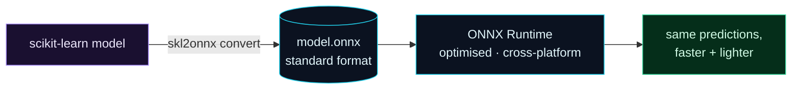

Welcome to **Day 59 of 100 Days of MLOps**. Yesterday you measured your service's speed. If you need it *faster* or *lighter* — more predictions per second, a smaller serving container, lower cost — one powerful lever is the **model format itself**. Today you'll meet **ONNX** (Open Neural Network Exchange), a standard, portable format that a specialised runtime can execute faster and with a smaller footprint than the original library — while producing the *exact same predictions*.

The idea: your scikit-learn model is bundled with scikit-learn's (general-purpose) prediction code. Convert it to ONNX, and a purpose-built engine — **ONNX Runtime** — runs it, optimised for inference. It's the same model, a faster engine. And because ONNX is a standard, that one file runs in many languages and on many platforms, without shipping the training framework at all.

> **Same model, faster engine.** ONNX is a portable format; ONNX Runtime executes it optimised for inference.

By the end of today you will:

- Understand what **ONNX** is and why it's useful for serving.
- **Export** a scikit-learn model to ONNX.
- Run it with **ONNX Runtime** and confirm predictions match.
- Compare **speed and size** against the original.

---

## A portable, optimised format

A trained model is normally tied to its framework — a scikit-learn model needs scikit-learn to run. ONNX breaks that coupling: you *convert* the model to a standard `.onnx` file, and **ONNX Runtime** (a lean, highly-optimised engine) executes it. Same predictions, but the runtime is built for speed, runs cross-platform (Python, C++, C#, JavaScript, mobile), and doesn't need the training library at all.



**Reading this diagram:**

On the left, in **purple**, is your **scikit-learn model** — bundled with scikit-learn's prediction machinery. The `skl2onnx convert` step turns it into the **cyan `model.onnx`** — a *standard* format, no longer tied to scikit-learn. That file is executed by **ONNX Runtime** (also cyan), a lean engine optimised specifically for running inference, on any platform.

The **green** result on the right is the key claim: **the same predictions, faster and lighter.** The model didn't change — its numbers are identical — but the engine running it is faster, the file is smaller, and serving no longer needs the heavy training library. The takeaway: **ONNX decouples the model from its framework and swaps in a faster runtime** — a pure serving optimisation that leaves your predictions untouched.

---

## Export and run

Install the tools (`pip install skl2onnx onnxruntime`). Then convert your model and run it through ONNX Runtime. Create `convert.py`:

```python
"""convert.py — Day 59: export a scikit-learn model to ONNX and compare."""
import time, joblib, numpy as np, pandas as pd, os
from sklearn.linear_model import LinearRegression
from skl2onnx import to_onnx
import onnxruntime as ort

# a numeric model (converts to ONNX cleanly)
rng = np.random.default_rng(42); n = 500
df = pd.DataFrame({"size_sqft": rng.integers(600,3500,n), "bedrooms": rng.integers(1,6,n),
    "age_years": rng.integers(0,80,n), "location_score": rng.integers(1,11,n)})
df["price"] = (30000+140*df.size_sqft+12000*df.bedrooms-900*df.age_years+20000*df.location_score
               + rng.normal(0,25000,n)).clip(50000)
X = df[["size_sqft","bedrooms","age_years","location_score"]].astype(np.float32).values
model = LinearRegression().fit(X, df["price"])
joblib.dump(model, "model.joblib")

# --- convert to ONNX (needs an example input to infer the schema) ---
onx = to_onnx(model, X[:1])
with open("model.onnx", "wb") as f:
    f.write(onx.SerializeToString())

# --- run BOTH on a big batch; compare predictions + speed ---
big = np.repeat(X, 200, axis=0).astype(np.float32)         # 100k rows
sk_pred = model.predict(big)
sess = ort.InferenceSession("model.onnx")
inp = sess.get_inputs()[0].name
onnx_pred = sess.run(None, {inp: big})[0].ravel()

print(f"predictions match: {np.allclose(sk_pred, onnx_pred, atol=1e-2)}")
t=time.perf_counter(); [model.predict(big) for _ in range(20)]; sk_t=time.perf_counter()-t
t=time.perf_counter(); [sess.run(None,{inp:big}) for _ in range(20)]; onnx_t=time.perf_counter()-t
print(f"scikit-learn: {sk_t:.3f}s | ONNX Runtime: {onnx_t:.3f}s | speedup: {sk_t/onnx_t:.1f}x")
print(f"model.joblib: {os.path.getsize('model.joblib')} bytes | model.onnx: {os.path.getsize('model.onnx')} bytes")
```

`to_onnx(model, X[:1])` converts the model, using an example input to work out the schema. Then `onnxruntime.InferenceSession` loads the `.onnx` and runs it. Run it:

```bash
python convert.py
```

```text
predictions match: True
scikit-learn: 0.005s | ONNX Runtime: 0.002s | speedup: 3.0x
model.joblib: 643 bytes | model.onnx: 255 bytes
```

Three results worth noting. **Predictions match** (`True`) — ONNX Runtime produces the identical output, so optimising the format changed nothing about *what* the model predicts. It ran **3× faster** on this batch. And the ONNX file is **smaller** (255 vs 643 bytes). Same model, faster and leaner — for free.

(These absolute times are tiny because this is a trivial linear model; the *ratio* is what matters, and it grows with model complexity and batch size. For a real tree ensemble or a service handling steady traffic, a 2–5× inference speedup and a much smaller dependency footprint translate directly into more throughput per replica and lower cost.)

---

## Why this matters for serving — and a note on quantization

Two concrete wins for a production service:

- **Speed → throughput.** Faster inference means each replica handles more requests per second, so you need fewer of them (Module 9) — directly lowering cost.
- **A leaner container.** A serving image needs only **`onnxruntime`** to run the model — not scikit-learn, not the whole training stack. That's a smaller, faster-to-pull image (Day 54) with a smaller attack surface.

There's a further optimisation you'll hear about: **quantization** — reducing the numeric precision of a model's weights (e.g. 32-bit floats down to 8-bit integers) to make it smaller and faster, usually with a tiny accuracy cost. It's most impactful for large deep-learning models (and ONNX Runtime supports it), less so for classic ML. Just know it exists as the next lever when ONNX alone isn't enough.

**One honest caveat:** not every model or pipeline converts cleanly to ONNX — complex or custom transforms may not be supported. So the golden rule is always to **verify predictions match** after conversion (the `np.allclose` check above), before trusting the ONNX version in production.

---

## Common errors (and how to fix them)

**1. Conversion fails on an unsupported operator**

Some scikit-learn transforms (or custom steps) don't have an ONNX equivalent. Convert the parts that are supported, simplify the pipeline, or check `skl2onnx`'s supported-operators list. Not everything converts — that's expected.

**2. `predictions match: False`**

Usually a dtype issue — feed ONNX Runtime **float32** (`astype(np.float32)`), since ONNX is precision-specific and scikit-learn often uses float64. Compare with a small tolerance (`np.allclose(..., atol=1e-2)`), not exact equality.

**3. `InvalidArgument: input name mismatch`**

ONNX Runtime needs the input fed by its exact name. Get it from the session: `name = sess.get_inputs()[0].name`, then `sess.run(None, {name: X})`. Don't hardcode a guessed name.

**4. The conversion needs an input schema**

`to_onnx(model, X_example)` uses an example array to infer input shape and type. Pass a representative sample (right number of columns, right dtype), or conversion can't determine the schema.

**5. No speedup (or it's slower)**

For a tiny model on a tiny batch, overhead can dominate and ONNX may not help. The gains show up with larger models and real batches. Measure on *your* model and workload before deciding.

**6. Optimising a service that's already fast enough**

ONNX is worth it when latency, throughput, or image size are actual constraints. If your service comfortably meets its SLA (Day 58), don't add the conversion complexity — optimise when the numbers say you need to.

---

## Recap — what you now have

You can optimise a model for serving without changing its predictions:

- You understand **ONNX** as a portable format and **ONNX Runtime** as a fast engine.
- You **exported** a scikit-learn model to ONNX and ran it.
- You confirmed **predictions match** and measured a **3× speedup** and smaller file.
- You know about **quantization** and to always **verify predictions** after conversion.

**Your cheat sheet:**

| Task | Code |
|------|------|
| Convert | `onx = to_onnx(model, X_example)` |
| Save | `open("model.onnx","wb").write(onx.SerializeToString())` |
| Load + run | `sess = ort.InferenceSession("model.onnx"); sess.run(None, {name: X})` |
| Input name | `sess.get_inputs()[0].name` |
| Verify | `np.allclose(sk_pred, onnx_pred, atol=1e-2)` |

Golden rule: **ONNX is a serving optimisation, not a model change** — convert, run with ONNX Runtime for speed and a lean footprint, and always confirm predictions still match.

---

## Coming up on Day 60 — Module 6 finale

Time to bring serving all together. **Day 60 — "A Production-Style Model Service"** ties Module 6 into one capstone: a service that's **validated** (Pydantic contract), **tested** (pytest), **containerized** (a Dockerfile), and **benchmarked** (a load test) — the complete, production-shaped package that turns a trained model into a service you'd actually deploy. It's everything from Days 51–59 assembled into the real thing, and it closes out the packaging-and-serving module.

See the full roadmap on the [100 Days of MLOps series page](/series/100-days-mlops). See you tomorrow.
