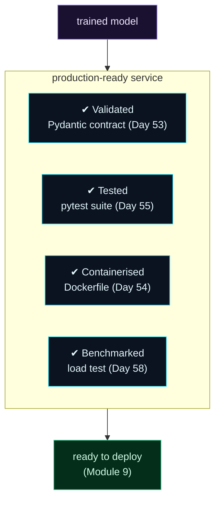

Welcome to **Day 60 of 100 Days of MLOps** — the finale of **Module 6.** You've learned every piece of serving a model: inference logic, a FastAPI endpoint, a Pydantic contract, containerisation, tests, batch vs online, BentoML, load testing, and ONNX. Today we assemble the essentials into **one production-style service** — the complete package you'd actually deploy. Not a toy that returns predictions, but a service that's *validated, tested, containerised, and benchmarked*: the four properties that separate "it runs on my laptop" from "it's ready for production."

This is what "serving a model" really means in MLOps. A model behind an endpoint isn't enough; it has to reject bad input, prove it works with tests, run anywhere via a container, and have a known capacity. Let's build that service and check every box.

> **A deployable service, not just an endpoint.** Validated, tested, containerised, benchmarked — the production checklist, all green.

By the end of today you will:

- Assemble a **complete model service** from Days 51–59.
- Verify it's **validated, tested, and benchmarked**.
- Package it with a **Dockerfile** (with a health check).
- Have a **production-readiness checklist** for any model service.

---

## The four properties of a deployable service

A trained model becomes a *deployable service* when it has four properties, each from a day in this module. **Validated**: a Pydantic contract rejects bad input. **Tested**: a pytest suite proves it works and catches regressions. **Containerised**: a Dockerfile makes it run anywhere. **Benchmarked**: a load test gives it a known capacity.



**Reading this diagram:**

At the top, in **purple**, is a **trained model** — the thing you've built all series. It flows into the **cyan box**, the *production-ready service*, and inside are the four properties, each a checkmark: **validated** (a Pydantic contract), **tested** (pytest), **containerised** (a Dockerfile), **benchmarked** (a load test). A model with all four is fundamentally different from one with none.

That complete box flows to the **green node**: *ready to deploy*. Only when all four boxes are ticked does a model service become something you'd hand to production (and to Module 9's Kubernetes deployment). The takeaway: **serving is a checklist, not a single endpoint** — validate, test, containerise, benchmark, and the model becomes a service you can trust in production.

---

## The complete service

Four files make the whole package. The service itself, **`app.py`** (FastAPI + the Pydantic contract + a health check):

```python
"""app.py — Day 60: the complete production-style model service."""
import joblib, pandas as pd
from typing import Literal
from fastapi import FastAPI
from pydantic import BaseModel, Field

_pipeline = joblib.load("model.joblib")
app = FastAPI(title="House Price API", version="1.0")


class HouseRequest(BaseModel):
    size_sqft: int = Field(ge=100, le=20000)
    bedrooms: int = Field(ge=1, le=10)
    age_years: int = Field(ge=0, le=150)
    neighborhood: Literal["downtown", "suburb", "rural"]


class PredictionResponse(BaseModel):
    predicted_price: float
    currency: str = "USD"


@app.get("/health")
def health():
    return {"status": "ok"}


@app.post("/predict", response_model=PredictionResponse)
def predict(house: HouseRequest):
    X = pd.DataFrame([house.model_dump()])
    price = _pipeline.predict(X)[0]
    return PredictionResponse(predicted_price=round(float(price), 2))
```

The **`Dockerfile`** — note the `HEALTHCHECK`, which lets an orchestrator know if the container is healthy:

```dockerfile
FROM python:3.12-slim
WORKDIR /app
COPY requirements.txt .
RUN pip install --no-cache-dir -r requirements.txt
COPY . .
EXPOSE 8000
HEALTHCHECK CMD curl -f http://localhost:8000/health || exit 1
CMD ["uvicorn", "app:app", "--host", "0.0.0.0", "--port", "8000"]
```

Plus **`test_app.py`** (the pytest suite from Day 55) and **`requirements.txt`** (pinned deps). Now let's tick every box.

---

## Check every box

**[1] Tested** — run the suite:

```bash
python -m pytest -q
```

```text
5 passed, 6 warnings in 1.17s
```

**[2] Validated** — the live contract accepts good input and rejects bad:

```text
valid   -> {"predicted_price":471358.3,"currency":"USD"}
invalid -> HTTP 422 (rejected)
```

**[3] Benchmarked** — a quick load test (Day 58) shows the capacity:

```text
728 req/s | 0 fails | median=28ms p99=71ms
```

**[4] Containerised** — build and run the image (the `HEALTHCHECK` reports container health to the orchestrator):

```bash
docker build -t house-api .
docker run -p 8000:8000 house-api
```

All four boxes green. This service does everything a production service must: it **rejects** malformed requests with clear errors, **proves** its behaviour with tests, **runs anywhere** as a container with a health check, and has a **measured** capacity (728 req/s, p99 71ms). That's the difference between a model in a notebook and a model in production. (As on Day 54, building the image needs the Docker engine and network for the base image; the service and its other three properties are fully verified regardless.)

---

## Module 6 complete

That wraps **Module 6: Packaging & Serving Models.** You took a trained model and turned it into a real service — inference logic (51), a FastAPI API (52), a typed contract (53), a container (54), tests (55), batch and online modes (56), BentoML (57), load testing (58), and ONNX optimisation (59) — all assembled today into a production-shaped package. Combined with the earlier modules, you now have a model that's **reproducible** (Module 3), **tracked** (Module 4), built on **trustworthy data** (Module 5), and **servable** (Module 6). It's a genuinely deployable ML system — and deploying it, at scale and safely, is exactly where the back half of the series goes.

---

## Common errors (and how to fix them)

**1. Shipping a service missing one of the four properties**

An untested service breaks silently; an unvalidated one accepts garbage; an un-containerised one won't run elsewhere; an un-benchmarked one falls over under load. Treat all four as **required** before "done."

**2. No `/health` endpoint**

Orchestrators (Kubernetes, Module 9) use a health check to know whether to route traffic to a container. Always include `/health` and wire it into the Docker `HEALTHCHECK`.

**3. The model is loaded per request**

`joblib.load` on every request is slow. Load the pipeline **once** at import (as in `app.py`) so requests reuse the in-memory model.

**4. Running with `--reload` or one worker in production**

`--reload` is for development. In production, run without it and with multiple workers/replicas — your load test (Day 58) tells you how many you need.

**5. Tests pass but the container fails**

Usually a dependency in the environment but not in `requirements.txt`. Pin every dependency, and rebuild — the container only has what you declare.

**6. No benchmark, so capacity is a guess**

Without a load test you don't know how much traffic the service handles or how many replicas to run. Always benchmark before deploying, and set an SLA from the numbers.

---

## Recap — what you now have

You built a deployable model service:

- You assembled a **complete service** — app, tests, Dockerfile, load test.
- It's **validated** (Pydantic), **tested** (5 passed), and **benchmarked** (728 req/s, p99 71ms).
- It's **containerised** with a **health check** for orchestrators.
- You have a **production-readiness checklist** for any model service — and completed Module 6.

**Your cheat sheet — the production checklist:**

| Property | How | Day |
|----------|-----|-----|
| Validated | Pydantic request/response models | 53 |
| Tested | pytest + TestClient suite | 55 |
| Containerised | Dockerfile + `HEALTHCHECK` | 54 |
| Benchmarked | Locust load test | 58 |
| Health check | `/health` endpoint | 52 |

Golden rule: **a deployable service is validated, tested, containerised, and benchmarked** — tick all four, add a health check, and your model is production-shaped.

---

## Coming up on Day 61 — Module 7 begins

Your model is trained, served, and deployable — but so far *you* run everything by hand. Real ML systems run themselves: retrain on a schedule, re-score nightly, react to new data. **Module 7 — "Orchestration & Automated Pipelines"** opens with **Day 61 — "Why Orchestration? Cron Isn't Enough,"** where you'll feel the pain of stitching together a multi-step ML pipeline with fragile scripts and cron jobs, and see why real workflows need an orchestrator that handles dependencies, retries, scheduling, and failure. From serving models, we turn to automating the whole loop.

See the full roadmap on the [100 Days of MLOps series page](/series/100-days-mlops). See you tomorrow.
