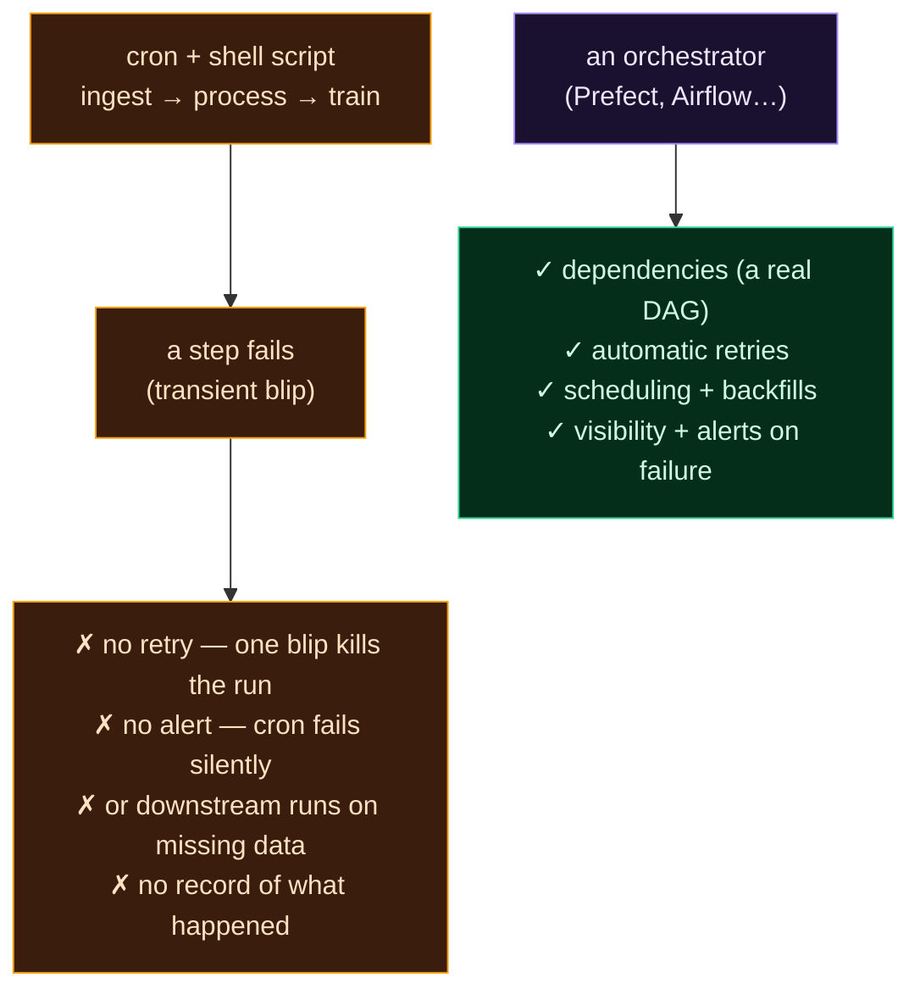

Welcome to **Day 61 of 100 Days of MLOps** — the start of **Module 7: Orchestration & Automated Pipelines.** You've built a model that's reproducible, tracked, and servable. But so far *you* run everything by hand: you kick off training, you re-score data, you check the results. Real ML systems don't work that way — they **run themselves**: retrain nightly, re-score every hour, react to new data, all without a human clicking "go." Today we ask how, and — like the "feel the pain" days before each module — we first see why the obvious answer (a shell script and a cron job) falls apart.

Chaining your pipeline steps in a bash script and scheduling it with cron *feels* like automation. It works right up until something goes wrong — and in a multi-step ML pipeline, something always eventually goes wrong. Today you'll watch a single transient failure turn that "automation" into either a silently-dead pipeline or a silently-broken model. That's why orchestration exists.

> **A "feel the pain" day.** No new tool — a hard look at why scripts + cron can't run a real pipeline, so Prefect lands with full force tomorrow.

By the end of today you will:

- See why a **shell script + cron** can't reliably run a multi-step pipeline.
- Watch a transient failure cause **two different disasters**.
- Understand what an orchestrator must handle: **dependencies, retries, visibility, scheduling**.
- Be ready for the tool built to do it.

---

## The trap: chain it and cron it

The naive automation is a script that runs each step in order, scheduled by cron:

```bash
python ingest.py && python process.py && python train.py
```

Looks reasonable. But a multi-step pipeline has *dependencies* (train needs process's output), things *fail transiently* (a network blip talking to a data source), and it runs *unattended* (cron, no human watching). A shell script understands none of that. Let's watch it break.



**Reading this diagram:**

The top half, in **amber**, is the cron + shell-script world. A pipeline runs, **a step fails** (a transient blip — a momentary network hiccup, the kind that would succeed on a retry), and you land in the **amber failure box**: *no retry* (one blip kills the whole run), *no alert* (cron fails silently — you find out days later), *or* downstream steps *run anyway on missing data*, and *no record* of what happened. Every line there is a real, common production failure that scripts + cron simply can't prevent.

The bottom half, in **purple → green**, is what an **orchestrator** gives you: real **dependencies** (it knows train needs process), **automatic retries** (a blip is retried, not fatal), **scheduling and backfills**, and **visibility with alerts** when something fails. The contrast is the whole point: **a shell script runs commands; an orchestrator runs a *workflow*** — with the reliability machinery a workflow needs. Let's make the amber side concrete.

---

## Watch it fail — two ways

Here's a three-step pipeline where the middle step hits a transient error. `ingest.py` and `train.py` are trivial; `process.py` simulates a blip:

```python
# process.py — a transient failure talking to the data source
import sys
print("[process] connecting to data source...", file=sys.stderr)
print("[process] ERROR: connection reset (transient)", file=sys.stderr)
sys.exit(1)          # fails THIS run
```

**Disaster #1 — the pipeline dies silently.** Chain the steps with `&&` (stop on first failure) and run it as cron would:

```bash
python ingest.py && python process.py && python train.py
echo "exit code: $?"
```

```text
[ingest] downloaded raw.csv
[process] connecting to data source...
[process] ERROR: connection reset (transient)
exit code: 1
```

The pipeline stopped — `train.py` never ran. That *sounds* safe, but think about what actually happened: a **transient** blip (one that would have worked on a retry) killed the entire run, and under cron there's **no retry and no alert**. The job just... didn't happen. You'd discover it days later when someone asks why the model is stale. One momentary hiccup, and your "automated" retraining silently stopped.

**Disaster #2 — worse: it runs on bad data.** Maybe you used `;` instead of `&&` so a failure doesn't stop the pipeline (people do this to be "robust"):

```bash
python ingest.py; python process.py; python train.py
```

```text
[train] ...using clean.csv that was never produced
[train] trained model on whatever data was here
```

Now `process.py` failed, but `train.py` **ran anyway** — on data that was never produced. It happily "trained a model" on stale or missing inputs, and exited `0` as if all was well. This is the nightmare: a **silently broken model**, deployed, with a green pipeline. There was no dependency check — nothing said "don't train if processing failed."

---

## What an orchestrator does that cron can't

Those two disasters aren't bad luck — they're everything scripts + cron structurally cannot do:

- **Dependencies.** An orchestrator knows `train` *depends on* `process` and won't run it if `process` failed. A shell script only knows "run the next line."
- **Retries.** A transient failure should be *retried*, not fatal. Orchestrators retry failed steps automatically (with backoff); cron reruns the *whole* job at best, hours later.
- **Visibility.** Orchestrators give you a UI, logs, run history, and **alerts on failure**. Cron runs in silence — you learn about failures from angry users.
- **Scheduling smarts.** Not just "run at 2am," but backfills, parameterised runs, "only if upstream succeeded," concurrency limits.
- **Recovery.** Resume from the failed step instead of rerunning everything from scratch.

> **Isn't a DVC pipeline (Day 24) enough?** DVC gives you *dependencies* and reproducibility — but it doesn't *schedule* runs, *retry* transient failures, or give you a *monitoring UI* and *alerts*. Those are orchestration concerns. The two complement each other: DVC defines a reproducible pipeline; an orchestrator runs pipelines reliably, on a schedule, with visibility.

That list — dependencies, retries, visibility, scheduling, recovery — is precisely what an **orchestrator** provides, and it's where this module goes. Tomorrow you meet **Prefect**, which turns your fragile script into a real, resilient workflow with a few decorators.

---

## Common errors (and how to fix them) — the mindset version

Today's "errors" are the habits that make automated pipelines fragile:

**1. "I'll just chain the steps in a bash script and cron it."**

Fine for one trivial command; a trap for a multi-step pipeline. Cron has no concept of dependencies, retries, or visibility. Use an orchestrator for real workflows.

**2. "If a step fails, the `&&` stops it — that's safe."**

It stops the run, but a *transient* failure shouldn't be fatal, and cron won't retry or tell you. A silently-not-run pipeline is a real failure, just a quiet one.

**3. "I'll use `;` so a failure doesn't block the rest."**

Now downstream steps run on missing or stale data and produce a silently-broken result. Worse than stopping. Dependencies must be enforced, not ignored.

**4. "Cron ran it, so it worked."**

Cron runs it; it doesn't tell you if it *succeeded*. Without status, logs, and alerts, "it ran" and "it worked" are different things you can't distinguish.

**5. "A transient network blip means the pipeline failed."**

It means one *attempt* failed. Transient errors should be retried automatically — an orchestrator does that; a script doesn't.

**6. "I'll add retries and logging to my bash script myself."**

You'll reinvent a bad orchestrator. Dependency graphs, retries with backoff, scheduling, a UI, and alerting are exactly what tools like Prefect give you for free.

---

## Recap — what you now have

You've felt the problem orchestration solves:

- You saw a **shell script + cron** can't run a multi-step pipeline reliably.
- A transient failure caused **two disasters**: a silently-dead pipeline, or a model trained on missing data.
- You know what's missing: **dependencies, retries, visibility, scheduling, recovery**.
- You're ready for an orchestrator built to provide them.

**Your cheat sheet:**

| Cron + script can't… | An orchestrator does |
|----------------------|----------------------|
| Enforce step dependencies | runs a real DAG |
| Retry transient failures | automatic retries + backoff |
| Show status / alert on failure | UI, logs, run history, alerts |
| Schedule smartly | backfills, params, conditions |
| Resume from failure | recovery, not full rerun |

Golden rule: **a shell script runs commands; a workflow needs an orchestrator** — dependencies, retries, and visibility aren't optional for automated ML pipelines.

---

## Coming up on Day 62

Meet the fix. **Day 62 — "Intro to Prefect"** turns your fragile script into a real workflow with almost no new code: decorate your functions with `@task` and `@flow`, and Prefect gives you a proper pipeline that understands dependencies, tracks every run, shows you a live dashboard, and forms the foundation for retries and scheduling. You'll convert today's pipeline into a Prefect flow and watch it run with full visibility — the difference between "I hope it ran" and "I can see exactly what happened."

See the full roadmap on the [100 Days of MLOps series page](/series/100-days-mlops). See you tomorrow.
