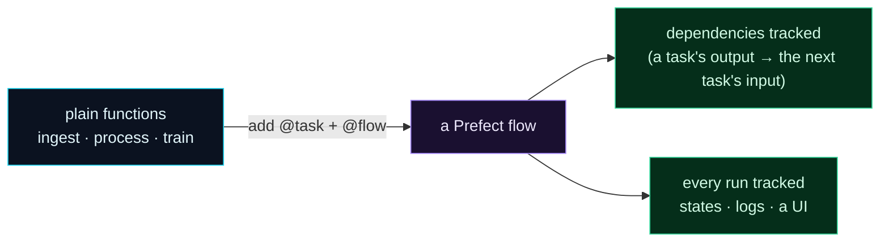

Welcome to **Day 62 of 100 Days of MLOps**. Yesterday you felt the pain: a shell script and cron can't run a multi-step pipeline reliably — one transient blip either kills the whole run silently or lets downstream steps train on missing data. Today you meet the fix. **Prefect** is a modern, Python-native orchestrator, and the beautiful part is how *little* it asks of you: take the plain functions you already have, add two decorators — `@task` and `@flow` — and you have a real workflow that understands dependencies, tracks every run, and shows you exactly what happened.

No YAML, no new language, no rewriting your code as a config file. Your pipeline stays ordinary Python. Prefect wraps it and gives you the orchestration machinery — dependencies, state tracking, logging, and (over the next few days) retries and scheduling — for the price of a few `@` lines. Let's convert yesterday's fragile pipeline into a Prefect flow and watch it run with full visibility.

> **Two decorators, a real workflow.** `@task` marks a step, `@flow` marks the pipeline. Your Python barely changes; Prefect does the rest.

By the end of today you will:

- Install **Prefect** and understand `@task` and `@flow`.
- Convert your pipeline's functions into a **Prefect flow**.
- Run it and read Prefect's **run output** — task states, flow state, logs.
- See Prefect mark a failed step **Failed** (the visibility cron never gave you).

---

## Tasks and flows: the whole idea

Prefect has two core concepts, and they map exactly onto what a pipeline already is:

- A **task** is a single unit of work — one step. You mark a function with `@task`, and Prefect tracks each time it runs: its state (Completed / Failed), its output, its logs.
- A **flow** is the pipeline itself — the function that calls the tasks in order. You mark it with `@flow`, and Prefect tracks the whole run as one thing, wiring up the tasks you call inside it.

The magic is that **dependencies are just Python**. When you pass one task's output into another, Prefect sees that the second depends on the first — a real dependency graph, built from ordinary function calls.



**Reading this diagram:**

On the left, in **cyan**, are the **plain functions** you already write — `ingest`, `process`, `train`. You *add two decorators* (`@task` on the steps, `@flow` on the pipeline) and they become the **purple Prefect flow** in the middle. Nothing about the functions' logic changed — you just told Prefect what they are.

From that flow, two **green** wins fall out for free. **Dependencies tracked**: because a task's output is passed as the next task's input, Prefect knows the order and won't run a step whose upstream failed. **Every run tracked**: each task's state (Completed/Failed), its logs, and the whole run's history, viewable in a UI. The takeaway: **you keep writing normal Python; the decorators turn it into a managed workflow** — exactly what yesterday's cron script couldn't be.

---

## Install Prefect

Prefect is a pip package (in your project's virtual environment, the one you've used all series):

```bash
pip install prefect
```

That's it — no server to stand up, no database to configure. Prefect runs your flows locally out of the box and keeps a local record of runs. (There's an optional UI dashboard you can start with one command — we'll get there.) Check it installed:

```bash
python -c "import prefect; print(prefect.__version__)"
```

```text
3.7.8
```

Any Prefect 3.x version is fine.

---

## Convert your pipeline into a flow

Here's yesterday's three-step pipeline — ingest, process, train — but written as a Prefect flow. It's the same house-price pipeline you've built all series, now orchestrated. Create `flow.py`:

```python
"""flow.py — Day 62: the house-price pipeline as a Prefect flow."""
import numpy as np, pandas as pd
from prefect import flow, task
from sklearn.linear_model import LinearRegression
from sklearn.metrics import r2_score
from sklearn.model_selection import train_test_split


@task
def ingest() -> pd.DataFrame:
    rng = np.random.default_rng(42); n = 500
    df = pd.DataFrame({"size_sqft": rng.integers(600, 3500, n),
                       "bedrooms": rng.integers(1, 6, n)})
    df["price"] = (30000 + 140 * df.size_sqft + 12000 * df.bedrooms
                   + rng.normal(0, 25000, n)).clip(50000)
    return df


@task
def process(df: pd.DataFrame) -> pd.DataFrame:
    return df.drop_duplicates()


@task
def train(df: pd.DataFrame) -> float:
    X, y = df[["size_sqft", "bedrooms"]], df["price"]
    Xtr, Xte, ytr, yte = train_test_split(X, y, test_size=0.2, random_state=42)
    model = LinearRegression().fit(Xtr, ytr)
    return round(r2_score(yte, model.predict(Xte)), 4)


@flow(name="house-price-pipeline")
def pipeline():
    raw = ingest()          # each task's OUTPUT feeds the next = a real dependency
    clean = process(raw)
    r2 = train(clean)
    print(f"pipeline finished — model R2 = {r2}")
    return r2


if __name__ == "__main__":
    pipeline()
```

Look at how little changed from an ordinary script. The three functions have `@task` on top; the `pipeline` function that calls them has `@flow`. The dependency chain — `ingest` → `process` → `train` — is expressed by **passing outputs**: `raw` goes into `process`, `clean` goes into `train`. That's how Prefect knows the order and the dependencies. Run it:

```bash
python flow.py
```

```text
Beginning flow run 'lurking-worm' for flow 'house-price-pipeline'
Task run 'ingest-0b9' - Finished in state Completed
Task run 'process-938' - Finished in state Completed
Task run 'train-ffe' - Finished in state Completed
Finished in state Completed()
pipeline finished — model R2 = 0.9642
```

Read that output — it's the whole point of today. Prefect gave your flow run a name (`lurking-worm` — it auto-generates friendly names), then reported **each task's state**: `ingest`, `process`, and `train` each *Finished in state Completed*. Finally the whole flow *Finished in state Completed*, and your own print line confirms the model trained (R² 0.9642). Compare that to yesterday's silent script: here, every step is *tracked*, *named*, and *stated*. You can see exactly what ran and that it succeeded — "I hope it ran" became "I can see it ran."

---

## The payoff: a failed step is *visible*

Yesterday's nightmare was silence — a transient blip killed the pipeline with no alert, or let a broken step slide through. Watch what Prefect does with the *same* transient failure. Make a `process` task that hits the blip, and a `train` that depends on it:

```python
# fail_demo.py — what Prefect does when a step fails
from prefect import flow, task

@task
def process(df=None):
    raise ConnectionError("connection reset (transient)")   # the Day 61 blip

@task
def train(df=None):
    print("[train] this should NOT run")

@flow(name="pipeline-with-failure")
def pipeline():
    clean = process()
    train(clean)          # depends on process — won't run if process failed

if __name__ == "__main__":
    pipeline()
```

```bash
python fail_demo.py
```

```text
Task run 'process-b5c' - Finished in state Failed('Task run encountered an exception ConnectionError: connection reset (transient)')
Encountered exception during execution: ConnectionError('connection reset (transient)')
```

Three things happened, and all three are what cron couldn't do. Prefect marked the `process` task **Failed** — explicitly, with the exception recorded, not swallowed. Because `train` **depends on** `process` (it takes its output), Prefect did **not** run it — the "`[train] this should NOT run`" line never printed. And the whole flow ended in a **Failed** state, so any monitoring or alerting sees a clear failure, not a green light. That's the difference: yesterday a blip was invisible; here it's *tracked, dependency-aware, and loud*.

(That step *still* failed on the blip — Prefect didn't retry it yet. Making a transient failure automatically retry is tomorrow's job, and it's a one-line change.)

---

## Common errors (and how to fix them)

**1. `ModuleNotFoundError: No module named 'prefect'`**

Prefect isn't installed in the active environment. Activate your virtual environment and `pip install prefect`. (Confirm with `python -c "import prefect"`.)

**2. Calling a `@task` function outside a flow**

Call tasks *inside* a `@flow` function, not at the top level of your script. A task run belongs to a flow run; calling `ingest()` directly at module level (outside a flow) isn't how Prefect is meant to be driven. Put the orchestration in the `@flow`.

**3. Forgetting to actually call the flow**

Defining `@flow def pipeline():` doesn't run anything. You still need to *call* it — `pipeline()` — usually under `if __name__ == "__main__":`. The decorator wraps the function; it doesn't invoke it.

**4. Expecting tasks to run in an order you didn't express**

Prefect orders tasks by their **data dependencies** — what output feeds what input. If two tasks don't pass data between them, Prefect may run them concurrently. To force an order without passing data, pass `wait_for=[other_task_result]` to the task call.

**5. Returning something un-serializable and getting a warning**

Prefect tracks task results. Returning huge or unpicklable objects between tasks can warn or slow things down. For big artifacts (a dataset, a model file), have the task **write to disk** and return the *path*, not the object itself — the pattern you'll use for real pipelines.

**6. "Do I need to start a server first?"**

No. Prefect runs flows locally with zero setup — `python flow.py` just works. The server/UI is *optional* (a dashboard for viewing runs). You only start it when you want the visual history, which we'll do in a later day.

---

## Recap — what you now have

You turned a fragile script into a real, tracked workflow:

- You installed **Prefect** and learned `@task` (a step) and `@flow` (the pipeline).
- You converted your pipeline into a **flow** by adding two decorators — no rewrite.
- You ran it and read the **run output**: each task Completed, the flow Completed, all tracked.
- You saw a failed step marked **Failed**, its downstream *skipped*, the flow *Failed* — the visibility cron never gave you.

**Your cheat sheet:**

| Task | Code |
|------|------|
| Import | `from prefect import flow, task` |
| Mark a step | `@task` above the function |
| Mark the pipeline | `@flow(name="...")` above it |
| Express a dependency | pass one task's output into another |
| Run | call the flow: `pipeline()` |
| Force order (no data) | `train(clean, wait_for=[other])` |

Golden rule: **keep writing normal Python — let `@task` and `@flow` make it a workflow.** Dependencies come from passing outputs, and every run is tracked, stated, and visible.

---

## Coming up on Day 63

Your flow runs and tracks everything — but yesterday's transient blip *still* killed a step. Tomorrow you fix exactly that. **Day 63 — "Retries, Caching & Logging"** adds the reliability machinery that makes orchestration worth it: a one-line `retries=3` so a transient failure is *retried* instead of fatal, caching so expensive steps don't re-run needlessly, and proper Prefect logging so every run tells you what happened. It's where "it's tracked" becomes "it's resilient."

See the full roadmap on the [100 Days of MLOps series page](/series/100-days-mlops). See you tomorrow.
