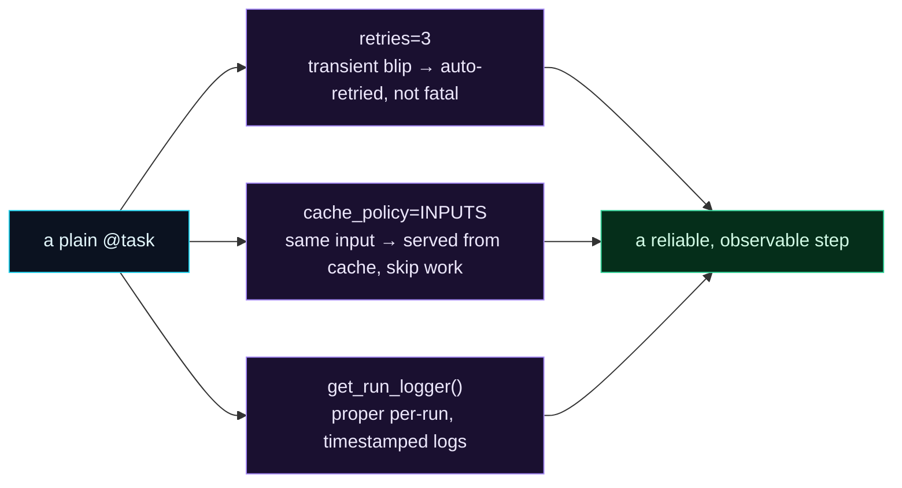

Welcome to **Day 63 of 100 Days of MLOps**. Yesterday you turned your fragile pipeline into a Prefect flow, and it tracked every step. But we ended on an honest note: when a step hit a transient blip, Prefect marked it **Failed** — clearly, visibly — but it *still* failed. It didn't retry. Today we fix exactly that, and add two more pieces of the reliability puzzle. Three small changes, each a single argument or line:

- **`retries=3`** — a transient failure is *automatically retried* instead of killing the run.
- **caching** — an expensive step that's already run on the same input is *served from cache*, not re-run.
- **logging** — `get_run_logger()` gives you proper, timestamped, per-run logs instead of stray `print`s.

This is the moment orchestration earns its keep. Yesterday you got *visibility*; today you get *resilience*. The exact transient error that silently killed your cron pipeline on Day 61 will now retry itself and recover — and you'll watch it happen.

> **Resilience, one argument at a time.** `retries=3` survives blips, caching skips repeat work, `get_run_logger()` records it all.

By the end of today you will:

- Add **`retries`** to a task and watch a transient failure recover automatically.
- Add **caching** so a task skips work it's already done for the same input.
- Use **`get_run_logger()`** for proper per-run logging.
- Understand when to use each — and when not to.

---

## Three features, one reliable step

Each feature attaches to a task with almost no code. Together they turn a bare `@task` into a step that survives transient failures, avoids wasted work, and records what it did.



**Reading this diagram:**

On the left, in **cyan**, is a **plain `@task`** — yesterday's building block, tracked but bare. Three **purple** features attach to it. **`retries=3`**: a transient blip is retried automatically instead of being fatal. **`cache_policy=INPUTS`**: if the task already ran on the same input, its result is served from cache and the work is skipped. **`get_run_logger()`**: the task writes proper, timestamped, per-run log lines Prefect captures.

All three flow into the **green** result: *a reliable, observable step*. The point is how *cheap* this is — each feature is one argument or one line, no rewrite. The takeaway: **orchestration's value isn't just seeing your pipeline; it's making it survive the real world** — flaky networks, expensive recomputation, and the need to know what happened. Let's add each.

---

## Retries: survive the transient blip

Recall Day 61's disaster: a momentary network hiccup — the kind that succeeds on a second try — killed the whole pipeline. With Prefect, you add one argument: `retries=3`. Now the task that fails is retried automatically, and a transient error becomes a non-event. Here's a task that fails its first two attempts (a blip) then succeeds — exactly like a real flaky data source. Create `retry_demo.py`:

```python
"""retry_demo.py — Day 63: a transient failure that now recovers."""
import itertools
from prefect import flow, task, get_run_logger

_attempt = itertools.count(1)          # simulate: fail twice, then succeed

@task(retries=3, retry_delay_seconds=0)
def flaky_ingest():
    n = next(_attempt)
    log = get_run_logger()
    log.info(f"attempt {n}: contacting data source")
    if n < 3:
        raise ConnectionError("connection reset (transient)")   # the Day 61 blip
    log.info("data downloaded")
    return "raw.csv"

@flow(name="pipeline-with-retries")
def pipeline():
    return flaky_ingest()

if __name__ == "__main__":
    print("result:", pipeline())
```

`@task(retries=3, retry_delay_seconds=0)` says: if this task raises, retry it up to 3 times (here with no delay; in production you'd use a few seconds, or exponential backoff). Run it:

```bash
python retry_demo.py
```

```text
attempt 1: contacting data source
Task run 'flaky_ingest-1ec' - Task run failed with exception: ConnectionError('connection reset (transient)') - Retry 1/3 will start immediately
attempt 2: contacting data source
Task run 'flaky_ingest-1ec' - Task run failed with exception: ConnectionError('connection reset (transient)') - Retry 2/3 will start immediately
attempt 3: contacting data source
data downloaded
Task run 'flaky_ingest-1ec' - Finished in state Completed()
result: raw.csv
```

Read what happened. Attempt 1 hit the transient error; Prefect logged it and announced **`Retry 1/3 will start immediately`**. Attempt 2 failed the same way — **`Retry 2/3`**. Attempt 3 succeeded, the task **Finished in state Completed**, and the flow returned `raw.csv`. The *exact* blip that silently killed your cron pipeline on Day 61 now retries itself and recovers — no human, no lost run. That's the single most important reliability feature an orchestrator gives you, and it cost one argument.

> **Retry only what's *transient*.** Retries help when a *retry might succeed* — network blips, rate limits, a busy service. They won't fix a real bug (a `KeyError`, bad data), which will just fail 3 times and waste time. Match retries to failures that are genuinely temporary.

---

## Caching: don't redo work you've already done

Some steps are expensive — downloading a big dataset, a long feature computation. If a task already ran on the *same input*, re-running it is wasted time (and money). Prefect's **caching** stores a task's result keyed by its inputs; a repeat call with the same inputs returns the cached result instead of executing. Create `cache_demo.py`:

```python
"""cache_demo.py — Day 63: skip work already done for the same input."""
import time
from prefect import flow, task
from prefect.cache_policies import INPUTS

@task(cache_policy=INPUTS)          # cache keyed by the task's inputs
def expensive_process(dataset: str):
    print(f"  [process] actually doing expensive work on {dataset}")
    time.sleep(0.2)
    return f"clean-{dataset}"

@flow(name="pipeline-with-cache")
def pipeline():
    a = expensive_process("raw.csv")     # runs for real
    b = expensive_process("raw.csv")     # same input -> served from cache
    return a, b

if __name__ == "__main__":
    print("result:", pipeline())
```

`cache_policy=INPUTS` tells Prefect to cache the result keyed by the task's inputs. The flow calls `expensive_process("raw.csv")` twice with the *same* argument. Run it:

```bash
python cache_demo.py
```

```text
  [process] actually doing expensive work on raw.csv
Task run 'expensive_process-...' - Finished in state Completed()
Task run 'expensive_process-...' - Finished in state Cached(type=COMPLETED)
result: ('clean-raw.csv', 'clean-raw.csv')
```

Look closely: **`[process] actually doing expensive work` printed only once**, even though we called the task twice. The first call ran for real (**Completed**); the second, with the same input, came back **`Cached(type=COMPLETED)`** — Prefect served the stored result and *skipped the work entirely*. Both calls returned the correct value (`clean-raw.csv`). For a step that takes minutes, this is the difference between a pipeline that re-does everything and one that only does what changed.

---

## Logging: `print` is for scripts, `get_run_logger` is for flows

You've seen `get_run_logger()` above. Inside a task or flow, it returns a logger whose output Prefect **captures and attaches to the run** — timestamped, tagged with the task-run name, and visible in the logs (and the UI). That's strictly better than `print`, which vanishes into stdout with no run context. From the retry run:

```text
23:45:27.014 | INFO    | Task run 'flaky_ingest-1ec' - attempt 1: contacting data source
```

Every line is timestamped, level-tagged (`INFO`), and attributed to the exact task run. When a pipeline runs unattended at 2am and something looks off, *this* is how you find out what happened — not by hoping a `print` landed in some log file. The rule: **inside flows and tasks, log with `get_run_logger()`**; save `print` for quick local pokes.

---

## Common errors (and how to fix them)

**1. Retrying a bug instead of a blip**

`retries=3` on a task that fails deterministically (a `KeyError`, a schema mismatch) just fails three times, slower. Retries are for *transient* failures — network, rate limits, a temporarily busy service. Fix real bugs; retry only what a retry could fix.

**2. No delay between retries**

`retry_delay_seconds=0` hammers a struggling service instantly. For real transient failures, give it room: `retry_delay_seconds=5`, or a backoff list like `retry_delay_seconds=[1, 10, 60]` so each retry waits longer. (We used `0` here only to keep the demo instant.)

**3. Caching a task with hidden inputs**

`cache_policy=INPUTS` keys on the *arguments*. If your task also reads a file or a clock that changed, the cache will wrongly serve a stale result. Cache only tasks that are truly a pure function of their inputs — or include the changing thing as an argument.

**4. Stale cache when the code changed**

If you cache on inputs alone and then change the task's *logic*, you can get an old cached result from the new code. For code-sensitive caching, use a policy that includes the task source (Prefect's `TASK_SOURCE + INPUTS`) so editing the task busts the cache.

**5. Using `print` and wondering where the logs went**

`print` writes to stdout with no run context and isn't captured as a proper log. Inside tasks/flows use `log = get_run_logger()` then `log.info(...)` — it's timestamped, attributed, and shows in the run's logs and UI.

**6. Expecting a failed flow to retry the whole pipeline**

`retries` on a `@task` retries *that task*. Retrying an entire flow is a separate setting (`@flow(retries=...)`). Usually you want *task-level* retries — retry the step that blipped, not re-run everything from scratch.

---

## Recap — what you now have

Your flow went from tracked to *resilient*:

- **`retries=3`** turned the transient blip that killed Day 61's pipeline into an automatic recovery — you watched `Retry 1/3`, `Retry 2/3`, then Completed.
- **Caching** (`cache_policy=INPUTS`) skipped an expensive step on a repeat input — it ran once, then came back `Cached`.
- **`get_run_logger()`** gave you proper timestamped, per-run logs instead of stray prints.
- You know to **retry only transient failures**, add **delays/backoff**, and **cache only pure work**.

**Your cheat sheet:**

| Goal | Code |
|------|------|
| Retry a flaky step | `@task(retries=3, retry_delay_seconds=5)` |
| Backoff | `retry_delay_seconds=[1, 10, 60]` |
| Cache by inputs | `@task(cache_policy=INPUTS)` (from `prefect.cache_policies`) |
| Cache-bust on code change | `cache_policy=TASK_SOURCE + INPUTS` |
| Proper logging | `log = get_run_logger(); log.info(...)` |
| Retry the whole flow | `@flow(retries=2)` |

Golden rule: **retries make transient failures survivable, caching makes repeat work free, and `get_run_logger` makes runs explainable** — three tiny changes that turn a tracked flow into a reliable one.

---

## Coming up on Day 64

Your pipeline is now resilient — but *you* still start it by hand. Real ML systems run *on a schedule*: retrain nightly, re-score every hour, no human clicking go. **Day 64 — "Scheduling Pipelines"** shows you how to deploy a Prefect flow and give it a schedule (a cron string or an interval), so it runs itself — the whole reason Module 7 exists. It's where "I run my pipeline" finally becomes "my pipeline runs itself."

See the full roadmap on the [100 Days of MLOps series page](/series/100-days-mlops). See you tomorrow.
