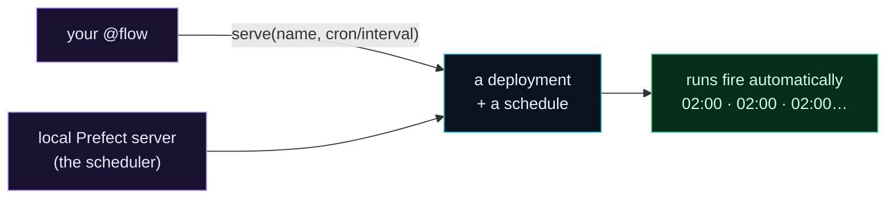

Welcome to **Day 64 of 100 Days of MLOps**. Your pipeline has come a long way: it's a Prefect flow (Day 62), it retries transient failures and caches expensive work (Day 63). But there's still a human in the loop — *you* type `python flow.py` to run it. Real ML systems don't wait for you. They retrain nightly, re-score hourly, refresh features every morning — **on a schedule, unattended.** That's the whole reason Module 7 exists, and today you deliver it.

You'll take your flow, give it a **schedule** — a cron string like `0 2 * * *` for "2am every day," or a simple interval — **serve** it, and watch Prefect's scheduler fire runs *automatically*, with nobody clicking go. This is the payoff of everything since Day 61: not a script you remember to run, but a pipeline that runs *itself*, reliably, on time.

> **From "I run it" to "it runs itself."** A schedule + `serve()` turns your flow into a pipeline that fires on its own.

By the end of today you will:

- Understand a Prefect **deployment** and how a **schedule** attaches to it.
- Start a local **Prefect server** so the scheduler can fire runs.
- **Serve** your flow on an interval (and see the cron form for production).
- Watch scheduled runs execute **automatically** — no manual trigger.

---

## Deployment, schedule, server: the three pieces

To make a flow run itself, three things come together. A **deployment** is your flow *registered* as something that can be triggered or scheduled. A **schedule** (a cron string or an interval) says *when*. And a running **Prefect server** provides the scheduler that actually fires the runs at those times.



**Reading this diagram:**

On the left, in **purple**, is **your `@flow`** — the pipeline you already built. Calling `serve(name, cron/interval)` on it registers a **cyan deployment with a schedule** — your flow, now known to Prefect and told *when* to run. The other purple node, the **local Prefect server**, provides the *scheduler*: the component that watches the clock and creates runs when a schedule says so.

Those combine into the **green** result: **runs fire automatically** at the scheduled times (2am, 2am, 2am…), with no human involved. The key insight is that all three pieces are needed — a schedule with no running server never fires (a gotcha we'll hit head-on), and a served flow with no schedule just waits to be triggered. Put them together and your pipeline runs itself. Let's build it.

---

## Start a local Prefect server

The scheduler lives in a Prefect *server*. For a served flow to fire on a schedule, a real server must be running (an on-the-fly "ephemeral" one won't schedule — more on that in the errors). Start one in its own terminal:

```bash
prefect server start
```

```text
 ___ ___ ___ ___ ___ ___ _____
| _ \ _ \ __| __| __/ __|_   _|
|  _/   / _|| _|| _| (__  | |
|_| |_|_\___|_| |___\___| |_|

Configure Prefect to communicate with the server with:
    prefect config set PREFECT_API_URL=http://127.0.0.1:4200/api

View the dashboard at http://127.0.0.1:4200
```

Leave that running. It hosts the API, the scheduler, **and** a dashboard at `http://127.0.0.1:4200` where you can watch runs. In a *second* terminal, point Prefect at it so your flow talks to this server rather than an ephemeral one:

```bash
prefect config set PREFECT_API_URL=http://127.0.0.1:4200/api
```

(On Windows use the same commands — Prefect is cross-platform; run each in its own terminal / PowerShell window.)

---

## Serve your flow on a schedule

Now give your flow a schedule and serve it. `serve()` registers the deployment and then *stays running*, polling the server for scheduled runs and executing them. Create `schedule.py`:

```python
"""schedule.py — Day 64: serve the flow on a schedule so it runs itself."""
from datetime import datetime
from prefect import flow, task, get_run_logger

@task
def retrain():
    get_run_logger().info(f"retrained model at {datetime.now():%H:%M:%S}")
    return "model.joblib"

@flow(name="nightly-retrain")
def pipeline():
    retrain()

if __name__ == "__main__":
    # Production: cron="0 2 * * *" runs at 02:00 every day.
    # Here we use a 5-second interval so you can watch it fire live.
    pipeline.serve(name="nightly-deployment", interval=5)
```

The only new line is `pipeline.serve(...)`. In production you'd write `cron="0 2 * * *"` (2am daily); to *see it work in seconds*, we use `interval=5`. Run it:

```bash
python schedule.py
```

```text
Your flow 'nightly-retrain' is being served and polling for scheduled runs!

To trigger a run for this flow, use the following command:

        $ prefect deployment run 'nightly-retrain/nightly-deployment'
```

It's now **serving** — registered, scheduled, and waiting. Leave it running and watch: every 5 seconds, the scheduler creates a run and it executes, all on its own:

```text
23:50:09 | Beginning flow run 'nickel-doberman' for flow 'nightly-retrain'
23:50:09 | retrained model at 23:50:09
23:50:12 | Beginning flow run 'married-goldfish' for flow 'nightly-retrain'
23:50:12 | retrained model at 23:50:12
23:50:17 | Beginning flow run 'invincible-angelfish' for flow 'nightly-retrain'
23:50:17 | retrained model at 23:50:17
23:50:22 | Beginning flow run 'dainty-dragon' for flow 'nightly-retrain'
23:50:22 | retrained model at 23:50:22
```

That's the whole point of Module 7, right there. **You didn't trigger any of these.** The scheduler fired a fresh flow run every interval — each with its own auto-generated name (`nickel-doberman`, `married-goldfish`…) — and each retrained the model. Swap `interval=5` for `cron="0 2 * * *"` and this exact machinery retrains your model at 2am every night, forever, with no one watching. Stop it with `Ctrl-C` when you're done; the runs also appear in the dashboard at `http://127.0.0.1:4200`.

---

## Cron strings and intervals

Two ways to say *when*, both passed to `serve()`:

| Schedule | Meaning |
|----------|---------|
| `interval=60` | every 60 seconds |
| `interval=timedelta(hours=1)` | every hour |
| `cron="0 2 * * *"` | 02:00 every day |
| `cron="0 */6 * * *"` | every 6 hours |
| `cron="30 3 * * 1"` | 03:30 every Monday |

A **cron string** has five fields — `minute hour day-of-month month day-of-week`. `0 2 * * *` is "minute 0, hour 2, any day, any month, any weekday" = 2am daily. Use **`interval`** for "every N," **`cron`** for "at specific clock times." (If cron syntax is fiddly, a site like crontab.guru helps — but the table above covers the ML cases you'll actually need: nightly retrain, hourly re-score, weekly refresh.)

To fire a run *right now* without waiting for the schedule (handy for testing), use the command the banner printed:

```bash
prefect deployment run 'nightly-retrain/nightly-deployment'
```

---

## Common errors (and how to fix them)

**1. `Cannot schedule flows on an ephemeral server`**

The most common gotcha. If you `serve()` without a real server running, Prefect spins up a *temporary* one that **won't run the scheduler** — your interval/cron never fires. Fix: start `prefect server start` in another terminal and set `PREFECT_API_URL` to it, *then* serve.

**2. The `serve()` process exited, so nothing fires**

`serve()` must **keep running** — it's the worker that executes scheduled runs. If you close the terminal or the process dies, scheduling stops. Keep it running (in production, as a background service / systemd unit / container that restarts).

**3. Confusing this with system cron**

You're *not* editing your OS crontab. Prefect owns the schedule, and it adds what cron can't: retries, logging, a UI, dependency-aware runs, and history. That's the entire lesson of Day 61 — don't drop back to raw cron.

**4. A bad cron string that runs too often (or never)**

`* * * * *` runs *every minute*, not "once." Get the five fields right (`minute hour dom month dow`), and test with a short interval first. Verify the next run times in the dashboard before trusting a production schedule.

**5. Timezone surprises**

`0 2 * * *` fires at 2am in the *server's* timezone, which may be UTC, not yours. For anything time-sensitive, set the schedule's timezone explicitly (Prefect schedules accept a `timezone` argument) so "2am" means 2am where you expect.

**6. Overlapping runs pile up**

If a scheduled run takes longer than the interval, runs can overlap or queue. For heavy pipelines, use a sensible interval (longer than the run takes) and consider concurrency limits so you don't stack ten retrains on top of each other.

---

## Recap — what you now have

Your pipeline runs itself:

- You understand a **deployment** (flow registered), a **schedule** (cron/interval), and the **server** (the scheduler that fires runs).
- You started a **local Prefect server** and pointed your flow at it.
- You **served** your flow on an interval and watched runs fire **automatically** — no manual trigger, each with its own run.
- You know the **cron string** form (`0 2 * * *`) for real nightly retraining, and the ephemeral-server gotcha to avoid.

**Your cheat sheet:**

| Task | Command / code |
|------|----------------|
| Start the server | `prefect server start` |
| Point at it | `prefect config set PREFECT_API_URL=http://127.0.0.1:4200/api` |
| Serve on interval | `pipeline.serve(name="d", interval=60)` |
| Serve on cron | `pipeline.serve(name="d", cron="0 2 * * *")` |
| Trigger now | `prefect deployment run 'nightly-retrain/nightly-deployment'` |
| Watch runs | dashboard at `http://127.0.0.1:4200` |

Golden rule: **a schedule needs a running server to fire** — start the server, serve your flow with `cron`/`interval`, keep it running, and your pipeline retrains itself on time, every time.

---

## Coming up on Day 65

Your pipeline runs on a schedule — but it always does the *exact same thing*. What if you want to retrain on last month's data, or with a different learning rate, without editing code? **Day 65 — "Parameterized Pipelines"** makes your flow take **parameters**: pass a date range, a config value, a data path as an argument to the flow, and Prefect tracks each run *with the parameters it used*. It's how one pipeline serves many scenarios — and how you'll run backfills and experiments without copy-pasting flows.

See the full roadmap on the [100 Days of MLOps series page](/series/100-days-mlops). See you tomorrow.
