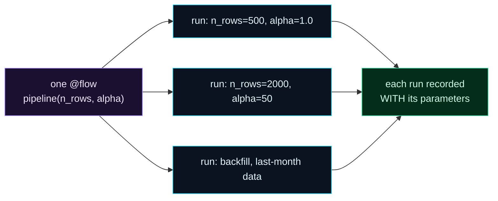

Welcome to **Day 65 of 100 Days of MLOps**. Your pipeline is a resilient, self-scheduling Prefect flow — a huge leap from the fragile cron script of Day 61. But it has one rigidity left: it always does the *exact same thing*. Same data size, same hyperparameters, every run. Real work isn't like that. You want to retrain on *last month's* data for a backfill, sweep a *different* learning rate for an experiment, or point the *same* pipeline at staging versus production data — all without copy-pasting the flow or editing code between runs.

The answer is **parameters**. A Prefect flow is just a Python function, so it can take arguments — and when it does, Prefect treats them as first-class *parameters*: you pass different values per run, and Prefect **records each run with the exact parameters it used**. One flow, many scenarios, full provenance. Today you'll parameterize your pipeline and run it two different ways from identical code.

> **One flow, many scenarios.** Give your flow arguments, and every run is a different scenario — tracked with the parameters that produced it.

By the end of today you will:

- Add **parameters** to a flow and give them sensible **defaults**.
- Run the *same* pipeline with **different values** — no code edits.
- Understand how Prefect **records parameters** per run (provenance).
- Know how to pass parameters to **scheduled/deployed** runs.

---

## Parameters: arguments Prefect tracks

A `@flow` function's arguments *are* its parameters. Give them type hints and defaults, and you can run the flow with different values each time. Crucially, Prefect stores the parameter values **with each run**, so you always know exactly which data size or hyperparameter produced a given result.



**Reading this diagram:**

On the left, in **purple**, is **one `@flow`** — a single pipeline, `pipeline(n_rows, alpha)`, that you write once. From it flow several **cyan runs**, each with *different parameter values*: 500 rows at alpha 1.0, 2000 rows at alpha 50, a backfill over last month's data. Same code, different inputs — no copy-pasting, no editing between runs.

Every one of those runs flows into the **green** node: *each run recorded with its parameters*. That's the provenance win — Prefect doesn't just run your flow with different values, it *remembers* which values produced which run, so months later you can see exactly what a given model was trained on. The takeaway: **parameters turn one rigid pipeline into a flexible, auditable tool** — one flow that serves every scenario, each fully traceable. Let's build it.

---

## Parameterize your pipeline

Here's the training pipeline with two parameters: `n_rows` (how much data) and `alpha` (a Ridge-regression hyperparameter). Both have defaults, so it still runs with no arguments — but now you can override either. Create `param_flow.py`:

```python
"""param_flow.py — Day 65: one pipeline, many scenarios via parameters."""
import numpy as np, pandas as pd
from prefect import flow, task, get_run_logger
from sklearn.linear_model import Ridge
from sklearn.metrics import mean_absolute_error
from sklearn.model_selection import train_test_split

@task
def make_data(n_rows: int) -> pd.DataFrame:
    rng = np.random.default_rng(42)
    df = pd.DataFrame({"size_sqft": rng.integers(600, 3500, n_rows),
                       "bedrooms": rng.integers(1, 6, n_rows)})
    df["price"] = (30000 + 140*df.size_sqft + 12000*df.bedrooms
                   + rng.normal(0, 25000, n_rows)).clip(50000)
    return df

@task
def train(df: pd.DataFrame, alpha: float) -> float:
    X, y = df[["size_sqft", "bedrooms"]], df["price"]
    Xtr, Xte, ytr, yte = train_test_split(X, y, test_size=0.2, random_state=42)
    model = Ridge(alpha=alpha).fit(Xtr, ytr)
    return round(mean_absolute_error(yte, model.predict(Xte)), 0)

@flow(name="train-pipeline")
def pipeline(n_rows: int = 500, alpha: float = 1.0):     # <- parameters, with defaults
    log = get_run_logger()
    log.info(f"running with n_rows={n_rows}, alpha={alpha}")
    df = make_data(n_rows)
    mae = train(df, alpha)
    log.info(f"result: MAE=${mae:,.0f}  (n_rows={n_rows}, alpha={alpha})")
    return mae

if __name__ == "__main__":
    pipeline()                          # defaults: n_rows=500, alpha=1.0
    pipeline(n_rows=2000, alpha=50.0)   # a different scenario — no code change
```

The flow signature `pipeline(n_rows: int = 500, alpha: float = 1.0)` is all it takes — those are now parameters. We call it twice: once with defaults, once with different values. Run it:

```bash
python param_flow.py
```

```text
Beginning flow run 'roaring-mule' for flow 'train-pipeline'
running with n_rows=500, alpha=1.0
result: MAE=$19,684  (n_rows=500, alpha=1.0)
Finished in state Completed

Beginning flow run 'indefinable-copperhead' for flow 'train-pipeline'
running with n_rows=2000, alpha=50.0
result: MAE=$19,343  (n_rows=2000, alpha=50.0)
Finished in state Completed
```

Two runs from **one flow**, no code edited between them. The first used the defaults (500 rows, alpha 1.0) → MAE **$19,684**; the second, a different scenario (2000 rows, alpha 50) → MAE **$19,343**. Each is a *separate, named flow run* (`roaring-mule`, `indefinable-copperhead`), and each was run *with its own parameters*. That's the entire idea: the pipeline is now a flexible tool, not a fixed script.

---

## Provenance: which parameters made this run?

The quiet superpower here isn't just flexibility — it's **traceability**. Prefect records the parameter values *as part of each flow run*. In the dashboard (Day 64's server at `http://127.0.0.1:4200`), every run shows the parameters it was called with. So when someone asks "what data was the model from last Tuesday trained on?" or "which alpha gave us that result?", the answer is recorded, not guessed.

This is why parameters beat the tempting alternatives. Editing the code before each run loses the history (and risks committing a test value). A pile of near-identical `flow_500.py`, `flow_2000.py` files is unmaintainable. **One parameterized flow** keeps a single source of truth *and* a full record of every scenario you ran through it — the same provenance discipline you learned for data (Module 3) and experiments (Module 4), now for pipeline runs.

---

## Parameters for scheduled and deployed runs

Parameters aren't just for local calls — they shine with the deployments from Day 64. A scheduled deployment can carry **default parameters** (e.g. always retrain on the latest data), and you can **override them per run** when you trigger one manually — perfect for backfills:

```bash
# trigger a one-off run of the deployment with different parameters
prefect deployment run 'train-pipeline/nightly-deployment' \
    --param n_rows=5000 --param alpha=10
```

So your nightly schedule runs with sensible defaults, but when you need a backfill or an experiment, you fire the *same* deployment with different `--param` values — no new code, and the run is recorded with exactly the parameters you passed. One flow covers the scheduled case *and* every ad-hoc scenario.

---

## Common errors (and how to fix them)

**1. No defaults, so scheduled runs fail**

A scheduled deployment calls your flow with *no* arguments unless you set defaults or deployment parameters. Give every parameter a sensible default (`def pipeline(n_rows: int = 500)`) so an unattended run always has values to use.

**2. Wrong type passed from the CLI or UI**

`--param n_rows=5000` arrives as text; Prefect coerces it using your **type hints**. If you omit hints (`def pipeline(n_rows):`), you may get a string where you expected an int and hit a subtle bug. Always type-hint parameters so Prefect validates and converts them.

**3. Passing huge objects as parameters**

Parameters are recorded and serialized. Pass *small, serializable* values — a path, a date, a number — not a giant DataFrame or a loaded model. Give the flow a data *path* as a parameter and let a task load it, rather than passing the data itself.

**4. Mutable default arguments**

The classic Python trap: `def pipeline(cols=[]):` reuses the same list across runs. Use `None` and build inside (`cols = cols or ["size_sqft"]`), so each run starts clean. This bites parameterized flows just like any function.

**5. Editing code instead of using parameters**

If you find yourself changing a number in the file before each run, that number should be a *parameter*. Editing code loses provenance and risks committing a test value. Parameterize it once and pass values instead.

**6. Parameter names that don't match**

`--param n_row=5000` (typo) silently won't set `n_rows` — you'll get the default and wonder why nothing changed. Match parameter names to the flow signature exactly; check the run's recorded parameters if a value seems ignored.

---

## Recap — what you now have

Your pipeline is now flexible *and* auditable:

- You added **parameters** with defaults to a flow — `pipeline(n_rows=500, alpha=1.0)`.
- You ran the **same pipeline** as two scenarios with different values, no code edits — MAE $19,684 vs $19,343.
- You understand Prefect **records parameters per run**, giving full provenance.
- You know how to pass parameters to **deployed/scheduled** runs with `--param` for backfills and experiments.

**Your cheat sheet:**

| Task | Code / command |
|------|----------------|
| Define parameters | `@flow` `def pipeline(n_rows: int = 500, alpha: float = 1.0):` |
| Run a scenario | `pipeline(n_rows=2000, alpha=50)` |
| Always give defaults | so scheduled runs have values |
| Type-hint everything | Prefect validates & coerces params |
| Override a deployed run | `prefect deployment run 'flow/dep' --param n_rows=5000` |
| Pass paths, not data | small serializable values only |

Golden rule: **parameters turn one flow into many scenarios — each tracked with the values that produced it.** Type-hint them, default them, and pass values instead of editing code.

---

## Coming up on Day 66

You can build, schedule, and parameterize flows — but so far each pipeline has been a straight line of steps. Real pipelines **branch and fan out**: validate data *and* features in parallel, train several models at once, run only the steps that a condition selects. **Day 66 — "Complex Flows: Subflows & Mapping"** shows you how to compose flows from other flows and run tasks over many inputs concurrently — turning a linear pipeline into a real, branching workflow.

See the full roadmap on the [100 Days of MLOps series page](/series/100-days-mlops). See you tomorrow.
