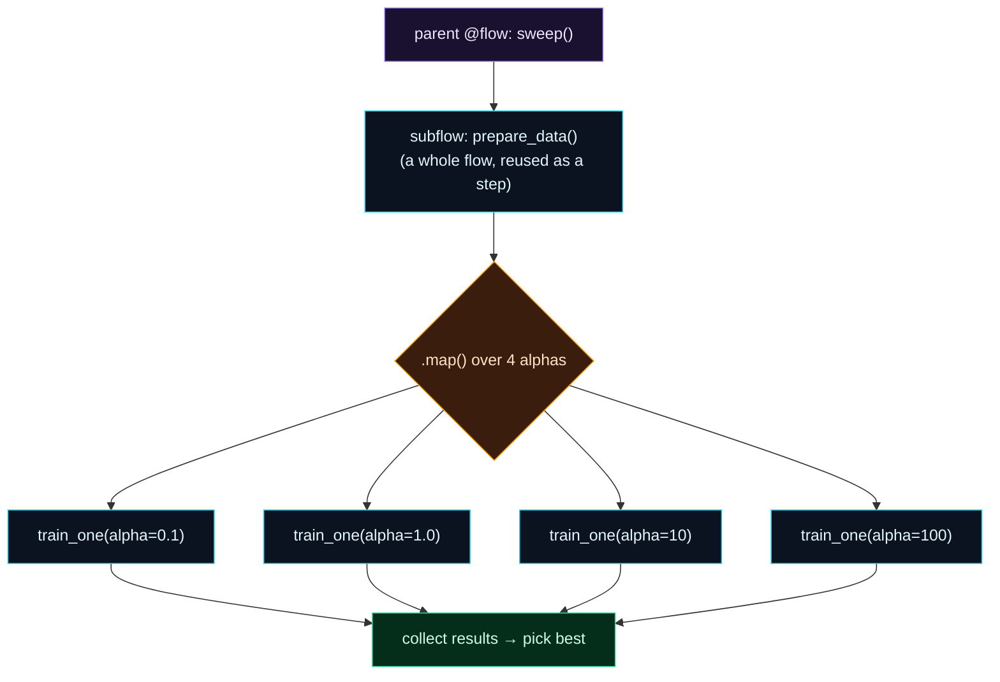

Welcome to **Day 66 of 100 Days of MLOps**. Every flow you've built has been a straight line: ingest → process → train, one step after another. Real ML pipelines aren't always so tidy. You want to **reuse** a data-prep step across several pipelines. You want to train **five models at once** instead of one after another. You want to **fan out** over every partition of a dataset. A single linear flow can't express that cleanly — so today you meet the two Prefect features that can:

- **Subflows** — call one `@flow` *inside* another. The inner flow becomes a tracked, reusable building block; the outer flow composes them. Modular pipelines, not one giant function.
- **Mapping** — `.map()` runs a task over a *list* of inputs, creating one task run per item and executing them **concurrently**. A whole hyperparameter sweep in parallel, from one line.

Together they turn "a script that does one thing in order" into "a workflow that composes reusable pieces and does many things at once." You'll build exactly that: a flow that prepares data in a subflow, then sweeps four hyperparameters in parallel to pick the best.

> **Compose and fan out.** Subflows make pipelines *modular*; `.map()` makes them *parallel*. Both are one small step up from what you already write.

By the end of today you will:

- Call a **subflow** from a parent flow and see it tracked as a nested run.
- Use **`.map()`** to run a task over many inputs concurrently.
- Use **`unmapped()`** to hold an argument constant across a mapped call.
- Collect mapped **results** and pick the best.

---

## Two ways to grow beyond a straight line

A linear flow calls tasks in sequence. Two features let it branch. A **subflow** is just a `@flow` you call from inside another `@flow` — Prefect tracks it as a nested run, so you get a reusable, independently-visible pipeline component. **Mapping** takes a task and a list, and fans it out: one task run per list item, run concurrently instead of in a loop.



**Reading this diagram:**

At the top, in **purple**, is the **parent flow** `sweep()`. Its first step is the **cyan subflow** `prepare_data()` — a *whole flow* used as a single step, tracked on its own and reusable in other pipelines. Then comes the **amber `.map()`** node: it takes the training task and a list of four alphas and **fans out** into four **cyan task runs** — `train_one` at alpha 0.1, 1.0, 10, 100 — which run *concurrently*, not one-after-another. Finally, all four flow into the **green** node: *collect results, pick the best*.

The shape is the lesson. A linear flow would be a single vertical chain; here it **branches** (a subflow as a component) and **widens** (four parallel trainings from one `.map()`). That's the difference between a script and a real workflow — composed of reusable pieces, doing many things at once. Let's build it.

---

## Build it: a subflow + a parallel sweep

Here's a flow that prepares data in a **subflow**, then uses **`.map()`** to train a Ridge model at four different `alpha` values *in parallel*, and picks the best. Create `complex_flow.py`:

```python
"""complex_flow.py — Day 66: subflows + .map() fan-out."""
import numpy as np, pandas as pd
from prefect import flow, task, get_run_logger, unmapped
from sklearn.linear_model import Ridge
from sklearn.metrics import mean_absolute_error
from sklearn.model_selection import train_test_split

@task
def make_data(n_rows: int = 800) -> pd.DataFrame:
    rng = np.random.default_rng(42)
    df = pd.DataFrame({"size_sqft": rng.integers(600, 3500, n_rows),
                       "bedrooms": rng.integers(1, 6, n_rows)})
    df["price"] = (30000 + 140*df.size_sqft + 12000*df.bedrooms
                   + rng.normal(0, 25000, n_rows)).clip(50000)
    return df

@task
def train_one(df: pd.DataFrame, alpha: float) -> dict:
    X, y = df[["size_sqft", "bedrooms"]], df["price"]
    Xtr, Xte, ytr, yte = train_test_split(X, y, test_size=0.2, random_state=42)
    mae = mean_absolute_error(yte, Ridge(alpha=alpha).fit(Xtr, ytr).predict(Xte))
    return {"alpha": alpha, "mae": round(mae, 0)}

@flow(name="prepare-data")                       # <- a SUBFLOW: a flow used as a step
def prepare_data(n_rows: int = 800) -> pd.DataFrame:
    get_run_logger().info(f"subflow preparing {n_rows} rows")
    return make_data(n_rows)

@flow(name="sweep-pipeline")
def sweep():
    log = get_run_logger()
    df = prepare_data(800)                        # call the subflow
    alphas = [0.1, 1.0, 10.0, 100.0]
    results = train_one.map(unmapped(df), alphas) # fan out: one run per alpha, concurrent
    best = min((r.result() for r in results), key=lambda r: r["mae"])
    log.info(f"best: alpha={best['alpha']} MAE=${best['mae']:,.0f}")
    return best

if __name__ == "__main__":
    print("BEST:", sweep())
```

Two things to notice. `prepare_data` is a `@flow`, and `sweep` *calls it* — that makes it a **subflow**. And `train_one.map(unmapped(df), alphas)` fans the training task across the four alphas: `alphas` is the list to map over, and `unmapped(df)` says "give *every* mapped run the same `df`" (more on that in a second). Each mapped call returns a future; `r.result()` gets its value. Run it:

```bash
python complex_flow.py
```

```text
Beginning subflow run 'meaty-squirrel' for flow 'prepare-data'
subflow preparing 800 rows
Task run 'train_one-4d4' - Finished in state Completed()
Task run 'train_one-929' - Finished in state Completed()
Task run 'train_one-d2c' - Finished in state Completed()
Task run 'train_one-f7c' - Finished in state Completed()
best: alpha=100.0 MAE=$21,710
BEST: {'alpha': 100.0, 'mae': 21710.0}
```

Read what happened. The **subflow** ran first — Prefect logged `Beginning subflow run 'meaty-squirrel' for flow 'prepare-data'`, tracking it as its *own* nested run (with its own name and state). Then `.map()` created **four separate task runs** — one per alpha — each `Finished in state Completed`, run concurrently rather than in a Python loop. Finally the flow collected all four results and picked the winner: `alpha=100.0` with the lowest MAE (`$21,710`). One flow, a reusable data-prep component, and a four-way parallel sweep — none of which a straight-line script gives you cleanly.

---

## The `unmapped()` gotcha

Here's a trap you'll hit the first time you use `.map()`. By default, Prefect maps over **every** argument you pass — it expects them all to be lists of the same length, and pairs them up element-by-element. So if you write `train_one.map(df, alphas)`, Prefect tries to *iterate `df` too* — and a DataFrame iterates its column names (here, 3 of them), which don't match the 4 alphas:

```text
prefect.exceptions.MappingLengthMismatch: Received iterable parameters with
different lengths. Got lengths: {'df': 3, 'alpha': 4}
```

The fix is **`unmapped()`**: wrap any argument that should stay *constant* across all mapped runs. `unmapped(df)` tells Prefect "don't iterate this — hand the same `df` to every call," while it maps only over `alphas`. Rule of thumb: **the thing you're sweeping over is a plain list; everything held constant gets `unmapped()`.**

---

## When to reach for each

- **Subflows** — when a chunk of your pipeline is *reusable* (a data-prep or validation flow used by several pipelines), or when a big pipeline is easier to read as a few named sub-pipelines. Each subflow is independently tracked, retried, and visible.
- **Mapping** — when you do the *same work over many items*: a hyperparameter sweep, processing every file/partition, scoring many batches. `.map()` runs them concurrently and collects the results, instead of a slow serial loop.

Both are the natural next step once your pipelines outgrow a single straight line — and both stay pure Python, tracked by Prefect.

---

## Common errors (and how to fix them)

**1. `MappingLengthMismatch` — mapped args have different lengths**

`.map()` maps over *all* iterable args and requires equal lengths. Wrap constants in **`unmapped(x)`** so only your real list is mapped. (A DataFrame "has length" = its column count, which is why it sneaks in.)

**2. Forgetting `.result()` on mapped outputs**

`train_one.map(...)` returns a list of *futures*, not values. Call `.result()` on each (`[f.result() for f in results]`) — or pass the futures straight into a downstream task, which resolves them automatically. Don't treat a future as the value.

**3. A subflow that's really just a task**

If a piece of work is a single unit with no internal steps, make it a `@task`, not a `@flow`. Use a **subflow** when it's a small *pipeline* of its own (multiple tasks, its own ret/logging concerns). Over-using subflows adds noise.

**4. Expecting `.map()` to be parallel with the default runner**

Mapped runs are *submitted concurrently*, but true parallelism depends on the task runner. For CPU-bound work, use a runner like `ThreadPoolTaskRunner` (or a process/Dask runner) — otherwise concurrency helps most with I/O-bound tasks. Measure before assuming N× speedup.

**5. Mapping over something huge and running out of resources**

`.map()` over 10,000 items launches 10,000 task runs. That can swamp memory or a database. Batch the inputs (map over chunks), or set concurrency limits, for large fan-outs.

**6. Subflow parameters passed positionally by mistake**

Call subflows with clear (ideally keyword) arguments — `prepare_data(n_rows=800)` — so the recorded parameters are unambiguous and a scheduled/deployed run passes them correctly.

---

## Recap — what you now have

Your pipelines can branch and fan out:

- You called a **subflow** (`prepare_data`) from a parent flow — a reusable, independently-tracked pipeline component.
- You used **`.map()`** to fan `train_one` across four alphas as **four concurrent task runs**, then picked the best (alpha 100, MAE $21,710).
- You learned **`unmapped()`** to hold `df` constant while mapping over the list — and why `MappingLengthMismatch` happens.
- You know **when** to use each: subflows for modular/reusable pipelines, mapping for the same work over many inputs.

**Your cheat sheet:**

| Task | Code |
|------|------|
| Subflow | call a `@flow` inside another `@flow` |
| Map a task | `train_one.map(unmapped(df), alphas)` |
| Hold arg constant | wrap it in `unmapped(...)` |
| Get results | `[f.result() for f in results]` |
| Parallel CPU work | `@flow(task_runner=ThreadPoolTaskRunner())` |
| Big fan-out | map over batches, set concurrency limits |

Golden rule: **subflows compose pipelines; `.map()` parallelizes them** — reach for a subflow to reuse a pipeline, and `.map()` (with `unmapped` for the constants) to run one task over many inputs at once.

---

## Coming up on Day 67

You've built flows that branch, retry, schedule, and fan out — and every one of those runs has been *recorded*. Tomorrow you finally look at where. **Day 67 — "Observability: The Prefect UI & Run States"** gives you the tour: start the dashboard, read the run states (Completed, Failed, Retrying, Cached), drill into logs and parameters, and filter your run history — so when a scheduled pipeline runs at 2am, you can see *exactly* what happened. It's how orchestration stops being a black box.

See the full roadmap on the [100 Days of MLOps series page](/series/100-days-mlops). See you tomorrow.
