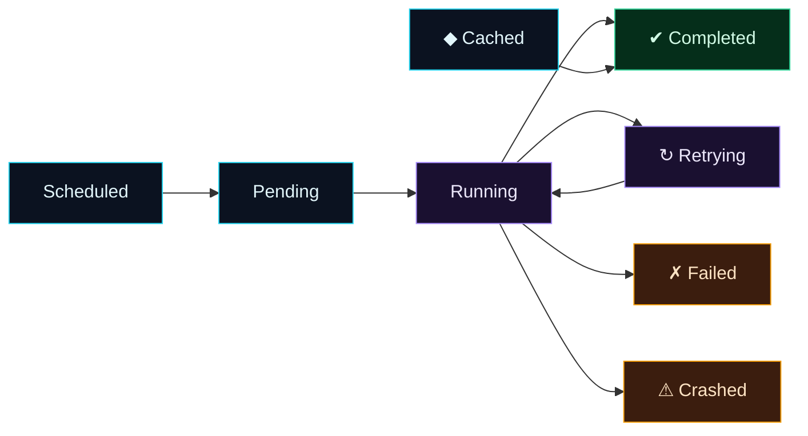

Welcome to **Day 67 of 100 Days of MLOps**. Here's a question that's been quietly building since Day 62: *every* flow you've run — the retries, the schedules, the parallel sweeps — has been **recorded**. But recorded *where*, and how do you read it? Today you find out. This is **observability**: the ability to look at your pipelines and know, at a glance, what ran, what succeeded, what failed, and why.

It matters most exactly when you're *not* watching. A pipeline you run by hand, you can see fail in your terminal. But the whole point of Module 7 is pipelines that run themselves — at 2am, on a schedule, unattended. When one of those fails, "I hope it worked" is not good enough. You need to open a dashboard, see a red **Failed** run, click into it, read the exact error, and know what to fix. That's what the Prefect UI gives you, and it's the difference between orchestration as a black box and orchestration as a system you can trust.

> **You can't operate what you can't see.** The Prefect UI shows every run's state, logs, and parameters — so an unattended pipeline is never a mystery.

By the end of today you will:

- Start the **Prefect dashboard** and find your runs.
- Read the **run states** — Completed, Failed, Retrying, Cached, Crashed — and what each means.
- Drill into a run to see its **logs and parameters**.
- Know how to **filter** run history to find what you need.

---

## Run states: the vocabulary of observability

Everything in the UI is built on **states**. Every flow run and task run is always *in a state*, and the state tells you exactly what happened without reading a single log line. You've already seen these scroll past in your terminal — here's what each one means:



**Reading this diagram:**

A run moves left to right. **Scheduled** (cyan) means Prefect knows it should run (a cron/interval fired it) but it hasn't started; **Pending** is the brief moment before execution. **Running** (purple) is in-progress. From Running, four things can happen: it reaches **Completed** (green — success), or it hits an error and goes to **Retrying** (purple, loops back to Running for another attempt — Day 63's `retries`), or it lands in **Failed** (amber — the code raised and retries are exhausted) or **Crashed** (amber — the *infrastructure* died: the process was killed, the machine went down). Off to the side, **Cached** (cyan) is a shortcut to Completed — the result was reused without running (Day 63's caching).

The takeaway: **the state is the summary.** Green means good, amber means investigate, and Retrying/Cached explain *how* a run got where it did. Learn these five words and you can read your pipeline's health from across the room. Now let's see them in the UI.

---

## Start the dashboard

You've met this server already (Day 64). Start it:

```bash
prefect server start
```

Open **`http://127.0.0.1:4200`** in your browser. The left sidebar is your map: **Dashboard** (the overview), **Runs** (every flow and task run), **Flows** and **Deployments** (your registered pipelines and schedules), plus Work Pools, Blocks, Variables, and Automations for later. The **Dashboard** greets you with two summary panels — **Flow Runs** and **Task Runs** — each showing totals and a coloured breakdown by state, over a time range you can change (Past day, Past week…) in the top-right.

To give it something to show, run a script that produces a mix of outcomes — one healthy pipeline (with a retry and a cached step) and one that fails. Create `states.py`:

```python
"""states.py — Day 67: generate runs in various states for the UI to show."""
import itertools
from prefect import flow, task
from prefect.cache_policies import INPUTS

_n = itertools.count(1)

@task(retries=2, retry_delay_seconds=0)
def flaky():                      # fails once, retries, then Completed
    if next(_n) == 1:
        raise ConnectionError("transient")
    return "ok"

@task(cache_policy=INPUTS)
def cached_step(x: int):          # 2nd identical call -> Cached
    return x * 2

@flow(name="healthy-pipeline")
def healthy():
    flaky()
    cached_step(21); cached_step(21)
    return "done"

@flow(name="broken-pipeline")
def broken():
    raise ValueError("bad data — pipeline fails")

if __name__ == "__main__":
    healthy()
    try: broken()
    except Exception: pass
```

Point your terminal at the server and run it:

```bash
prefect config set PREFECT_API_URL=http://127.0.0.1:4200/api
python states.py
```

Now refresh the dashboard. The **Flow Runs** panel shows **2 total** — one green (Completed), one red (Failed) — and the **Task Runs** panel shows the task-level states. That coloured bar *is* your pipeline's health, at a glance.

---

## Read the states — from the API the UI uses

The dashboard is a view onto Prefect's API; you can query that same data directly, which proves what the UI is showing. After running `states.py`, ask Prefect for every run and its state:

```python
import asyncio
from prefect.client.orchestration import get_client

async def main():
    async with get_client() as c:
        for fr in await c.read_flow_runs():
            print(f"FLOW  {fr.name:22} {fr.state_name}")
        for tr in await c.read_task_runs():
            print(f"TASK  {tr.name:22} {tr.state_name}")

asyncio.run(main())
```

```text
FLOW  rebel-muskrat          Completed
FLOW  garnet-velociraptor    Failed
TASK  cached_step-2a0        Completed
TASK  cached_step-ef8        Cached
TASK  flaky-81e              Completed
```

Read it against what you ran. The `healthy-pipeline` run (`rebel-muskrat`) is **Completed**; `broken-pipeline` (`garnet-velociraptor`) is **Failed** — exactly the green/red split the dashboard drew. At the task level: the first `cached_step` **Completed** (ran for real), the second is **Cached** (same input, result reused), and `flaky` shows **Completed** — but *it failed its first attempt and retried*, which the run's timeline and logs make visible. Every state in the diagram, in your own run history.

---

## Drill into a run: logs and parameters

The summary tells you *that* something failed; the run detail tells you *why*. In the UI, click any run to open it. You get:

- **Logs** — every line the run produced, including your `get_run_logger()` messages (Day 63) and Prefect's own — timestamped and attributed. For the failed run, the `ValueError: bad data — pipeline fails` is right there.
- **Parameters** — the exact arguments the flow was called with (Day 65). "Which alpha produced this?" is answered, not guessed.
- **Task runs & timeline** — each task's state and timing, so you can see *which step* failed and how long each took (including the retry on `flaky`).
- **State history** — the sequence of states the run moved through (Running → Retrying → Completed), the story of the run.

This is the payoff. A scheduled pipeline fails overnight; in the morning you open the dashboard, spot the red run, click it, read `ValueError: bad data`, and know a data source sent something malformed — all in fifteen seconds, without touching the server it ran on.

---

## Common errors (and how to fix them)

**1. The UI is empty / your runs aren't there**

Your flow ran against an *ephemeral* server (or a different one) and didn't report to the dashboard you're viewing. Set `PREFECT_API_URL=http://127.0.0.1:4200/api` in the terminal that runs the flow, so it points at the same server the UI shows.

**2. `Failed` vs `Crashed` confusion**

**Failed** = your *code* raised an exception (a bug, bad data) — fix the code. **Crashed** = the *infrastructure* died (process killed, out of memory, machine down) — the code may be fine; fix the environment. They point at different problems; read which one you got.

**3. Expecting the server's data to persist forever**

The local server stores runs in a database under your Prefect home. It persists across restarts, but it's a *local dev* store — don't treat it as long-term audit storage for production. For real deployments, use a hosted/managed Prefect or a properly backed database.

**4. Drowning in runs, can't find the one you want**

Use the **filters** — by flow name, state, tag, and time range. Looking for last night's failure? Filter to `state: Failed` and the right time window instead of scrolling. Tag your flows (`@flow(tags=["nightly"])`) to group related runs.

**5. `print()` output missing from the UI logs**

Plain `print` isn't captured as a run log by default. Use `get_run_logger()` (Day 63) inside tasks/flows so your messages appear in the run's Logs tab where you'll actually look for them.

**6. Leaving `prefect server start` not running**

No server, no dashboard *and* no scheduler (Day 64). The server must be running to view runs or fire schedules. In production it runs as a managed service; locally, keep the terminal open (or run it in the background).

---

## Recap — what you now have

You can see inside your pipelines:

- You started the **Prefect dashboard** and found the Flow Runs / Task Runs overview.
- You learned the **run states** — Completed, Failed, Retrying, Cached, Crashed — and read them at a glance.
- You generated a mix of states and confirmed them via the same **API the UI uses** (Completed, Failed, Cached, a retried run).
- You know how to **drill in** for logs and parameters, and **filter** history to find a specific run.

**Your cheat sheet:**

| State | Meaning |
|-------|---------|
| Completed | success ✔ |
| Failed | your code raised (retries exhausted) |
| Retrying | failed, attempting again (Day 63) |
| Cached | result reused, work skipped (Day 63) |
| Crashed | infrastructure died (killed / OOM) |
| Scheduled | queued by a schedule, not started |

Golden rule: **the state is the summary; the run detail is the why.** Open the dashboard, read the colours, and drill into any run for logs and parameters — that's how an unattended pipeline stays observable.

---

## Coming up on Day 68

You've gone deep on Prefect — but it's not the only orchestrator, and you'll meet the other name constantly in job posts and older codebases. **Day 68 — "A Peek at Airflow"** steps back to survey the landscape: what **Apache Airflow** is, how its DAGs, operators, and scheduler compare to Prefect's flows and tasks, and when you'd encounter each. You don't need to master two tools — but knowing how Airflow thinks makes you fluent in the whole orchestration world, not just one corner of it.

See the full roadmap on the [100 Days of MLOps series page](/series/100-days-mlops). See you tomorrow.
