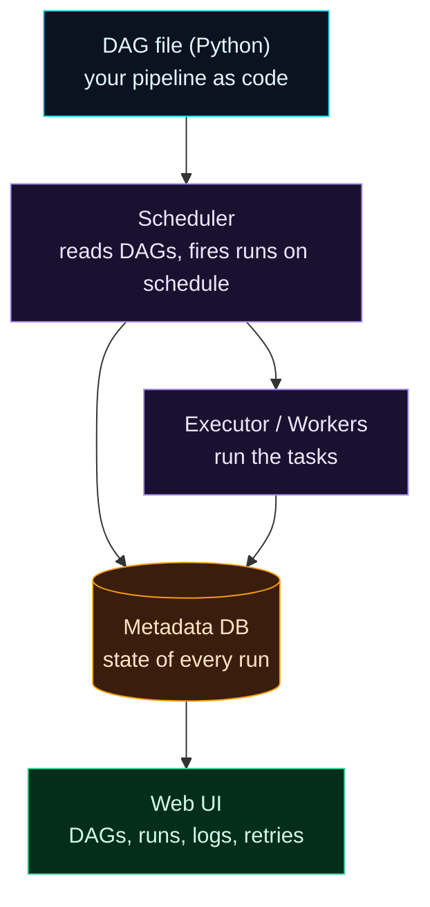

Welcome to **Day 68 of 100 Days of MLOps**. You've spent a week with Prefect, and it's an excellent modern orchestrator. But it isn't the one you'll see most in the wild. Open almost any data-engineering job post, or inherit almost any established data platform, and you'll meet **Apache Airflow** — the orchestrator that, more than any other, defined the category. Today isn't about switching tools or learning Airflow in depth; it's a **peek**: enough to recognise Airflow, map its ideas onto what you already know, and hold your own in a conversation about it.

The good news is that you've already learned the *concepts*. Orchestration is orchestration: pipelines, steps, dependencies, schedules, retries, a UI. Airflow and Prefect just use different words and different ergonomics for the same ideas. Once you can translate "DAG" to "flow" and "operator" to "task," Airflow stops looking foreign. And to make it concrete, you'll write a real Airflow DAG of our house-price pipeline and watch Airflow parse it into a task graph — the same `ingest → process → train` you've built all module, in Airflow's dialect.

> **Same concepts, different dialect.** Airflow's DAGs/operators/scheduler map almost one-to-one onto Prefect's flows/tasks/schedules. Learn the translation, not a second tool.

By the end of today you will:

- Know what **Apache Airflow** is and why it's everywhere.
- Map Airflow's **DAG, operator, scheduler** onto Prefect's flow, task, schedule.
- Write a real Airflow **DAG** and see Airflow parse it into `ingest → process → train`.
- Understand **when** you'd meet Airflow vs Prefect.

---

## What Airflow is

Airflow was created at Airbnb in 2014 and is now a top-level Apache project — the de-facto standard for data-pipeline orchestration for a decade. Its central idea is the **DAG** (Directed Acyclic Graph): your pipeline, written as a Python file, where nodes are steps and edges are dependencies ("train runs after process"). "Acyclic" just means no loops — work flows forward. Around that sit a few big pieces:



**Reading this diagram:**

It starts, in **cyan**, with a **DAG file** — a Python file defining your pipeline (Airflow watches a `dags/` folder for these). The **purple Scheduler** is Airflow's heart: it continuously reads your DAGs and, when a schedule says so, creates runs and hands tasks to the **Executor/workers** (also purple) that actually run them. Everything's state — which run, which task, what state, retries — lives in the **amber Metadata DB**, a real database Airflow requires. And the **green Web UI** reads that database to show you DAGs, run history, logs, and controls.

Notice the shape: Airflow is a **standing system** of cooperating services (scheduler, database, workers, webserver), not a single script. That's the biggest practical difference from Prefect, where `python flow.py` just runs. The takeaway: Airflow is a **heavier, always-on platform** built for many teams running many pipelines — powerful, but more to operate. Now let's map its vocabulary onto yours.

---

## The translation table

Almost everything you learned in Prefect has an Airflow twin. This is the whole "peek" in one table:

| Concept | Prefect | Airflow |
|---------|---------|---------|
| The pipeline | `@flow` | a **DAG** |
| A step | `@task` | a **task** / **operator** |
| Dependencies | pass task outputs | `a >> b`, or TaskFlow returns |
| Schedule | `serve(cron=...)` | `schedule="0 2 * * *"` on the DAG |
| Retries | `@task(retries=3)` | `retries=3` in `default_args` |
| Run tracking | states + UI | states + Web UI |
| Where it runs | `python flow.py`, local-first | scheduler + workers + DB |
| Parameters | flow arguments | **Params** / `dag_run.conf` |

The single biggest ergonomic difference: **Prefect is Python-first and dynamic** (a flow is just a function you call; dependencies emerge from how data flows), while **classic Airflow is DAG-first and more static** (you declare a DAG structure that the scheduler parses). Airflow's newer **TaskFlow API** (`@dag` / `@task` decorators) closes much of that gap and looks strikingly like Prefect — which is exactly what we'll use.

---

## Write a real Airflow DAG

Here's the house-price pipeline as an Airflow DAG, using the modern TaskFlow API so the resemblance to Prefect is obvious. Airflow discovers DAGs by scanning a `dags/` folder, so this goes in `dags/house_price_dag.py`:

```python
"""house_price_dag.py — Day 68: the house-price pipeline as an Airflow DAG."""
from datetime import datetime
from airflow.decorators import dag, task

@dag(
    schedule="0 2 * * *",              # 2am daily — same cron idea as Prefect
    start_date=datetime(2026, 1, 1),
    catchup=False,
    tags=["mlops", "house-price"],
)
def house_price_pipeline():
    @task
    def ingest() -> str:
        return "raw.csv"

    @task
    def process(path: str) -> str:
        return f"clean-{path}"

    @task
    def train(path: str) -> float:
        return 0.9668              # R2

    # dependencies = passing outputs, just like Prefect
    train(process(ingest()))

house_price_pipeline()
```

Look how close this is to a Prefect flow: `@dag` instead of `@flow`, `@task` on the steps, and the dependency chain expressed by *passing outputs* — `train(process(ingest()))` — exactly the pattern from Day 62. The differences are Airflow-specific: a `schedule` and `start_date` on the DAG, `catchup=False` (don't backfill every day since the start date), and the DAG lives in a folder Airflow scans.

Airflow parses that folder into DAG objects. Verify it — Airflow reads the file, builds the graph, and reports the tasks and their dependencies:

```bash
airflow dags list
airflow tasks list house_price_pipeline
```

```text
dag_id                fileloc                          owners    is_paused
house_price_pipeline  .../dags/house_price_dag.py      airflow

ingest
process
train
```

And inspecting the parsed graph confirms the dependencies and schedule:

```text
import errors: NONE
DAG 'house_price_pipeline': schedule=0 2 * * *, tags=['house-price', 'mlops']
  task 'ingest'   ->  downstream=['process']
  task 'process'  ->  downstream=['train']
  task 'train'    ->  downstream=[]
```

There it is: Airflow read your Python, found **no import errors**, and built the exact graph `ingest → process → train`, scheduled for 2am daily. That's a real, valid Airflow pipeline — the same shape as your Prefect flow, in Airflow's dialect.

> **What "running it fully" takes.** We *parsed and validated* the DAG (real proof the pipeline is correct). To actually *run* it on a schedule, Airflow needs its standing services up — initialise the metadata database (`airflow db migrate`) and start the scheduler and webserver (`airflow standalone` does all three for a local trial, serving the UI at `http://localhost:8080`). That's the heavier setup the diagram warned about, and precisely why many smaller teams reach for Prefect instead.

---

## When you'd meet each

Neither tool is "better" — they fit different worlds:

- **Airflow** dominates established, larger **data-engineering** platforms: big batch ETL, many teams, a huge ecosystem of pre-built operators (for Spark, dbt, cloud services), and an ops team to run the standing services. If you join a company with an existing data platform, odds are it's Airflow.
- **Prefect** suits **Python-native, ML-flavoured** work and smaller teams: dynamic pipelines, minimal setup (`pip install`, `python flow.py`), and flows that feel like ordinary code. It's common in newer MLOps stacks — which is why this series teaches it hands-on.

You don't need to master both. Know Prefect deeply (you do), and know Airflow well enough to read a DAG, follow a discussion, and pick it up if a job requires it. That's what today bought you.

---

## Common errors (and how to fix them)

**1. Thinking you must learn two orchestrators**

You don't. The *concepts* transfer completely — pipelines, steps, dependencies, schedules, retries, states. Learn one deeply and translate. This day is recognition and vocabulary, not a second full toolchain.

**2. Expecting `python my_dag.py` to run the pipeline**

Running a DAG file doesn't *execute* the pipeline like Prefect does — it just *defines* the DAG for Airflow's scheduler to pick up. Airflow runs tasks via its scheduler + executor against the metadata DB, not by running the file directly.

**3. Forgetting Airflow needs a metadata database**

Airflow won't do anything real until you initialise its database (`airflow db migrate`) and start its services. There's no "just run it" — the standing platform *is* Airflow. (`airflow standalone` bootstraps a local one for trials.)

**4. `catchup=True` surprise backfills**

With a `start_date` in the past and `catchup` left on, Airflow will schedule a run for *every* interval since that date — possibly hundreds at once. Set `catchup=False` unless you explicitly want backfills.

**5. DAG import errors that hide your DAG**

If your DAG file raises on import (a bad dependency, a typo), it silently won't appear in the UI. Check `airflow dags list-import-errors` (or the DagBag import errors) — "my DAG isn't showing up" is almost always an import error.

**6. Comparing classic Airflow to Prefect and missing the TaskFlow API**

Old Airflow examples (explicit `PythonOperator`, `a >> b`) look very different from Prefect. Airflow's **TaskFlow API** (`@dag`/`@task`) is the modern, Prefect-like style — compare against that for a fair picture.

---

## Recap — what you now have

You can navigate the wider orchestration world:

- You know **Apache Airflow** — the long-standing standard — and its **DAG / scheduler / metadata-DB / web-UI** architecture.
- You can **translate** Airflow ↔ Prefect: DAG↔flow, operator/task↔task, `schedule`↔`cron`, `default_args` retries↔`@task(retries=)`.
- You wrote a real **TaskFlow DAG** and Airflow parsed it (no import errors) into `ingest → process → train`, scheduled 2am daily.
- You know **when** you'd meet each — Airflow in big data-eng platforms, Prefect in Python-native/ML stacks.

**Your cheat sheet:**

| Airflow | = Prefect |
|---------|-----------|
| DAG (`@dag`) | flow (`@flow`) |
| task / operator | task (`@task`) |
| `schedule="0 2 * * *"` | `serve(cron="0 2 * * *")` |
| `retries` in `default_args` | `@task(retries=3)` |
| scheduler + workers + DB | `python flow.py` (local-first) |
| `airflow standalone` (UI :8080) | `prefect server start` (UI :4200) |

Golden rule: **orchestration concepts are universal; tools are dialects.** You know Prefect hands-on and Airflow by translation — enough to read any DAG and work anywhere.

---

## Coming up on Day 69

You can build, schedule, observe, and even translate pipelines — but there's one piece missing for true "set it and forget it": when a pipeline fails at 2am, *how do you find out?* **Day 69 — "Notifications & Failure Handling"** adds the last reliability layer: state-change hooks (`on_failure`, `on_completion`) that run when a flow finishes, so a failure can fire an alert — a Slack message, an email, a log — instead of sitting silently in a dashboard nobody's watching. It's how an unattended pipeline tells *you* when it needs attention.

See the full roadmap on the [100 Days of MLOps series page](/series/100-days-mlops). See you tomorrow.
