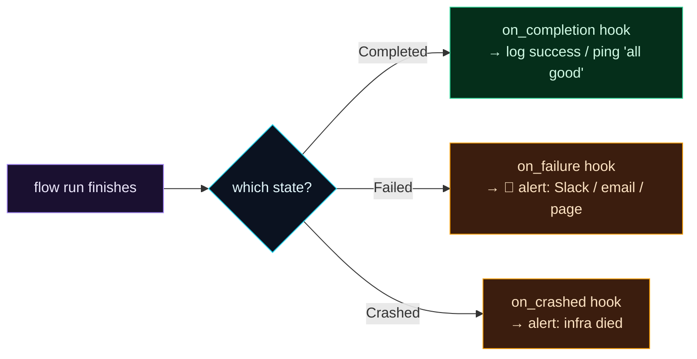

Welcome to **Day 69 of 100 Days of MLOps**. Your pipeline can now run itself — scheduled, resilient, observable. But there's a quiet gap in "set it and forget it": what happens when your nightly retrain fails at 2am? Yesterday's dashboard shows a red **Failed** run — but *only if someone opens it*. Nobody's watching a dashboard at 2am. A pipeline that fails silently and waits to be *discovered* is barely better than one that didn't run. The fix is to make the pipeline **tell you**.

That's what **state-change hooks** do. You attach a function to a flow — `on_failure`, `on_completion` — and Prefect runs it *automatically* the moment the flow enters that state. A failure hook can post to Slack, send an email, or page whoever's on call. Instead of "we noticed the model was stale three days later," it's "the pipeline pinged us the second it failed, and we fixed it before breakfast." Today you'll wire that up and watch a failure hook fire the instant a flow fails.

> **Make the pipeline page you.** A hook on `on_failure` turns a silent red run into an active alert — the difference between finding out and being told.

By the end of today you will:

- Understand **state-change hooks** — functions Prefect runs when a flow changes state.
- Attach **`on_failure`** and **`on_completion`** hooks to a flow.
- Watch a failure hook **fire automatically** when a flow enters `Failed`.
- Know how hooks relate to Prefect's UI-level **Automations** for real Slack/email alerts.

---

## Hooks: code that runs when state changes

You've spent two days learning that every run has a **state** (Day 67). A **state hook** is simply a function you register to run *when a flow (or task) enters a given state*. Prefect calls it for you — you don't invoke it. The most useful ones:



**Reading this diagram:**

A **flow run finishes** (purple) and lands in some final **state** (the cyan decision). Prefect then runs whichever hook matches. If it **Completed**, the **green `on_completion`** hook fires — maybe a quiet "all good" log or a success ping. If it **Failed** (your code raised), the **amber `on_failure`** hook fires — and *this* is the important one: it sends the alert that gets a human's attention. If it **Crashed** (infrastructure died, Day 67), `on_crashed` fires — a different alert, because the fix is different.

The key idea: **hooks are automatic reactions to state.** You attach them once, and Prefect guarantees they run when the matching state is reached — including when the flow ran unattended at 2am. That's how a pipeline stops failing *silently* and starts failing *loudly, to you*. Let's wire one up.

---

## Attach `on_failure` and `on_completion`

A hook is a plain function with a fixed signature: `(flow, flow_run, state)`. You pass a *list* of hooks to the flow decorator. Here's a retrain flow with a failure alert and a success notice. Create `notify.py`:

```python
"""notify.py — Day 69: fire an alert when a flow fails."""
from prefect import flow, get_run_logger

# A state hook always takes (flow, flow_run, state).
def alert_on_failure(flow, flow_run, state):
    msg = f"ALERT: flow '{flow_run.name}' FAILED — state={state.name}"
    print(f"  >> {msg}")
    # in production: post to Slack / send email / page on-call here

def notify_on_success(flow, flow_run, state):
    print(f"  >> OK: flow '{flow_run.name}' completed ({state.name})")

@flow(on_failure=[alert_on_failure], on_completion=[notify_on_success])
def nightly_retrain(should_fail: bool = False):
    log = get_run_logger()
    log.info("retraining model...")
    if should_fail:
        raise ValueError("data source unreachable")
    return "model.joblib"

if __name__ == "__main__":
    print("RUN 1 (healthy):")
    nightly_retrain(should_fail=False)
    print("RUN 2 (failure):")
    try:
        nightly_retrain(should_fail=True)
    except Exception:
        pass
```

The flow declares `on_failure=[alert_on_failure]` and `on_completion=[notify_on_success]`. We run it twice — once healthy, once forced to fail. Run it:

```bash
python notify.py
```

```text
Flow run 'crystal-duck' - retraining model...
Flow run 'crystal-duck' - Running hook 'notify_on_success' in response to entering state 'Completed'
Flow run 'crystal-duck' - Finished in state Completed()
  >> OK: flow 'crystal-duck' completed (Completed)

Flow run 'lavender-bat' - retraining model...
Flow run 'lavender-bat' - Running hook 'alert_on_failure' in response to entering state 'Failed'
Flow run 'lavender-bat' - Finished in state Failed('Flow run encountered an exception: ValueError: data source unreachable')
  >> ALERT: flow 'lavender-bat' FAILED — state=Failed
```

Read exactly what Prefect did. On the healthy run (`crystal-duck`), it entered `Completed` and Prefect logged **`Running hook 'notify_on_success' in response to entering state 'Completed'`** — the success hook ran, printing our OK line. On the failing run (`lavender-bat`), the flow raised, entered `Failed`, and Prefect **`Running hook 'alert_on_failure' in response to entering state 'Failed'`** — the alert hook fired *automatically*, printing our ALERT. That `>> ALERT ...` line is the whole point: replace the `print` with a Slack post, and your pipeline just paged you the instant it broke, at 2am, with nobody watching.

---

## From `print` to a real alert

The hook body here prints — because printing is runnable anywhere. In production you'd send a real notification. Two paths:

- **In the hook (code):** call whatever you like — a Slack incoming-webhook POST, an email via SMTP, a PagerDuty event. The hook is just Python: `requests.post(SLACK_WEBHOOK, json={"text": msg})`. Simple and explicit.
- **Prefect Automations (no code):** in the UI (Day 67), create an **Automation** — "when any flow run enters `Failed`, send this notification" — wired to a **Slack** or **Email** notification block. This is the scalable route: one rule covers *all* your flows, configured once, no hook code to maintain.

Use hooks for per-flow, custom reactions (clean up a temp file, roll back, alert a specific channel); use Automations for broad, uniform policies ("alert #ml-alerts on any failure"). Most teams end up with both.

---

## Handling failure, not just announcing it

Hooks do more than notify — they let you *react*. An `on_failure` hook is a good place to:

- **Alert** the right people (the headline use).
- **Clean up** — remove a half-written output file so the next run starts clean.
- **Record** — write the failure to a log/table for later analysis.

And remember the tools from earlier in the module compose with this: **retries** (Day 63) handle the *transient* failures automatically, so your `on_failure` hook only fires for the *real* ones worth a human's attention. That's the right layering — retry the blips, alert on the genuine failures. Together they make a pipeline that's both self-healing and self-reporting.

---

## Common errors (and how to fix them)

**1. Wrong hook signature**

A state hook must accept exactly `(flow, flow_run, state)` — even if you don't use all three. A `TypeError` about arguments means your function's signature is off. Copy the signature exactly.

**2. Passing a function instead of a list**

It's `on_failure=[alert_on_failure]` — a *list* of hooks, not `on_failure=alert_on_failure`. You can register several; Prefect runs them all. Forgetting the brackets is a common slip.

**3. Doing heavy or fragile work inside a hook**

A hook that itself raises or hangs can swallow your alert. Keep hooks fast and defensive (wrap network calls in try/except) — the alert failing is worse than the pipeline failing, because now you're blind.

**4. Expecting `on_completion` to fire on failure**

`on_completion` runs only on success (`Completed`). For failures use `on_failure`; for infra deaths use `on_crashed`. If you want "always run, pass or fail," register hooks on multiple states (or use both `on_completion` and `on_failure`).

**5. Alerting on every transient blip**

Without retries, a momentary network hiccup fires your failure alert and trains everyone to ignore alerts. Add `retries` (Day 63) so hooks fire only on *real* failures — alert fatigue is a real failure mode.

**6. Hardcoding secrets (webhook URLs, tokens) in the hook**

Don't paste a Slack webhook or API token into the code. Store it in an environment variable or a Prefect **Secret block**, and read it in the hook — so credentials aren't committed to your repo.

---

## Recap — what you now have

Your pipeline can now tell you when it needs you:

- You learned **state-change hooks** — functions Prefect runs automatically when a flow enters a state.
- You attached **`on_failure`** and **`on_completion`** and watched Prefect run each on the matching state (the alert fired the instant the flow hit `Failed`).
- You know how to turn the hook into a **real alert** (Slack webhook, email) or use UI **Automations** for a fleet-wide rule.
- You know to pair hooks with **retries** so alerts fire only on genuine failures, and to keep secrets out of the code.

**Your cheat sheet:**

| Goal | Code |
|------|------|
| Alert on failure | `@flow(on_failure=[alert])` |
| Notify on success | `@flow(on_completion=[notify])` |
| Alert on infra death | `@flow(on_crashed=[alert])` |
| Hook signature | `def hook(flow, flow_run, state): ...` |
| Real alert | `requests.post(SLACK_WEBHOOK, json={"text": msg})` |
| Fleet-wide rule | UI → Automations + a Notification block |

Golden rule: **an unattended pipeline must fail loudly.** Attach an `on_failure` hook (or an Automation), pair it with retries so it only fires on real failures, and you'll be *told* about problems instead of *discovering* them.

---

## Coming up on Day 70 — Module 7 finale

Time to put the whole module together. **Day 70 — "Capstone: An Automated Retraining Pipeline"** assembles everything from Days 61–69 into one real, production-shaped workflow: a Prefect flow that ingests, validates, trains, and evaluates — parameterized, retried, scheduled to run nightly, observable in the UI, and wired to alert on failure. It's the automated retraining loop that Module 7 has been building toward — the pipeline that keeps a model fresh without a human in the loop. It closes out orchestration and sets up monitoring in Module 8.

See the full roadmap on the [100 Days of MLOps series page](/series/100-days-mlops). See you tomorrow.
