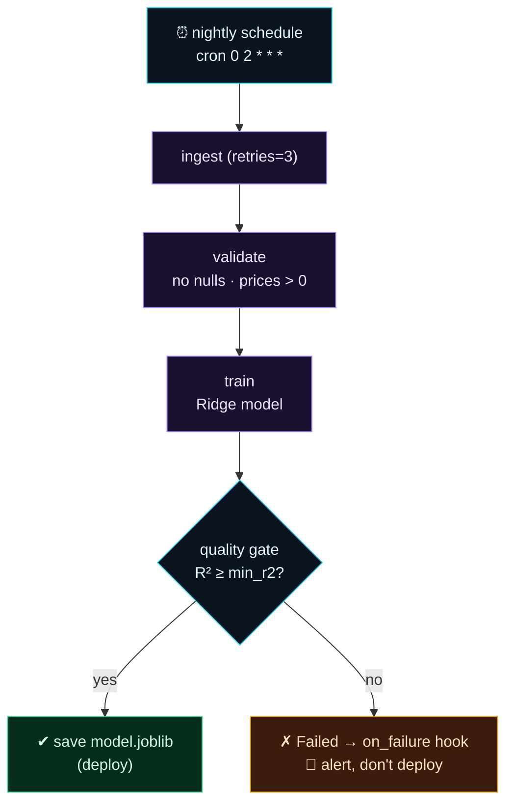

Welcome to **Day 70 of 100 Days of MLOps** — the finale of **Module 7.** Ten days ago you had a model you ran by hand and a fragile cron script that failed silently. Today you assemble everything the module taught into **one real automated retraining pipeline**: a flow that ingests data, validates it, trains a model, and only deploys it if it passes a quality gate — with retries on transient failures, parameters for flexibility, a schedule to run itself nightly, full observability, and an alert when something goes wrong.

This is the payoff of Module 7 and a genuinely production-shaped pattern: the **automated retraining loop** that keeps a model fresh without a human in the loop. You'll build it, run a healthy retrain that trains and deploys a model, then watch a *quality gate* block a sub-par model and fire a failure alert — because a real pipeline doesn't just run, it *decides*, and tells you when it refuses. Let's assemble the whole module into the real thing.

> **The self-running retraining loop.** Ingest → validate → train → gate → deploy — retried, scheduled, observable, and alerting. Everything from Days 61–69, in one flow.

By the end of today you will:

- Assemble a **complete retraining flow** from every Module 7 piece.
- Run a **healthy retrain** that validates, trains, and deploys a model.
- Watch a **quality gate** block a bad model and fire the **failure alert**.
- Have a schedulable, observable pipeline — and a **Module 7 checklist**.

---

## The anatomy of an automated retraining pipeline

A production retraining pipeline is a chain of steps with reliability machinery around each. Data comes in and is **validated** (bad data must never train a model); a model is **trained**; and — crucially — it faces a **quality gate** before deployment (a worse model must never replace a good one). Retries wrap the flaky steps, a schedule fires the whole thing nightly, and a failure hook alerts you if any step fails.



**Reading this diagram:**

It starts with the **cyan nightly schedule** (Day 64) — no human presses go. It fires **ingest** (purple), which has `retries=3` so a transient blip is survived (Day 63), then **validate** (bad data is caught before it can poison training), then **train**. The **cyan diamond** is the heart of the capstone: a **quality gate** asking "is the new model good enough (R² ≥ threshold)?" If **yes**, the flow reaches the **green** node — save/deploy the model. If **no**, it goes to the **amber** node: the flow **Fails on purpose**, the `on_failure` hook fires an alert (Day 69), and the bad model is *not* deployed.

That gate is what separates a toy retrain from a real one: **automation you can trust to say no.** A pipeline that blindly deploys whatever it trains is dangerous; one that refuses to ship a regression, and tells you it did, is production-grade. Let's build exactly this.

---

## The complete pipeline

Here's the whole thing — every Module 7 concept in one file. Create `retrain_pipeline.py`:

```python
"""retrain_pipeline.py — Day 70 capstone: an automated retraining pipeline.
Assembles Module 7: tasks/flow (62), retries (63), params (65), hooks (69)."""
import joblib, numpy as np, pandas as pd
from prefect import flow, task, get_run_logger
from sklearn.linear_model import Ridge
from sklearn.metrics import mean_absolute_error, r2_score
from sklearn.model_selection import train_test_split

def alert_on_failure(flow, flow_run, state):                 # Day 69
    print(f"  >> ALERT: retraining '{flow_run.name}' FAILED — {state.name}")

@task(retries=3, retry_delay_seconds=0)                      # Day 63: survive blips
def ingest(n_rows: int) -> pd.DataFrame:
    rng = np.random.default_rng(42)
    df = pd.DataFrame({"size_sqft": rng.integers(600, 3500, n_rows),
                       "bedrooms": rng.integers(1, 6, n_rows)})
    df["price"] = (30000 + 140*df.size_sqft + 12000*df.bedrooms
                   + rng.normal(0, 25000, n_rows)).clip(50000)
    return df

@task
def validate(df: pd.DataFrame) -> pd.DataFrame:              # bad data never trains
    log = get_run_logger()
    assert not df.isnull().any().any(), "nulls in data"
    assert (df["price"] > 0).all(), "non-positive prices"
    log.info(f"validation passed: {len(df)} rows, no nulls, prices > 0")
    return df

@task
def train(df: pd.DataFrame, alpha: float) -> tuple:
    X, y = df[["size_sqft", "bedrooms"]], df["price"]
    Xtr, Xte, ytr, yte = train_test_split(X, y, test_size=0.2, random_state=42)
    model = Ridge(alpha=alpha).fit(Xtr, ytr)
    pred = model.predict(Xte)
    return model, {"mae": round(mean_absolute_error(yte, pred), 0),
                   "r2": round(r2_score(yte, pred), 4)}

@task
def evaluate_and_save(model, metrics: dict, min_r2: float) -> str:   # the quality gate
    log = get_run_logger()
    log.info(f"metrics: MAE=${metrics['mae']:,.0f}  R2={metrics['r2']}")
    if metrics["r2"] < min_r2:
        raise ValueError(f"R2 {metrics['r2']} below threshold {min_r2} — NOT deploying")
    joblib.dump(model, "model.joblib")
    log.info(f"R2 {metrics['r2']} >= {min_r2} — model saved to model.joblib")
    return "model.joblib"

@flow(name="automated-retrain", on_failure=[alert_on_failure])      # Day 62 + 69
def retraining_pipeline(n_rows: int = 1000, alpha: float = 1.0, min_r2: float = 0.90):  # Day 65
    log = get_run_logger()
    log.info(f"START retrain: n_rows={n_rows} alpha={alpha} min_r2={min_r2}")
    df = validate(ingest(n_rows))
    model, metrics = train(df, alpha)
    path = evaluate_and_save(model, metrics, min_r2)
    log.info(f"DONE — deployed {path} (R2={metrics['r2']})")
    return metrics

if __name__ == "__main__":
    print("RESULT:", retraining_pipeline(n_rows=1000, alpha=1.0, min_r2=0.90))
```

Every piece is labelled: `@task`/`@flow` (Day 62), `retries` (Day 63), parameters (Day 65), the `on_failure` hook (Day 69). Dependencies flow by passing outputs — `validate(ingest(n_rows))`, then `train`, then the gate. Run the healthy retrain:

```bash
python retrain_pipeline.py
```

```text
validation passed: 1000 rows, no nulls, prices > 0
metrics: MAE=$22,349  R2=0.9485
R2 0.9485 >= 0.9 — model saved to model.joblib
DONE — deployed model.joblib (R2=0.9485)
RESULT: {'mae': 22349.0, 'r2': 0.9485}
```

The whole loop ran on its own: data ingested (with retry protection), **validated** (1000 rows, no nulls, prices positive), a model **trained** (MAE $22,349, R² 0.9485), the **quality gate** checked (0.9485 ≥ 0.90 ✔), and the model **saved/deployed**. That's an automated retrain — and every step is a tracked run in the UI (Day 67).

---

## The gate that says no

The healthy path is the easy half. The capstone's real value is what happens when the new model *isn't* good enough. Raise the bar to an impossible `min_r2=0.999` and run again:

```python
retraining_pipeline(n_rows=1000, alpha=1.0, min_r2=0.999)
```

```text
metrics: MAE=$22,349  R2=0.9485
Task run 'evaluate_and_save-668' - Finished in state Failed(... R2 0.9485 below threshold 0.999 — NOT deploying)
Flow run 'urban-mayfly' - Running hook 'alert_on_failure' in response to entering state 'Failed'
Flow run 'urban-mayfly' - Finished in state Failed(... R2 0.9485 below threshold 0.999 — NOT deploying)
  >> ALERT: retraining 'urban-mayfly' FAILED — Failed
```

This is the moment that makes it production-grade. The model trained fine (R² 0.9485) — but it **failed the quality gate**, so `evaluate_and_save` raised, the model was **not** deployed, the flow entered **Failed**, and the **`on_failure` hook fired an alert**. The old model stays in place; a human gets pinged. The pipeline didn't blindly ship a regression — it *refused*, and told you. That single behaviour — automate the deploy, but gate it and alert on refusal — is the difference between automation you fear and automation you trust.

---

## Schedule it — and it runs itself

One line turns this into a nightly, unattended pipeline (Day 64). With a Prefect server running, serve it on a cron schedule:

```python
if __name__ == "__main__":
    retraining_pipeline.serve(
        name="nightly-retrain",
        cron="0 2 * * *",                 # 2am every day
        parameters={"n_rows": 1000, "alpha": 1.0, "min_r2": 0.90},
    )
```

Now, every night at 2am, this pipeline ingests fresh data, validates it, retrains, gates on quality, deploys if it passes, and alerts you if it doesn't — with every run recorded in the dashboard. You've built the automated retraining loop from the Day 2 lifecycle diagram, for real.

---

## Common errors (and how to fix them)

**1. No quality gate — deploying whatever you trained**

The single most dangerous omission. Always compare the new model to a threshold (or the current model's score) and *refuse* to deploy a regression. Automation without a gate will happily ship a broken model on schedule.

**2. Validating after training, not before**

Validate *first* — bad data should never reach `train`. In the flow, `validate(ingest(...))` runs before `train`, so a data problem fails fast and clearly instead of producing a quietly-wrong model.

**3. Overwriting the good model before the gate passes**

Save the new model only *after* it passes the gate (as in `evaluate_and_save`). If you `joblib.dump` before checking quality, a failed gate has already clobbered your working model. Gate first, save second.

**4. Retries that mask a real failure**

`retries=3` on `ingest` is right for transient blips — but don't wrap the *gate* in retries. A quality failure isn't transient; retrying it just delays the alert. Retry I/O, not decisions.

**5. Scheduling without alerting**

A scheduled pipeline with no `on_failure` hook fails silently in the dark (Day 69's whole point). Schedule and alert together, or you won't know when your nightly retrain stops working.

**6. Non-reproducible retrains**

If each retrain uses different code or unpinned deps, you can't tell whether a metric change is the *data* or the *pipeline*. Keep the flow versioned and the environment pinned (Modules 1–3) so retrain results are comparable over time.

---

## Module 7 complete

That wraps **Module 7: Orchestration & Automated Pipelines.** You went from a fragile cron script to a real, self-running system: you felt the pain of scripts + cron (61), met Prefect's flows and tasks (62), added retries/caching/logging (63), scheduled pipelines (64), parameterized them (65), composed subflows and parallel maps (66), got full observability (67), surveyed Airflow (68), wired up failure alerts (69), and today assembled it all into an **automated retraining pipeline** with a quality gate. Your model no longer waits for you to retrain it — it retrains itself, safely, on schedule, and tells you if anything's wrong.

Combined with the earlier modules, your ML system is now **reproducible** (Module 3), **tracked** (Module 4), built on **validated data** (Module 5), **servable** (Module 6), and **automated** (Module 7). There's one big question left: once it's running in production, *how do you know the model is still any good?*

---

## Recap — what you now have

You built the automated retraining loop:

- You assembled a **complete retraining flow** — ingest, validate, train, evaluate — with retries, parameters, and a failure hook.
- You ran a **healthy retrain** that validated, trained (R² 0.9485), passed the gate, and deployed.
- You watched the **quality gate block a sub-par model** and fire the alert — automation that says no.
- You know how to **schedule** it nightly, and have a **Module 7 checklist** for any pipeline.

**Your cheat sheet — the automated retraining checklist:**

| Piece | How | Day |
|-------|-----|-----|
| Steps + pipeline | `@task` / `@flow` | 62 |
| Survive blips | `@task(retries=3)` | 63 |
| Flexible runs | flow parameters | 65 |
| Validate first | assert before training | 5/41 |
| Quality gate | refuse deploy if below threshold | 70 |
| Run itself | `serve(cron="0 2 * * *")` | 64 |
| Alert on failure | `on_failure=[hook]` | 69 |

Golden rule: **automate the retrain, but gate it and alert on it.** Validate before training, refuse to deploy a regression, schedule it to run itself, and make it shout when it fails — that's a retraining pipeline you can actually trust.

---

## Coming up on Day 71 — Module 8 begins

Your pipeline retrains on a schedule — but *should* it? Retraining nightly whether the model needs it or not is wasteful; retraining too rarely lets a decaying model hurt users. The missing piece is **knowing when the model has gone stale.** **Module 8 — "Monitoring & Drift Detection"** opens with **Day 71 — "Why Monitor? Models Decay,"** where you'll see how a model that was accurate on launch day silently gets worse as the world shifts away from its training data — and why monitoring, not just retraining, is what keeps a production model honest. From automating the loop, we turn to watching it.

See the full roadmap on the [100 Days of MLOps series page](/series/100-days-mlops). See you tomorrow.
