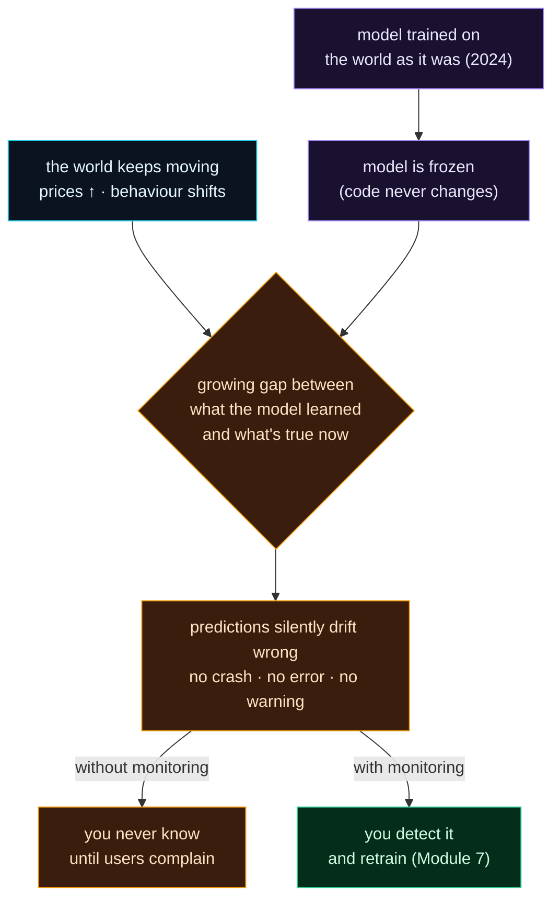

Welcome to **Day 71 of 100 Days of MLOps** — the start of **Module 8: Monitoring & Drift Detection.** You've built a model that's reproducible, tracked, validated, served, and now retrains itself on a schedule (Module 7). It feels finished. It isn't — because of a property that makes ML fundamentally different from normal software: **a model that works today can silently get worse tomorrow, without anyone touching it.**

A normal program that passed its tests yesterday passes them today; its behaviour is fixed. A model learns patterns from a snapshot of the world — and the world keeps moving. Prices rise, user behaviour shifts, a new product launches, a sensor is recalibrated. The model, frozen at the moment it was trained, keeps applying yesterday's patterns to today's reality — and its predictions quietly drift from right to wrong. The terrifying part: **it doesn't crash, doesn't error, doesn't warn you.** It returns predictions as confidently as ever. This is *model decay*, and today — like every "feel the pain" day — you'll watch it happen before we spend the module learning to catch it.

> **Models decay silently.** No crash, no error — just predictions that get quietly, steadily wronger as the world drifts from the training data.

By the end of today you will:

- Understand why models **decay** even though the code never changes.
- Watch a frozen model's error **explode** as its market drifts.
- Know the difference between a model *erroring* and a model being *silently wrong*.
- See why **monitoring** — not just retraining — is the missing piece.

---

## Why a frozen model goes wrong

Nothing about the model changes — that's the point. What changes is the **world** the model is being asked about. A model learns the relationship between inputs and outputs *as it was in the training data*. When that relationship shifts in production — the housing market inflates, fraud patterns evolve, customer tastes move — the model's learned relationship is now **out of date**, and it applies it anyway.



**Reading this diagram:**

On the left, in **purple**, a model is **trained on the world as it was** and then **frozen** — its code never changes again. But the **cyan node** on the right is the problem: **the world keeps moving**. Those two feed the **amber diamond** — a *growing gap* between what the model learned and what's now true — which produces the core failure: **predictions silently drift wrong**, with no crash, no error, no warning.

Then the fork that defines this whole module. **Without monitoring** (amber), you're *blind* — you don't find out until users complain or revenue drops. **With monitoring** (green), you *detect* the decay and trigger a retrain (the Module 7 loop). The takeaway: **decay is inevitable; being blind to it is a choice.** Monitoring is what turns a silent failure into a caught one. Let's make the silent failure concrete.

---

## Watch it decay

Here's a model trained on the housing market "as it was at launch," then frozen. We never retrain it — but the market inflates year over year, exactly as real markets do. We measure the *same frozen model's* error against each year's reality. Create `decay.py`:

```python
"""decay.py — Day 71: a model that was accurate at launch silently decays."""
import numpy as np, pandas as pd
from sklearn.linear_model import LinearRegression
from sklearn.metrics import mean_absolute_error

def make_market(n, price_per_sqft, base, seed):
    rng = np.random.default_rng(seed)
    size = rng.integers(600, 3500, n); beds = rng.integers(1, 6, n)
    price = (base + price_per_sqft*size + 12000*beds + rng.normal(0, 20000, n)).clip(50000)
    return pd.DataFrame({"size_sqft": size, "bedrooms": beds}), price

# --- Launch day: train on the market as it was ---
Xtr, ytr = make_market(2000, price_per_sqft=140, base=30000, seed=0)
model = LinearRegression().fit(Xtr, ytr)

# --- The model is frozen. The market drifts over the next 3 years. ---
print("period            | true $/sqft | model MAE   | note")
print("-"*66)
for label, ppsf, base, seed in [
    ("launch  (2024)", 140, 30000, 1),
    ("+1yr    (2025)", 165, 45000, 2),   # prices rising
    ("+2yr    (2026)", 195, 62000, 3),   # inflation continues
    ("+3yr    (2027)", 230, 85000, 4),   # market has moved a lot
]:
    Xt, yt = make_market(2000, ppsf, base, seed)
    mae = mean_absolute_error(yt, model.predict(Xt))
    note = "accurate" if mae < 30000 else ("degrading" if mae < 80000 else "BROKEN")
    print(f"{label}    | {ppsf:>7}     | ${mae:>9,.0f} | {note}")
```

Run it:

```bash
python decay.py
```

```text
period            | true $/sqft | model MAE   | note
------------------------------------------------------------------
launch  (2024)    |     140     | $   15,721 | accurate
+1yr    (2025)    |     165     | $   67,163 | degrading
+2yr    (2026)    |     195     | $  143,249 | BROKEN
+3yr    (2027)    |     230     | $  240,334 | BROKEN
```

Read that table slowly, because it's the whole reason this module exists. At **launch**, the model is excellent — MAE $15,721. The code never changes after that. But as the market inflates, the *same frozen model* gets steadily worse: **$67,163** a year later, **$143,249** the year after, **$240,334** by year three. That's the error growing **15×** — not because of a bug, not because anyone touched the model, but because the world moved on and the model didn't. A model that was your best asset on launch day is a liability three years later, and *nothing in the model itself tells you*.

---

## The scary part: it never complained

Look at what *didn't* happen in that run. No exception. No stack trace. No `500` from your API. The model in the "$240,334 error" row was still happily returning predictions — clean numbers, formatted nicely, served in a few milliseconds — for houses it was wrong about by a quarter of a million dollars. To your service's logs, to your uptime dashboard, to everything except the *quality of the predictions*, the model looked perfectly healthy.

This is what makes model decay so dangerous and so different from normal bugs:

- A **crash** is loud — you get paged, you see it, you fix it.
- **Decay** is silent — the system is "up," latency is fine, no errors fire — and the predictions are quietly, expensively wrong.

You cannot catch decay by watching for errors, because there are none. You catch it only by **measuring the thing that's actually degrading**: the model's inputs (are they still like the training data?) and its predictions (are they still accurate?). That measurement is **monitoring**, and it's the entire back-half concern of running ML in production.

---

## Monitoring vs retraining: why you need both

You built automated retraining in Module 7 — so isn't decay already solved? Not quite. Retraining *fixes* a decayed model; monitoring *tells you when to*. Retrain on a blind schedule and you either:

- retrain **too often** — burning compute (and risking a bad batch of new data) when the model was still fine, or
- retrain **too rarely** — letting the model rot between runs, exactly like the table above.

Monitoring closes that gap: watch for decay, and retrain *when the model actually needs it*. Module 7 gave you the loop; **Module 8 gives you the eyes** that tell the loop when to fire. Over the next nine days you'll learn to log predictions, detect data drift (with PSI and statistical tests), track performance decay, use Evidently to generate drift reports, expose monitoring metrics, alert on drift, and finally wire drift detection back into the retraining loop — a model that watches itself and heals itself.

---

## Common errors (and how to fix them)

**1. "It deployed fine and there are no errors, so it's working."**

No errors means the *service* is healthy, not that the *predictions* are. Decay produces zero errors. Judge a model by prediction quality (accuracy, drift), never by uptime alone.

**2. "We validated the model at launch, so we're done."**

Launch accuracy is a snapshot, not a guarantee. The model was validated against *launch-day* data; the world it serves changes continuously. Monitoring is ongoing, not a one-time gate.

**3. Assuming retraining on a schedule is enough**

A fixed schedule retrains blindly — too often (waste) or too rarely (rot). Without monitoring you can't tell which. Retraining fixes decay; monitoring tells you *when* it's needed.

**4. Confusing "data drift" with "the model is broken code"**

Nothing is wrong with the model's code when it decays — the input distribution moved. Debugging the code is the wrong response; measuring drift and retraining on fresh data is the right one.

**5. Only monitoring infrastructure, not the model**

CPU, memory, latency, and error rate are necessary but not sufficient. A model can be silently wrong while every infra metric is green. You must also monitor *model-level* signals — inputs and predictions.

**6. Waiting for users to report the problem**

If your first signal of decay is a complaint or a revenue dip, the damage is already done and weeks old. Monitoring exists to catch decay *before* users do.

---

## Recap — what you now have

You've felt the problem monitoring solves:

- You understand **model decay**: a frozen model gets worse as the world drifts from its training data.
- You watched a real model's error grow **15×** ($15,721 → $240,334) with no code change.
- You know decay is **silent** — no crash, no error — so you can't catch it by watching for failures.
- You know **monitoring tells the retraining loop when to fire** — you need both.

**Your cheat sheet:**

| Failure type | How you notice | Fix |
|--------------|----------------|-----|
| Crash / error | loud — pages, stack traces | debug the code |
| **Model decay** | **silent — only prediction quality drops** | **monitor + retrain** |
| Infra problem | infra metrics (CPU/latency) | scale / fix infra |
| Data drift | input distribution moves | detect (Days 73+), retrain |

Golden rule: **a model that isn't monitored is a model you're trusting blindly.** Decay is inevitable and silent — measure inputs and predictions, or you won't know your model has quietly stopped working.

---

## Coming up on Day 72

You can't monitor what you don't record. Before you can detect drift or measure decay, you need the raw material: a log of what your model actually did in production. **Day 72 — "Logging Predictions & Ground Truth"** shows you how to capture every prediction — inputs, output, timestamp — and later join it with the *true* outcome when it arrives, so you can measure how right the model really was. It's the unglamorous foundation the whole module is built on: you can't monitor a model that keeps no records.

See the full roadmap on the [100 Days of MLOps series page](/series/100-days-mlops). See you tomorrow.
