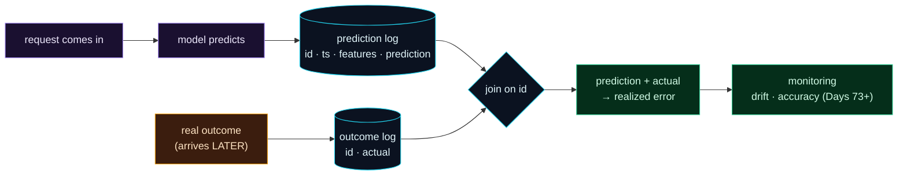

Welcome to **Day 72 of 100 Days of MLOps**. Yesterday you saw a model decay silently, and the lesson landed: you must *measure* your model in production, not trust it. But measurement needs data — and here's the catch that trips up most teams. By default, a prediction is **ephemeral**: a request comes in, your model returns a number, the response goes out, and the whole event vanishes. There's no record of what the model saw or what it said. You can't detect drift, you can't measure accuracy, you can't investigate a bad prediction — because it's *gone*.

So the very first thing every monitoring system needs is a **prediction log**: a durable record of every prediction — the inputs, the output, a timestamp, the model version. And then a second, trickier piece — **ground truth**. The *actual* outcome (the real sale price, whether the customer churned, whether the transaction was fraud) almost always arrives *later*, sometimes much later. When it does, you join it back to the logged prediction, and only then can you ask the question that matters: *how right was the model, really?* Today you build both halves of that foundation.

> **You can't monitor what you don't log.** Record every prediction now; join the real outcome when it arrives later. That joined record is the raw material of all monitoring.

By the end of today you will:

- Log every prediction — **inputs, output, timestamp, id** — to a durable file.
- Understand **why ground truth arrives late** (label lag) and how to handle it.
- **Join** logged predictions with actual outcomes by id.
- Compute the model's **realized error** on labelled data.

---

## Two logs, joined by an id

Monitoring data comes from two streams that meet later. At **prediction time** you know the inputs and the model's output — log them immediately with a unique id. At **outcome time** (hours or weeks later) the *truth* becomes known — log that against the same id. Join the two, and each row becomes "what the model predicted *and* what actually happened."



**Reading this diagram:**

The top path, in **purple → cyan**, is the fast one: a request arrives, the model **predicts**, and you write a row to the **prediction log** — `id`, timestamp, features, prediction — *right now*, while you have them. The **amber** node is the awkward reality: the **real outcome arrives later**, and you write it to an **outcome log** keyed by the same `id`. The two logs meet at the **join on id**, producing a **green** row that holds *both* the prediction and the actual — from which you compute **realized error** — and that feeds all the **monitoring** to come.

The key insight is that shape: **prediction and truth are separated in time**, and an `id` is the thread that reconnects them. Get this plumbing right and everything downstream (drift, accuracy, alerting) becomes possible; skip it and you're monitoring blind. Let's build it.

---

## Log every prediction

A prediction log needs to be **durable** (survives restarts), **append-only** (you never rewrite history), and **easy to append to concurrently**. A simple, robust choice is **JSONL** — one JSON object per line. Each record carries an id, a UTC timestamp, the input features, and the prediction. Create `logging_preds.py`:

```python
"""logging_preds.py — Day 72: log every prediction, later join ground truth."""
import json, uuid, datetime as dt, numpy as np, pandas as pd
from pathlib import Path
from sklearn.linear_model import LinearRegression
from sklearn.metrics import mean_absolute_error

LOG = Path("predictions.jsonl")

def log_prediction(features: dict, prediction: float) -> str:
    """Append one prediction record to the log. Returns its id."""
    rec_id = str(uuid.uuid4())[:8]
    record = {
        "id": rec_id,
        "ts": dt.datetime.now(dt.timezone.utc).isoformat(timespec="seconds"),
        "features": features,
        "prediction": round(float(prediction), 2),
    }
    with LOG.open("a") as f:               # append-only: never rewrite history
        f.write(json.dumps(record) + "\n")
    return rec_id

# --- train a model + simulate serving 5 requests, logging each ---
rng = np.random.default_rng(42)
Xtr = pd.DataFrame({"size_sqft": rng.integers(600,3500,500), "bedrooms": rng.integers(1,6,500)})
ytr = 30000 + 140*Xtr.size_sqft + 12000*Xtr.bedrooms
model = LinearRegression().fit(Xtr, ytr)

LOG.unlink(missing_ok=True)
requests = [{"size_sqft": s, "bedrooms": b} for s, b in
            [(1200,2),(2500,4),(900,1),(3200,5),(1800,3)]]
ids = []
for req in requests:
    pred = model.predict(pd.DataFrame([req]))[0]
    ids.append(log_prediction(req, pred))     # <- log at prediction time

print("=== predictions.jsonl (first 2 lines) ===")
for line in LOG.read_text().splitlines()[:2]:
    print(line)
```

The `log_prediction` function is the whole idea: every time the model predicts, you append a record. In a real FastAPI service (Day 52), you'd call this inside your `/predict` endpoint. Running it logs five predictions:

```text
=== predictions.jsonl (first 2 lines) ===
{"id": "11b61b66", "ts": "2026-07-12T07:09:10+00:00", "features": {"size_sqft": 1200, "bedrooms": 2}, "prediction": 222000.0}
{"id": "15f32a8b", "ts": "2026-07-12T07:09:10+00:00", "features": {"size_sqft": 2500, "bedrooms": 4}, "prediction": 428000.0}
```

Each line is a complete, self-contained record: which prediction (`id`), when (`ts`), what the model saw (`features`), what it said (`prediction`). That file is now your model's memory — the thing you couldn't monitor without.

---

## Ground truth arrives late — then you join

Here's what makes monitoring ML harder than monitoring a web server: **you usually don't know if a prediction was right until much later.** Predict a house price today; the actual sale might close in three months. Predict churn; you find out in 30 days. Flag a transaction as fraud; the chargeback lands weeks later. This gap is called **label lag**, and it means ground truth is a *separate, delayed* stream.

When the true outcomes do arrive, you join them to the logged predictions by `id`, and compute how the model actually did. Add this to the script:

```python
# --- LATER: ground truth (actual sale prices) arrives, keyed by id ---
truth = {ids[0]: 235000, ids[1]: 470000, ids[2]: 150000,
         ids[3]: 690000, ids[4]: 348000}

# --- join logged predictions with ground truth, compute realized error ---
rows = [json.loads(l) for l in LOG.read_text().splitlines()]
df = pd.DataFrame(rows)
df["actual"] = df["id"].map(truth)
df["abs_error"] = (df["prediction"] - df["actual"]).abs()
print(df[["id","prediction","actual","abs_error"]].to_string(index=False))
print(f"\nrealized MAE on labelled data: ${mean_absolute_error(df.actual, df.prediction):,.0f}")
```

```text
      id  prediction  actual  abs_error
11b61b66    222000.0  235000    13000.0
15f32a8b    428000.0  470000    42000.0
e63dfdc9    168000.0  150000    18000.0
274a3332    538000.0  690000   152000.0
7d09fa6f    318000.0  348000    30000.0

realized MAE on labelled data: $51,000
```

There it is — the payoff of logging. Because every prediction was recorded with an `id`, the moment real prices arrived we could line them up and see exactly how the model performed: mostly close, but one prediction ($538k vs $690k actual) off by $152k, and an overall **realized MAE of $51,000** *on live traffic*. This is the number you'll track over time to detect performance decay (Day 74) — and it only exists because you logged. Without the prediction log, those five predictions would have vanished and this table would be impossible.

---

## What to log (and what not to)

A good prediction record has a few more fields than our demo:

- **id** — to join with ground truth. Non-negotiable.
- **timestamp** — to slice by time (drift is a time-series question).
- **features** — the model's inputs, for drift detection (Day 73).
- **prediction** — the output, and ideally the probability/score too.
- **model version** — *which* model made it, so a bad deploy is traceable.

And be careful what you *don't* log: **no raw secrets or unnecessary PII.** Log the features the model actually used, not a customer's full record. Prediction logs are data like any other — subject to privacy rules, retention limits, and access controls (echoes of Modules 3 and 5).

For scale, JSONL on disk is perfect for learning and small services; in production these records go to a **database, data warehouse, or log pipeline** (Postgres, BigQuery, S3 + a query engine) so you can query millions of them. The *shape* stays identical — id, timestamp, features, prediction, and a later-joined actual.

---

## Common errors (and how to fix them)

**1. Not logging predictions at all**

The most common and most costly. If you don't log, every prediction is lost the instant it's served, and monitoring is impossible. Add prediction logging *before* you need it — you can't reconstruct history after the fact.

**2. No id to join on**

Without a unique id per prediction, you can't match a logged prediction to its later outcome. Generate an id at prediction time (a UUID) and return it in the response *and* the log, so ground truth can reference it.

**3. Assuming ground truth is immediate**

Most real labels lag — hours to months. Build for it: a separate outcome stream that arrives later and joins by id. Don't design monitoring that assumes you know the truth at prediction time; you almost never do.

**4. Rewriting or overwriting the log**

Prediction logs are *append-only history*. Opening the file in write mode (`"w"`) instead of append (`"a"`), or "cleaning up" old rows, destroys the record you need to analyse trends. Append only; rotate/archive, don't overwrite.

**5. Logging raw PII or secrets**

Don't dump full customer records into the log. Log the features the model used, minimise PII, and apply the same retention/access rules as any sensitive data. A prediction log is a data asset *and* a liability if careless.

**6. Not logging the model version**

When a prediction looks wrong, "which model made it?" is the first question. Without a model-version field you can't tell a good model from a bad deploy. Log the version with every record.

---

## Recap — what you now have

You built the foundation of monitoring:

- You **log every prediction** — id, timestamp, features, prediction — to a durable, append-only JSONL file.
- You understand **label lag**: ground truth is a separate, delayed stream.
- You **join** predictions to actual outcomes by id and computed a **realized MAE ($51,000)** on live data.
- You know **what to log** (features, version, id) and **what not to** (raw PII/secrets).

**Your cheat sheet:**

| Field | Why |
|-------|-----|
| `id` | join predictions ↔ ground truth |
| `ts` | slice by time (drift is temporal) |
| `features` | detect data drift (Day 73) |
| `prediction` | measure accuracy over time |
| `model_version` | trace a bad deploy |
| `actual` (joined later) | compute realized error (Day 74) |

Golden rule: **log the prediction now, join the truth later.** Every prediction gets a durable record with an id; ground truth arrives late and joins back — that joined row is what every drift and accuracy check in this module reads from.

---

## Coming up on Day 73

Ground truth is slow — but you don't always need it to spot trouble. Often the *first* sign a model is decaying shows up in its **inputs**: the live data starts to look different from what the model trained on, long before you know whether predictions were right. **Day 73 — "Detecting Data Drift (PSI & KS)"** teaches you to measure that: compare a live feature's distribution to the training baseline using the Population Stability Index and the Kolmogorov–Smirnov test, and get an early warning that the world has moved — no labels required.

See the full roadmap on the [100 Days of MLOps series page](/series/100-days-mlops). See you tomorrow.
