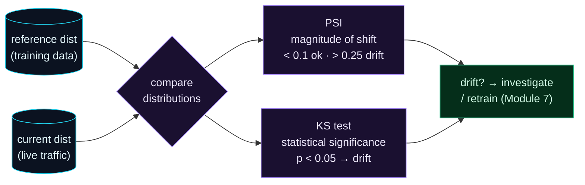

Welcome to **Day 73 of 100 Days of MLOps**. Yesterday you learned to log predictions and join ground truth — but you also learned that ground truth is *slow*. If the only way to know your model decayed is to wait weeks for real outcomes, you'll always be catching problems late. So here's the powerful idea behind today: you can often spot trouble *without labels at all*, by watching the model's **inputs**.

Think back to Day 71's decaying model. What actually changed? The **input distribution** — houses got bigger and pricier, so the live `size_sqft` and `price` no longer looked like the training data. That shift is called **data drift**, and it's detectable the moment the data arrives, long before you know whether any prediction was right. Data drift is your **early-warning system**: when the live data stops resembling the training data, the model is operating outside what it learned, and accuracy is probably about to suffer. Today you'll measure drift with the two tools every practitioner reaches for — **PSI** and the **KS test** — and watch them flag a drifted feature with no ground truth required.

> **Watch the inputs, not just the outcomes.** Data drift — the live data drifting from training data — is a label-free early warning that a model is heading for trouble.

By the end of today you will:

- Understand **data drift** and why it's an early, label-free signal.
- Compute the **Population Stability Index (PSI)** and read its thresholds.
- Run the **Kolmogorov–Smirnov (KS) test** with SciPy.
- See both methods **agree**: stable data is quiet, drifted data screams.

---

## Two ways to ask "has this feature moved?"

Data drift detection compares a feature's **reference** distribution (from training) to its **current** distribution (live traffic) and asks: are these the same, or has the data moved? Two standard methods answer it differently but agree in practice:



**Reading this diagram:**

Two **cyan** distributions feed in: the **reference** (how a feature looked in training) and the **current** (how it looks in live traffic). The **purple compare** node runs two checks. **PSI** measures the *magnitude* of the shift — a single number with well-known thresholds (below 0.1 is fine, above 0.25 is significant drift). The **KS test** asks a *statistical* question — "could these two samples come from the same distribution?" — and answers with a p-value (below 0.05 means "no, they've drifted").

Both flow to the **green verdict**: if either flags drift, you investigate and, if warranted, retrain (the Module 7 loop). The insight is that these are complementary — **PSI tells you *how much* the data moved; KS tells you *whether* the move is statistically real.** Together they make a robust, label-free drift signal. Let's compute both.

---

## PSI and the KS test in code

We'll build PSI from scratch (it's just binning and a log-ratio sum) and use SciPy's `ks_2samp` for the KS test. Then we compare a **reference** feature against two live samples: one from the *same* distribution (should be quiet) and one that's *shifted* (should alarm). Create `drift.py`:

```python
"""drift.py — Day 73: detect data drift with PSI and the KS test."""
import numpy as np
from scipy.stats import ks_2samp

def psi(reference, current, bins=10):
    """Population Stability Index: how much `current` shifted from `reference`."""
    edges = np.quantile(reference, np.linspace(0, 1, bins + 1))   # bins from reference
    edges[0], edges[-1] = -np.inf, np.inf
    ref_pct = np.histogram(reference, edges)[0] / len(reference)
    cur_pct = np.histogram(current,   edges)[0] / len(current)
    ref_pct = np.clip(ref_pct, 1e-6, None)      # avoid div-by-zero / log(0)
    cur_pct = np.clip(cur_pct, 1e-6, None)
    return float(np.sum((cur_pct - ref_pct) * np.log(cur_pct / ref_pct)))

def verdict(p):
    return "no drift" if p < 0.1 else ("MODERATE drift" if p < 0.25 else "SIGNIFICANT drift")

rng = np.random.default_rng(42)
reference = rng.normal(2000, 500, 5000)         # training baseline: ~2000 sqft

stable  = rng.normal(2000, 500, 5000)           # same market  -> expect NO drift
drifted = rng.normal(2600, 650, 5000)           # bigger houses -> expect drift

print(f"{'sample':10} | {'PSI':>6} | {'PSI verdict':16} | {'KS stat':>7} | {'KS p-value':>10} | KS says")
print("-"*78)
for name, cur in [("stable", stable), ("drifted", drifted)]:
    p = psi(reference, cur)
    ks = ks_2samp(reference, cur)
    ks_says = "drift" if ks.pvalue < 0.05 else "no drift"
    print(f"{name:10} | {p:6.3f} | {verdict(p):16} | {ks.statistic:7.3f} | {ks.pvalue:10.2e} | {ks_says}")
```

The `psi` function bins the reference distribution into deciles, then compares what *fraction* of each sample falls in each bin — if the current data piles up in different bins than training did, PSI grows. `ks_2samp` returns a statistic (the max gap between the two cumulative distributions) and a p-value. Run it:

```bash
python drift.py
```

```text
sample     |    PSI | PSI verdict      | KS stat | KS p-value | KS says
------------------------------------------------------------------------------
stable     |  0.008 | no drift         |   0.021 |   2.39e-01 | no drift
drifted    |  0.990 | SIGNIFICANT drift |   0.414 |   0.00e+00 | drift
```

Both methods agree, decisively. The **stable** sample — drawn from the same distribution as training — has a PSI of **0.008** (far below the 0.1 "no drift" line) and a KS p-value of **0.24** (well above 0.05, so "no evidence of drift"). The **drifted** sample — bigger houses — has a PSI of **0.990** (way past the 0.25 "significant" threshold) and a KS p-value of **essentially zero** (drift, unambiguously). That's a working, label-free drift detector: it caught the shift from the *inputs alone*, with no ground truth needed.

---

## Reading PSI and KS — and their gotchas

**PSI thresholds** are an industry convention worth memorising:

| PSI | Interpretation |
|-----|----------------|
| < 0.1 | no significant drift |
| 0.1 – 0.25 | moderate drift — watch it |
| > 0.25 | significant drift — investigate / retrain |

PSI is popular because it's a *stable magnitude* — one interpretable number per feature, robust to sample size. Its main knobs are the number of bins (10 is standard) and how you bin (quantiles of the reference, as above).

**The KS test** answers a subtly different question: "is this shift *statistically significant*?" That's useful — but it comes with a famous trap. With **large samples**, the KS test becomes *hyper-sensitive*: feed it a million live rows and it will flag a drift so tiny it doesn't matter, because with enough data even a trivial difference is "statistically significant." So in production monitoring, teams often lean on **PSI's magnitude thresholds** for the "does this actually matter?" decision, and use KS as a corroborating signal. Know both; don't trust a KS p-value blindly on huge samples.

One more point: drift is **per-feature**. You compute PSI/KS for *each* input column, because a model can be fine on most features and broken by one that moved. Monitor them all, and watch the trend over time — a feature creeping from PSI 0.05 to 0.15 to 0.30 is decay in motion.

---

## Common errors (and how to fix them)

**1. Treating drift detection as needing labels**

Data drift is measured on **inputs only** — no ground truth required. That's its whole value: an early warning available *now*, weeks before labels arrive. Don't wait for outcomes to start monitoring.

**2. Trusting KS on very large samples**

KS flags statistically-significant-but-tiny drift on big data — it'll cry "drift!" over noise. Use PSI's magnitude thresholds for the "does it matter" call, and treat a KS p-value on millions of rows with suspicion.

**3. Binning current data with its own bins**

PSI must bin *both* samples with edges from the **reference** distribution. If you re-bin the current data on its own quantiles, you're not comparing like with like and PSI is meaningless. Fix the edges from training.

**4. Forgetting the `log(0)` / empty-bin trap**

If a bin has zero current samples, `log(cur/ref)` blows up. Clip proportions to a tiny floor (as in the code) so empty bins don't produce infinities or NaNs.

**5. Monitoring one feature, or averaging them**

A model can break because of a single drifted feature while the average looks fine. Compute drift **per feature** and alert on the worst one — don't hide it in an average.

**6. Detecting drift but not acting on it**

Drift is a *signal*, not a fix. High PSI means "the world moved" — investigate whether accuracy actually suffered (Day 74) and retrain if so (Module 7). A drift dashboard nobody acts on is just decoration.

---

## Recap — what you now have

You can detect drift without waiting for labels:

- You understand **data drift** — inputs moving from the training distribution — as an early, label-free signal.
- You computed **PSI** and know its thresholds (< 0.1 ok, > 0.25 significant).
- You ran the **KS test** with SciPy and read its statistic and p-value.
- You saw both agree: stable data PSI 0.008 / p 0.24; drifted data PSI 0.990 / p ≈ 0 — and you know KS's large-sample trap.

**Your cheat sheet:**

| Task | Code |
|------|------|
| PSI | bin on reference quantiles, `Σ (cur−ref)·ln(cur/ref)` |
| PSI thresholds | < 0.1 ok · 0.1–0.25 watch · > 0.25 drift |
| KS test | `scipy.stats.ks_2samp(reference, current)` |
| KS verdict | `p < 0.05` → drift (but beware big samples) |
| Scope | compute **per feature**, track over time |

Golden rule: **watch the inputs — PSI for magnitude, KS for significance.** Compare live features to the training baseline per column; drift is a label-free early warning that the world has moved and the model may be next.

---

## Coming up on Day 74

Data drift tells you the *inputs* moved — but it's a proxy. The question it's really standing in for is: *did the model actually get less accurate?* Sometimes inputs drift and accuracy holds; sometimes accuracy collapses with no obvious input drift at all. **Day 74 — "Concept Drift & Performance Decay"** tackles that head-on: the difference between *data* drift and *concept* drift (when the input–output *relationship* itself changes), and how to track your model's real, realized performance over time using the ground-truth joins you built on Day 72.

See the full roadmap on the [100 Days of MLOps series page](/series/100-days-mlops). See you tomorrow.
