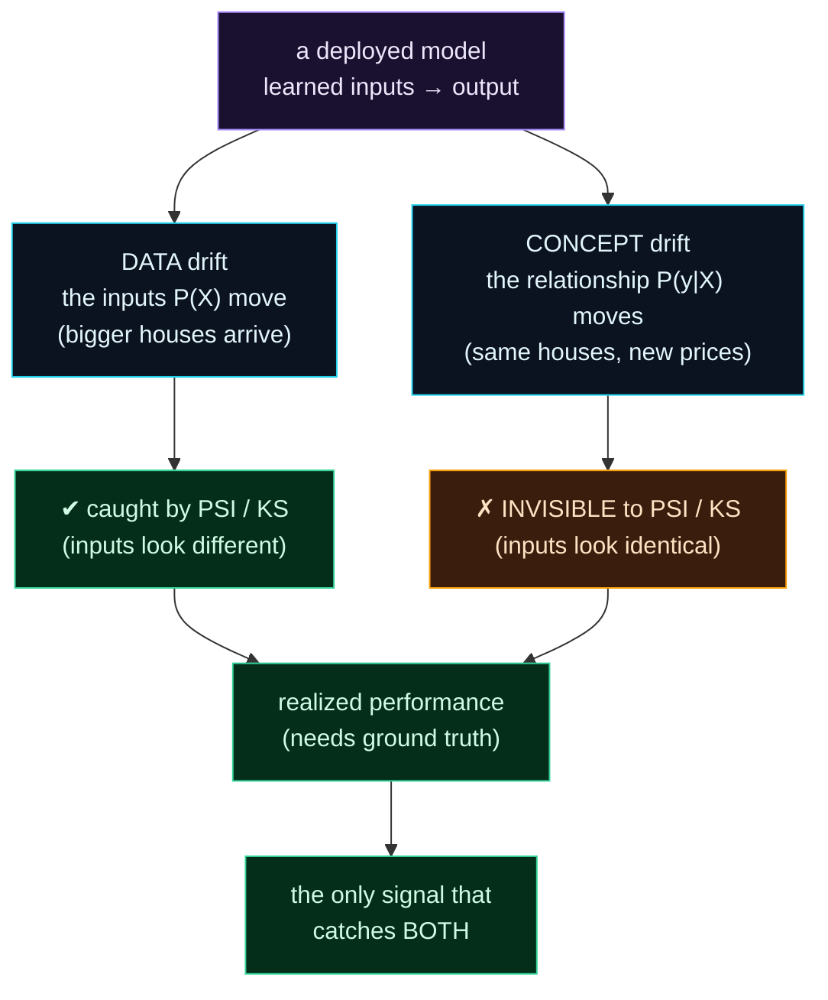

Welcome to **Day 74 of 100 Days of MLOps**. Yesterday you built a label-free early-warning system: watch the inputs, and when they drift from the training distribution, PSI and KS light up. It's fast and it needs no ground truth — a genuinely useful signal. But it has a blind spot, and today you're going to walk straight into it.

Data drift detects when the *inputs* move. But a model can decay catastrophically while its inputs look **completely unchanged** — because what shifted wasn't the data, it was the **relationship** between inputs and outputs. The houses are still the same sizes; they just sell for different prices now (a recession hit). The transactions look identical; the fraud patterns evolved. Your input-drift metrics read "all clear" while the model bleeds accuracy. This is **concept drift**, and it's the reason data drift alone is never enough. The only thing that catches it is measuring the model's **actual, realized performance** over time — which is exactly what the ground-truth logging from Day 72 was for. Today you'll watch concept drift slip past PSI entirely, and learn the monitoring that catches it.

> **Data drift is a proxy; performance is the truth.** Inputs can look unchanged while the input→output relationship rots — only realized performance reveals concept drift.

By the end of today you will:

- Distinguish **data drift** (inputs move) from **concept drift** (the relationship moves).
- Watch concept drift stay **invisible** to PSI and KS while accuracy collapses.
- Track **realized performance** over time from ground-truth joins.
- Know why you need **both** input-drift and performance monitoring.

---

## Two different things can drift

There are two fundamentally different ways a model's world can change, and they need different detectors:



**Reading this diagram:**

A **deployed model** (purple) learned a mapping from inputs to output. Two things can drift beneath it. **Data drift** (cyan) is when the *inputs* move — bigger houses start arriving — and that's **caught by PSI/KS** (green) because the inputs literally look different. **Concept drift** (cyan) is when the *relationship* moves — the same houses now sell for different prices — and here's the trap: it's **invisible to PSI/KS** (amber), because the inputs are unchanged; only the correct *answer* changed.

Both, however, show up in **realized performance** (green) — the model's actual error, measured against ground truth. That's why performance monitoring is **the only signal that catches both** (the final green node). The takeaway: input-drift metrics are a fast early warning for *one* kind of drift; performance monitoring is the slower, authoritative check for *all* decay. You need both, and today's demo shows exactly why.

---

## Watch concept drift hide from PSI

Here's the experiment. We train a model on the launch-day market (price ≈ $140/sqft). Then, over four periods, we draw houses from the **exact same size distribution** — so input drift *should* stay silent — but the market's price-per-sqft **falls** (a deepening recession). We measure, per period, the input drift (PSI, KS) *and* the realized error. Create `concept_drift.py`:

```python
"""concept_drift.py — Day 74: concept drift hides from input-drift metrics."""
import numpy as np, pandas as pd
from scipy.stats import ks_2samp
from sklearn.linear_model import LinearRegression
from sklearn.metrics import mean_absolute_error

def psi(reference, current, bins=10):
    edges = np.quantile(reference, np.linspace(0, 1, bins + 1)); edges[0], edges[-1] = -np.inf, np.inf
    r = np.clip(np.histogram(reference, edges)[0]/len(reference), 1e-6, None)
    c = np.clip(np.histogram(current,  edges)[0]/len(current),   1e-6, None)
    return float(np.sum((c - r) * np.log(c / r)))

def market(n, ppsf, seed):
    """Inputs (sizes) are ALWAYS drawn the same way. Only the price RELATIONSHIP changes."""
    rng = np.random.default_rng(seed)
    size = rng.normal(2000, 500, n).clip(600, 3500)
    price = (30000 + ppsf*size + rng.normal(0, 15000, n)).clip(50000)
    return pd.DataFrame({"size_sqft": size}), price

Xtr, ytr = market(4000, ppsf=140, seed=0)         # train on launch relationship
model = LinearRegression().fit(Xtr, ytr)
ref_size = Xtr["size_sqft"].values

print(f"{'window':16} | {'input PSI':>9} | {'KS p':>7} | {'realized MAE':>12} | what")
print("-"*70)
for label, ppsf, seed, what in [
    ("launch",        140, 1, "healthy"),
    ("recession -15%",120, 2, "same inputs!"),
    ("recession -30%",100, 3, "same inputs!"),
    ("crash     -45%", 80, 4, "same inputs!"),
]:
    Xt, yt = market(4000, ppsf, seed)             # same input dist, relationship changed
    p   = psi(ref_size, Xt["size_sqft"].values)
    ksp = ks_2samp(ref_size, Xt["size_sqft"].values).pvalue
    mae = mean_absolute_error(yt, model.predict(Xt))
    print(f"{label:16} | {p:9.3f} | {ksp:7.2f} | ${mae:>11,.0f} | {what}")
```

Run it:

```bash
python concept_drift.py
```

```text
window           | input PSI |    KS p | realized MAE | what
----------------------------------------------------------------------
launch           |     0.004 |    0.84 | $     11,940 | healthy
recession -15%   |     0.005 |    0.69 | $     39,541 | same inputs!
recession -30%   |     0.004 |    0.06 | $     80,607 | same inputs!
crash     -45%   |     0.003 |    0.23 | $    119,816 | same inputs!
```

This is the lesson of the day in one table. Look at the **input PSI** column: **0.004, 0.005, 0.004, 0.003** — dead flat, all far below the 0.1 threshold. KS p-values stay high too. Every input-drift metric says *"nothing to see here."* And they're *right* — the house sizes really are drawn from the same distribution throughout. But look at **realized MAE**: **$11,940 → $39,541 → $80,607 → $119,816**, a 10× collapse. The model is falling apart, and your Day 73 drift detector is completely blind to it, because the *inputs* never moved — only the price they command did. **That** is concept drift, and only performance monitoring caught it.

---

## Tracking realized performance

So the authoritative signal is **realized performance**: the model's actual error, measured against ground truth, tracked over time. You already have the raw material — the prediction log joined with actual outcomes (Day 72). The monitoring job is to compute a metric (MAE for regression, accuracy/precision/recall for classification) **per time window** and watch the trend:

```python
# from Day 72's joined log: rows with prediction + actual, bucketed by day/week
weekly_mae = (df.assign(week=df["ts"].dt.to_period("W"))
                .groupby("week")
                .apply(lambda g: mean_absolute_error(g["actual"], g["prediction"])))
```

A rising `weekly_mae` is decay in progress — exactly the $11,940→$119,816 climb above, but on real traffic. That series is what you alert on (Day 78) and what triggers a retrain (Day 79).

The one catch you already know: performance monitoring needs **labels**, and labels **lag** (Day 72). So the practical setup is a *two-speed* system:

- **Input-drift metrics (PSI/KS)** — fast, label-free, available now. Early warning for *data* drift.
- **Performance metrics (realized MAE/accuracy)** — slower, needs ground truth, authoritative. Catches *concept* drift and confirms real decay.

Watch the fast signal for a heads-up; trust the slow signal for the truth. Neither alone is enough — data drift misses concept drift (today's demo), and performance monitoring is too slow to be your *only* alarm.

---

## A note on the kinds of concept drift

Concept drift comes in flavours worth naming, because they change how you respond:

- **Sudden** — an overnight shift (a policy change, a market crash). Error jumps in one step; you want a fast alarm.
- **Gradual** — a slow slide (tastes evolving over months). Error creeps; you catch it by watching the *trend*, not a single reading.
- **Recurring / seasonal** — patterns that come and go (holiday shopping). Not permanent decay — don't retrain it away; account for seasonality.

Recognising which one you're seeing tells you whether to retrain now, keep watching the trend, or adjust for a season — a judgement the raw metric alone doesn't make for you.

---

## Common errors (and how to fix them)

**1. Relying on data drift alone**

Input-drift metrics miss concept drift entirely (today's whole point). A model can decay 10× with PSI flat at 0.004. Always pair input-drift monitoring with **performance** monitoring against ground truth.

**2. Relying on performance alone**

Performance needs labels, and labels lag. If it's your only signal, you'll detect decay weeks late. Use input drift as the fast early warning *and* performance as the authoritative confirmation.

**3. Measuring performance on too small a window**

A weekly MAE on five predictions is noise, not signal. Aggregate over enough labelled samples per window that the metric is stable, or you'll chase random fluctuations.

**4. Retraining away seasonality**

A recurring holiday pattern looks like drift but isn't permanent decay. Retraining every season is wasteful and can make things worse. Distinguish seasonal/recurring drift from a genuine one-way shift before you act.

**5. Ignoring label lag in the design**

If your monitoring assumes labels are available immediately, it will silently do nothing (there's no ground truth yet). Design for delayed labels: compute performance on the window whose labels have *arrived*, and lean on drift metrics meanwhile.

**6. Watching a single metric for a multi-class/regression model**

Overall accuracy or MAE can hide decay in a subgroup (one region, one class). Segment performance where it matters, so a collapse in part of the population isn't averaged into "fine."

---

## Recap — what you now have

You understand the deeper half of decay:

- You can distinguish **data drift** (inputs move, caught by PSI/KS) from **concept drift** (the relationship moves).
- You watched concept drift stay **invisible to PSI** (flat 0.004) while realized MAE climbed **$11,940 → $119,816**.
- You know to track **realized performance per time window** from ground-truth joins — the only signal that catches both drifts.
- You know the **two-speed** setup (fast drift metrics + slow performance) and the kinds of concept drift.

**Your cheat sheet:**

| | Data drift | Concept drift |
|-|------------|---------------|
| What moves | inputs P(X) | relationship P(y\|X) |
| Detect with | PSI / KS (no labels) | realized performance (needs labels) |
| Speed | fast, early warning | slower, authoritative |
| Blind spot | misses concept drift | needs ground truth, lags |

Golden rule: **data drift is the early warning; performance is the verdict.** Inputs can look perfect while the model rots — track realized accuracy over time, and use drift metrics and performance together.

---

## Coming up on Day 75

You've now hand-built drift and performance checks — enough to understand exactly what they measure. In production you don't want to maintain all that yourself. **Day 75 — "Intro to Evidently"** introduces the standard open-source library for ML monitoring: point it at a reference dataset and a current one, and it computes drift, data quality, and performance for *every* column at once, with sensible defaults and clear verdicts. You'll generate your first Evidently report and see the concepts from Days 71–74 packaged into one tool.

See the full roadmap on the [100 Days of MLOps series page](/series/100-days-mlops). See you tomorrow.
