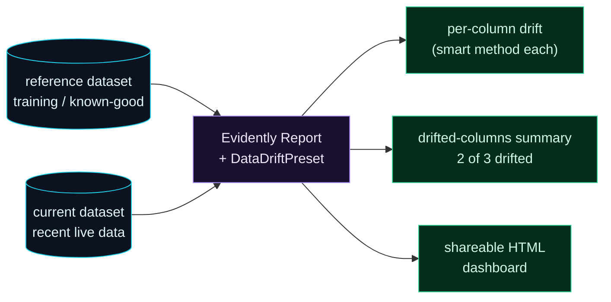

Welcome to **Day 75 of 100 Days of MLOps**. For the last two days you hand-built drift detection — PSI, the KS test, per-window performance. That was on purpose: now you know *exactly* what these metrics measure and why. But in production, you don't want to maintain a pile of custom statistics code, remember which test suits which feature type, or hand-roll a dashboard. You want a tool that does it properly, for every column, with sensible defaults — and reports it clearly.

That tool is **Evidently**: the most widely-used open-source library for ML monitoring. The idea is beautifully simple — give it a **reference** dataset (what "normal" looks like, e.g. your training data) and a **current** dataset (recent live data), and it computes drift, data quality, and performance across *every* column at once, picking an appropriate statistical method per feature, and produces both a machine-readable result and a shareable HTML dashboard. Everything you did by hand on Days 73–74, in a few lines — and more robustly. Today you'll generate your first Evidently report and watch it correctly flag the drifted columns while leaving the stable one alone.

> **Don't hand-roll monitoring — Evidently does it for every column.** Reference in, current in, drift/quality/performance out, with a dashboard.

By the end of today you will:

- Understand Evidently's **reference vs current** model.
- Build a **`Report`** with the **`DataDriftPreset`**.
- Read the **per-column drift verdicts** and the summary.
- Save a **shareable HTML report** of the results.

---

## Reference vs current: the whole mental model

Evidently compares two datasets. The **reference** is your baseline — what the data *should* look like (usually the training set, or a known-good recent window). The **current** is what you're checking — recent production data. Evidently runs the comparison and reports, per column, whether things have moved.



**Reading this diagram:**

Two **cyan** datasets go in — the **reference** (baseline) and the **current** (recent live data). They feed the **purple Evidently Report**, configured with a **preset** (here `DataDriftPreset`, a bundle of drift checks). Out come three **green** things: a **per-column drift verdict** (Evidently picks an appropriate method for each feature automatically), a **summary** ("2 of 3 columns drifted"), and a **shareable HTML dashboard** you can hand to a teammate.

The key idea is that you describe *what to check* (a preset) and *which two datasets*, and Evidently handles the statistics — no choosing tests, no writing PSI. The takeaway: **monitoring becomes declarative.** You point it at reference and current; it does the rest. Let's write it.

---

## Your first Evidently report

Evidently's current API (0.7.x) has three pieces: wrap your DataFrames as **`Dataset`** objects (with a `DataDefinition`), build a **`Report`** from a list of presets/metrics, and `run` it on reference vs current. We'll reuse the drift scenario from Day 73 — a reference market and a drifted current one — but let Evidently check *all* columns. Create `evidently_intro.py`:

```python
"""evidently_intro.py — Day 75: first Evidently drift report."""
import numpy as np, pandas as pd
from evidently import Report, Dataset, DataDefinition
from evidently.presets import DataDriftPreset

rng = np.random.default_rng(42)
# reference = training data; current = drifted live data (bigger, pricier houses)
reference = pd.DataFrame({
    "size_sqft": rng.normal(2000, 500, 2000),
    "bedrooms":  rng.integers(1, 6, 2000),
    "price":     rng.normal(320000, 60000, 2000),
})
current = pd.DataFrame({
    "size_sqft": rng.normal(2600, 650, 2000),     # drifted
    "bedrooms":  rng.integers(1, 6, 2000),        # stable
    "price":     rng.normal(430000, 80000, 2000), # drifted
})

# wrap frames as Evidently Datasets
schema = DataDefinition()
ref_ds = Dataset.from_pandas(reference, data_definition=schema)
cur_ds = Dataset.from_pandas(current,  data_definition=schema)

# one preset checks drift on EVERY column at once
report = Report([DataDriftPreset()])
result = report.run(reference_data=ref_ds, current_data=cur_ds)

result.save_html("drift_report.html")             # shareable dashboard
```

That's the whole thing: wrap, build, run, save. The `DataDriftPreset` bundles a full set of drift checks; `run` compares the two datasets; `save_html` writes a visual report. To read the verdicts programmatically, pull them out of `result.dict()`:

```python
d = result.dict()
for m in d["metrics"]:
    name = m["metric_name"]
    if name.startswith("ValueDrift"):
        col = m["config"]["column"]; score = m["value"]; thr = m["config"]["threshold"]
        print(f"  {col:10} score={score:.3f}  threshold={thr}  -> {'DRIFTED' if score>thr else 'stable'}")
    if name.startswith("DriftedColumnsCount"):
        print(f"  SUMMARY: {int(m['value']['count'])} of 3 columns drifted (share={m['value']['share']:.2f})")
```

Run it:

```bash
python evidently_intro.py
```

```text
  SUMMARY: 2 of 3 columns drifted (share=0.67)
  size_sqft  score=1.297  threshold=0.1  -> DRIFTED
  price      score=1.843  threshold=0.1  -> DRIFTED
  bedrooms   score=0.017  threshold=0.1  -> stable
```

Evidently nailed it — with no statistics code from us. It checked all three columns, flagged **`size_sqft`** (drift score 1.297) and **`price`** (1.843) as **DRIFTED**, correctly left **`bedrooms`** (0.017) alone as **stable**, and summarised: **2 of 3 columns drifted**. Notice it chose the method itself (here a normed Wasserstein distance) with a sensible default threshold — the same *conclusion* you reached by hand-coding PSI/KS on Day 73, but for every column at once and without you picking a test. And `drift_report.html` is now a full visual dashboard you can open in a browser or send to a colleague.

---

## Presets: drift is just the start

`DataDriftPreset` is one of several **presets** — pre-built bundles of metrics for a common monitoring job:

| Preset | What it checks |
|--------|----------------|
| `DataDriftPreset` | drift on every column (today) |
| `DataSummaryPreset` | data quality: missing values, ranges, stats |
| `RegressionPreset` | regression performance (MAE, error plots) |
| `ClassificationPreset` | classification performance (accuracy, ROC, confusion) |

The pattern is identical for all of them: `Report([SomePreset()]).run(reference, current)`. So the *same* three lines that gave you drift will, with `RegressionPreset`, give you a full performance report against ground truth (Day 74's realized MAE, plus error distributions) — provided your datasets include prediction and target columns. One tool, one API, covering drift, quality, and performance. Tomorrow you'll dig into the reports and dashboards these produce.

> **Mind the version.** Evidently's API changed meaningfully across releases — older tutorials use `Report(metrics=[...])` with different imports (`evidently.report`, `evidently.metric_preset`). This series uses the current `evidently` top-level API (`Report`, `Dataset`, `DataDefinition`, `evidently.presets`). **Pin your version** (`pip install evidently==0.7.21`) so examples match, exactly as you learned in Module 3.

---

## Common errors (and how to fix them)

**1. Following an old-API tutorial**

The single biggest source of confusion. Pre-0.7 Evidently used `from evidently.report import Report` and `Report(metrics=[DataDriftPreset()])` with a different `run` signature. Pin your version and match the docs to it, or imports and calls won't line up.

**2. Not wrapping DataFrames as `Dataset`**

The current API expects `Dataset.from_pandas(df, data_definition=...)`, not raw DataFrames passed straight to `run`. Wrap both reference and current the same way.

**3. Reference and current with different columns**

Evidently compares columns by name. If the two datasets have different schemas (a renamed or missing column), the comparison breaks or silently skips columns. Keep the schemas identical — same columns, same types.

**4. Using a tiny or non-representative reference**

The reference *defines* "normal." If it's too small or from an odd window, everything will look like drift (or nothing will). Use a solid, representative baseline — typically the training set or a known-good production window.

**5. Treating the default threshold as gospel**

Evidently's per-method thresholds are sensible defaults, not universal truth. On huge samples or noisy features, tune them for your data (just as KS over-fires on big samples, Day 73). Read *why* a column flagged, don't just trust the boolean.

**6. Only ever saving HTML, never reading the result programmatically**

The HTML dashboard is great for humans, but automation needs the numbers. Use `result.dict()` (or JSON) to extract drift verdicts so you can alert (Day 78) and trigger retraining (Day 79) — a report nobody's code reads can't drive action.

---

## Recap — what you now have

You can monitor with the standard tool instead of by hand:

- You understand Evidently's **reference vs current** comparison model.
- You built a **`Report([DataDriftPreset()])`**, wrapped data as **`Dataset`**, and ran it.
- You read **per-column verdicts** (size_sqft & price drifted, bedrooms stable — 2 of 3) and saved an **HTML dashboard**.
- You know the other **presets** (summary, regression, classification) use the identical pattern — and to **pin the version**.

**Your cheat sheet:**

| Task | Code |
|------|------|
| Imports | `from evidently import Report, Dataset, DataDefinition` |
| Wrap data | `Dataset.from_pandas(df, data_definition=DataDefinition())` |
| Drift report | `Report([DataDriftPreset()])` |
| Run | `report.run(reference_data=ref_ds, current_data=cur_ds)` |
| Read result | `result.dict()` |
| Save dashboard | `result.save_html("report.html")` |

Golden rule: **describe what to check, let Evidently do the statistics.** Point a `Report` at reference and current data; it computes drift/quality/performance per column and hands you both numbers and a dashboard — pin the version so your code matches the docs.

---

## Coming up on Day 76

Today you generated a report and read its numbers — tomorrow you'll actually *use* the dashboards. **Day 76 — "Drift Dashboards & Reports"** goes deeper into what Evidently produces: the visual drift report (distribution plots, per-column detail), combining presets into one report, and the difference between a one-off **Report** and a **Test Suite** that returns pass/fail checks you can automate against. It's how a pile of metrics becomes something a team actually looks at — and something your pipeline can act on.

See the full roadmap on the [100 Days of MLOps series page](/series/100-days-mlops). See you tomorrow.
