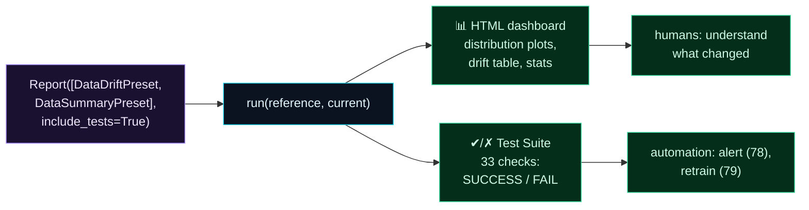

Welcome to **Day 76 of 100 Days of MLOps**. Yesterday you generated your first Evidently report and read its drift numbers. Today you turn that into two things a real team needs: a **dashboard people actually look at**, and **pass/fail checks your pipeline can enforce**. Because a monitoring number sitting in a Python dict helps no one — the humans need a visual they can scan in ten seconds, and the automation needs a clean SUCCESS/FAIL it can branch on.

Evidently gives you both from the same building blocks. Combine several **presets** into one report and you get a single dashboard covering drift *and* data quality, with per-column distribution plots you can hand to a stakeholder. Flip on **tests** and the very same report also produces a **Test Suite** — dozens of individual checks, each returning SUCCESS or FAIL against a threshold — which is exactly what you'll wire into alerting (Day 78) and retraining triggers (Day 79). Today you'll build a combined report, see the dashboard it produces, and run 33 automated checks that fail precisely the columns that drifted.

> **Reports for humans, tests for machines.** One Evidently run gives you a visual dashboard to read *and* pass/fail checks to automate against.

By the end of today you will:

- **Combine presets** (drift + data quality) into one report and dashboard.
- Understand what the **visual HTML report** shows (distribution plots, per-column detail).
- Turn a report into a **Test Suite** with `include_tests=True`.
- Read **SUCCESS/FAIL** checks — the automatable output that drives alerts and retraining.

---

## One report, two audiences

The same Evidently report serves two very different consumers. A human opens the **HTML dashboard** — charts, distributions, a drift table — to *understand* what changed. Automation reads the **Test Suite** — a list of pass/fail checks — to *decide* what to do. You produce both in one `run`.



**Reading this diagram:**

At the left, in **purple**, you configure one report from *multiple presets* with `include_tests=True`. The **cyan run** compares reference and current once, and produces two **green** outputs. The **HTML dashboard** — distribution plots, a drift table, summary stats — is for **humans** to read and understand what moved. The **Test Suite** — dozens of individual SUCCESS/FAIL checks — is for **automation** to act on: it's the clean signal that drives alerting (Day 78) and triggered retraining (Day 79).

The insight is efficiency: **you don't build monitoring twice.** One report, one comparison, serves both the person scanning a dashboard and the pipeline making a decision. Let's produce both.

---

## Combine presets + turn on tests

Two changes from yesterday: pass *several* presets in the list, and add `include_tests=True`. Create `dashboards.py`:

```python
"""dashboards.py — Day 76: combined presets + pass/fail tests."""
import numpy as np, pandas as pd
from collections import Counter
from evidently import Report, Dataset, DataDefinition
from evidently.presets import DataDriftPreset, DataSummaryPreset

rng = np.random.default_rng(42)
reference = pd.DataFrame({"size_sqft": rng.normal(2000,500,2000),
                          "bedrooms": rng.integers(1,6,2000),
                          "price": rng.normal(320000,60000,2000)})
current   = pd.DataFrame({"size_sqft": rng.normal(2600,650,2000),   # drifted
                          "bedrooms": rng.integers(1,6,2000),        # stable
                          "price": rng.normal(430000,80000,2000)})   # drifted
schema = DataDefinition()
ref_ds = Dataset.from_pandas(reference, data_definition=schema)
cur_ds = Dataset.from_pandas(current,  data_definition=schema)

# combine presets + turn on pass/fail tests
report = Report([DataDriftPreset(), DataSummaryPreset()], include_tests=True)
result = report.run(reference_data=ref_ds, current_data=cur_ds)
result.save_html("full_report.html")               # the dashboard (for humans)

# the Test Suite (for automation)
tests = result.dict().get("tests", [])
st = lambda t: getattr(t.get("status"), "value", str(t.get("status")))
print("total tests:", len(tests), "|", dict(Counter(st(t) for t in tests)))
for t in tests[:7]:
    print(f"  [{st(t):7}] {t.get('name','')[:52]}")
```

`DataDriftPreset` adds the drift checks; `DataSummaryPreset` adds data-quality checks (row counts, duplicates, missing values, ranges). `include_tests=True` makes each metric also emit a pass/fail test. Run it:

```bash
python dashboards.py
```

```text
total tests: 33 | {'FAIL': 17, 'SUCCESS': 16}
  [FAIL   ] Share of Drifted Columns: Less 0.500
  [FAIL   ] Value Drift for column size_sqft
  [FAIL   ] Value Drift for column price
  [SUCCESS] Value Drift for column bedrooms
  [SUCCESS] Row count in dataset: Equal 2000.000 ± 200.000
  [SUCCESS] Column count in dataset: Equal 3.000 ± 0.000
  [SUCCESS] Duplicated row count in dataset: Equal 0.000 ± 0.000
```

From one call, **33 automated checks** — and they're exactly right. The drift tests **FAIL** for `size_sqft` and `price`, **SUCCESS** for the stable `bedrooms`, and the overall "Share of Drifted Columns < 0.5" **FAILs** (two of three drifted is 0.67). Meanwhile the data-quality checks from `DataSummaryPreset` **pass** — row count, column count, no duplicates. That `{'FAIL': 17, 'SUCCESS': 16}` summary is the automatable heartbeat of your monitoring: a machine can read "17 failed" and act, no human required.

---

## What the dashboard shows

Open `full_report.html` in a browser and you get the *human* view of the same run. For each column, Evidently draws the **reference and current distributions overlaid**, so a drifted feature is visually obvious — `size_sqft`'s current distribution sits clearly to the right of its reference (bigger houses), while `bedrooms`'s two distributions overlap almost perfectly. Above the plots is a **drift summary table** (which columns drifted, the score, the method used), and the `DataSummaryPreset` adds **data-quality panels** (missing values, ranges, basic stats per column).

This is what you put on a wall or in a weekly review. A stakeholder who'd never read a PSI value can look at two distributions pulling apart and immediately grasp "our incoming houses are bigger than what we trained on." The dashboard *explains*; the tests *decide*. Both came from the same three lines.

---

## Reports vs Test Suites: when to use which

The distinction matters as you build real monitoring:

| | Report (metrics) | Test Suite (`include_tests=True`) |
|-|------------------|-----------------------------------|
| Output | numbers + charts | SUCCESS / FAIL per check |
| Audience | humans (investigate) | automation (decide) |
| Use for | dashboards, reviews, debugging | alerts, CI gates, retrain triggers |
| Reads via | `result.dict()["metrics"]`, HTML | `result.dict()["tests"]` |

In practice you use both together: the **Test Suite** runs on a schedule and, when checks fail, fires an alert (Day 78) or triggers a retrain (Day 79); the **HTML report** is what a human opens *after* the alert to understand *why* it failed. Tests catch it; the dashboard explains it. That pairing — automated detection plus human-readable explanation — is what a mature monitoring setup looks like.

---

## Common errors (and how to fix them)

**1. Forgetting `include_tests=True`**

Without it, you only get metrics (numbers), not pass/fail tests. If `result.dict()["tests"]` is empty, you didn't enable tests — automation has nothing clean to branch on. Turn it on when you want checks.

**2. Relying on default thresholds for your automation**

The tests use Evidently's default thresholds. They're reasonable, but *your* "acceptable" may differ. Configure preset thresholds (e.g. `DataDriftPreset(threshold=...)`, `drift_share=...`) so FAIL means *your* definition of a problem, not a generic one.

**3. Alerting on every individual FAIL**

With 33 checks, some will flap. Don't page on each one — aggregate (e.g. "alert if share of drifted columns > 0.5" or "if any *key* feature drifts"). One meaningful FAIL beats 17 noisy ones (alert fatigue, again).

**4. Only saving the HTML, never reading the tests**

The dashboard is for humans; automation needs `result.dict()["tests"]`. If your pipeline only writes HTML, nothing can *act* on drift. Read the tests programmatically to drive alerts and retraining.

**5. Combining so many presets the report is unreadable**

More presets = a bigger, slower, busier report. Include what you'll actually look at (drift + quality is a good default; add regression/classification when you have labels). A focused dashboard gets read; a 50-panel one gets ignored.

**6. Regenerating the dashboard but never comparing over time**

A single report is a snapshot. Drift is a *trend*. Save reports per run (dated) or use Evidently's monitoring UI/snapshots so you can see a feature creeping over weeks, not just today's reading.

---

## Recap — what you now have

You can produce monitoring for both humans and machines:

- You **combined presets** (`DataDriftPreset` + `DataSummaryPreset`) into one report covering drift and data quality.
- You generated a **visual dashboard** with overlaid distribution plots per column.
- You enabled **`include_tests=True`** and got a **33-check Test Suite** — 17 FAIL / 16 SUCCESS.
- You know **Report vs Test Suite**: dashboards for humans, pass/fail checks for automation.

**Your cheat sheet:**

| Task | Code |
|------|------|
| Combine presets | `Report([DataDriftPreset(), DataSummaryPreset()])` |
| Enable pass/fail | `Report([...], include_tests=True)` |
| Save dashboard | `result.save_html("full_report.html")` |
| Read tests | `result.dict()["tests"]` → status per check |
| Tune drift test | `DataDriftPreset(threshold=..., drift_share=...)` |
| Aggregate signal | alert on "share of drifted columns", not each check |

Golden rule: **one report, two outputs — a dashboard to understand and tests to act on.** Combine the presets you'll actually read, turn on tests for automation, and let the HTML explain what the FAILs mean.

---

## Coming up on Day 77

Evidently reports are perfect for batch checks and human review — but production systems also need **live, continuous** metrics: request rates, latencies, prediction values, error counts, all scraped every few seconds into a time-series system. **Day 77 — "Monitoring Metrics (Prometheus-style)"** shows you how to expose model and service metrics in the standard Prometheus format from a `/metrics` endpoint — counters, gauges, and histograms — so your ML service plugs into the same monitoring stack the rest of your infrastructure already uses.

See the full roadmap on the [100 Days of MLOps series page](/series/100-days-mlops). See you tomorrow.
