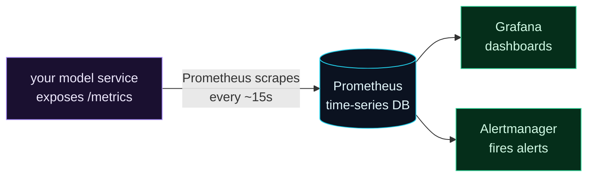

Welcome to **Day 77 of 100 Days of MLOps**. Evidently (Days 75–76) is perfect for one job: take a batch of data, compare it to a reference, and produce a drift report. But production monitoring has a second mode Evidently doesn't cover — **live, continuous, operational metrics.** How many predictions per second is the service handling *right now*? What's the p99 latency this minute? Is the error rate climbing? These aren't batch questions you answer with a report; they're time-series you want scraped every few seconds and graphed on a wall.

That's the world of **Prometheus** — the de-facto standard for infrastructure metrics, and almost certainly what monitors the rest of your company's services. The model is elegantly simple: your service exposes a **`/metrics`** endpoint that reports its current numbers in a plain-text format; Prometheus **scrapes** that endpoint on a schedule and stores the values as time-series; Grafana graphs them and Alertmanager alerts on them. The beautiful part for MLOps: by exposing model metrics this way, your ML service plugs into the *exact same* stack as every other service — your prediction latency sits on the same dashboard as CPU and memory. Today you'll instrument a model service with `prometheus_client` and read the real metrics it exposes.

> **Live metrics, standard format.** Expose a `/metrics` endpoint; Prometheus scrapes it every few seconds — your model joins the same monitoring stack as everything else.

By the end of today you will:

- Understand the **Prometheus model**: expose, scrape, store, graph, alert.
- Instrument a service with a **Counter, Histogram, and Gauge**.
- Expose a **`/metrics`** endpoint and read the exposition format.
- Know which **model-specific metrics** are worth exposing.

---

## Expose, scrape, store, alert

Prometheus is a *pull* system. Your service doesn't push metrics anywhere — it just exposes its current state at `/metrics`, and Prometheus comes and reads it on an interval. That decoupling is why one Prometheus can monitor hundreds of services uniformly.



**Reading this diagram:**

On the left, in **purple**, your **model service exposes a `/metrics` endpoint** — a plain-text snapshot of its current counters and values. **Prometheus** (cyan) **scrapes** that endpoint every ~15 seconds and stores each reading as a point in a **time-series database**. From there, two **green** consumers: **Grafana** graphs the time-series into dashboards, and **Alertmanager** watches them and fires alerts when a threshold is crossed (Day 78).

The key idea is **pull, not push**: your service is passive — it just reports "here's my state right now" whenever asked. That's what lets the same Prometheus monitor your ML service, your database, and your web servers identically. Your job is just to expose the numbers; today you'll do exactly that.

---

## The three metric types

Almost all metrics are one of three types, and picking the right one matters:

- **Counter** — a number that only ever goes *up* (until restart): total predictions served, total errors. You graph its *rate* ("predictions per second").
- **Gauge** — a number that goes up *and* down: the last predicted price, current in-flight requests, current memory. A snapshot of "right now."
- **Histogram** — records a *distribution* by bucketing observations: request latency, prediction values. From it you compute percentiles (p50, p99) — the right way to watch latency (Day 58).

Instrument a FastAPI model service with one of each. Create `metrics_app.py`:

```python
"""metrics_app.py — Day 77: a model service that exposes Prometheus metrics."""
import numpy as np, pandas as pd
from fastapi import FastAPI, Response
from pydantic import BaseModel
from sklearn.linear_model import LinearRegression
from prometheus_client import Counter, Histogram, Gauge, generate_latest, CONTENT_TYPE_LATEST

rng = np.random.default_rng(42)
Xtr = pd.DataFrame({"size_sqft": rng.integers(600,3500,500), "bedrooms": rng.integers(1,6,500)})
ytr = 30000 + 140*Xtr.size_sqft + 12000*Xtr.bedrooms
model = LinearRegression().fit(Xtr, ytr)

# --- define metrics ---
PREDICTIONS = Counter("predictions_total", "Total predictions served")
LATENCY = Histogram("prediction_latency_seconds", "Prediction latency",
                    buckets=(0.001, 0.005, 0.01, 0.05, 0.1))
LAST_PRICE = Gauge("last_predicted_price_dollars", "Most recent predicted price")

app = FastAPI()

class House(BaseModel):
    size_sqft: int
    bedrooms: int

@app.post("/predict")
def predict(h: House):
    with LATENCY.time():                       # histogram: time this block
        price = float(model.predict(pd.DataFrame([h.model_dump()]))[0])
    PREDICTIONS.inc()                          # counter: +1
    LAST_PRICE.set(round(price, 2))            # gauge: current value
    return {"predicted_price": round(price, 2)}

@app.get("/metrics")
def metrics():
    return Response(generate_latest(), media_type=CONTENT_TYPE_LATEST)
```

Three lines of instrumentation inside `/predict`: `LATENCY.time()` times the prediction, `PREDICTIONS.inc()` counts it, `LAST_PRICE.set()` records the value. The `/metrics` endpoint calls `generate_latest()` — that's the whole Prometheus integration. Now exercise it and scrape the endpoint:

```python
if __name__ == "__main__":
    from fastapi.testclient import TestClient
    c = TestClient(app)
    for s, b in [(1200,2),(2500,4),(900,1),(3200,5),(1800,3)]:
        c.post("/predict", json={"size_sqft": s, "bedrooms": b})
    print(c.get("/metrics").text)     # the Prometheus exposition format
```

```bash
python metrics_app.py
```

```text
# TYPE predictions_total counter
predictions_total 5.0
prediction_latency_seconds_bucket{le="0.001"} 4.0
prediction_latency_seconds_bucket{le="0.005"} 5.0
prediction_latency_seconds_bucket{le="0.01"} 5.0
prediction_latency_seconds_bucket{le="0.05"} 5.0
prediction_latency_seconds_bucket{le="0.1"} 5.0
prediction_latency_seconds_bucket{le="+Inf"} 5.0
prediction_latency_seconds_count 5.0
# TYPE last_predicted_price_dollars gauge
last_predicted_price_dollars 318000.0
```

That plain text *is* the Prometheus exposition format — what the scraper reads. Decode it: `predictions_total 5.0` — the counter says five predictions served. The `_bucket` lines are the latency histogram: `le="0.001"` had 4 observations (4 predictions took ≤1ms), and all 5 were ≤5ms — *cumulative* buckets from which Prometheus computes p50/p99. `last_predicted_price_dollars 318000.0` — the gauge holds the most recent prediction. A running Prometheus would scrape this every 15 seconds and turn each into a live time-series.

---

## Which model metrics to expose

Standard service metrics (request count, latency, error rate) are table stakes — but ML services have *model-specific* signals worth exposing too:

| Metric | Type | Why |
|--------|------|-----|
| `predictions_total` | Counter | throughput; rate = predictions/sec |
| `prediction_latency_seconds` | Histogram | p50/p99 latency (Day 58) |
| `prediction_errors_total` | Counter | error rate / bad requests |
| predicted-value distribution | Histogram | **a live drift signal** — if outputs shift, something changed |
| feature values | Histogram/Gauge | input drift, cheaply, in real time |
| `model_info{version="..."}` | Gauge | which model is live |

The clever one is the **prediction distribution**. Remember Day 71: a decaying model's *outputs* shift even when nothing errors. Expose predictions as a histogram, and a sudden change in the distribution is a live, real-time hint of drift — visible on a Grafana graph in seconds, without waiting for a batch Evidently run. Prometheus and Evidently are **complementary**: Prometheus for fast, continuous operational metrics; Evidently for deep, statistical, batch drift analysis. Mature setups run both — and often *export Evidently's drift scores into Prometheus* as gauges so drift lives on the same dashboard as latency.

---

## Common errors (and how to fix them)

**1. Using a Counter for something that goes down**

A Counter must be monotonic (only up). For in-flight requests, queue depth, or the last predicted value — things that rise *and* fall — use a **Gauge**. Using a Counter for those produces nonsense rates.

**2. Averaging latency instead of using a Histogram**

An average latency hides the tail — the p99 that actually hurts users (Day 58). Use a **Histogram** and compute percentiles; never report a single mean latency for an SLA.

**3. High-cardinality labels**

Don't label metrics with unbounded values (user id, request id, raw feature values). Each unique label combination is a new time-series; high cardinality can overwhelm Prometheus. Label with *bounded* dimensions (model version, endpoint, status), not identifiers.

**4. Creating metric objects per request**

Define `Counter`/`Histogram`/`Gauge` **once at module load**, not inside the request handler. Re-creating them each call errors ("duplicated timeseries") or resets state. Module-level definitions, updated per request.

**5. Forgetting to actually expose `/metrics`**

Instrumenting metrics does nothing if Prometheus can't read them. Expose a `/metrics` endpoint returning `generate_latest()` with the right content type — that's the contract the scraper relies on.

**6. Thinking Prometheus replaces Evidently (or vice-versa)**

They solve different problems: Prometheus = fast operational time-series; Evidently = statistical batch drift/quality. A prediction-distribution gauge is a *hint*; a proper drift test is the *analysis*. Use both, don't substitute one for the other.

---

## Recap — what you now have

Your model service now speaks the standard monitoring language:

- You understand the **Prometheus pull model**: expose `/metrics`, scrape, store, graph, alert.
- You instrumented a service with a **Counter** (predictions), **Histogram** (latency), and **Gauge** (last price).
- You exposed a **`/metrics`** endpoint and read the real exposition format (`predictions_total 5.0`, latency buckets, `last_predicted_price_dollars 318000.0`).
- You know the **model-specific metrics** to expose — including the prediction distribution as a live drift hint — and that Prometheus and Evidently complement each other.

**Your cheat sheet:**

| Task | Code |
|------|------|
| Counter | `C = Counter("name", "help"); C.inc()` |
| Gauge | `G = Gauge("name", "help"); G.set(x)` |
| Histogram | `H = Histogram("name", "help", buckets=(...))` |
| Time a block | `with H.time(): ...` |
| Expose | `Response(generate_latest(), media_type=CONTENT_TYPE_LATEST)` |
| Rule | define metrics at module level, not per request |

Golden rule: **expose your model's numbers in the standard format and let Prometheus do the rest.** Counter for counts, Gauge for levels, Histogram for distributions/latency — and your ML service monitors like any other service.

---

## Coming up on Day 78

You can now *detect* drift (Evidently) and *expose* live metrics (Prometheus) — but detection is useless if nobody's told. **Day 78 — "Alerting on Drift"** closes that gap: turn a drift signal into an actual alert. You'll set thresholds on drift and performance metrics, decide what's worth waking someone for, and fire a notification when a check crosses the line — combining the Evidently test results and the failure hooks from Module 7 into a monitoring system that doesn't just watch, but *tells you* when your model needs attention.

See the full roadmap on the [100 Days of MLOps series page](/series/100-days-mlops). See you tomorrow.
