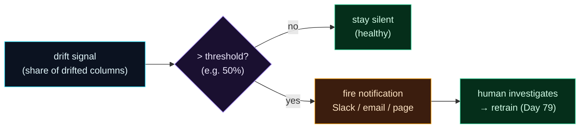

Welcome to **Day 78 of 100 Days of MLOps**. You can now detect drift (Evidently) and expose live metrics (Prometheus) — but a monitoring system that only *watches* is half a system. Recall Day 71's whole lesson: decay is dangerous precisely because it's *silent*. If your drift detector produces a beautiful dashboard that nobody opens, you've reinvented the silent failure with extra steps. The point of monitoring is not to *know*; it's to *be told*.

Today you build the piece that does the telling: **alerting**. The pattern is simple and universal — take a monitoring signal (drift share, a failing test, a performance metric), compare it to a **threshold**, and if it crosses, **fire a notification**. But the art is in the judgement around it: alert on the *right* signal (an aggregate, not every noisy column), at the *right* level (page for a crisis, log for a nuisance), with a *useful* message (what drifted, how much, what to do), and without crying wolf so often that people mute you. You'll build a drift alert that stays quiet on a healthy window and fires a detailed, actionable alert on a drifted one.

> **Monitoring that can't alert is just decoration.** Threshold a signal, and when it's crossed, tell a human — with a message they can act on.

By the end of today you will:

- Turn a drift signal into a **threshold-based alert**.
- Fire a notification only when drift crosses the line — and stay silent otherwise.
- Design **actionable** alerts and avoid **alert fatigue**.
- See how this maps to both **app-level** and **Prometheus Alertmanager** alerting.

---

## From signal to notification

An alert is a tiny decision engine sitting on top of a metric. It reads the current value, compares it to a threshold you chose, and takes one of two paths: stay quiet, or notify. The skill is choosing a signal and threshold that fire on *real* problems and stay silent on noise.



**Reading this diagram:**

A **drift signal** (cyan) — here the *share of columns that drifted* — feeds the **purple threshold check**. Two outcomes: if it's *below* the line, the system **stays silent** (green — a healthy window shouldn't page anyone), and if it's *above*, it **fires a notification** (amber — Slack, email, or a page). The alert leads to a **human investigating** and, if warranted, retraining (green, tomorrow's topic).

The design choices live in that diamond: *which* signal (an aggregate share, not one flaky column), *what* threshold (high enough to ignore noise, low enough to catch real drift), and *what* the notification says. The takeaway: **an alert is a threshold plus a message plus judgement.** Get the signal and threshold right and the alert is trusted; get them wrong and it's either missed problems or ignored noise. Let's build it.

---

## A drift alert

We'll wrap Evidently's drift check (Days 75–76) in an alert: compute the *share* of drifted columns, and if it exceeds a threshold, send a notification with the specifics. Create `alerting.py`:

```python
"""alerting.py — Day 78: turn a drift signal into an alert."""
import numpy as np, pandas as pd
from evidently import Report, Dataset, DataDefinition
from evidently.presets import DataDriftPreset

DRIFT_SHARE_THRESHOLD = 0.5     # alert if >50% of columns drift

def drift_share(reference, current):
    """Return (share_of_drifted_columns, list_of_drifted_columns)."""
    schema = DataDefinition()
    ref_ds = Dataset.from_pandas(reference, data_definition=schema)
    cur_ds = Dataset.from_pandas(current,  data_definition=schema)
    result = Report([DataDriftPreset()]).run(reference_data=ref_ds, current_data=cur_ds)
    drifted, share = [], 0.0
    for m in result.dict()["metrics"]:
        if m["metric_name"].startswith("ValueDrift") and m["value"] > m["config"]["threshold"]:
            drifted.append(m["config"]["column"])
        if m["metric_name"].startswith("DriftedColumnsCount"):
            share = m["value"]["share"]
    return share, drifted

def send_alert(message: str):
    # in production: POST to Slack webhook / PagerDuty / email
    print(f"  🚨 ALERT SENT: {message}")

def check_and_alert(name, reference, current):
    share, drifted = drift_share(reference, current)
    print(f"[{name}] drift share = {share:.0%}  drifted = {drifted or 'none'}")
    if share > DRIFT_SHARE_THRESHOLD:
        send_alert(f"Data drift {share:.0%} > {DRIFT_SHARE_THRESHOLD:.0%} threshold. "
                   f"Drifted columns: {drifted}. Investigate/retrain.")
    else:
        print("  ✔ within threshold — no alert")
```

The key design choice: we alert on the **aggregate share** (over half the columns drifted), not on each column individually — one meaningful signal, not a flurry. And the message is **actionable**: it says how much drifted, *which* columns, and what to do. Run it against a healthy and a drifted window:

```python
# ... reference, stable, drifted DataFrames ...
check_and_alert("stable",  reference, stable)
check_and_alert("drifted", reference, drifted)
```

```text
=== healthy window ===
[stable] drift share = 0%  drifted = none
  ✔ within threshold — no alert
=== drifted window ===
[drifted] drift share = 67%  drifted = ['size_sqft', 'price']
  🚨 ALERT SENT: Data drift 67% > 50% threshold. Drifted columns: ['size_sqft', 'price']. Investigate/retrain.
```

Exactly the behaviour you want. The **healthy window** — data drawn from the same distribution — has 0% drift and the system stays **silent** (no false alarm, no fatigue). The **drifted window** crosses the threshold at 67% and fires a **specific, actionable alert**: 67% drifted, the culprits are `size_sqft` and `price`, and the next step is investigate/retrain. Swap `send_alert`'s `print` for a Slack webhook POST and this is production alerting.

---

## Designing alerts that people trust

Firing a notification is easy; firing a *good* one is the real skill. The failure mode is **alert fatigue** — so many alerts (many false) that people mute the channel, and then a real one is missed. Guard against it:

- **Alert on aggregates or key signals, not everything.** "Over half the columns drifted" or "a *critical* feature drifted" — not a page per column. We chose drift *share* deliberately.
- **Use severity levels.** A minor drift → a log or a low-priority Slack message. A major performance drop → a page. Not everything deserves waking someone at 3am.
- **Add a cooldown / dedup.** If drift persists, don't re-alert every 15 minutes. Alert once, then suppress repeats until it clears (or escalate if it worsens).
- **Make every alert actionable.** Include the metric, the threshold, what crossed it, and the likely next step. An alert that just says "drift detected" wastes the responder's time.
- **Require a sustained signal, not a blip.** Alert when drift is high for *N consecutive* checks, not on a single noisy reading — the same "retry the blips" wisdom from Module 7.

A muted alert channel is worse than no alerting, because it gives false confidence. Tune thresholds so a firing alert almost always means "a human should look."

---

## Two places alerts live

You'll implement alerting at one (or both) of two layers, and they mirror the two tools from this week:

- **App-level (batch)** — code like today's, usually run on a schedule (a **Prefect flow**, Day 64): fetch recent data, run the Evidently check, and call `send_alert` if it crosses a threshold. Best for statistical drift and performance checks that need a batch of data. This also composes with Module 7's **`on_failure` hooks** (Day 69) — an Evidently Test Suite that fails can fire the alert.
- **Infra-level (continuous)** — **Prometheus Alertmanager** rules on the `/metrics` you exposed on Day 77: e.g. "alert if p99 latency > 200ms for 5 minutes" or "if the prediction-value gauge shifts sharply." Best for fast operational signals scraped every few seconds.

Use batch alerting for deep drift/performance analysis and Alertmanager for live operational metrics — together they cover both the slow, statistical decay and the fast, operational failures.

---

## Common errors (and how to fix them)

**1. Detecting drift but never alerting**

A drift dashboard nobody watches is the silent-failure trap all over again. Wire detection to a *notification* — the whole point is to be told, not to have the data available if someone looks.

**2. Alerting on every column / every check**

Per-column alerts on a wide dataset produce a storm of noise and train people to ignore the channel. Alert on an **aggregate** (drift share) or on **key** features, not on all 33 checks firing individually.

**3. No cooldown — re-alerting on persistent drift**

If drift lasts a day and you check every 15 minutes, that's 96 identical pages. Dedup/cooldown: alert once, suppress repeats until it clears or worsens.

**4. Thresholds copied from a blog, not tuned to your data**

A default threshold may fire constantly (or never) on *your* features. Calibrate against your own history — pick a threshold that would have fired on real past incidents and stayed quiet otherwise.

**5. Alerts with no action in them**

"Drift detected" tells the responder nothing. Include the metric, value, threshold, which columns, and the suggested next step, so they can act without spelunking through dashboards at 3am.

**6. Alerting on a single noisy reading**

One window can spike from randomness. Require the signal to persist (N consecutive checks) before paging — otherwise you page on noise and erode trust in the alert.

---

## Recap — what you now have

Your monitoring can now speak up:

- You turned a **drift signal into a threshold-based alert** — quiet on a healthy window (0%), firing on a drifted one (67%).
- Your alert is **actionable**: it names the drift level, the drifted columns, and the next step.
- You know how to **avoid alert fatigue**: aggregate signals, severity, cooldown, sustained checks, actionable messages.
- You know alerts live at **two layers** — app-level batch (Prefect + Evidently) and infra-level continuous (Prometheus Alertmanager).

**Your cheat sheet:**

| Principle | Do |
|-----------|-----|
| Signal | alert on aggregates / key features, not every column |
| Threshold | tune to your data & history, not a default |
| Severity | page for crises, log for nuisances |
| Cooldown | alert once; suppress repeats until cleared |
| Sustained | require N consecutive checks, not one blip |
| Message | include value, threshold, cause, next step |

Golden rule: **a monitoring system that can't alert is decoration.** Threshold the right signal, fire an actionable notification, and tune it so a firing alert almost always means "look now" — that's what makes people trust it.

---

## Coming up on Day 79

You can now detect drift and get alerted — but there's a human in the loop clicking "retrain." The final step of automation is closing that loop entirely. **Day 79 — "Closing the Loop: Monitoring-Triggered Retraining"** wires drift detection directly into the automated retraining pipeline from Module 7: when drift crosses the threshold, *automatically* kick off a retrain — no human required. It's the self-healing ML system the whole course has been building toward: a model that watches itself, notices its own decay, and fixes it.

See the full roadmap on the [100 Days of MLOps series page](/series/100-days-mlops). See you tomorrow.
