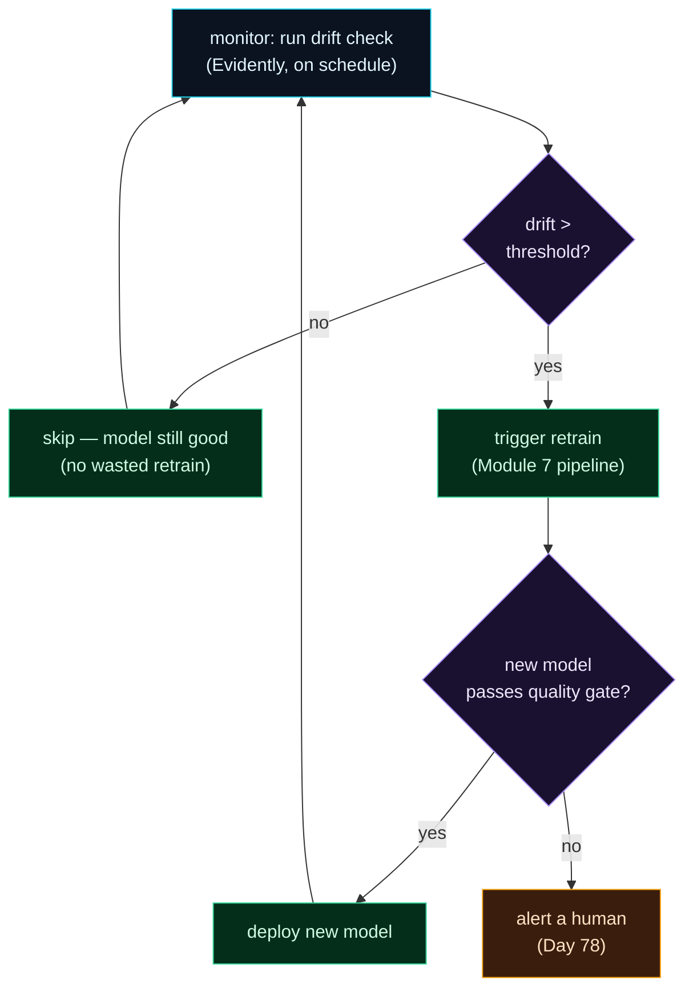

Welcome to **Day 79 of 100 Days of MLOps**. Everything in this course has been building to this moment. In Module 7 you built a pipeline that retrains itself *on a schedule*. In Module 8 you learned to *detect* when a model has actually decayed. Today you connect the two, and the result is the thing MLOps is really about: a model that **watches itself, notices its own decay, and retrains itself — with no human in the loop.**

Remember the tension from Day 71: retraining on a blind schedule is either wasteful (retraining a still-good model nightly) or too slow (letting it rot between runs). Monitoring resolves that tension — you retrain *exactly when the model needs it*, and not otherwise. Today you'll wire your Evidently drift check (Module 8) directly into a Prefect retraining flow (Module 7): the flow checks for drift, and **only if drift crosses the threshold** does it fire a retrain. You'll watch it do the right thing twice — skip a healthy window (no waste), and on a drifted window where the model has quietly broken, automatically retrain and heal itself. This is the closed loop, the self-driving model.

> **The model that heals itself.** Monitoring detects decay; the loop retrains automatically — only when needed, no human required.

By the end of today you will:

- **Wire drift detection into a retraining flow** as a conditional trigger.
- See the loop **skip** retraining on a healthy window (no waste).
- See it **auto-retrain** on a drifted window and fix a broken model.
- Know the **guardrails** — quality gates, validation, alerts — a real closed loop needs.

---

## The closed loop

The whole system is a cycle. Monitoring runs (on a schedule); if it detects drift, it triggers a retrain; the retrain produces a new model that (if it passes a gate) is deployed; and monitoring keeps watching. The model maintains itself.



**Reading this diagram:**

It's a **cycle**, not a line. **Monitor** (cyan) runs the drift check on a schedule. The **purple decision** asks: is drift over threshold? If **no**, the loop **skips** (green) — the model's still good, so retraining would be waste — and returns to monitoring. If **yes**, it **triggers a retrain** (green, the Module 7 pipeline). The retrained model faces a **quality gate** (purple, from Day 70): if it passes, **deploy** and resume monitoring; if it fails, **alert a human** (amber) rather than ship a bad model. Then the loop continues, forever.

The key property is that arrow from `skip` and `deploy` *back to* monitor: **the system is self-sustaining.** It retrains only when drift demands it, gates every new model, and escalates to a human only when something's wrong. That's a model that maintains itself. Let's build the core of it.

---

## Wire drift detection to retraining

The flow measures drift, and *conditionally* retrains based on the result. We'll show it on two windows: a stable one (should skip) and a drifted one where the model has broken (should retrain and fix it). Create `closed_loop.py`:

```python
"""closed_loop.py — Day 79: drift detection triggers automatic retraining."""
import numpy as np, pandas as pd
from prefect import flow, task, get_run_logger
from evidently import Report, Dataset, DataDefinition
from evidently.presets import DataDriftPreset
from sklearn.linear_model import LinearRegression
from sklearn.metrics import mean_absolute_error

DRIFT_THRESHOLD = 0.5

@task
def drift_check(reference, current) -> float:
    schema = DataDefinition()
    r = Dataset.from_pandas(reference, data_definition=schema)
    c = Dataset.from_pandas(current,  data_definition=schema)
    res = Report([DataDriftPreset()]).run(reference_data=r, current_data=c)
    share = [m for m in res.dict()["metrics"]
             if m["metric_name"].startswith("DriftedColumnsCount")][0]["value"]["share"]
    get_run_logger().info(f"drift share = {share:.0%}")
    return share

@task
def retrain(X, y) -> LinearRegression:
    get_run_logger().info("RETRAINING on fresh data...")
    return LinearRegression().fit(X, y)

@flow(name="monitored-retrain")
def monitored_retrain(model, reference, cur_X, cur_y):
    log = get_run_logger()
    before = mean_absolute_error(cur_y, model.predict(cur_X))
    log.info(f"current model MAE on live data: ${before:,.0f}")
    share = drift_check(reference, cur_X)                 # the monitoring step
    if share > DRIFT_THRESHOLD:                           # the trigger
        log.info(f"drift {share:.0%} > {DRIFT_THRESHOLD:.0%} threshold -> TRIGGER RETRAIN")
        model = retrain(cur_X, cur_y)
        after = mean_absolute_error(cur_y, model.predict(cur_X))
        log.info(f"NEW model MAE on live data: ${after:,.0f}  (was ${before:,.0f})")
    else:
        log.info(f"drift {share:.0%} within threshold -> no retrain needed")
    return model
```

The whole idea is that `if share > DRIFT_THRESHOLD` — the retrain is *gated on the monitoring signal*, not run unconditionally. Now run it against a stable market and a drifted one (bigger houses, a pricier market — the world moved):

```python
Xref, yref = make(2000, seed=0)                          # launch data = reference
model = LinearRegression().fit(Xref, yref)

# SCENARIO 1: stable market
Xs, ys = make(2000, seed=1)
monitored_retrain(model, Xref, Xs, ys)

# SCENARIO 2: bigger houses, pricier market (both features drift + relationship steepens)
Xd, yd = make(2000, seed=2, size=(2800,6000), beds=(3,9), ppsf=230, base=80000)
monitored_retrain(model, Xref, Xd, yd)
```

```text
### SCENARIO 1: stable market (no drift) ###
current model MAE on live data: $11,791
drift 0% within threshold -> no retrain needed

### SCENARIO 2: market drifted — bigger houses, pricier market ###
current model MAE on live data: $445,234
drift 100% > 50% threshold -> TRIGGER RETRAIN
RETRAINING on fresh data...
NEW model MAE on live data: $12,131  (was $445,234)
```

This is the whole course in one output. In **Scenario 1**, the market is stable: the model is accurate ($11,791 MAE), drift is 0%, and the loop **skips retraining** — no wasted compute on a model that's fine. In **Scenario 2**, the world has moved: the old model is catastrophically wrong on the new market ($445,234 MAE — decayed exactly like Day 71), drift reads **100%**, the loop **automatically triggers a retrain**, and the fresh model drops the error back to **$12,131**. A broken model detected itself and healed itself, and a healthy one was left alone — **with no human touching either.** That's the self-driving ML system.

---

## The guardrails a real loop needs

Auto-retraining is powerful, which means it's also dangerous if naïve. Our demo shows the *trigger*; a production loop wraps it in the safety machinery you already built:

- **Quality gate (Day 70).** Never deploy the retrained model blindly — compare it to the current model on a holdout and deploy *only if it's better*. Drift triggering a retrain doesn't guarantee the retrain is good (the fresh data could be bad).
- **Validate the fresh data (Day 72, Module 5).** Retraining on drifted-*and-corrupt* data makes things worse. Validate inputs before training on them.
- **Alert on the event (Day 78).** Auto-retraining shouldn't be silent — notify the team "drift detected, retrain triggered, new model deployed (or gate failed)." Humans should *know* the loop acted.
- **Trigger on drift *or* performance.** Data drift is the fast trigger; a drop in realized performance (Day 74) is the authoritative one. Real systems watch both — remember concept drift hides from data-drift checks.
- **Rate-limit retrains.** Don't retrain every 15 minutes on persistent drift (cost, instability). Cooldown between retrains, like alert dedup (Day 78).

With those guardrails, the loop is safe: it retrains only when needed, on good data, deploys only an improvement, and keeps humans informed. In production you'd run `monitored_retrain` on a **schedule** (Day 64) — so the whole thing is unattended — and the retrain step would be your full Day 70 pipeline (ingest → validate → train → gate → deploy), not a bare `.fit`.

---

## Common errors (and how to fix them)

**1. Auto-deploying the retrained model without a gate**

Drift triggering a retrain doesn't mean the new model is good. Always run it through the Day 70 **quality gate** and deploy only if it beats the current model on a holdout. Otherwise a bad retrain silently replaces a working model.

**2. Retraining on unvalidated fresh data**

The data that drifted might also be *corrupt*. Validate it (Module 5 / Day 72) before training, or you'll bake bad data into the new model — worse than the drift you were fixing.

**3. Triggering on data drift alone**

Data drift misses concept drift (Day 74). If your only trigger is input drift, a model can decay (relationship changed, inputs unchanged) and never retrain. Add a **performance-based** trigger from ground-truth joins.

**4. No cooldown — retrain storms**

Persistent drift + frequent checks = retraining constantly, burning compute and destabilising production. Rate-limit: one retrain, then a cooldown before the loop can fire again.

**5. Silent auto-retraining**

If the loop retrains and redeploys with no notification, nobody knows the model changed — and can't investigate if the new one misbehaves. **Alert** on every automated retrain/deploy (Day 78).

**6. Threshold too sensitive or too lax**

Too sensitive → retrain storms on noise; too lax → the model rots before it fires. Tune the drift threshold on real history (as in Day 78), and require the signal to persist before triggering.

---

## Recap — what you now have

You closed the loop:

- You wired **drift detection into a retraining flow** as a conditional trigger (`if share > threshold`).
- The loop **skipped** retraining on a healthy window (0% drift — no waste).
- It **auto-retrained** on a drifted window, fixing a broken model — **MAE $445,234 → $12,131**, no human.
- You know the **guardrails**: quality gate, data validation, alerting, drift-*or*-performance triggers, cooldown.

**Your cheat sheet — the closed loop:**

| Step | From |
|------|------|
| Monitor drift on a schedule | Days 64, 73–76 |
| Trigger retrain if drift > threshold | today |
| Retrain (ingest→validate→train) | Day 70 |
| Gate the new model before deploy | Day 70 |
| Alert on the retrain event | Day 78 |
| Also trigger on performance decay | Day 74 |

Golden rule: **retrain when the model needs it, not on a blind clock — and gate every retrain.** Monitoring detects decay, the loop retrains automatically, the quality gate keeps it safe: a model that maintains itself.

---

## Coming up on Day 80 — Module 8 finale

Time to assemble the whole thing. **Day 80 — "Capstone: A Fully Monitored ML System"** brings Module 8 together into one complete monitoring setup: prediction logging, drift detection, performance tracking, live metrics, alerting, and the monitoring-triggered retraining loop — the full picture of running a model in production *and keeping it healthy*. It's the capstone of the monitoring module and, with Module 7's automation, completes the self-sustaining ML system this course set out to build.

See the full roadmap on the [100 Days of MLOps series page](/series/100-days-mlops). See you tomorrow.
