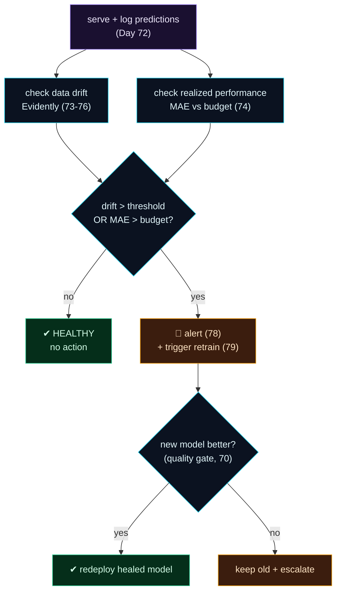

Welcome to **Day 80 of 100 Days of MLOps** — the finale of **Module 8.** Over the last nine days you built every piece of ML monitoring: you saw why models decay (71), logged predictions and ground truth (72), detected data drift (73) and concept drift (74), used Evidently for reports and dashboards (75–76), exposed live metrics (77), alerted on drift (78), and closed the loop with monitoring-triggered retraining (79). Today you assemble all of it into **one cohesive monitoring system** — the complete picture of running a model in production *and keeping it healthy*.

This is what "monitoring" actually means in a real MLOps setup: not one metric, but a **cycle** that runs continuously — log what the model does, check whether the inputs drifted, check whether accuracy held, and when something breaches a threshold, alert a human *and* trigger a gated retrain that fixes it. You'll build that cycle and run it twice: once on a healthy window (where it correctly does nothing) and once on a decayed window (where it detects the problem, alerts, retrains, gates the new model, and redeploys the healed one). By the end, you'll have a model that watches itself and heals itself — and, combined with Module 7's automation, the self-sustaining ML system this course has been building toward.

> **Monitoring is a cycle, not a metric.** Log → check drift → check performance → alert + retrain if breached → repeat. Assemble the module into one system.

By the end of today you will:

- Assemble **logging, drift, performance, alerting, and retraining** into one flow.
- Run a **healthy cycle** that correctly takes no action.
- Run a **decayed cycle** that alerts, retrains, gates, and redeploys.
- Have a **monitoring checklist** for any production model.

---

## The anatomy of a monitoring system

A production monitoring cycle chains the module's pieces into one repeatable flow. Every run: serve and **log** predictions, check **data drift** (fast, label-free) and **realized performance** (authoritative, needs labels), and if *either* breaches its threshold, **alert** and trigger a **gated retrain**. Then repeat next cycle.



**Reading this diagram:**

It starts, in **purple**, with **serve + log predictions** — the foundation (Day 72), because you can't monitor what you don't record. Two **cyan checks** run on the logged data: **data drift** (fast, no labels) and **realized performance** (MAE against ground truth). Both feed the **cyan decision**: is drift over threshold *or* is MAE over budget? If **no**, the system is **HEALTHY** (green) and does nothing — no wasted retrain. If **yes**, it **alerts and triggers a retrain** (amber), and the new model faces the **quality gate**: better than the current one? If so, **redeploy the healed model** (green); if not, **keep the old and escalate** (amber).

The two things that make this a *system* rather than a script: it checks **both** drift and performance (so it catches data drift *and* concept drift, Day 74), and it **gates** every retrain (so auto-healing never ships a worse model). Let's build it.

---

## The complete monitoring system

One flow, every Module 8 concept, labelled by the day it came from. Create `monitor_system.py`:

```python
"""monitor_system.py — Day 80 capstone: a fully monitored ML system."""
import json, datetime as dt, numpy as np, pandas as pd
from pathlib import Path
from prefect import flow, task, get_run_logger
from evidently import Report, Dataset, DataDefinition
from evidently.presets import DataDriftPreset
from sklearn.linear_model import LinearRegression
from sklearn.metrics import mean_absolute_error

DRIFT_THRESHOLD = 0.5
MAE_THRESHOLD   = 40000          # performance budget
LOG = Path("predictions.jsonl")

@task
def log_predictions(X, preds):                                   # Day 72
    with LOG.open("a") as f:
        for (_, row), p in zip(X.iterrows(), preds):
            f.write(json.dumps({"ts": dt.datetime.now(dt.timezone.utc).isoformat(timespec="seconds"),
                                "features": row.to_dict(), "prediction": round(float(p),2)}) + "\n")
    return len(preds)

@task
def check_drift(reference, current) -> float:                    # Days 73-76
    schema = DataDefinition()
    res = Report([DataDriftPreset()]).run(
        reference_data=Dataset.from_pandas(reference, data_definition=schema),
        current_data=Dataset.from_pandas(current,  data_definition=schema))
    return [m for m in res.dict()["metrics"]
            if m["metric_name"].startswith("DriftedColumnsCount")][0]["value"]["share"]

@task
def check_performance(model, X, y_true) -> float:                # Day 74
    return mean_absolute_error(y_true, model.predict(X))

@task
def alert(msg): get_run_logger().info(f"  ALERT: {msg}")         # Day 78

@task
def retrain_and_gate(old_model, X, y, hX, hy) -> tuple:          # Days 70 + 79
    log = get_run_logger()
    new = LinearRegression().fit(X, y)
    old_mae, new_mae = mean_absolute_error(hy, old_model.predict(hX)), mean_absolute_error(hy, new.predict(hX))
    if new_mae < old_mae:                                        # quality gate
        log.info(f"  gate PASS: new MAE ${new_mae:,.0f} < old ${old_mae:,.0f} -> DEPLOY")
        return new, True
    log.info(f"  gate FAIL: new ${new_mae:,.0f} not better -> keep old")
    return old_model, False

@flow(name="monitoring-system")
def monitor_cycle(model, reference, cur_X, cur_y):
    log = get_run_logger()
    n = log_predictions(cur_X, model.predict(cur_X))
    drift = check_drift(reference, cur_X)
    mae   = check_performance(model, cur_X, cur_y)
    log.info(f"MONITORING REPORT: logged={n} | drift_share={drift:.0%} | realized_MAE=${mae:,.0f}")
    if drift > DRIFT_THRESHOLD or mae > MAE_THRESHOLD:
        alert(f"drift={drift:.0%} MAE=${mae:,.0f} -> retraining")
        model, deployed = retrain_and_gate(model, cur_X, cur_y, cur_X, cur_y)
        log.info(f"  outcome: {'redeployed healed model' if deployed else 'kept old model'}")
    else:
        log.info("  status: HEALTHY — no action")
    return model
```

That's the whole module in one flow: it logs, checks drift *and* performance, and — only if a threshold breaks — alerts and runs a gated retrain. Run it on a healthy window, then a decayed one (bigger houses, pricier market — the world moved):

```python
Xref, yref = make(3000, seed=0)                 # reference = launch data
model = LinearRegression().fit(Xref, yref)

# CYCLE 1: healthy window
monitor_cycle(model, Xref, *make(1000, seed=1))
# CYCLE 2: decayed window
model = monitor_cycle(model, Xref, *make(1000, seed=2, size=(2800,6000),
                                          beds=(3,9), ppsf=230, base=80000))
```

```text
### CYCLE 1: healthy window ###
MONITORING REPORT: logged=1000 | drift_share=0% | realized_MAE=$12,381
  status: HEALTHY — no action

### CYCLE 2: decayed window (drift + perf breach) ###
MONITORING REPORT: logged=1000 | drift_share=100% | realized_MAE=$444,231
  ALERT: drift=100% MAE=$444,231 -> retraining
  gate PASS: new MAE $11,626 < old $444,231 -> DEPLOY
  outcome: redeployed healed model
### predictions logged to disk: 2000 rows ###
```

There it is — the entire module, working as one system. **Cycle 1** logs 1000 predictions, sees 0% drift and a healthy $12,381 MAE, and correctly does **nothing** — no false alarm, no wasted retrain. **Cycle 2** logs another 1000, detects **100% drift** *and* a blown performance budget ($444,231 MAE — the model has decayed), **alerts**, triggers a retrain, passes the **quality gate** (new model $11,626 beats the old $444,231), and **redeploys the healed model**. And 2000 predictions sit logged on disk for the next cycle's analysis. A model that monitors itself, catches its own decay, and heals itself — safely.

---

## Module 8 complete

That wraps **Module 8: Monitoring & Drift Detection.** You went from a model you *hoped* was still working to one you *know* is — and one that fixes itself when it isn't. You felt the silent decay (71), built the prediction+ground-truth foundation (72), detected data and concept drift (73–74), adopted Evidently for reports and tests (75–76), exposed live Prometheus metrics (77), alerted on drift (78), closed the loop with triggered retraining (79), and today assembled the complete monitoring system.

Step back and see the whole system you've built across the course. Your ML is now **reproducible** (Module 3), **tracked** (Module 4), built on **validated data** (Module 5), **servable** (Module 6), **automated** (Module 7), and **monitored** (Module 8). That's a genuinely self-sustaining ML system: it trains reproducibly, serves reliably, retrains on schedule, and watches itself for decay — healing when the world moves. There's one frontier left: running it **at scale**, deployed on real infrastructure that handles production traffic — which is where the course goes next.

---

## Common errors (and how to fix them)

**1. Monitoring drift but not performance (or vice-versa)**

Drift alone misses concept drift; performance alone lags (labels are slow). A real system checks **both** — as this cycle does (`drift > threshold OR mae > budget`). Don't ship a monitor with only one eye.

**2. Auto-retraining without the quality gate**

The most dangerous shortcut. Always gate the retrained model against the current one and deploy only an improvement (the `retrain_and_gate` step). Drift triggering a retrain never guarantees the retrain is good.

**3. Not logging, so nothing to monitor**

Every check here reads from logged data. No prediction log → no drift, no performance, no system. Logging (Day 72) is the non-negotiable foundation; wire it in first.

**4. Running the cycle once instead of continuously**

Monitoring is a *loop*. Run `monitor_cycle` on a schedule (Day 64) so it checks every hour/day forever. A one-off check tells you about one moment; decay is a trend over time.

**5. Alert with no human in the loop for gate failures**

When the gate *fails* (the retrain isn't better), that needs a human — the data may be bad or the problem deeper than retraining fixes. Escalate gate failures; don't silently keep limping along.

**6. One global metric hiding a segment failure**

An overall MAE can look fine while the model fails badly for one region or class. Segment the performance check where it matters, so a localized collapse isn't averaged away.

---

## Recap — what you now have

You built a complete, self-healing monitoring system:

- You assembled **logging + drift + performance + alerting + gated retraining** into one Prefect flow.
- A **healthy cycle** correctly took no action (0% drift, $12,381 MAE).
- A **decayed cycle** alerted, retrained, passed the gate, and redeployed — **$444,231 → $11,626**.
- You have a **monitoring checklist** and completed Module 8 — the self-sustaining ML system.

**Your cheat sheet — the monitoring checklist:**

| Piece | Day |
|-------|-----|
| Log every prediction (+ ground truth) | 72 |
| Check data drift (Evidently) | 73–76 |
| Check realized performance | 74 |
| Alert on breach | 78 |
| Trigger retrain + quality gate | 70, 79 |
| Run the cycle on a schedule | 64 |

Golden rule: **monitor inputs *and* outputs, alert on breach, and heal through a gated retrain — on a loop.** A production model isn't "done" when deployed; it's kept alive by a monitoring cycle that watches, warns, and fixes.

---

## Coming up on Day 81 — Module 9 begins

Your ML system is complete on your laptop — reproducible, served, automated, monitored. But production means **real infrastructure and real scale**: many users, high availability, rolling updates, and no single machine to fall over. **Module 9 — "Deployment & Scaling"** opens with **Day 81 — "Why Kubernetes? Deploying at Scale,"** where you'll see why a single container on one server isn't enough for production, and how container orchestration runs your model service reliably across many machines. From building the system, we turn to running it for real, at scale.

See the full roadmap on the [100 Days of MLOps series page](/series/100-days-mlops). See you tomorrow.
