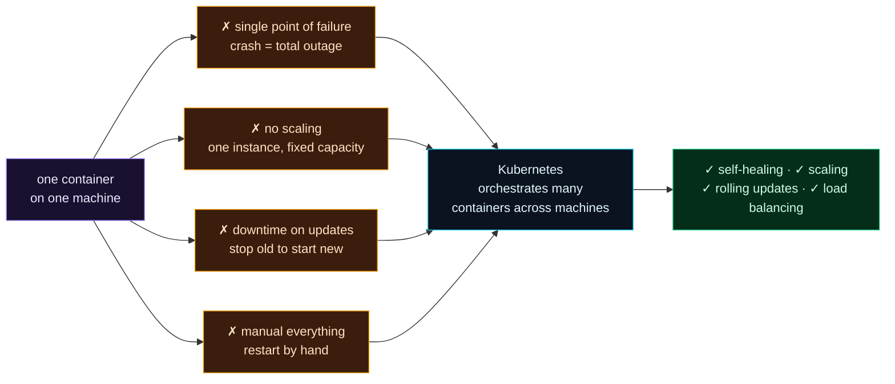

Welcome to **Day 81 of 100 Days of MLOps** — the start of **Module 9: Deployment & Scaling.** You've built an impressive system: a model that's reproducible, tracked, validated, served, automated, and monitored. It runs beautifully in one container on your machine. And that last part — *one container on your machine* — is exactly the problem. It's a demo, not a production deployment. Today, like every "feel the pain" day, you'll see why.

Production isn't one process on one computer. It's **thousands of users**, **zero tolerance for downtime**, and **traffic that spikes** without warning. A single container fails all three tests. When its process crashes — a bug, an out-of-memory kill, the machine rebooting — your *entire service* goes dark, and every user gets an error until a human notices and restarts it. It can't handle more traffic than one instance allows. And deploying a new version means stopping the old one, so every update is an outage. You'll watch that single-container fragility break in front of you, then meet the tool built to fix all of it: **Kubernetes**, the container orchestrator that runs many copies of your service across many machines and keeps them alive automatically.

> **One container is a demo, not a deployment.** Production needs many replicas, self-healing, scaling, and zero-downtime updates — that's orchestration.

By the end of today you will:

- See why a **single container** is a single point of failure.
- Watch a lone service **crash and take everything down**.
- Understand the four things production needs that one container can't give.
- Know what **Kubernetes** does and why this module teaches it.

---

## Watch the single point of failure

The claim is simple: with one instance, one crash is a total outage. Let's prove it. We run a single copy of a model service, confirm it's healthy, then kill the process — exactly what happens when a container OOMs or a node dies — and send one more request. Create `app.py`:

```python
from fastapi import FastAPI
app = FastAPI()

@app.get("/health")
def health(): return {"status": "ok"}

@app.post("/predict")
def predict(): return {"predicted_price": 471358.0}
```

Start one instance, hit it, kill it, hit it again:

```bash
python -m uvicorn app:app --port 8077 &     # ONE instance — the single point of failure
curl http://127.0.0.1:8077/health           # while it's up
kill -9 %1                                   # the process crashes
curl http://127.0.0.1:8077/health           # after the crash
```

```text
=== the one instance is UP ===
{"status":"ok"}  [HTTP 200]
=== the single process crashes (OOM, bug, node dies) ===
=== a user request after the crash ===
  curl: Connection refused — SERVICE DOWN, no failover, every user gets an error
```

There's the whole problem in five lines. While the single process is alive, everything's fine — `{"status":"ok"}`, HTTP 200. But the moment it dies, the very next request gets **connection refused**. There is no second instance to take over, no automatic restart, nothing. Your service is simply *down* — for every user, on every request — until a human notices and manually restarts it. In production, that's minutes-to-hours of outage from a single process dying, and processes die *all the time*: bugs, memory limits, hardware failures, routine reboots. One container means one thing between you and a total outage.

---

## Four things production needs (and one container lacks)

That crash is just the most visible failure. A single container falls short on four fronts, and together they define what production deployment requires:



**Reading this diagram:**

On the left, in **purple**, is **one container on one machine**. Four **amber** failures branch off it: a **single point of failure** (the crash you just saw — one death, total outage), **no scaling** (one instance has fixed capacity; a traffic spike overwhelms it), **downtime on updates** (to deploy v2 you stop v1, so every release is an outage), and **manual everything** (a human restarts, scales, and recovers by hand).

All four flow into the **cyan Kubernetes** node — a system that *orchestrates many containers across many machines* — which produces the **green** wins: **self-healing** (a dead container is replaced automatically), **scaling** (run 3 or 30 replicas, adjust to load), **rolling updates** (deploy v2 gradually with zero downtime), and **load balancing** (spread traffic across all replicas). The takeaway: **every weakness of one container is something orchestration was built to solve.** That's why production ML runs on Kubernetes, and why this module teaches it.

---

## What Kubernetes actually does

**Kubernetes** (often "k8s") is the industry-standard **container orchestrator**. You give it a *declarative* goal — "run 3 copies of this model service, keep them healthy, expose them at this address" — and it makes reality match, continuously. The core promises map exactly onto the four failures above:

- **Self-healing.** k8s constantly checks that the number of running copies matches what you asked for. A container crashes? It starts a new one — automatically, in seconds. The outage you just saw simply doesn't happen.
- **Scaling.** Change one number (`replicas: 3` → `replicas: 30`), or let it scale automatically with traffic, and k8s spreads copies across machines.
- **Rolling updates.** Deploy a new version gradually — a few pods at a time, old ones draining as new ones come up — so users never see downtime, and a bad release can be rolled back.
- **Load balancing & scheduling.** It distributes traffic across all healthy replicas and decides which machine each one runs on, packing them efficiently across a cluster.

Over the next nine days you'll build exactly this for your model service: the core concepts (pods, deployments, services), a real deployment, networking, scaling and autoscaling, zero-downtime rolling updates, config and secrets, health checks, and packaging with Helm — ending in a full production-shaped deployment.

> **A note on running a cluster.** To *practise* Kubernetes locally you'll run a small cluster with **minikube** or **kind** (Kubernetes-in-Docker), or use a managed cloud cluster (GKE, EKS, AKS). Those need a working container runtime and image registry access. Throughout this module we'll write and **validate real Kubernetes manifests** (with tools like `kubeconform`) and give you the exact `kubectl` commands to apply them — so whether you run minikube locally or deploy to the cloud, the YAML is correct and ready.

---

## Common errors (and how to fix them)

**1. "It works in one container, so it's production-ready."**

Running is not the same as *production*. One container has no failover, no scaling, and downtime on every update. "It runs on my machine" is the start of deployment, not the end.

**2. Thinking self-healing means bug-free**

Kubernetes restarts a *crashed* container; it doesn't fix the bug that crashed it. Self-healing buys you availability while you fix the root cause — it's resilience, not a substitute for good code and monitoring (Module 8).

**3. Reaching for Kubernetes for a tiny, single-user service**

k8s solves *scale and availability* problems. If you genuinely have one user and downtime is fine, it's overkill — a single container or a simple platform is fine. Match the tool to the need; this module assumes you're heading for production scale.

**4. Confusing Docker with Kubernetes**

Docker *builds and runs* a container (Day 54); Kubernetes *orchestrates many* containers across machines. You need both — k8s runs your Docker images. They're layers, not alternatives.

**5. Manually restarting containers in production**

If your recovery plan is "SSH in and restart it," you don't have a production deployment. The whole point of orchestration is that recovery, scaling, and updates are *automatic and declarative* — not a human at 3am.

**6. Deploying updates by stopping the old version**

Stop-then-start means downtime on every release. Production uses **rolling updates** (Day 86) so new and old versions overlap and users never see an outage. Never take the service down to deploy.

---

## Recap — what you now have

You've felt why one container isn't enough:

- You watched a **single instance crash** and take the whole service down — connection refused, no failover.
- You know the **four failures** of one container: single point of failure, no scaling, downtime on updates, manual everything.
- You understand what **Kubernetes** provides: self-healing, scaling, rolling updates, load balancing.
- You know this module builds a **real production deployment** on validated manifests.

**Your cheat sheet:**

| One container | Kubernetes |
|---------------|------------|
| crash = total outage | self-healing (auto-restart) |
| fixed capacity | scaling / autoscaling |
| downtime on update | rolling updates |
| restart by hand | declarative, automatic |
| one machine | scheduled across a cluster |

Golden rule: **one container is a demo; production needs orchestration.** A single process is one crash away from total outage — Kubernetes runs many replicas across many machines and keeps them alive, scaled, and updated automatically.

---

## Coming up on Day 82

Kubernetes has a vocabulary you need before you can deploy anything. **Day 82 — "Kubernetes Core Concepts"** introduces the building blocks: **pods** (the smallest unit — one or more containers), **deployments** (which keep a set of identical pods running and healing), and **services** (a stable address in front of ever-changing pods), plus **`kubectl`**, the command-line tool you drive it all with, and the *declarative* model that makes k8s work. You'll write and validate your first real manifests — the nouns you'll compose for the rest of the module.

See the full roadmap on the [100 Days of MLOps series page](/series/100-days-mlops). See you tomorrow.
