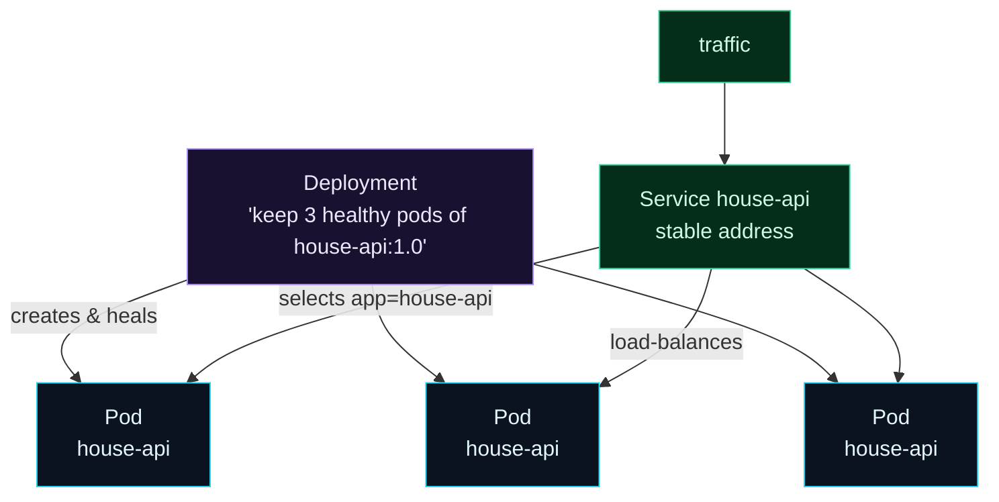

Welcome to **Day 82 of 100 Days of MLOps**. Yesterday you saw *why* you need Kubernetes; today you learn its language. Kubernetes has a reputation for being overwhelming, but almost all of it rests on three nouns and one idea. Learn **pods**, **deployments**, and **services**, plus the **declarative model**, and the rest of the module — scaling, updates, config, health checks — is just adding detail to these foundations.

Here's the whole mental model in one sentence: a **deployment** keeps a set of identical **pods** running and healthy, and a **service** gives them one stable address to be reached at. That's it. A pod is where your container actually runs; a deployment is the manager that guarantees "always keep N healthy copies alive" (that's your self-healing and scaling from yesterday); and a service is the stable front door, because individual pods are born and die constantly and their addresses change. You drive all of it with **`kubectl`**, and you describe what you want in **YAML manifests** that Kubernetes continuously works to make real. Today you'll write and validate your first manifests for these three objects — the nouns you'll use every day from here on.

> **Three nouns run Kubernetes.** A deployment keeps identical pods alive; a service is their stable address; you declare all of it in YAML.

By the end of today you will:

- Understand **pods**, **deployments**, and **services** and how they relate.
- Grasp the **declarative model** — you describe desired state, k8s reconciles.
- Write real manifests and **validate them** against the Kubernetes schemas.
- Know the essential **`kubectl`** commands.

---

## The three objects, and how they fit

The three objects stack. Your container runs in a **pod**. A **deployment** manages many identical pods (creating, replacing, scaling them). A **service** sits in front and routes traffic to whichever pods are currently alive, found by their **labels**.



**Reading this diagram:**

At the top, in **purple**, is the **Deployment** — your statement of intent: "keep 3 healthy pods running `house-api:1.0`." It **creates and heals** the three **cyan Pods** below it; if one dies, the deployment makes a new one (yesterday's self-healing). On the left, the **green Service** is the stable front door: it **selects** pods by their label (`app=house-api`) and **load-balances** incoming **traffic** across whichever pods are currently alive.

The crucial insight is the *separation of concerns*: the **deployment** worries about *how many* healthy pods exist, and the **service** worries about *how to reach them* — connected only by a **label**. Pods come and go (they're cattle, not pets), but the service's address never changes, so clients always have a stable target. That decoupling — via labels — is the core of how Kubernetes works. Let's write each object.

---

## The declarative model

Before the YAML, the one big idea: Kubernetes is **declarative.** You don't tell it *how* to do things step by step ("start a container, now another…"). You describe the **desired state** — "I want 3 pods of this image" — in a manifest, and Kubernetes' controllers *continuously reconcile* reality to match. If a pod dies and you're down to 2, the deployment controller notices the gap and creates a third, *without you asking*. You declare the destination; k8s drives there and keeps you there.

This is why you'll spend this module writing **YAML manifests** and running `kubectl apply -f`, not typing imperative commands. The manifest is the source of truth; apply it, and k8s makes it so.

---

## Write the three manifests

**A Pod** — the smallest unit, one container here. (You rarely create bare pods in production — deployments make them for you — but it's the foundation.) `pod.yaml`:

```yaml
apiVersion: v1
kind: Pod
metadata:
  name: house-api
  labels:
    app: house-api
spec:
  containers:
    - name: house-api
      image: house-api:1.0
      ports:
        - containerPort: 8000
```

**A Deployment** — the workhorse. It wraps a pod *template* and a `replicas` count, and guarantees that many healthy pods exist. `deployment.yaml`:

```yaml
apiVersion: apps/v1
kind: Deployment
metadata:
  name: house-api
  labels:
    app: house-api
spec:
  replicas: 3                    # keep 3 identical pods alive
  selector:
    matchLabels:
      app: house-api             # this deployment manages pods with this label
  template:                      # the pod blueprint the deployment stamps out
    metadata:
      labels:
        app: house-api
    spec:
      containers:
        - name: house-api
          image: house-api:1.0
          ports:
            - containerPort: 8000
```

**A Service** — a stable address that load-balances across pods matching a label. `service.yaml`:

```yaml
apiVersion: v1
kind: Service
metadata:
  name: house-api
spec:
  selector:
    app: house-api              # route to pods with this label
  ports:
    - port: 80                  # the service's port
      targetPort: 8000          # the container's port
```

Notice the thread tying them together: the label **`app: house-api`**. The deployment stamps it onto every pod it creates; the service selects pods *by* it. That label is the glue.

---

## Validate the manifests

You don't need a running cluster to check a manifest is correct — **`kubeconform`** validates YAML against the real Kubernetes API schemas, offline. Catching a typo or a wrong field here saves a failed deploy later:

```bash
kubeconform -summary -verbose pod.yaml deployment.yaml service.yaml
```

```text
service.yaml - Service house-api is valid
deployment.yaml - Deployment house-api is valid
pod.yaml - Pod house-api is valid
Summary: 3 resources found in 3 files - Valid: 3, Invalid: 0, Errors: 0, Skipped: 0
```

All three **valid** — checked against the actual Kubernetes schemas. This is the habit to build: validate manifests *before* applying them, in CI or locally, so structural mistakes never reach the cluster. It's the Kubernetes equivalent of the linting and schema checks you've used all series.

---

## Driving it with kubectl

`kubectl` is the command-line tool you use to talk to a cluster. The handful you'll use constantly:

| Command | Does |
|---------|------|
| `kubectl apply -f deployment.yaml` | create/update from a manifest (declarative) |
| `kubectl get pods` | list pods and their status |
| `kubectl get deployments,services` | list deployments and services |
| `kubectl describe pod <name>` | detailed state + events (debugging) |
| `kubectl logs <pod>` | a pod's container logs |
| `kubectl delete -f deployment.yaml` | remove what a manifest created |

Applying the deployment and listing pods on a real cluster looks like this — three pods, because you asked for three:

```text
$ kubectl apply -f deployment.yaml
deployment.apps/house-api created

$ kubectl get pods
NAME                         READY   STATUS    RESTARTS   AGE
house-api-7d9c8f6b4b-2xq7p   1/1     Running   0          20s
house-api-7d9c8f6b4b-8fjkl   1/1     Running   0          20s
house-api-7d9c8f6b4b-vp4rn   1/1     Running   0          20s
```

You declared `replicas: 3`; the deployment created three pods and will keep exactly three running — kill one and a fourth appears in seconds. (To run this yourself, start a local cluster with **minikube** or **kind**, or use a cloud cluster, then `kubectl apply` the manifests above.)

---

## Common errors (and how to fix them)

**1. Creating bare pods instead of deployments**

A lone pod has no self-healing — delete it and it's *gone*, no replacement (yesterday's outage). Almost always create a **Deployment**, which keeps pods alive and lets you scale. Bare pods are for one-off debugging only.

**2. Mismatched labels between selector and template**

A deployment's `selector.matchLabels` must match its pod `template` labels, and a service's `selector` must match the pods' labels. A typo here means the deployment manages nothing, or the service routes to nothing (and no error until traffic fails). Keep the labels identical.

**3. Confusing `port` and `targetPort` in a Service**

`port` is the service's own port; `targetPort` is the *container's* port it forwards to. Swap them and traffic goes nowhere. Here `port: 80` → `targetPort: 8000` (the container listens on 8000).

**4. Editing live objects instead of the manifest**

If you `kubectl edit` a live object, your YAML file is now out of date, and the next `apply` reverts your change (or conflicts). Treat the **manifest as the source of truth** — change the file, then `apply`. (Declarative, not imperative.)

**5. Forgetting the container port matters**

`containerPort` documents what your app listens on, and `targetPort` must match it. If your FastAPI app serves on 8000, both must say 8000, or the service can't reach it.

**6. Skipping manifest validation**

A misindented or misspelled field can fail a deploy in confusing ways. Run `kubeconform` (or `kubectl apply --dry-run`) *before* applying — catch structural errors offline, not on the cluster.

---

## Recap — what you now have

You know the vocabulary of Kubernetes:

- **Pods** run your container; **deployments** keep N identical pods healthy; **services** are a stable, load-balanced address in front of them.
- You understand the **declarative model** — describe desired state, k8s reconciles continuously.
- You wrote all three manifests and **validated them** (3 valid) with `kubeconform`.
- You know the essential **`kubectl`** commands to apply and inspect them.

**Your cheat sheet:**

| Object | Role |
|--------|------|
| Pod | smallest unit — runs your container(s) |
| Deployment | keeps N identical pods alive + heals + scales |
| Service | stable address, load-balances across pods |
| label/selector | the glue connecting them |
| `kubectl apply -f` | declare desired state |
| `kubeconform` | validate manifests offline |

Golden rule: **a deployment keeps pods alive; a service gives them a stable address; you declare it all in YAML.** Learn these three nouns and the label that links them, and the rest of Kubernetes is detail.

---

## Coming up on Day 83

Now you'll deploy for real. **Day 83 — "Deploying Your Model Service"** takes your FastAPI house-price API, wraps it in a proper Deployment manifest, and walks through getting it running on a cluster: applying the manifest, watching the pods come up, checking their logs, and confirming the model is serving. It's the moment your model goes from "a container on my laptop" to "a managed workload on Kubernetes" — the first real step of production deployment.

See the full roadmap on the [100 Days of MLOps series page](/series/100-days-mlops). See you tomorrow.
