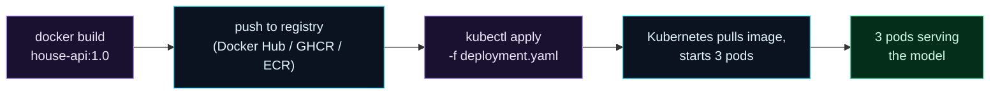

Welcome to **Day 83 of 100 Days of MLOps**. You know the vocabulary; now you deploy. Today your house-price model service makes the jump from "a container that runs on my machine" to "a managed workload on Kubernetes" — three replicas, self-healing, ready to sit behind a load balancer. It's the concrete first step of everything Module 9 is about.

The path has three stages, and you've already done the first. Your FastAPI app is containerised (Day 54) — that's your **image**. In production, that image lives in a **registry** (Docker Hub, GHCR, ECR) where the cluster can pull it. Then a **Deployment manifest** tells Kubernetes "run three copies of this image and keep them healthy," and `kubectl apply` makes it real. Today you'll write that deployment for the actual model service, validate it against the Kubernetes schemas, and walk the full `kubectl` workflow — apply it, watch the pods come up, read their logs, and reach the model to confirm it's serving. By the end, your model is a proper Kubernetes workload.

> **Image in a registry → Deployment manifest → pods serving the model.** That's the path from container to cluster, and `kubectl apply` walks it.

By the end of today you will:

- Understand the **image → registry → deployment** path.
- Write a **Deployment manifest** for the real model service.
- **Validate** it and know the `kubectl` deploy workflow.
- Reach the model on the cluster with **`kubectl port-forward`**.

---

## From image to running pods

Deploying a model service to Kubernetes is a pipeline. You **build** the image (Docker), **push** it to a registry the cluster can read, and **apply** a deployment that tells k8s to pull that image and run N copies.



**Reading this diagram:**

Left to right: **`docker build`** (purple) produces your `house-api:1.0` **image** — the FastAPI app plus the model, from Day 54. You **push** it to a **registry** (cyan), because the cluster can't see your laptop's local images — it pulls from a registry both can reach. Then **`kubectl apply`** (purple) submits the deployment, and **Kubernetes pulls the image and starts 3 pods** (cyan). The result: **3 pods serving the model** (green), load-balanced, self-healing.

The one step beginners miss is the **registry**: Kubernetes nodes are (usually) different machines from your laptop, so "it's built locally" isn't enough — the image must be somewhere the cluster can pull it. (For a *local* cluster like kind/minikube there are shortcuts to load a local image, noted below.) With that mental model, let's write the deployment.

---

## The deployment manifest

This is yesterday's Deployment, fleshed out for the real service: three replicas of the `house-api` image, the container port, and an environment variable pointing at the model file. `deployment.yaml`:

```yaml
apiVersion: apps/v1
kind: Deployment
metadata:
  name: house-api
  labels:
    app: house-api
spec:
  replicas: 3
  selector:
    matchLabels:
      app: house-api
  template:
    metadata:
      labels:
        app: house-api
        version: "1.0"
    spec:
      containers:
        - name: house-api
          image: house-api:1.0
          imagePullPolicy: IfNotPresent
          ports:
            - containerPort: 8000
          env:
            - name: MODEL_PATH
              value: "/app/model.joblib"
```

Two additions worth noting. **`imagePullPolicy: IfNotPresent`** tells k8s to use a locally-present image if it has one (handy for local clusters where you've loaded the image directly, rather than always pulling from a registry). And **`env`** injects configuration — here the model's path — into the container; the app reads it with `os.environ["MODEL_PATH"]`. (Real config and secrets get their own treatment on Day 87.) The image itself is your Day 54 container — a `python:3.12-slim` base with the app, `requirements.txt`, and `model.joblib`, running `uvicorn app:app`.

Validate it before applying:

```bash
kubeconform -summary -verbose deployment.yaml
```

```text
deployment.yaml - Deployment house-api is valid
Summary: 1 resource found in 1 file - Valid: 1, Invalid: 0, Errors: 0, Skipped: 0
```

Valid against the real Kubernetes schema — safe to apply.

---

## Deploy it: the kubectl workflow

With a cluster running (minikube/kind locally, or a cloud cluster) and the image available to it, deploying is one command — then you watch it happen:

```bash
kubectl apply -f deployment.yaml     # declare desired state
kubectl get pods                     # watch the pods come up
kubectl logs <pod-name>              # check a pod's logs
```

On the cluster you'll see the three pods appear and become `Running`:

```text
$ kubectl apply -f deployment.yaml
deployment.apps/house-api created

$ kubectl get pods
NAME                         READY   STATUS    RESTARTS   AGE
house-api-6b4c9d8f7c-4mn2p   1/1     Running   0          15s
house-api-6b4c9d8f7c-lk9qr   1/1     Running   0          15s
house-api-6b4c9d8f7c-zx7tw   1/1     Running   0          15s

$ kubectl logs house-api-6b4c9d8f7c-4mn2p
INFO:     Uvicorn running on http://0.0.0.0:8000 (Press CTRL+C to quit)
INFO:     Application startup complete.
```

Three pods, all `Running`, each an independent copy of your model service — and the deployment will keep exactly three alive. Delete one (`kubectl delete pod <name>`) and watch a replacement spin up in seconds: that's the self-healing from Day 81, now protecting your model.

---

## Reach the model with port-forward

The pods are running, but how do you *test* one before wiring up real networking (Day 84)? **`kubectl port-forward`** tunnels a local port straight to a pod (or service), so you can hit it from your laptop:

```bash
kubectl port-forward deployment/house-api 8000:8000
```

Now `localhost:8000` reaches the deployment, and you can send a real request:

```bash
curl -X POST http://localhost:8000/predict \
  -H "Content-Type: application/json" \
  -d '{"size_sqft":2000,"bedrooms":4,"age_years":5,"neighborhood":"downtown"}'
```

```text
{"predicted_price":471358.3,"currency":"USD"}
```

There it is — your model, running in a Kubernetes pod, returning the canonical prediction. `port-forward` is a **debugging** tool (one developer, one pod); real traffic goes through a **Service** (tomorrow). But it's the quickest way to confirm a fresh deployment actually serves.

> **Running a local cluster.** To do this yourself: start **minikube** (`minikube start`) or **kind** (`kind create cluster`), make your image available (`minikube image load house-api:1.0` or `kind load docker-image house-api:1.0`), then `kubectl apply -f deployment.yaml`. On a cloud cluster (GKE/EKS/AKS) you push the image to that cloud's registry and apply the same manifest — the YAML is identical.

---

## Common errors (and how to fix them)

**1. `ErrImagePull` / `ImagePullBackOff`**

The cluster can't get the image. Either it's not in a registry the cluster can reach, the name/tag is wrong, or (local cluster) you didn't load it in. Push to an accessible registry, or `minikube image load` / `kind load docker-image` for local clusters.

**2. Assuming the cluster can see your local image**

Your laptop's `docker images` are invisible to a remote cluster. The image must be in a registry (or explicitly loaded into a local cluster). "It's built locally" is not the same as "the cluster can pull it."

**3. `CrashLoopBackOff` — the pod keeps restarting**

The container starts and immediately exits/errors, so k8s restarts it, repeatedly. Check `kubectl logs <pod>` — usually a missing model file, a bad `MODEL_PATH`, or a crash on startup. Fix the app/image, not the manifest.

**4. Wrong `containerPort`**

If your app serves on 8000 but the manifest says 80, nothing can reach it. `containerPort` must match the port uvicorn actually binds. Keep them in sync.

**5. Treating `port-forward` as production access**

`port-forward` is a single-user debug tunnel — it dies when you close the terminal and doesn't load-balance. It's for testing a pod, not serving users. Real traffic needs a **Service** (Day 84).

**6. Baking the model into the image vs mounting it**

For a small, versioned model, baking it into the image (as here) is simple and reproducible. For large or frequently-updated models, you'd mount it from a volume or object store instead. Choose deliberately; don't accidentally ship a stale model inside an old image.

---

## Recap — what you now have

Your model is a Kubernetes workload:

- You understand the **image → registry → deployment** path, and why the registry matters.
- You wrote and **validated** a real Deployment manifest for the model service (Valid: 1).
- You know the **`kubectl` workflow**: `apply`, `get pods`, `logs`.
- You reached the running model with **`kubectl port-forward`** and got the canonical prediction.

**Your cheat sheet:**

| Step | Command |
|------|---------|
| Build image | `docker build -t house-api:1.0 .` |
| Load into local cluster | `minikube image load house-api:1.0` / `kind load docker-image ...` |
| Validate manifest | `kubeconform deployment.yaml` |
| Deploy | `kubectl apply -f deployment.yaml` |
| Watch pods | `kubectl get pods` |
| Debug a pod | `kubectl logs <pod>` |
| Test a pod | `kubectl port-forward deployment/house-api 8000:8000` |

Golden rule: **push the image where the cluster can pull it, then `apply` a Deployment.** Three self-healing pods serve your model; `port-forward` confirms it works before you wire up real networking.

---

## Coming up on Day 84

Your pods are running, but `port-forward` is a debug hack — real users can't reach them that way, and pods come and go with changing addresses. **Day 84 — "Services & Networking"** gives your deployment a proper front door: a **Service** that provides one stable address and load-balances across all your pods. You'll learn the service types — **ClusterIP** (internal), **NodePort**, and **LoadBalancer** (external) — and how traffic actually flows from a user to a pod. It's how your model becomes reachable, reliably, by the outside world.

See the full roadmap on the [100 Days of MLOps series page](/series/100-days-mlops). See you tomorrow.
