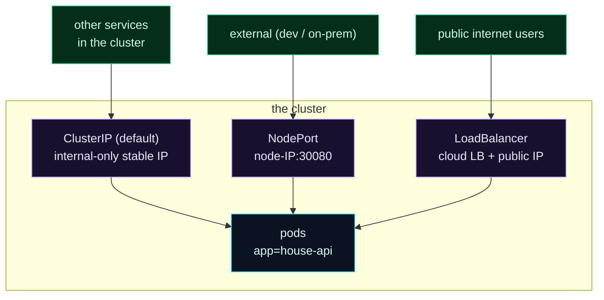

Welcome to **Day 84 of 100 Days of MLOps**. Your model runs in three pods — but there's a problem you glossed over yesterday with `port-forward`: **pods are ephemeral.** They die, get rescheduled, scale up and down, and every time, they come back with a *new IP address*. If a client had to talk to a pod directly, it would lose its target constantly. So how does anyone reliably reach your model? The answer is the third core object: a **Service**.

A Service is a **stable front door** for a set of pods. It gets a fixed virtual IP and a DNS name that *never change*, and it load-balances every request across whichever pods are currently alive (found by their label). Pods churn underneath; the Service's address stays put. That stability is what makes a Kubernetes deployment actually *usable*. But "reachable" has degrees — reachable by other services *inside* the cluster is different from reachable by users on the *internet* — and that's what the three **service types** are for. Today you'll write and validate a Service of each type and trace exactly how a request finds a healthy pod.

> **A Service is a stable address for ever-changing pods.** Fixed IP, fixed DNS name, load-balanced across live pods — the front door your model needs.

By the end of today you will:

- Understand why pods need a **Service** in front of them.
- Know the three types: **ClusterIP**, **NodePort**, **LoadBalancer**.
- Write and **validate** a manifest for each.
- Trace how a request **flows** from user to pod.

---

## Three levels of reachability

The three service types are really three answers to "who needs to reach this?" — escalating from internal-only to fully public.



**Reading this diagram:**

All three **purple** service types point at the same **cyan pods** (`app=house-api`) — they differ only in *who can reach them*. **ClusterIP** (the default) is **internal-only**: other services in the cluster can reach it (green, left), but nothing outside can. **NodePort** opens a fixed port on every node's IP, so **external clients** (dev/on-prem) can reach it crudely. **LoadBalancer** asks the cloud to provision a real external load balancer with a **public IP**, so **internet users** reach your model properly.

The pattern is *escalating exposure*: ClusterIP for service-to-service traffic inside the cluster, NodePort for basic external access (mostly dev), LoadBalancer for production public traffic. All three do the same core job — a stable address that load-balances across live pods — they just differ in reach. Let's write each.

---

## ClusterIP — the internal default

**ClusterIP** is the default. It gives your pods a stable *internal* IP and DNS name (`house-api.default.svc.cluster.local`), reachable only from inside the cluster — perfect for a model service that other internal services call. `clusterip.yaml`:

```yaml
apiVersion: v1
kind: Service
metadata:
  name: house-api
spec:
  type: ClusterIP            # default: internal-only, stable in-cluster address
  selector:
    app: house-api
  ports:
    - port: 80               # the service's port
      targetPort: 8000       # the pods' container port
```

Any pod in the cluster can now reach your model at `http://house-api:80` — a name that never changes, no matter how the pods churn.

## NodePort — basic external access

**NodePort** opens a static port (30000–32767) on *every node*, forwarding to your pods. Reach it at `<any-node-IP>:30080`. It's simple but crude — high ports, node IPs to track — so it's mostly for local clusters and on-prem dev. `nodeport.yaml`:

```yaml
apiVersion: v1
kind: Service
metadata:
  name: house-api-nodeport
spec:
  type: NodePort            # exposes on each node's IP at a static port
  selector:
    app: house-api
  ports:
    - port: 80
      targetPort: 8000
      nodePort: 30080        # the external port on every node
```

## LoadBalancer — production external access

**LoadBalancer** asks your cloud (GKE/EKS/AKS) to provision a real external load balancer with a **public IP** in front of your pods — the standard way to expose a service to the internet. `loadbalancer.yaml`:

```yaml
apiVersion: v1
kind: Service
metadata:
  name: house-api-lb
spec:
  type: LoadBalancer       # cloud provisions an external load balancer + public IP
  selector:
    app: house-api
  ports:
    - port: 80
      targetPort: 8000
```

Validate all three at once:

```bash
kubeconform -summary -verbose clusterip.yaml nodeport.yaml loadbalancer.yaml
```

```text
nodeport.yaml - Service house-api-nodeport is valid
loadbalancer.yaml - Service house-api-lb is valid
clusterip.yaml - Service house-api is valid
Summary: 3 resources found in 3 files - Valid: 3, Invalid: 0, Errors: 0, Skipped: 0
```

All three valid. Apply a LoadBalancer on a cloud cluster and it gets an external IP:

```text
$ kubectl get svc house-api-lb
NAME           TYPE           CLUSTER-IP     EXTERNAL-IP     PORT(S)        AGE
house-api-lb   LoadBalancer   10.96.144.7    34.121.55.10    80:31234/TCP   60s
```

That `EXTERNAL-IP` is your model's public address — users hit `34.121.55.10`, and the service load-balances them across your three healthy pods.

---

## How a request flows to a pod

Trace a single prediction request through the Service, because it explains *why* pods can churn freely:

1. A request arrives at the Service's stable address (ClusterIP, node port, or the cloud LB's public IP).
2. The Service knows which pods are currently alive — it maintains a live list of pod IPs (**Endpoints**) that match its **selector** (`app: house-api`).
3. It **load-balances** the request to one healthy pod (spreading load, skipping dead ones).
4. That pod runs your model and returns the prediction.

The magic is step 2: when a pod dies and a new one takes its place (with a new IP), the Service's Endpoint list updates *automatically*. Clients keep using the same stable Service address and never know pods changed underneath. That's the decoupling that makes self-healing and scaling invisible to callers.

> **And for HTTP routing — Ingress.** A LoadBalancer per service gets expensive and gives you one raw IP each. In production, an **Ingress** (with an ingress controller) sits in front as a single entry point that routes by hostname/path — `api.example.com/predict` → your service — with one load balancer for many services, plus TLS. Services are the foundation; Ingress is the L7 HTTP router you add on top when you have several services to expose.

---

## Common errors (and how to fix them)

**1. Service selector doesn't match pod labels**

If the Service's `selector` doesn't match the pods' labels, its Endpoint list is *empty* and requests go nowhere — with no obvious error. Check `kubectl get endpoints <service>`; if it's empty, your selector/labels are mismatched.

**2. Swapping `port` and `targetPort`**

`port` is what clients hit on the Service; `targetPort` is the pods' container port. Reversed, traffic can't reach the app. Here `port: 80` (service) → `targetPort: 8000` (container).

**3. Using NodePort for production**

NodePort exposes high ports on node IPs — fragile, ugly, and tied to node addresses. It's fine for local/dev clusters, but for production external traffic use **LoadBalancer** (or Ingress). Don't ship NodePort to users.

**4. Expecting a LoadBalancer IP without a cloud provider**

`type: LoadBalancer` needs a cloud (or MetalLB on-prem) to provision the external LB. On a bare local cluster the `EXTERNAL-IP` stays `<pending>` forever. Use NodePort or `minikube tunnel` locally; LoadBalancer in the cloud.

**5. Relying on `port-forward` instead of a Service**

`port-forward` is a personal debug tunnel, not a network path for users. Real traffic must go through a Service. If your "deployment" only works via port-forward, it isn't actually exposed.

**6. Hardcoding pod IPs anywhere**

Pod IPs change constantly — never hardcode one. Always talk to the *Service* name/IP, which is stable. Hardcoding a pod IP guarantees breakage the moment that pod is replaced.

---

## Recap — what you now have

Your model has a stable, load-balanced front door:

- You know why **pods need a Service** — they're ephemeral with changing IPs.
- You can write **ClusterIP** (internal), **NodePort** (basic external), and **LoadBalancer** (public) services — and validated all three.
- You traced how a request **flows** from address → selector → Endpoints → a live pod.
- You know **Ingress** is the L7 HTTP router you add for multiple services.

**Your cheat sheet:**

| Type | Reach | Use for |
|------|-------|---------|
| ClusterIP | internal only | service-to-service (default) |
| NodePort | node-IP:30080 | dev / on-prem external |
| LoadBalancer | cloud public IP | production external traffic |
| Ingress | hostname/path routing | many services, one entry + TLS |

Golden rule: **never talk to pods directly — talk to a Service.** It gives ever-changing pods one stable address and load-balances across the live ones; pick the type by who needs to reach your model.

---

## Coming up on Day 85

Your model is deployed and reachable — now make it handle real load. **Day 85 — "Scaling & Autoscaling"** shows you how to run more copies of your model on demand: scale the replica count by hand with one command, then set up a **HorizontalPodAutoscaler** that adds and removes pods *automatically* based on CPU (or custom metrics), so your service grows to meet a traffic spike and shrinks when it passes — the elasticity that a single container could never give you.

See the full roadmap on the [100 Days of MLOps series page](/series/100-days-mlops). See you tomorrow.
