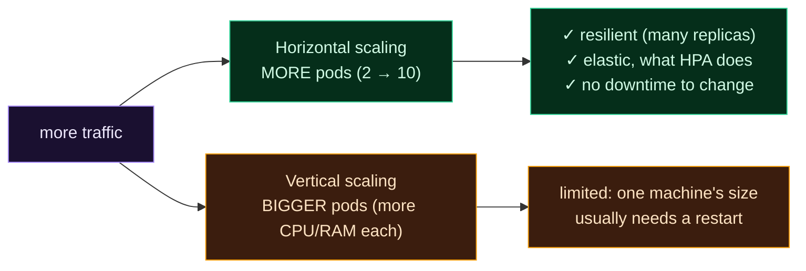

Welcome to **Day 85 of 100 Days of MLOps**. Your model is deployed behind a stable Service — now make it handle *real* load. Traffic isn't constant: a product launch, a marketing email, or a busy Monday morning can 10× your requests in minutes, and a quiet weekend can drop them to a trickle. A fixed number of pods is wrong both ways — too few and you fall over under the spike; too many and you burn money serving nobody. The answer is **scaling**, and Kubernetes makes it a first-class feature.

There are two ways to scale, and you'll use both. **Manual scaling** is one command — `kubectl scale ... --replicas=5` — when you *know* a spike is coming (a scheduled launch). **Autoscaling** is the powerful one: a **HorizontalPodAutoscaler** watches a metric (usually CPU) and adds or removes pods *automatically*, growing your fleet as traffic climbs and shrinking it as traffic falls, all without you watching. That elasticity — right-sized capacity at every moment — is exactly what a single container could never do. Today you'll scale by hand, then write and validate an HPA that does it for you.

> **Match capacity to load, automatically.** Scale up for the spike, down for the lull — a HorizontalPodAutoscaler adjusts your pod count on its own.

By the end of today you will:

- Scale a deployment **manually** with one command.
- Understand **horizontal vs vertical** scaling.
- Write and validate a **HorizontalPodAutoscaler**.
- Know why HPA needs **resource requests** and a metrics source.

---

## Manual scaling: one number

Scaling horizontally means *more pods*, and with a deployment it's trivial — change the replica count. Two ways: imperatively for a quick change, or declaratively by editing the manifest (the source of truth):

```bash
kubectl scale deployment house-api --replicas=5      # quick, imperative
# or: set replicas: 5 in deployment.yaml, then
kubectl apply -f deployment.yaml                     # declarative (preferred)
```

```text
$ kubectl scale deployment house-api --replicas=5
deployment.apps/house-api scaled

$ kubectl get pods
NAME                         READY   STATUS    RESTARTS   AGE
house-api-6b4c9d8f7c-4mn2p   1/1     Running   0          5m
house-api-6b4c9d8f7c-lk9qr   1/1     Running   0          5m
house-api-6b4c9d8f7c-zx7tw   1/1     Running   0          5m
house-api-6b4c9d8f7c-pw2vk   1/1     Running   0          10s
house-api-6b4c9d8f7c-hd8sm   1/1     Running   0          10s
```

Two new pods appear in seconds, and the Service (Day 84) starts load-balancing across all five automatically — no client change. That's manual scaling: perfect when you *know* load is coming. But you won't always be watching at 2am when it spikes, which is where autoscaling comes in.

---

## Horizontal vs vertical

Two ways to add capacity, and Kubernetes strongly favours one:



**Reading this diagram:**

When **traffic rises** (purple), you can scale two ways. **Horizontal** (green) means *more pods* — go from 2 to 10 copies — which is **resilient** (many replicas, no single point of failure), **elastic** (add/remove freely), and needs **no downtime**. **Vertical** (amber) means *bigger pods* — more CPU/RAM each — which is **limited** by a single machine's size and usually needs a restart to change.

Kubernetes is built for **horizontal** scaling: cheap, resilient, elastic replicas behind a load-balancing Service. That's what the HorizontalPodAutoscaler automates — and why "scale" in k8s almost always means "add pods," not "grow pods." Let's automate it.

---

## The HorizontalPodAutoscaler

An **HPA** watches a metric across your pods and adjusts the replica count to keep that metric near a target. The classic setup: keep average CPU around 70%, between 2 and 10 pods. `hpa.yaml`:

```yaml
apiVersion: autoscaling/v2
kind: HorizontalPodAutoscaler
metadata:
  name: house-api
spec:
  scaleTargetRef:
    apiVersion: apps/v1
    kind: Deployment
    name: house-api            # which deployment to scale
  minReplicas: 2
  maxReplicas: 10
  metrics:
    - type: Resource
      resource:
        name: cpu
        target:
          type: Utilization
          averageUtilization: 70    # add pods when avg CPU > 70%
```

The critical catch: **HPA can only compute "70% CPU" if it knows what 100% is** — so the target deployment *must* declare CPU **requests**. Without them, the HPA has no baseline and won't scale. So the deployment needs:

```yaml
      containers:
        - name: house-api
          image: house-api:1.0
          resources:
            requests:
              cpu: "250m"          # HPA computes utilization against this
              memory: "256Mi"
```

Validate both:

```bash
kubeconform -summary -verbose hpa.yaml deployment-with-requests.yaml
```

```text
hpa.yaml - HorizontalPodAutoscaler house-api is valid
deployment-with-requests.yaml - Deployment house-api is valid
Summary: 2 resources found in 2 files - Valid: 2, Invalid: 0, Errors: 0, Skipped: 0
```

Apply the HPA and it starts managing your replica count:

```text
$ kubectl apply -f hpa.yaml
horizontalpodautoscaler.autoscaling/house-api created

$ kubectl get hpa
NAME        REFERENCE              TARGETS       MINPODS  MAXPODS  REPLICAS
house-api   Deployment/house-api  35%/70%       2        10       2

# ... a traffic spike drives CPU up ...
$ kubectl get hpa
NAME        REFERENCE              TARGETS       MINPODS  MAXPODS  REPLICAS
house-api   Deployment/house-api  180%/70%      2        10       6
```

Watch what happened: at 35% CPU it holds at the minimum 2 pods; when a spike pushes average CPU to 180% (well over the 70% target), the HPA scales *up* to 6 pods to bring utilization back down. When the spike passes and CPU falls, it scales back toward 2. Your model fleet now breathes with the traffic — automatically.

---

## How the autoscaling loop works

The HPA runs a simple control loop, roughly every 15 seconds:

1. **Observe** the metric (average CPU across the pods), read from the cluster's **metrics-server**.
2. **Compare** to the target (70%).
3. **Compute** the desired replicas: if utilization is double the target, roughly double the pods (bounded by min/max).
4. **Adjust** the deployment's replica count; new pods start, the Service load-balances to them.

Two prerequisites make this work, and their absence is the usual reason "my HPA doesn't scale": the deployment must declare **resource requests** (so utilization is meaningful), and the cluster must run a **metrics-server** (so the HPA can read CPU). On cloud clusters metrics-server is usually built in; on minikube you enable it (`minikube addons enable metrics-server`). Beyond CPU, HPAs can scale on memory or **custom metrics** — including your Prometheus metrics from Day 77, like requests-per-second or queue depth — which is often a better signal for an ML service than CPU alone.

---

## Common errors (and how to fix them)

**1. HPA with no resource requests on the deployment**

The most common failure. Without `resources.requests.cpu`, the HPA can't compute a utilization percentage and simply won't scale (`TARGETS` shows `<unknown>`). Always set CPU requests on any deployment an HPA manages.

**2. No metrics-server in the cluster**

The HPA reads metrics from metrics-server; if it's not installed, the HPA is blind. On minikube: `minikube addons enable metrics-server`. On cloud clusters it's typically already there — but check if scaling never triggers.

**3. Fighting the HPA with a fixed `replicas`**

If an HPA manages a deployment, don't also set `replicas` in the manifest and re-apply — you'll fight the autoscaler. Let the HPA own the replica count once it's attached (or scale via the HPA's min/max).

**4. min == max (no room to scale)**

If `minReplicas` equals `maxReplicas`, the HPA can't do anything. Give it a range (e.g. 2–10) so it has room to grow and shrink with load.

**5. CPU as the only signal for an ML service**

CPU isn't always the bottleneck — an I/O-bound or batching model may saturate on queue depth or latency, not CPU. Consider scaling on **custom metrics** (requests/sec, p99 latency from Day 77) for a signal that actually tracks your service's load.

**6. maxReplicas too low (or too high)**

Too low and the HPA can't absorb a real spike; too high and a runaway can exhaust the cluster (and your budget). Set `maxReplicas` from a real load test (Day 58) — you know how many pods a given throughput needs.

---

## Recap — what you now have

Your model deployment is elastic:

- You scaled a deployment **manually** with `kubectl scale` — pods appear in seconds.
- You know **horizontal** (more pods, preferred) vs **vertical** (bigger pods) scaling.
- You wrote and **validated** a **HorizontalPodAutoscaler** (2–10 pods at 70% CPU).
- You know HPA needs **resource requests** and a **metrics-server**, and can scale on custom metrics.

**Your cheat sheet:**

| Task | Command / field |
|------|-----------------|
| Manual scale | `kubectl scale deployment house-api --replicas=5` |
| Autoscaler | `HorizontalPodAutoscaler`, `autoscaling/v2` |
| Range | `minReplicas` / `maxReplicas` |
| Target | `averageUtilization: 70` (CPU) |
| Prerequisite | `resources.requests.cpu` on the deployment |
| Also needs | metrics-server in the cluster |

Golden rule: **scale horizontally, and let an HPA do it automatically.** More pods for the spike, fewer for the lull — but only if the deployment declares CPU requests and the cluster has a metrics source.

---

## Coming up on Day 86

You can run many copies of your model — but how do you *update* them without an outage? **Day 86 — "Rolling Updates & Rollbacks"** shows you Kubernetes' answer to deploying a new model version with zero downtime: a **rolling update** replaces pods gradually, a few at a time, so the service stays up throughout — and if the new version misbehaves, one command (`kubectl rollout undo`) rolls it straight back. It's how you ship new models to production confidently, without the stop-the-world downtime of Day 81.

See the full roadmap on the [100 Days of MLOps series page](/series/100-days-mlops). See you tomorrow.
