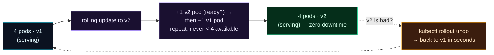

Welcome to **Day 86 of 100 Days of MLOps**. You can run and scale your model — now you need to *update* it without an outage. Remember Day 81's fourth failure: the naive way to deploy a new version is to stop the old one and start the new one, which means downtime on *every single release*. In an ML system where you retrain and redeploy models regularly (Module 7!), that's unacceptable — you can't take the service down every time a new model ships. Kubernetes solves this with **rolling updates**.

A rolling update replaces your pods **gradually** instead of all at once: it starts a new-version pod, waits for it to be *ready*, then retires an old one, and repeats — a few at a time — until every pod runs the new version. Throughout, the Service keeps routing traffic only to healthy pods, so users never see an interruption. And because Kubernetes remembers the previous version, a bad deploy isn't a crisis: one command — `kubectl rollout undo` — rolls straight back to the last working model in seconds. Today you'll configure a zero-downtime rolling update and learn the rollout commands that make shipping models safe.

> **Update without downtime, roll back in one command.** Rolling updates swap pods gradually; `rollout undo` reverts a bad model instantly.

By the end of today you will:

- Configure a **rolling update** with `maxSurge` and `maxUnavailable`.
- Understand why a **readiness probe** makes it truly zero-downtime.
- Trigger and watch a version rollout.
- **Roll back** a bad deploy with one command.

---

## How a rolling update stays up

The trick is *overlap*: new pods come up and prove healthy *before* old pods go away, so there are always enough live pods to serve traffic. Two knobs control the pace.



**Reading this diagram:**

You start with **4 pods running v1** (cyan), serving traffic. The **rolling update to v2** (purple) proceeds in the **middle step**: bring up *one* v2 pod, wait until it's **ready**, *then* remove one v1 pod — and repeat, always keeping at least 4 pods available. The result is **4 pods running v2** (green) with **zero downtime** — at no point did capacity dip below what's needed to serve.

And the dashed path is the safety net: if **v2 turns out to be bad**, **`kubectl rollout undo`** (amber) reverts to v1 in seconds. The takeaway: **updates overlap old and new, and are reversible.** You're never in a state with no healthy pods, and you're never stuck with a broken release. Let's configure it.

---

## Configure the rolling update

Deployments roll updates by default, but you control the *pace* with a `strategy`. The zero-downtime setting: **`maxUnavailable: 0`** (never drop below the desired count) and **`maxSurge: 1`** (allow one extra pod during the update). And crucially, a **`readinessProbe`** so Kubernetes knows when a new pod is *actually* ready to serve. `deployment.yaml`:

```yaml
apiVersion: apps/v1
kind: Deployment
metadata:
  name: house-api
spec:
  replicas: 4
  strategy:
    type: RollingUpdate
    rollingUpdate:
      maxSurge: 1              # at most 1 extra pod above desired during update
      maxUnavailable: 0        # never drop below desired = zero downtime
  selector:
    matchLabels:
      app: house-api
  template:
    metadata:
      labels:
        app: house-api
        version: "2.0"
    spec:
      containers:
        - name: house-api
          image: house-api:2.0    # the new version being rolled out
          ports:
            - containerPort: 8000
          readinessProbe:
            httpGet:
              path: /health
              port: 8000
```

The **`readinessProbe`** is what makes "wait for the new pod to be ready" real: Kubernetes hits `/health`, and only when it responds does it (a) send the pod traffic and (b) proceed to retire an old pod. Without it, k8s would consider a pod "ready" the instant the *container starts* — before your model has loaded — and route traffic to a pod that 500s. (Probes get their full treatment on Day 88; here it's the linchpin of a safe rollout.) Validate:

```bash
kubeconform -summary -verbose deployment.yaml
```

```text
deployment.yaml - Deployment house-api is valid
Summary: 1 resource found in 1 file - Valid: 1, Invalid: 0, Errors: 0, Skipped: 0
```

---

## Trigger and watch a rollout

To ship a new model version, change the image — either edit the manifest and `apply`, or set it imperatively — then watch the rollout progress:

```bash
kubectl set image deployment/house-api house-api=house-api:2.0
kubectl rollout status deployment/house-api
```

```text
$ kubectl set image deployment/house-api house-api=house-api:2.0
deployment.apps/house-api image updated

$ kubectl rollout status deployment/house-api
Waiting for deployment "house-api" rollout to finish: 1 out of 4 new replicas updated...
Waiting for deployment "house-api" rollout to finish: 2 out of 4 new replicas updated...
Waiting for deployment "house-api" rollout to finish: 3 out of 4 new replicas updated...
deployment "house-api" successfully rolled out
```

Kubernetes replaced the four pods one at a time — each new v2 pod passing its readiness check before the next old pod was retired — while the Service kept serving from whatever pods were healthy. Users saw no interruption. This is how you ship a freshly-retrained model (Module 7) to production: change the image tag, and the cluster rolls it out safely.

---

## Roll back a bad deploy

The safety net is what makes rolling updates *confident*. Kubernetes keeps a history of revisions, so if the new model misbehaves — worse predictions, errors, latency — you revert instantly:

```bash
kubectl rollout history deployment/house-api    # see the revisions
kubectl rollout undo deployment/house-api        # roll back to the previous one
```

```text
$ kubectl rollout history deployment/house-api
REVISION  CHANGE-CAUSE
1         house-api:1.0
2         house-api:2.0

$ kubectl rollout undo deployment/house-api
deployment.apps/house-api rolled back
```

`rollout undo` performs *another* rolling update — back to the previous version — so the rollback itself is also zero-downtime. In seconds you're back on the last known-good model, and you can debug the bad one offline. (Roll back to a *specific* revision with `--to-revision=N`.) This is the deployment counterpart of Module 8's monitoring: monitoring *tells you* the new model is bad; `rollout undo` *fixes it* immediately.

> **Beyond rolling updates.** For cases where old and new can't coexist (a breaking schema change), use the `Recreate` strategy (brief downtime, all-at-once). For extra safety on risky model changes, teams use **blue-green** (run v2 alongside v1, switch traffic at once) or **canary** (send 5% of traffic to v2, watch it, then ramp) deploys. Rolling update is the sensible default; these are tools for higher-stakes releases.

---

## Common errors (and how to fix them)

**1. No readiness probe — traffic hits a not-ready pod**

Without a `readinessProbe`, Kubernetes routes traffic (and proceeds with the rollout) the moment the container starts — before your model has loaded — so users get errors mid-deploy. A readiness probe is what makes a rolling update actually zero-downtime.

**2. `maxUnavailable` too high for zero-downtime**

If `maxUnavailable` lets too many pods go at once, capacity dips and users feel it under load. For strict zero-downtime, use `maxUnavailable: 0` with `maxSurge: 1` (or higher surge for faster rollouts).

**3. Assuming a rollout is instant**

A rolling update is *gradual* by design — it takes time proportional to replicas and readiness. Watch `kubectl rollout status`; don't assume it's done the instant you change the image.

**4. Forgetting you can roll back**

When a new model misbehaves, some teams scramble to rebuild the old image. You don't have to — `kubectl rollout undo` reverts in seconds. Know it exists *before* the incident.

**5. Not versioning image tags**

Rolling out `house-api:latest` makes rollbacks and history meaningless — every revision points at the same moving tag. Use immutable, versioned tags (`:2.0`, a git SHA) so revisions and rollbacks are precise.

**6. Using `Recreate` (or manual stop/start) by habit**

`Recreate` and stop-then-start both cause downtime. Only use `Recreate` when versions genuinely can't coexist; otherwise the default `RollingUpdate` keeps you up. Never take the service down just to deploy.

---

## Recap — what you now have

You can ship models without downtime:

- You configured a **rolling update** with `maxSurge: 1` and `maxUnavailable: 0` for true zero-downtime.
- You know a **readiness probe** is what makes the overlap safe — new pods must be *ready* before old ones leave.
- You triggered a rollout (`kubectl set image` + `rollout status`) and watched pods replace gradually.
- You can **roll back** a bad model instantly with `kubectl rollout undo`.

**Your cheat sheet:**

| Task | Command / field |
|------|-----------------|
| Zero-downtime strategy | `maxUnavailable: 0`, `maxSurge: 1` |
| Ship new version | `kubectl set image deployment/house-api house-api=house-api:2.0` |
| Watch rollout | `kubectl rollout status deployment/house-api` |
| See revisions | `kubectl rollout history deployment/house-api` |
| Roll back | `kubectl rollout undo deployment/house-api` |
| Prerequisite | a `readinessProbe` on the pods |

Golden rule: **roll out gradually, keep a readiness probe, and know `rollout undo`.** New pods prove healthy before old ones leave, so releases are zero-downtime — and a bad model is one command from reverted.

---

## Coming up on Day 87

Your model service still has configuration baked into the image — the model path, thresholds, and (worse) any credentials. That's inflexible and insecure. **Day 87 — "Config & Secrets"** shows the Kubernetes way to separate configuration from code: **ConfigMaps** for non-sensitive settings and **Secrets** for credentials, injected into your pods as environment variables or files. It's how you change config without rebuilding the image, and keep API keys and passwords out of your manifests and container.

See the full roadmap on the [100 Days of MLOps series page](/series/100-days-mlops). See you tomorrow.
