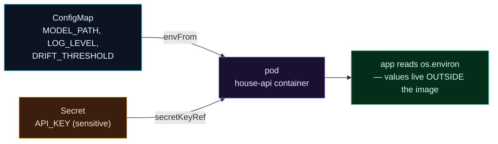

Welcome to **Day 87 of 100 Days of MLOps**. Your model service still carries its configuration *inside the image* — the model path, the log level, drift thresholds, and, if you're not careful, API keys and database passwords. That's two problems in one. It's **inflexible**: changing any setting means rebuilding and redeploying the whole image. And it's **insecure**: credentials baked into an image (or committed in a manifest) leak to anyone who can read either. Kubernetes separates configuration from code with two purpose-built objects.

**ConfigMaps** hold your non-sensitive settings — paths, log levels, feature flags, thresholds — as plain key-value data. **Secrets** hold the sensitive stuff — API keys, passwords, tokens — with a bit of extra handling. Both get **injected** into your pods at runtime, as environment variables or mounted files, so your app reads them the same way it always has (`os.environ`), but the values now live *outside* the image. Change a ConfigMap and restart the pods — no rebuild. And there's one crucial thing everyone misunderstands about Secrets that you'll learn today, because getting it wrong is how credentials leak. Let's separate config from code, properly.

> **Config outside the image, not baked in.** ConfigMaps for settings, Secrets for credentials — injected at runtime, changeable without a rebuild.

By the end of today you will:

- Move settings into a **ConfigMap** and credentials into a **Secret**.
- **Inject** both into a pod as environment variables.
- Change config **without rebuilding** the image.
- Understand that a Secret is **base64-encoded, not encrypted** — and what to do about it.

---

## Config and credentials, injected

The pattern is the same for both objects: define the values in a small YAML object, then reference it from your deployment so Kubernetes injects the values into the container at runtime.



**Reading this diagram:**

On the left, two sources. The **cyan ConfigMap** holds non-sensitive settings (model path, log level, drift threshold). The **amber Secret** holds sensitive data (an API key) — amber because it needs careful handling. Both are **injected into the pod** (purple): the ConfigMap via `envFrom` (all its keys become env vars), the Secret via a `secretKeyRef` (a specific key). Inside, your **app reads `os.environ`** (green) exactly as before — but the values now live *outside* the image, in Kubernetes objects you can change independently.

The important idea is the **separation**: the image is now generic (same image, any environment), and the configuration is external and swappable. Dev, staging, and prod run the *identical image* with different ConfigMaps/Secrets. Let's write them.

---

## A ConfigMap for settings

Non-sensitive configuration goes in a ConfigMap — just key-value data. `configmap.yaml`:

```yaml
apiVersion: v1
kind: ConfigMap
metadata:
  name: house-api-config
data:
  MODEL_PATH: "/app/model.joblib"
  LOG_LEVEL: "info"
  DRIFT_THRESHOLD: "0.5"
```

## A Secret for credentials

Sensitive values go in a Secret. Same shape, but the values are **base64-encoded** (more on why this matters shortly). To create the encoded value:

```bash
printf 'dummy-not-a-real-key' | base64      # -> ZHVtbXktbm90LWEtcmVhbC1rZXk=
```

`secret.yaml` (the value here is a deliberate placeholder — **never** put a real key in a file you commit):

```yaml
apiVersion: v1
kind: Secret
metadata:
  name: house-api-secret
type: Opaque
data:
  API_KEY: ZHVtbXktbm90LWEtcmVhbC1rZXk=    # base64 of a placeholder
```

## Inject both into the deployment

The deployment pulls the ConfigMap's keys in as environment variables (`envFrom`) and the Secret's key as a specific env var (`secretKeyRef`). `deployment.yaml` (container spec):

```yaml
      containers:
        - name: house-api
          image: house-api:1.0
          envFrom:
            - configMapRef:
                name: house-api-config       # all config keys become env vars
          env:
            - name: API_KEY
              valueFrom:
                secretKeyRef:
                  name: house-api-secret      # inject one secret key
                  key: API_KEY
```

Now the container has `MODEL_PATH`, `LOG_LEVEL`, `DRIFT_THRESHOLD`, and `API_KEY` as environment variables — read with `os.environ["MODEL_PATH"]` — none of them baked into the image. Validate all three:

```bash
kubeconform -summary -verbose configmap.yaml secret.yaml deployment.yaml
```

```text
configmap.yaml - ConfigMap house-api-config is valid
secret.yaml - Secret house-api-secret is valid
deployment.yaml - Deployment house-api is valid
Summary: 3 resources found in 3 files - Valid: 3, Invalid: 0, Errors: 0, Skipped: 0
```

## Change config without a rebuild

The payoff: to change a setting, edit the ConfigMap and restart the pods — **no image rebuild**:

```bash
kubectl edit configmap house-api-config          # change DRIFT_THRESHOLD to 0.6
kubectl rollout restart deployment/house-api      # pods pick up the new value
```

The same generic image now runs with new configuration. (Env vars are read at startup, so a restart is needed; config mounted as *files* can update live.)

---

## The one thing everyone gets wrong: base64 ≠ encryption

This is the most important point of the day. A Kubernetes Secret's values are **base64-encoded, not encrypted.** Base64 is *encoding* — trivially reversible, no key needed:

```bash
echo 'ZHVtbXktbm90LWEtcmVhbC1rZXk=' | base64 -d
# -> dummy-not-a-real-key
```

Anyone who can read the Secret (or the YAML file) can decode it in one command. So a Secret is **not** magically safe — it's barely obscured. What actually protects Secrets:

- **Never commit real Secrets to git.** A base64'd password in a repo is a plaintext password to anyone with the repo. Keep real Secret manifests out of version control (or encrypt them).
- **RBAC.** Restrict who/what can *read* Secrets in the cluster — Secrets separate *what can read config* from *what can read credentials*.
- **Encryption at rest.** Enable etcd encryption so Secrets aren't stored in plaintext in the cluster's database.
- **External secret managers** (the production answer): tools like **Sealed Secrets**, the **External Secrets Operator**, or **HashiCorp Vault** / cloud secret managers keep the real secret *outside* Kubernetes and inject it securely — so it never sits in a manifest at all.

The reason Secrets exist as a *separate object* from ConfigMaps isn't the base64 — it's that Kubernetes can then treat them specially (RBAC, encryption, not printing them in logs). Treat a Secret as "config that must be access-controlled," not "config that's encrypted."

---

## Common errors (and how to fix them)

**1. Thinking a Secret is encrypted**

The number-one misconception. Secrets are **base64-encoded** — anyone with read access decodes them instantly. Protect them with RBAC, encryption-at-rest, and by keeping real ones out of git; don't assume the Secret object alone makes a credential safe.

**2. Committing real credentials in a Secret manifest**

A base64'd API key in a committed YAML *is* a leaked API key. Never commit real Secret values. Use a secrets manager, or encrypt the manifest (Sealed Secrets), so git only ever holds encrypted/placeholder values.

**3. Putting sensitive data in a ConfigMap**

ConfigMaps have *no* special handling — passwords there are plain text with no RBAC distinction. Credentials go in **Secrets**; settings go in ConfigMaps. Don't mix them.

**4. Baking config into the image "just for now"**

Hardcoded config means a rebuild for every change and per-environment images. Externalise it from the start — the same image should run in dev/staging/prod with different ConfigMaps.

**5. Expecting env-var changes to apply without a restart**

Environment variables are read at container **startup**. Change a ConfigMap and the running pods keep the old values until you `rollout restart` (or the pods recreate). Mounted-file config can update live; env vars can't.

**6. Referencing a key that doesn't exist**

A `secretKeyRef`/`configMapKeyRef` pointing at a missing key (typo, wrong name) fails the pod at startup. Keep the key names in the ConfigMap/Secret and the deployment references exactly aligned.

---

## Recap — what you now have

Your config lives outside the image:

- You moved settings into a **ConfigMap** and credentials into a **Secret**, and validated all three manifests.
- You **inject** both into the pod as env vars (`envFrom`, `secretKeyRef`).
- You can change config with `kubectl edit` + `rollout restart` — **no rebuild**.
- You know a Secret is **base64-encoded, not encrypted**, and how to actually protect it.

**Your cheat sheet:**

| Need | Use |
|------|-----|
| Non-sensitive settings | ConfigMap |
| Credentials / tokens | Secret (base64, RBAC-protected) |
| All keys as env vars | `envFrom: [configMapRef]` |
| One secret key as env | `secretKeyRef` |
| Change config | edit + `kubectl rollout restart` |
| Real security | secrets manager, RBAC, encryption at rest, never in git |

Golden rule: **externalise config; treat Secrets as access-controlled, not encrypted.** ConfigMaps for settings, Secrets for credentials — and the real protection is RBAC, encryption, and keeping secrets out of git, not the base64.

---

## Coming up on Day 88

Kubernetes can only keep your model healthy if it knows what "healthy" *means* — and how much CPU and memory each pod needs. **Day 88 — "Health Checks & Resource Management"** covers the two things that make a deployment production-grade: **liveness and readiness probes** (so k8s restarts a hung pod and only sends traffic to ready ones) and **resource requests and limits** (so pods get the CPU/RAM they need and can't starve their neighbours). It's what turns "the pods are running" into "the pods are reliably serving."

See the full roadmap on the [100 Days of MLOps series page](/series/100-days-mlops). See you tomorrow.
