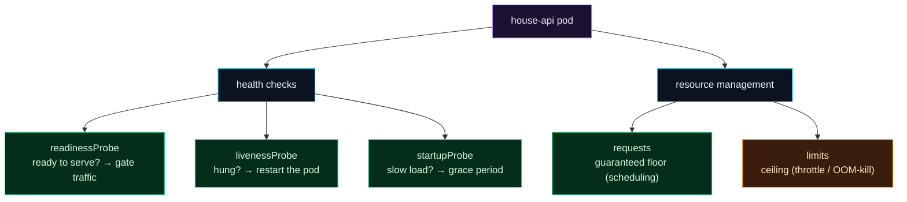

Welcome to **Day 88 of 100 Days of MLOps**. Your deployment runs, scales, and updates — but Kubernetes is still flying half-blind. It knows a container *process* is running, but not whether your model is actually *serving*. A pod can be "Running" while its process is deadlocked, its model failed to load, or it's mid-startup and not ready yet — and k8s will happily send users to it. Today you fix that with **health checks**, and you give Kubernetes the other thing it needs to place pods well: knowledge of how much **CPU and memory** each one requires.

These are the two features that separate a demo deployment from a production one. **Probes** let Kubernetes ask your pod "are you alive?" and "are you ready?" — so it restarts hung pods and routes traffic only to ready ones. **Resource requests and limits** tell the scheduler how much each pod needs (so it's placed on a machine with room) and cap how much it can take (so one greedy pod can't starve the rest). Without probes, a broken-but-running pod silently drops requests; without resource management, pods fight over CPU and memory unpredictably. Today you'll add both and validate a genuinely production-grade deployment.

> **Tell Kubernetes what "healthy" means and what each pod needs.** Probes gate traffic and restart hangs; requests/limits guarantee resources and cap greed.

By the end of today you will:

- Add **readiness**, **liveness**, and **startup** probes — and know what each does.
- Set resource **requests** (guaranteed) and **limits** (ceiling).
- Understand why both are required for reliable, fair scheduling.
- Validate a production-grade deployment.

---

## Probes and resources, together

A production pod tells Kubernetes two kinds of information: *how healthy it is* (probes) and *how much it needs* (resources). Together they let k8s route, restart, place, and cap correctly.



**Reading this diagram:**

The **purple pod** exposes two kinds of info. **Health checks** (cyan) split into three green probes: **readiness** ("ready to serve?" — gates traffic without restarting), **liveness** ("hung?" — restarts the pod), and **startup** ("slow to load?" — a grace period before the others apply). **Resource management** (cyan) splits into **requests** (green — the guaranteed floor the scheduler reserves) and **limits** (amber — the ceiling, enforced by throttling CPU or OOM-killing on memory).

The division of labour is the point: **readiness** protects *users* (no traffic to a not-ready pod), **liveness** protects *availability* (restart a dead-but-running pod), **requests** protect *this pod* (guaranteed resources), and **limits** protect *the neighbours* (no one pod hogs the node). Let's put all of it in one manifest.

---

## The three probes

Kubernetes checks a pod's health by probing an endpoint (here `/health`, your Day 52 endpoint). Three probes answer three different questions:

- **readinessProbe** — *"Is this pod ready to receive traffic?"* If it fails, k8s removes the pod from the Service's endpoints (no traffic) but does **not** restart it. Essential while a model loads, and the linchpin of zero-downtime rollouts (Day 86).
- **livenessProbe** — *"Is this pod alive, or hung?"* If it fails repeatedly, k8s **restarts** the pod. Catches deadlocks and hangs — the insidious failures where the process is up but serving nothing.
- **startupProbe** — *"Has this slow-starting app finished starting?"* It holds off liveness/readiness until the app is up, so a model that takes 60s to load isn't killed for "failing" liveness during startup.

```yaml
          startupProbe:          # give a slow model load time before liveness kicks in
            httpGet: {path: /health, port: 8000}
            failureThreshold: 30
            periodSeconds: 5      # up to 30×5s = 150s to start
          readinessProbe:        # only send traffic when ready
            httpGet: {path: /health, port: 8000}
            initialDelaySeconds: 5
            periodSeconds: 10
          livenessProbe:         # restart if hung
            httpGet: {path: /health, port: 8000}
            initialDelaySeconds: 15
            periodSeconds: 20
```

The key distinction: **readiness gates traffic** (fail → no traffic, no restart), **liveness restarts** (fail → kill and recreate). A pod whose model is still loading should be *not ready* (readiness fails) but *alive* (liveness passes) — so it gets no traffic but isn't needlessly killed. Mixing these up is the classic probe mistake.

---

## Requests and limits

Resources tell the scheduler what each pod needs and caps what it can take:

```yaml
          resources:
            requests:            # guaranteed: the scheduler reserves this
              cpu: "250m"        # 250 millicores = 0.25 CPU
              memory: "256Mi"
            limits:              # ceiling: enforced at runtime
              cpu: "1000m"       # throttled above 1 CPU
              memory: "512Mi"    # OOM-killed above 512Mi
```

- **requests** are *guaranteed*. The scheduler uses them to place the pod on a node with enough free capacity, and reserves that amount. The HPA (Day 85) computes CPU utilization *against the request*. Too-low requests → pods packed too tightly and starved; too-high → wasted, unschedulable capacity.
- **limits** are the *ceiling*, enforced differently per resource: exceed the **CPU** limit and the pod is **throttled** (slowed, not killed); exceed the **memory** limit and the pod is **OOM-killed** and restarted. Limits stop one runaway pod from taking down a whole node.

Validate the full production deployment (probes + resources):

```bash
kubeconform -summary -verbose deployment.yaml
```

```text
deployment.yaml - Deployment house-api is valid
Summary: 1 resource found in 1 file - Valid: 1, Invalid: 0, Errors: 0, Skipped: 0
```

That manifest — three replicas, requests, limits, and all three probes — is what a production-grade Kubernetes deployment of a model service actually looks like.

---

## Why both matter for an ML service

ML pods have traits that make these features especially important:

- **Models are slow to load.** A pod may need many seconds to load `model.joblib` (or a large model) before it can serve. A **startupProbe** prevents k8s from killing it during that load, and a **readinessProbe** keeps traffic away until the model is actually ready — no cold-start 500s for users.
- **Inference is memory-hungry.** Models and their libraries use real memory. A **memory limit** prevents a leak or a big batch from OOM-ing the whole node; a **memory request** ensures the scheduler gives the pod enough. Get these from your load test (Day 58) and profiling.
- **Hangs happen.** A model server can deadlock (a stuck thread, a wedged dependency) while the process stays "up." A **livenessProbe** is the only thing that notices and restarts it — self-healing for the silent hang, not just the crash.

Set probes and resources from *measured* behaviour: your load test tells you the CPU/memory a pod needs and how long it takes to become ready. Guessing leads to OOM-kills, throttling, or pods that never pass their probes.

---

## Common errors (and how to fix them)

**1. No readiness probe → traffic to a not-ready pod**

Without readiness, k8s sends users to a pod the instant its container starts — before the model loads — and they get errors. A readiness probe on `/health` gates traffic until the pod can actually serve. (It's also what makes rolling updates safe, Day 86.)

**2. Liveness probe too aggressive → restart loops**

If the liveness probe fails during a slow startup (or with a too-short `initialDelaySeconds`), k8s kills the pod mid-load, forever. Use a **startupProbe** for slow starts, and give liveness a sane delay/threshold. A restart-looping pod is often an over-eager liveness probe.

**3. Using liveness where you meant readiness**

Liveness *restarts*; readiness *gates traffic*. A pod that's temporarily busy should fail *readiness* (stop sending it traffic), not *liveness* (which would needlessly restart it). Mixing these causes restart storms under load.

**4. No resource requests → bad scheduling and no HPA**

Without requests, the scheduler can't place pods well and the HPA can't compute utilization (Day 85). Always set CPU/memory requests; they're the foundation of scheduling and autoscaling.

**5. No memory limit → one pod OOMs the node**

An unbounded pod with a memory leak (or a huge batch) can consume all node memory and take down its neighbours. Set a memory **limit** so a runaway pod is OOM-killed in isolation, not the whole node.

**6. requests == limits everywhere without thought**

Setting requests equal to limits gives "Guaranteed" QoS (good for critical pods) but wastes capacity if the pod rarely uses its max. For bursty inference, requests below limits (Burstable) is often more efficient. Choose based on the workload, from real measurements.

---

## Recap — what you now have

Your deployment is production-grade:

- You added **readiness** (gate traffic), **liveness** (restart hangs), and **startup** (grace for slow loads) probes.
- You set resource **requests** (guaranteed floor, used for scheduling + HPA) and **limits** (ceiling: CPU throttle, memory OOM-kill).
- You know **why ML pods** especially need these — slow loads, memory-hungry inference, silent hangs.
- You **validated** a full production deployment.

**Your cheat sheet:**

| Feature | Purpose |
|---------|---------|
| readinessProbe | fail → no traffic (no restart) |
| livenessProbe | fail → restart the pod |
| startupProbe | grace period for slow starts |
| requests | guaranteed floor (scheduling, HPA) |
| limits (cpu) | throttle above ceiling |
| limits (memory) | OOM-kill above ceiling |

Golden rule: **probes tell k8s what "healthy" means; requests/limits tell it what each pod needs.** Readiness gates traffic, liveness restarts hangs, requests guarantee resources, limits cap greed — set them from measurements, and the deployment is reliable.

---

## Coming up on Day 89

You now have a lot of YAML — deployment, service, HPA, config, secrets, probes — and copying it for every environment is error-prone. **Day 89 — "Packaging with Helm"** introduces the package manager for Kubernetes: bundle all your manifests into a reusable **chart** with **templated values**, so one `helm install` deploys the whole stack, and a single `values.yaml` configures it per environment (dev/staging/prod). You'll build a chart for your model service and render it — turning a pile of manifests into one versioned, parameterised package.

See the full roadmap on the [100 Days of MLOps series page](/series/100-days-mlops). See you tomorrow.
