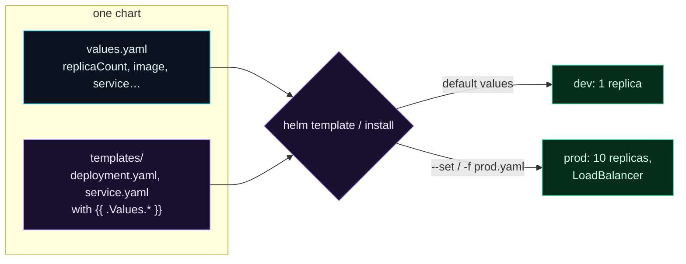

Welcome to **Day 89 of 100 Days of MLOps**. Look at what you've accumulated this module: a deployment, a service, an HPA, a ConfigMap, a Secret, probes, resource limits — a stack of YAML files. Now imagine deploying that stack to *three* environments. Dev wants 1 replica and debug logging; staging wants 3; prod wants 10 replicas, a LoadBalancer, and production config. The naive approach is to copy all the YAML three times and hand-edit the differences — which is how you end up with prod running a setting someone forgot to change in the copy. There's a better way: **Helm**.

Helm is the **package manager for Kubernetes** — think `apt` or `npm`, but for cluster resources. It bundles your manifests into a reusable **chart**: the YAML becomes *templates* with `{{ placeholders }}`, and a **`values.yaml`** file supplies the actual numbers. Now the *same* chart deploys to every environment — you just point it at a different values file (or override a few values on the command line). One `helm install` brings up your whole model stack; one `values.yaml` configures it; and Helm tracks each release so you can upgrade and roll back like any package. Today you'll build a chart for your model service, render it, and validate the output.

> **One chart, every environment.** Templated manifests + a values file = install the whole stack with one command, configured per environment.

By the end of today you will:

- Understand a Helm **chart**: templates + values + metadata.
- **Template** your manifests with `{{ .Values }}` placeholders.
- Render the chart and **override values** for different environments.
- **Lint and validate** the chart and its rendered output.

---

## A chart: templates plus values

A Helm chart separates the *structure* of your manifests (templates, written once) from the *configuration* (values, supplied per environment). Render them together and you get concrete Kubernetes YAML.



**Reading this diagram:**

Inside **one chart** are two parts: **templates** (purple) — your deployment and service YAML with `{{ .Values.* }}` placeholders instead of hardcoded numbers — and **`values.yaml`** (cyan) — the actual settings. Helm's **render step** combines them, and the *same chart* produces different concrete manifests depending on the values: with defaults, a **dev** deployment (1 replica); with a prod values file or `--set` overrides, a **prod** deployment (10 replicas, LoadBalancer).

The insight is *write once, configure many*: the template captures the *shape* of your deployment, and values capture what *differs* between environments. No more copy-paste-and-edit; one source of truth, parameterised. Let's build it.

---

## Build the chart

A minimal chart is three things: `Chart.yaml` (metadata), `values.yaml` (default config), and a `templates/` folder of manifests.

**`Chart.yaml`** — the chart's identity:

```yaml
apiVersion: v2
name: house-api
description: A Helm chart for the house-price model service
type: application
version: 0.1.0
appVersion: "1.0"
```

**`values.yaml`** — the default configuration (what varies per environment):

```yaml
replicaCount: 3
image:
  repository: house-api
  tag: "1.0"
service:
  type: ClusterIP
  port: 80
resources:
  requests:
    cpu: 250m
    memory: 256Mi
```

**`templates/deployment.yaml`** — your deployment, now *templated* with `{{ .Values.* }}`:

```yaml
apiVersion: apps/v1
kind: Deployment
metadata:
  name: {{ .Release.Name }}-house-api
spec:
  replicas: {{ .Values.replicaCount }}
  selector:
    matchLabels:
      app: house-api
  template:
    metadata:
      labels:
        app: house-api
    spec:
      containers:
        - name: house-api
          image: "{{ .Values.image.repository }}:{{ .Values.image.tag }}"
          ports:
            - containerPort: 8000
          resources:
            requests:
              cpu: {{ .Values.resources.requests.cpu }}
              memory: {{ .Values.resources.requests.memory }}
```

The placeholders are the whole idea: `{{ .Values.replicaCount }}` pulls from `values.yaml`, and `{{ .Release.Name }}` is the name you give the install (so two installs don't collide). A `templates/service.yaml` follows the same pattern for the Service.

---

## Lint, render, and override

First, **lint** the chart — Helm checks its structure and templates:

```bash
helm lint ./house-api
```

```text
==> Linting ./house-api
[INFO] Chart.yaml: icon is recommended
1 chart(s) linted, 0 chart(s) failed
```

Then **render** it with `helm template` — this substitutes the values and prints the concrete manifests, *without* touching a cluster (perfect for validation and CI):

```bash
helm template myrelease ./house-api
```

```text
# Source: house-api/templates/service.yaml
apiVersion: v1
kind: Service
metadata:
  name: myrelease-house-api
spec:
  type: ClusterIP
  ports:
    - port: 80
---
# Source: house-api/templates/deployment.yaml
apiVersion: apps/v1
kind: Deployment
metadata:
  name: myrelease-house-api
spec:
  replicas: 3
```

The values are filled in: `replicas: 3`, `ClusterIP`, port 80. Now the payoff — **override values** for a different environment, no file copying:

```bash
helm template myrelease ./house-api --set replicaCount=5 --set service.type=LoadBalancer
```

```text
  type: LoadBalancer
  replicas: 5
```

Same chart, prod configuration — 5 replicas and a LoadBalancer — from two overrides. In practice you'd keep a `values-prod.yaml` and pass `-f values-prod.yaml`. And because `helm template` emits plain manifests, you can pipe them straight into `kubeconform` to validate the *rendered* output:

```bash
helm template myrelease ./house-api | kubeconform -summary
```

```text
Summary: 2 resources found parsing stdin - Valid: 2, Invalid: 0, Errors: 0, Skipped: 0
```

Both rendered resources are valid Kubernetes — the chart produces correct manifests. That combination (`helm lint`, `helm template`, and `kubeconform` on the output) is exactly the check to run in CI before any deploy.

---

## Installing, upgrading, rolling back

On a real cluster, Helm manages the whole stack as one versioned **release**:

```bash
helm install house-api ./house-api                    # deploy the whole stack
helm install house-api ./house-api -f values-prod.yaml # ... with prod config
helm upgrade house-api ./house-api --set image.tag=2.0 # ship a new version
helm rollback house-api 1                              # revert to revision 1
helm list                                              # see releases + revisions
```

Notice the parallels to what you learned this module: `helm upgrade` performs a rolling update (Day 86), and `helm rollback` reverts — but now across your *entire* stack (deployment + service + HPA + config), not one object. Helm tracks each release's revision history, so the whole application rolls forward and back as a unit. And because charts are versioned and shareable, you can install *others'* charts the same way (`helm install prometheus prometheus-community/prometheus`) — the ecosystem's answer to "don't write the monitoring stack yourself."

---

## Common errors (and how to fix them)

**1. Hardcoding values in templates**

If you leave a number hardcoded in a template instead of `{{ .Values.* }}`, it can't vary per environment — defeating the point. Anything that differs between dev/staging/prod belongs in `values.yaml`, referenced from the template.

**2. Indentation errors in templates**

Helm templates are whitespace-sensitive YAML *and* Go templating. A misplaced `{{ }}` or wrong indent renders broken YAML. Always `helm template` and pipe to `kubeconform` to catch it before installing.

**3. Forgetting `{{ .Release.Name }}` in resource names**

If resource names are hardcoded, two installs of the chart collide (same names). Prefix names with `{{ .Release.Name }}` so each release's objects are distinct.

**4. Editing rendered manifests instead of the chart**

If you tweak the output of `helm template` directly, the next `helm upgrade` overwrites your change. The **chart and values are the source of truth** — change those, not the rendered YAML (the same declarative lesson as Day 82).

**5. Not validating the rendered output**

`helm lint` checks the chart, but always also render and validate the *result* (`helm template | kubeconform`) — a chart can lint clean but produce invalid manifests once values are substituted.

**6. Reaching for Helm on day one**

For a single manifest, plain YAML is simpler; Helm shines when you have *many* resources across *multiple* environments. Don't add templating complexity before you have the reuse to justify it — but for a full production stack like this module's, it's the right tool.

---

## Recap — what you now have

Your model stack is a reusable package:

- You understand a Helm **chart**: `Chart.yaml`, `values.yaml`, and `templates/`.
- You **templated** your manifests with `{{ .Values.* }}` and `{{ .Release.Name }}`.
- You rendered the chart, **overrode values** for prod (5 replicas, LoadBalancer), and **validated** the output (lint + `kubeconform`, 2 valid).
- You know `helm install/upgrade/rollback` manage the whole stack as one versioned release.

**Your cheat sheet:**

| Task | Command |
|------|---------|
| Lint the chart | `helm lint ./house-api` |
| Render locally | `helm template myrelease ./house-api` |
| Override a value | `--set replicaCount=5` or `-f values-prod.yaml` |
| Validate output | `helm template ... \| kubeconform` |
| Install / upgrade | `helm install` / `helm upgrade` |
| Roll back | `helm rollback house-api 1` |

Golden rule: **template the structure, parameterise the differences.** One chart plus per-environment values deploys your whole model stack consistently — validate `helm template | kubeconform` before every release.

---

## Coming up on Day 90 — Module 9 finale

Time to bring deployment all together. **Day 90 — "Capstone: Deploying the Model Service at Scale"** assembles everything from Module 9 into one production-grade deployment: a Deployment with health checks and resource limits, a Service, a HorizontalPodAutoscaler, config and secrets, rolling updates — all packaged as a Helm chart and validated end-to-end. It's the complete picture of running your model service at scale, and it closes out the deployment module — leaving just the final stretch of the course.

See the full roadmap on the [100 Days of MLOps series page](/series/100-days-mlops). See you tomorrow.
