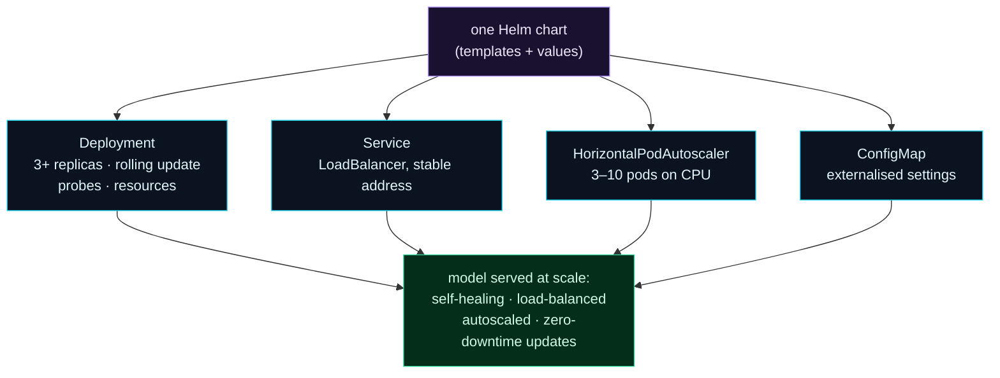

Welcome to **Day 90 of 100 Days of MLOps** — the finale of **Module 9.** Ten days ago your model was one container that fell over when its process died. Today you assemble everything the module taught into **one production-grade deployment**: multiple self-healing replicas, a stable load-balanced address, autoscaling for traffic spikes, zero-downtime rolling updates, externalised config, health checks, and resource limits — all packaged as a single **Helm chart** you can install with one command and validate end-to-end.

This is what "deploying a model at scale" actually means. Not `python app.py` on a server, but a declarative, versioned package that Kubernetes runs reliably across many machines: it keeps the right number of healthy pods alive, routes traffic only to ready ones, scales with load, updates without downtime, and rolls back on demand. You'll bundle the Deployment (with rolling updates, probes, and resources), a Service, a HorizontalPodAutoscaler, and a ConfigMap into one chart, render the whole stack, and confirm every resource is valid. By the end, your model service is genuinely production-shaped — and Module 9 is complete.

> **The whole stack, one chart, one command.** Deployment + Service + HPA + config, packaged, validated, and deployable at scale.

By the end of today you will:

- Assemble the **entire Module 9 stack** into one Helm chart.
- Include **rolling updates, probes, resources, autoscaling, and config**.
- Render and **validate every resource** end-to-end.
- Have a **production deployment checklist** for any model service.

---

## The anatomy of a production deployment

A production model deployment is several Kubernetes objects working together, each solving one of the module's problems. One Helm chart bundles them all.



**Reading this diagram:**

At the top, in **purple**, is **one Helm chart** (Day 89) — templates plus values. It renders four **cyan** Kubernetes objects: a **Deployment** (self-healing replicas with rolling updates, probes, and resource limits — Days 83/86/88), a **Service** (a stable load-balanced address — Day 84), a **HorizontalPodAutoscaler** (elastic scaling — Day 85), and a **ConfigMap** (externalised config — Day 87). Together they produce the **green** result: a model **served at scale** — self-healing, load-balanced, autoscaled, and updatable with zero downtime.

The takeaway is that production deployment is *compositional*: no single object does it all: the Deployment keeps pods alive, the Service makes them reachable, the HPA makes them elastic, the ConfigMap makes them configurable — and Helm packages the whole thing as one versioned unit. Let's build it.

---

## The complete chart

The chart's `values.yaml` captures everything that varies; the templates compose the objects. Here's the heart of it — **`values.yaml`**:

```yaml
replicaCount: 3
image:
  repository: house-api
  tag: "1.0"
service:
  type: LoadBalancer
  port: 80
autoscaling:
  minReplicas: 3
  maxReplicas: 10
  targetCPUUtilizationPercentage: 70
resources:
  requests: {cpu: 250m, memory: 256Mi}
  limits:   {cpu: 1000m, memory: 512Mi}
config:
  MODEL_PATH: "/app/model.joblib"
  LOG_LEVEL: "info"
```

The **`templates/deployment.yaml`** brings together rolling updates, config, resources, and probes — the production essentials from across the module:

```yaml
apiVersion: apps/v1
kind: Deployment
metadata:
  name: {{ .Release.Name }}-house-api
spec:
  replicas: {{ .Values.replicaCount }}
  strategy:
    type: RollingUpdate
    rollingUpdate: {maxSurge: 1, maxUnavailable: 0}   # zero-downtime (Day 86)
  selector:
    matchLabels: {app: house-api}
  template:
    metadata:
      labels: {app: house-api}
    spec:
      containers:
        - name: house-api
          image: "{{ .Values.image.repository }}:{{ .Values.image.tag }}"
          ports:
            - containerPort: 8000
          envFrom:
            - configMapRef: {name: {{ .Release.Name }}-config}   # config (Day 87)
          resources:
{{ toYaml .Values.resources | indent 12 }}                       # requests/limits (Day 88)
          readinessProbe:
            httpGet: {path: /health, port: 8000}                 # gate traffic (Day 88)
          livenessProbe:
            httpGet: {path: /health, port: 8000}
            initialDelaySeconds: 15
```

Alongside it, the chart has `templates/service.yaml` (a LoadBalancer), `templates/hpa.yaml` (the autoscaler), and `templates/configmap.yaml` (the config) — each templated from `values.yaml`. Four objects, one chart.

---

## Validate the whole stack

The discipline you've built all module: lint the chart, render it, and validate every resource — *before* deploying. First the lint:

```bash
helm lint ./house-api
```

```text
1 chart(s) linted, 0 chart(s) failed
```

Then render the full stack and validate every rendered manifest against the Kubernetes schemas:

```bash
helm template prod ./house-api | kubeconform -summary
```

```text
Summary: 4 resources found parsing stdin - Valid: 4, Invalid: 0, Errors: 0, Skipped: 0
```

And confirm the chart produces exactly the objects you expect:

```bash
helm template prod ./house-api | grep '^kind:' | sort | uniq -c
```

```text
   1 kind: ConfigMap
   1 kind: Deployment
   1 kind: HorizontalPodAutoscaler
   1 kind: Service
```

There it is — the entire production stack, from **one chart**: a Deployment (rolling updates, probes, resources), a Service (LoadBalancer), an HPA (3–10 pods), and a ConfigMap — **all four valid**. One command deploys it, one values file configures it per environment, and one `helm rollback` reverts the whole thing. That's a model service deployed at scale.

---

## Deploy it (and Module 9 complete)

On a real cluster, the whole stack goes up with one command — and updates and rolls back as a unit:

```bash
helm install house-api ./house-api                     # deploy the full stack
helm upgrade house-api ./house-api --set image.tag=2.0 # ship a new model (rolling update)
helm rollback house-api 1                              # revert the whole stack
```

That wraps **Module 9: Deployment & Scaling.** You went from a single fragile container to a production deployment: you saw why one container isn't enough (81), learned the core objects (82), deployed your model (83), exposed it with a Service (84), scaled it manually and automatically (85), shipped zero-downtime rolling updates with rollbacks (86), externalised config and secrets (87), added health checks and resource limits (88), packaged it with Helm (89), and today assembled the complete, validated stack.

Step back at the whole system now. Your ML is **reproducible** (Module 3), **tracked** (Module 4), built on **validated data** (Module 5), **servable** (Module 6), **automated** (Module 7), **monitored** (Module 8), and **deployed at scale** (Module 9). That is, genuinely, a production MLOps system — the thing this course set out to build. One module remains: tying it all together into professional practice.

---

## Common errors (and how to fix them)

**1. Shipping a deployment missing one production piece**

A deployment without probes drops traffic mid-rollout; without resource limits one pod OOMs the node; without an HPA it can't handle spikes; without a Service it's unreachable. Treat the whole set — Deployment+probes+resources, Service, HPA, config — as *required* for "production."

**2. Baking config into the chart's templates**

Anything environment-specific (replicas, image tag, service type, thresholds) belongs in `values.yaml`, not hardcoded in a template — so one chart serves dev/staging/prod. Hardcoding forces chart edits per environment.

**3. Deploying without validating the rendered output**

`helm lint` isn't enough — always `helm template | kubeconform` to validate the *substituted* manifests. A chart can lint clean but render invalid YAML once values are applied.

**4. `latest` image tags in production**

`:latest` makes rollbacks and rollout history meaningless. Use immutable, versioned tags (`:1.0`, a git SHA) so `helm upgrade`/`rollback` and revision history are precise.

**5. No rollback plan**

Combine the monitoring from Module 8 (which *detects* a bad deploy) with `helm rollback` (which *reverts* it). A production deploy without a tested rollback path is a production incident waiting to happen.

**6. Over-provisioning "to be safe"**

Huge requests/limits and a high `maxReplicas` waste money and can't schedule. Size them from your **load test** (Day 58) and real usage, not fear — right-sizing is part of production-readiness.

---

## Recap — what you now have

You can deploy a model service at scale:

- You assembled the **entire Module 9 stack** — Deployment, Service, HPA, ConfigMap — into one Helm chart.
- It includes **rolling updates, probes, resources, and autoscaling** — every production essential.
- You **validated the whole stack** end-to-end: `helm lint` clean, `helm template | kubeconform` → **4 valid** resources.
- You have a **production deployment checklist** and completed Module 9.

**Your cheat sheet — the production deployment checklist:**

| Piece | Day |
|-------|-----|
| Deployment + replicas | 83 |
| Service (LoadBalancer) | 84 |
| HorizontalPodAutoscaler | 85 |
| Rolling updates + rollback | 86 |
| Config & Secrets | 87 |
| Probes + resource limits | 88 |
| Packaged as a Helm chart | 89 |

Golden rule: **a production deployment is a composed, validated stack — not a running container.** Deployment, Service, HPA, config, probes, limits — packaged with Helm and validated before every release.

---

## Coming up on Day 91 — Module 10 begins

You've built every layer of a production ML system. The final module ties it into professional practice. **Module 10 — "MLOps in Practice"** opens with **Day 91 — "CI/CD for Machine Learning,"** where you'll automate the path from a code or model change to a validated, deployed update — building the pipeline that runs your tests, validation, and Helm deploy automatically, so shipping a model is a `git push`, not a manual ritual. From building the pieces, we turn to the professional workflow that ties them together — the last stretch of the course.

See the full roadmap on the [100 Days of MLOps series page](/series/100-days-mlops). See you tomorrow.
