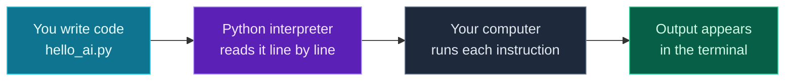

Welcome to **Day 1 of Python for AI Engineering** — a 30-day, project-based journey that takes you from never having written a line of code to writing the kind of Python that real AI applications run on.

This series is built for **everyone**, not just computer-science graduates. If you have never programmed before, you are exactly who this was written for. Every idea is explained in plain English first, every command is something you can copy and run, and **everything works on your own laptop** — macOS, Windows or Linux. You do not need a powerful machine, a cloud account, or any paid software to follow along.

> **New to all of this? You are in the right place.** This is Day 1, so it assumes *nothing*. We install Python together, set up a clean workspace, and write a working program by the end. If a word looks unfamiliar, keep reading — it gets explained the first time it matters.

By the end of today you will have:

- A working **Python installation** you can prove is running.
- **VS Code** — a free, friendly code editor — set up for Python.
- Your first **virtual environment** (an isolated, tidy workspace for each project).
- A real program you wrote and ran: an **interactive intro-card generator** that greets you, asks what you want to build, and confirms your setup is ready.

Let's go.

---

## What is Python, and why does AI run on it?

**Python is a programming language** — a way of writing instructions that a computer can follow. You write those instructions as plain text in a file, and a piece of software called the **Python interpreter** reads your file and carries out each instruction.

Python is famous for reading almost like English:

> Illustration only — do not paste.
> ```
> if temperature > 30:
>     print("It's hot today")
> ```

You can probably guess what that does, and that is the point. Python was designed to be **easy to read and quick to write**, which is why beginners love it — and also why it became the default language of **artificial intelligence**.

Nearly every major AI tool is built on Python: the libraries that train models (**PyTorch**, **TensorFlow**), the ones that work with pre-built models (**Hugging Face**), and the ones that connect your code to AI services like Claude, OpenAI and Gemini. If you want to build with AI, Python is the doorway — and these 30 days are how you walk through it.

You do **not** need any maths or AI knowledge today. We are just getting Python running and writing our first program. The AI parts come later, once your foundations are solid.

---

## What you'll build today

To make Day 1 real, you will write a small interactive program called **`hello_ai.py`**. When you run it, it will greet you, ask two questions, and print a tidy "intro card" — including the exact version of Python you just installed, as proof that everything works:

```text
============================================
  Welcome to Python for AI Engineering!
============================================

What's your name? Vishwas
What do you want to build with Python? AI agents

--------------------------------------------
  Hi Vishwas!
  Goal: AI agents
  Running Python: 3.12.4
  Status: ready to learn ✅
--------------------------------------------

See you on Day 2. You just ran your first Python program!
```

Don't worry about *how* yet — we build it step by step. First, let's understand what actually happens when you run a Python program.

---

## How Python runs your code

Before installing anything, here is the whole picture in one small diagram. It's deliberately simple — this is the mental model you'll use every single day.



**Reading this diagram:**

Read it left to right — that's the order things happen.

The **cyan box on the far left** is *you*. You write instructions into a plain text file ending in `.py` (here, `hello_ai.py`). That file is just text — by itself it does nothing.

The **purple box** is the **Python interpreter** — the program you are about to install. When you run your file, the interpreter opens it and reads it **top to bottom, one line at a time**, translating each line into something the computer understands. This is the heart of "running Python," and it's why installing Python is step one: without the interpreter, a `.py` file is just words on a page.

The **grey box** is your actual computer carrying out those translated instructions — doing the maths, asking you questions, storing values.

The **green box on the right** is the **terminal** (also called the command line or console) — the text window where your program's output appears, like the intro card above. Throughout this series you'll run programs from the terminal and read their results there.

The key takeaway: **you write text → Python reads it → your computer acts → results show in the terminal.** Every day builds on this same loop.

---

## Step 1 — Install Python

Pick the section for **your** operating system. Skip the other two. Each one ends with a quick check so you *know* it worked before moving on.

> Throughout this series, anything in a `grey code block` is meant to be typed (or pasted) into your **terminal** and run by pressing **Enter**. We'll show you how to open the terminal in Step 3; for now, just follow your OS's installer steps.

### Windows

1. Open your web browser and go to **[python.org/downloads](https://www.python.org/downloads/)**.
2. Click the big yellow **"Download Python 3.x"** button (any version **3.11 or newer** is perfect for this series). This downloads an installer file ending in `.exe`.
3. Open the downloaded file to start the installer. **This next part is the single most important step on Windows:**
   - At the bottom of the first installer screen, **tick the checkbox that says "Add python.exe to PATH"**. ✅
   - Then click **"Install Now"**.

   "Add to PATH" is what lets you type `python` in any terminal and have Windows find it. If you forget this checkbox, you'll get a *"'python' is not recognized"* error later — and the fix is annoying. So: **tick the box.**
4. When it finishes, click **Close**.

**Check it worked.** Open the **Start menu**, type `PowerShell`, and open **Windows PowerShell**. In the blue window, type:

```powershell
python --version
```

You should see something like `Python 3.12.4` (your numbers may differ — anything 3.11+ is great). Windows also installs a helper called the **`py` launcher**, so `py --version` works too.

> If you see *"'python' is not recognized…"*, Python isn't on your PATH. The cleanest fix: re-run the installer, choose **Modify**, and make sure **"Add Python to environment variables"** is ticked — or simply reinstall and tick **"Add python.exe to PATH"** this time. See the [Common errors](#common-errors-and-how-to-fix-them) section.

### macOS

On a Mac, **do not use the old "system Python"** that may already be there — it's outdated and meant for macOS itself. Install a fresh, current Python instead.

1. Go to **[python.org/downloads](https://www.python.org/downloads/)**.
2. Click **"Download Python 3.x"** (any **3.11 or newer**). This downloads a `.pkg` installer.
3. Open the downloaded `.pkg` file and click through the installer (**Continue → Continue → Agree → Install**). Enter your Mac password if asked.
4. When it finishes, you can move the installer to the Trash.

**Check it worked.** Open the **Terminal** app (press **⌘ + Space**, type `Terminal`, press **Enter**). In the window, type:

```bash
python3 --version
```

You should see something like `Python 3.12.4`. 

> **Important Mac detail:** on macOS the command is **`python3`**, not `python`. Throughout this series, Mac and Linux users type `python3` and `pip3`; Windows users type `python` and `pip`. We'll remind you when it matters.

*(If you already use [Homebrew](https://brew.sh), `brew install python` also works. The python.org installer is simpler for beginners, so we recommend it for Day 1.)*

### Linux (Ubuntu / Debian)

Most Linux distributions already include Python 3, but we'll make sure you also have the two helper packages this series needs: `venv` (for virtual environments) and `pip` (for installing libraries).

Open your **Terminal** and run:

```bash
sudo apt update
sudo apt install -y python3 python3-venv python3-pip
```

`sudo` runs the command with administrator rights (it'll ask for your password — typing shows nothing on screen, which is normal). `apt` is Ubuntu/Debian's software installer; the first line refreshes its catalog, the second installs the three packages.

**Check it worked:**

```bash
python3 --version
```

You should see `Python 3.10` or newer (Ubuntu 24.04 ships 3.12). 

> On other distributions: Fedora uses `sudo dnf install python3 python3-pip`; Arch uses `sudo pacman -S python python-pip`. Like macOS, Linux uses the **`python3`** command.

---

## Step 2 — Install VS Code (your code editor)

You *could* write Python in any text editor, but a proper **code editor** makes everything easier: it colors your code so it's readable, warns you about typos, and lets you run programs with one click. We'll use **Visual Studio Code (VS Code)** — it's free, runs on all three operating systems, and is the most popular editor for Python.

1. Go to **[code.visualstudio.com](https://code.visualstudio.com/)** and click **Download** (it auto-detects your OS).
2. Install it like any normal app:
   - **Windows:** run the downloaded `.exe`, accept the defaults (leave the "Add to PATH" option ticked).
   - **macOS:** open the `.zip`, then drag **Visual Studio Code** into your **Applications** folder.
   - **Linux:** open the downloaded `.deb` with your software installer, or run `sudo apt install ./<filename>.deb`.
3. Open VS Code.

**Add the Python extension** (this gives VS Code its Python superpowers):

1. In VS Code, click the **Extensions** icon in the left sidebar (it looks like four little squares), or press **Ctrl+Shift+X** (**⌘+Shift+X** on Mac).
2. In the search box, type **`Python`**.
3. Install the one published by **Microsoft** (it'll be the top result, with millions of downloads). Click **Install**.

That's it — you now have a real development setup. Next we'll create a tidy home for today's project.

---

## Step 3 — Create a project folder and a virtual environment

Every project in this series gets its **own folder** and its **own virtual environment**. Let's set up today's.

### What is a virtual environment (and why bother)?

As you build Python projects, you'll install extra **packages** (ready-made bundles of code — we'll use them from Day 16 onward). The problem: different projects often need *different versions* of the same package, and installing everything into one shared place eventually causes conflicts.

A **virtual environment** solves this. Think of it as a **clean, sealed box for one project**: the packages you install while it's active stay *inside that box* and don't affect anything else on your computer. Each project gets its own box, so they never collide. It's the single most important "good habit" in Python, and we start it on Day 1 so it becomes second nature.

### Open the terminal inside VS Code

The easiest way to run commands is VS Code's built-in terminal:

1. In VS Code, create a folder for today: **File → Open Folder…**, then create and select a new folder called `day-01` (put it wherever you like — Desktop is fine).
2. Open the terminal with **View → Terminal** (or press **Ctrl+`** — that's the backtick key, usually above **Tab**).

A panel opens at the bottom. That's your terminal, already "inside" your `day-01` folder. Everything below is typed here.

### Create and activate the virtual environment

Run the command for **your** OS. This creates a hidden folder called `.venv` (that's your sealed box):

**macOS / Linux:**

```bash
python3 -m venv .venv
source .venv/bin/activate
```

**Windows (PowerShell):**

```powershell
python -m venv .venv
.venv\Scripts\Activate.ps1
```

**Windows (Command Prompt / cmd):**

```cmd
python -m venv .venv
.venv\Scripts\activate.bat
```

Once it's active, your terminal prompt shows **`(.venv)`** at the start of the line. That little tag means "the box is open" — you're working inside the environment. 

> **Windows PowerShell hiccup:** if activation fails with a message about *"running scripts is disabled on this system,"* Windows is blocking the activation script by default. Fix it once with this command, then try activating again:
> ```powershell
> Set-ExecutionPolicy -Scope CurrentUser -ExecutionPolicy RemoteSigned
> ```
> This allows scripts you create locally to run, which is safe for development. (Details in [Common errors](#common-errors-and-how-to-fix-them).)

To **leave** the environment later, just type `deactivate`. You don't need to do that now — keep it active for the rest of Day 1.

---

## Step 4 — Say hello to Python (interactively)

Before writing a file, let's talk to Python directly using its **REPL** — an interactive prompt where you type one line and Python answers immediately. REPL stands for **Read–Eval–Print Loop**: it *reads* what you type, *evaluates* it, *prints* the result, and *loops* back for more.

In your terminal (with `(.venv)` showing), start it:

- **macOS / Linux:** `python3`
- **Windows:** `python`

You'll see a `>>>` prompt. Type these lines one at a time, pressing **Enter** after each:

```python
>>> print("Hello from Python!")
Hello from Python!
>>> 2 + 2
4
>>> name = "Ada"
>>> print("Hi", name)
Hi Ada
```

See how Python responded instantly? The REPL is a great scratchpad for trying things out. When you're done, leave it by typing:

```python
>>> exit()
```

That drops you back to your normal terminal prompt. The REPL is perfect for quick experiments, but for real programs we save instructions in a `.py` file — which is exactly what we do next.

---

## Step 5 — Your very first program file

Let's write the traditional first program: one that prints a message.

In VS Code, create a new file: **File → New File**, then save it (**Ctrl+S** / **⌘+S**) as **`first.py`** inside your `day-01` folder. Type this single line into it:

```python
print("Hello, world!")
```

`print(...)` is a built-in Python **function** — a ready-made action. It displays whatever you put between the parentheses. The text in quotes is called a **string** (just "some text"). We'll go deep on strings on Day 2.

**Run it.** Two easy ways:

- Click the **▶ Run** button (top-right of the VS Code editor), **or**
- In the terminal, type the run command for your OS:

  **macOS / Linux:** `python3 first.py`
  **Windows:** `python first.py`

You'll see:

```text
Hello, world!
```

🎉 You just ran a program you wrote. That `print(...)` → text-in-the-terminal loop is the same one you saw in the diagram. Now let's build something a little more fun.

---

## Step 6 — Build today's project: an interactive intro card

Create a new file in your `day-01` folder called **`hello_ai.py`** and put the **complete** contents below into it. (From now on, when we show a full file, create or open that file in VS Code and paste the whole thing — you never have to hunt for "the line to change.")

```python
# hello_ai.py — your first interactive Python program.
# It says hello, asks two questions, and prints a personalized intro card.

import sys  # a built-in module; we use it to read your Python version

# 1) Greet and collect input
print("=" * 44)
print("  Welcome to Python for AI Engineering!")
print("=" * 44)

name = input("\nWhat's your name? ")
goal = input("What do you want to build with Python? ")

# 2) Read which Python you're running (proof your install works)
version = f"{sys.version_info.major}.{sys.version_info.minor}.{sys.version_info.micro}"

# 3) Print a formatted intro card using f-strings
print("\n" + "-" * 44)
print(f"  Hi {name}!")
print(f"  Goal: {goal}")
print(f"  Running Python: {version}")
print("  Status: ready to learn ✅")
print("-" * 44)
print("\nSee you on Day 2. You just ran your first Python program!")
```

**Run it** (`python3 hello_ai.py` on Mac/Linux, `python hello_ai.py` on Windows). It will pause and wait for you to type answers — type your name, press **Enter**, type a goal, press **Enter**:

```text
============================================
  Welcome to Python for AI Engineering!
============================================

What's your name? Vishwas
What do you want to build with Python? AI agents

--------------------------------------------
  Hi Vishwas!
  Goal: AI agents
  Running Python: 3.12.4
  Status: ready to learn ✅
--------------------------------------------

See you on Day 2. You just ran your first Python program!
```

Your name, your goal, and **your** Python version will appear (so the `Running Python:` line will match whatever you installed in Step 1). That last detail is your proof that the whole chain — install, editor, environment, code — is working end to end.

### Understanding the code, line by line

You don't need to memorize any of this — we cover every piece properly over the next few days. But here's a gentle tour so nothing feels like magic:

- **Lines starting with `#` are comments.** Python ignores them; they're notes for humans. Use them to remind yourself what code does.
- **`import sys`** pulls in a built-in **module** (a bundle of extra tools). We borrow one thing from it — the running Python version. Imports get their own full day (Day 6); for now, just know that one line gives us `sys`.
- **`print(...)`** displays text in the terminal. `"=" * 44` is a neat trick: multiplying a string by a number repeats it, so this prints a line of 44 `=` characters.
- **`input("...")`** prints the prompt in the quotes, then *waits* for the user to type something and press Enter. Whatever they type is handed back to your program.
- **`name = input(...)`** stores that typed text in a **variable** called `name`, so we can use it again later. A variable is just a labeled box that holds a value. (Full deep-dive: Day 2.)
- **`\n`** inside a string means "start a new line" — it's how we add blank lines for spacing.
- **`f"... {name} ..."`** is an **f-string** (formatted string). The `f` before the quotes lets you drop variables straight into text using `{curly braces}`. `f"Hi {name}!"` becomes `Hi Vishwas!`. F-strings are one of Python's most-loved features and you'll use them constantly.

That's genuinely it. Six small ideas — comments, import, print, input, variables, f-strings — and you've built an interactive program.

---

## Common errors and how to fix them

Everyone hits these on Day 1. None of them mean you broke anything — they're normal, and each has a quick fix.

**1. `python: command not found` (macOS / Linux)**
You typed `python` but on Mac/Linux the command is **`python3`**. Use `python3 hello_ai.py` and `python3 --version`. (If `python3` also isn't found, revisit Step 1 for your OS.)

**2. `'python' is not recognized as an internal or external command` (Windows)**
Python isn't on your PATH — almost always because the **"Add python.exe to PATH"** checkbox was missed during install. Fix: re-run the Python installer, choose **Modify → Next**, tick **"Add Python to environment variables,"** finish, then **close and reopen** your terminal and try `python --version` again. (Reopening matters — the terminal reads PATH when it starts.)

**3. `running scripts is disabled on this system` (Windows PowerShell, during venv activation)**
Windows blocks local scripts by default. Run this once, then activate again:
```powershell
Set-ExecutionPolicy -Scope CurrentUser -ExecutionPolicy RemoteSigned
```
It only affects your user account and is the standard, safe setting for development. Alternatively, use **Command Prompt** instead of PowerShell and activate with `.venv\Scripts\activate.bat`.

**4. `can't open file '...hello_ai.py': [Errno 2] No such file or directory`**
Your terminal is in a different folder than your file. Make sure you opened the `day-01` folder in VS Code (Step 3) and that `hello_ai.py` is saved there. Run `ls` (Mac/Linux) or `dir` (Windows) to list files in the current folder — you should see `hello_ai.py` in the list.

**5. `IndentationError: unexpected indent`**
Python cares about spaces at the start of a line. For today's files, every line should start at the far left (no leading spaces) except where the code intentionally indents. If you accidentally added spaces or tabs, delete them so the line starts at the margin. (Indentation becomes meaningful on Day 4 with loops and conditionals — VS Code will handle it for you then.)

**6. `SyntaxError: ...` (often from a missing quote or parenthesis)**
Usually a small typo: a missing closing `)` or `"`. Python points an arrow `^` near where it got confused. Compare your line carefully with the snippet — quotes come in pairs, and every `(` needs a matching `)`. Re-paste the complete file from Step 6 if in doubt; pasting the whole block avoids these.

> **General tip:** read error messages from the **bottom up** — the last line names the error type and a short reason. Python's errors are unusually friendly once you get used to them, and you'll get plenty of practice with them on Day 13.

---

## Recap — what you now have

In one sitting, you went from zero to a working Python setup:

- ✅ **Python installed** on your OS, and you can prove it with `python --version` / `python3 --version`.
- ✅ **VS Code** installed with the official **Python extension**.
- ✅ Your first **virtual environment** (`.venv`) — the clean-box habit you'll use for every project.
- ✅ Comfort with the **terminal**, the **REPL**, and **running `.py` files**.
- ✅ A real program — **`hello_ai.py`** — that uses `print`, `input`, variables, and f-strings to build an interactive intro card.

That is a genuine developer workflow. Everything from here builds on this exact loop: **write code → run it → read the output.**

### Day 1 cheat sheet

Keep this handy — it's the per-OS reference for the commands you'll reuse daily.

| Action | macOS / Linux | Windows |
|---|---|---|
| Check Python version | `python3 --version` | `python --version` |
| Create a virtual environment | `python3 -m venv .venv` | `python -m venv .venv` |
| Activate it | `source .venv/bin/activate` | `.venv\Scripts\Activate.ps1` |
| Deactivate it | `deactivate` | `deactivate` |
| Start the REPL | `python3` | `python` |
| Run a program | `python3 file.py` | `python file.py` |
| List files in folder | `ls` | `dir` |

---

## Coming up on Day 2

Tomorrow we dig into the raw material of every Python program: **variables and the basic data types** — numbers, strings, and booleans (true/false values). You'll learn how Python stores and labels information, how to do arithmetic, how to slice and combine text, and you'll build a small **tip & bill-splitting calculator** that takes a few inputs and prints a clean breakdown.

You've done the hardest part already — getting set up. From here, it's all building. See the full roadmap on the [Python for AI Engineering series page](/series/python-for-ai-engineering).

**See you on Day 2.** 🐍
