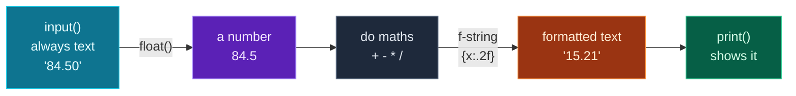

Yesterday you installed Python, set up VS Code and a virtual environment, and ran your first program. Today we slow down and learn the **raw materials** that every Python program — from a tiny script to a giant AI system — is built out of: **variables** and the **four core data types**.

By the end you'll understand how Python stores numbers, text and true/false values, how to do arithmetic and format text cleanly, and — crucially — how to turn the text a user types into numbers you can actually compute with. Then you'll put it all together in a real, interactive **tip & bill-splitting calculator**.

> **Coming straight from Day 1? Perfect.** This builds directly on it and still assumes no prior experience. Every term is explained the first time it appears, and you can try every snippet yourself — either in the **REPL** (type `python3` on Mac/Linux or `python` on Windows to start it) or by saving it in a `.py` file and running it. Learning by typing beats learning by reading.

Make a folder for today (e.g. `day-02`) and open it in VS Code, just like yesterday. A virtual environment isn't strictly needed today (we use no extra packages), but activating one is a great habit — see the [Day 1 cheat sheet](/articles/py-day-01-setup-and-first-program) if you want to.

---

## Variables: labelled boxes for your data

A **variable** is a name that points to a value. You create one with a single `=` sign, which means **"assign"** (not "equals" in the maths sense):

```python
age = 27
name = "Vishwas"
price = 19.99
```

Read `age = 27` as *"let `age` refer to the value 27."* From then on, writing `age` gives you back `27`. Think of a variable as a **labelled box**: the label is the name, and the value is what's inside. You can look in the box any time, and you can swap its contents:

```python
score = 10
print(score)        # 10
score = 25          # reassign — the box now holds 25
print(score)        # 25
score = score + 5   # read the box, add 5, put the result back
print(score)        # 30
```

**Output:**

```text
10
25
30
```

That last line trips up newcomers because it isn't valid maths — but it's perfectly valid Python. The right-hand side runs *first* (`score + 5` → `30`), and only then is the result stored back in `score`.

### Naming rules and conventions

A few rules (Python enforces these) and one strong convention (everyone follows it):

- Names can contain letters, digits and underscores, but **cannot start with a digit**: `total2` is fine, `2total` is an error.
- **No spaces** and no symbols like `-` or `$`.
- Names are **case-sensitive**: `Total` and `total` are two different variables.
- **Convention:** use lowercase words joined by underscores — `tip_amount`, `user_name`, `bill_total`. This style is called **snake_case**, and it's the standard across the entire Python world. Use clear, descriptive names; `x` tells future-you nothing, `per_person` tells the whole story.

---

## The four core data types

Every value in Python has a **type** — the kind of thing it is. Today we meet the four you'll use constantly. You can always ask Python a value's type with the built-in `type()` function:

| Type | Name | What it holds | Examples |
|---|---|---|---|
| `int` | integer | whole numbers | `0`, `27`, `-5`, `1000000` |
| `float` | floating-point | numbers with a decimal point | `19.99`, `3.0`, `-0.5` |
| `str` | string | text | `"hello"`, `"Vishwas"`, `""` |
| `bool` | boolean | a truth value | `True`, `False` |

```python
print(type(27))        # <class 'int'>
print(type(19.99))     # <class 'float'>
print(type("hello"))   # <class 'str'>
print(type(True))      # <class 'bool'>
```

The type matters because **it decides what you can do with a value.** You can multiply two numbers, but "multiplying" text does something completely different — and adding text to a number is an outright error. Let's look at each type.

---

## Numbers: int, float, and arithmetic

Python has two everyday number types: **`int`** for whole numbers and **`float`** for numbers with a decimal point. You rarely have to think about the difference — Python switches between them automatically — but it's good to know they exist.

Here are the arithmetic operators:

```python
print(7 + 2)    # addition
print(7 - 2)    # subtraction
print(7 * 2)    # multiplication
print(7 / 2)    # division        -> always a float
print(7 // 2)   # floor division  -> drops the remainder
print(7 % 2)    # modulo          -> the remainder
print(2 ** 5)   # exponent        -> 2 to the power of 5
```

**Output:**

```text
9
5
14
3.5
3
1
32
```

Three of these surprise beginners, so let's be explicit:

- **`/` always gives a `float`**, even when it divides evenly: `10 / 2` is `5.0`, not `5`. If you want a whole-number result, use…
- **`//` (floor division)** throws away anything after the decimal point: `7 // 2` is `3`. Handy for "how many whole groups fit."
- **`%` (modulo)** gives you the **remainder**: `7 % 2` is `1`. It's surprisingly useful — for example, `n % 2 == 0` tests whether `n` is even.

### Order of operations

Python follows normal maths precedence: `**` first, then `*` `/` `//` `%`, then `+` `-`. Use parentheses to be explicit and to make your intent obvious:

```python
print(2 + 3 * 4)     # 14  (multiplication happens first)
print((2 + 3) * 4)   # 20  (parentheses force addition first)
```

**Output:**

```text
14
20
```

> **One quirk to know about (not a bug):** because computers store decimals in binary, some sums look slightly off — `0.1 + 0.2` gives `0.30000000000000004`. This is normal in *every* programming language, not just Python. For money, we sidestep it by **formatting** the result to 2 decimals when we display it (you'll do exactly this in today's project), so the user always sees a clean `0.30`.

---

## Strings: working with text

A **string** is text, written inside quotes — single `'...'` or double `"..."`, your choice (just match them). Strings can hold letters, spaces, digits, punctuation, anything.

You can **join** strings with `+` (called concatenation) and **repeat** them with `*`:

```python
first = "Ada"
last = "Lovelace"
print(first + " " + last)   # join, with a space in between
print("ha" * 3)             # repeat
print(len("Python"))        # len() counts the characters
```

**Output:**

```text
Ada Lovelace
hahaha
6
```

Notice `len("Python")` is `6` — the built-in `len()` function tells you how many characters a string contains.

### f-strings: the clean way to build text

You met **f-strings** on Day 1; here's the proper introduction because you'll use them in almost every program. Put the letter `f` before the opening quote, and then drop variables (or even calculations) directly into the text inside `{curly braces}`:

```python
name = "Ada"
print(f"Hi {name}, you have {3 + 4} messages")
```

**Output:**

```text
Hi Ada, you have 7 messages
```

This is far cleaner than gluing pieces together with `+`, and it never forces you to convert numbers to text by hand. f-strings can also **format** a value — the part after a colon controls how it's displayed. The one you'll reach for daily is `:.2f`, which shows a number with exactly **2 decimal places** (perfect for money):

```python
price = 19.5
print(f"Total: ${price:.2f}")   # 2 decimal places
```

**Output:**

```text
Total: $19.50
```

### A few handy string methods

A **method** is an action attached to a value, called with a dot. Strings come with many; here are four you'll use often:

```python
print("python".upper())        # PYTHON
print("LOUD".lower())          # loud
print("ada lovelace".title())  # Ada Lovelace
print("  hi  ".strip())        # 'hi' without the surrounding spaces
```

**Output:**

```text
PYTHON
loud
Ada Lovelace
hi
```

`.strip()` is especially useful for cleaning up text a user typed, since people often add stray spaces. (There are dozens more methods — you'll meet them as you need them; no need to memorize.)

---

## Booleans: true or false

A **boolean** is the simplest type of all — it has only two possible values, `True` and `False` (capitalized, no quotes). Booleans are how programs make decisions, which becomes the heart of Day 4.

You usually get a boolean by **comparing** two values. The comparison operators are:

| Operator | Means | Example | Result |
|---|---|---|---|
| `==` | equal to | `5 == 5` | `True` |
| `!=` | not equal to | `5 != 5` | `False` |
| `>` | greater than | `5 > 3` | `True` |
| `<` | less than | `3 < 2` | `False` |
| `>=` | greater than or equal | `3 >= 3` | `True` |
| `<=` | less than or equal | `2 <= 1` | `False` |

```python
print(5 > 3)      # True
print(5 == 5)     # True
print(5 != 5)     # False
print(3 <= 2)     # False
age = 20
print(age >= 18)  # True
```

**Output:**

```text
True
True
False
False
True
```

> **Watch the doubled `==`.** A single `=` *assigns* a value (`age = 18`), while a double `==` *compares* two values (`age == 18`). Mixing them up is the single most common beginner slip — when you mean "is this equal to that?", always use `==`.

---

## Type conversion: making input usable

Here's the most important practical idea of the day, and the one that unlocks the project.

On Day 1 you used `input()` to ask the user a question. **`input()` always hands you back a string** — even if the user typed digits. So `input("Age: ")` gives you `"27"` (text), *not* `27` (a number). And you can't do maths on text:

```python
bill = "100"     # imagine this came from input()
print(bill + 5)  # we want 105...
```

**Output:**

```text
TypeError: can only concatenate str (not "int") to str
```

Python is telling you it can't add a number to text. The fix is **type conversion** — three built-in functions that turn one type into another:

- **`int("42")`** → `42` (text to whole number)
- **`float("3.14")`** → `3.14` (text to decimal number)
- **`str(42)`** → `"42"` (number to text)

```python
print(int("42") + 1)        # 43   — now it's a number, so + means add
print(float("3.14") * 2)    # 6.28
print("answer: " + str(42)) # 'answer: 42' — number turned to text to join it
```

**Output:**

```text
43
6.28
answer: 42
```

So the rule for interactive programs is simple: **read input as a string, then immediately convert it to the number type you need.** That's exactly what the project does.

### How a value flows through your program

This little pipeline is the shape of almost every interactive script you'll write today and beyond:



**Reading this diagram:**

Follow it left to right — it's the journey of a single piece of data, from the keyboard to the screen.

The **cyan box** on the left is what the user types. No matter what they enter, `input()` always gives it to you as a **string** — here the text `'84.50'`. Text is fine for names, but you can't add or multiply it.

The arrow into the **purple box** is labelled `float()`: this is the conversion step. We turn the string `'84.50'` into the actual number `84.5`. (We'd use `int()` instead when we need a whole number, like a count of people.) This conversion is the part beginners forget, and it's the cause of the `TypeError` you saw above — so it earns its own box.

The **grey box** is where the real work happens: now that you have genuine numbers, arithmetic (`+ - * /`) behaves the way you expect.

The arrow into the **orange box** is labelled with an f-string format, `{x:.2f}`. After computing, we turn the number *back* into nicely formatted text — `15.21`, rounded to two decimals — so money looks like money.

The **green box** is `print()`, putting that finished text on screen.

The key takeaway: **text comes in → convert to numbers → compute → format back to text → print.** Miss the "convert to numbers" step and Python stops you with a `TypeError`. Keep this shape in your head and interactive programs stop feeling mysterious.

---

## Build it: a tip & bill-splitting calculator

Time to combine everything — variables, all four types, arithmetic, conversion, comparison, and f-string formatting — into one useful tool. It asks for a bill amount, a tip percentage, and how many people are splitting, then prints a clean breakdown.

Create a file called **`tip_calculator.py`** in your `day-02` folder and paste in the whole thing:

```python
# tip_calculator.py — split a restaurant bill (with tip) between friends.

currency = "$"  # change this to your own symbol, e.g. "₹" or "€"

print("=== Bill Splitter ===\n")

# input() ALWAYS returns text (a string), so we convert it to a number.
bill = float(input("Total bill amount: "))
tip_percent = float(input("Tip percentage (e.g. 15): "))
people = int(input("How many people are splitting? "))

# the maths
tip_amount = bill * tip_percent / 100
total = bill + tip_amount
per_person = total / people

# a boolean (True/False) from a comparison
is_generous = tip_percent >= 20

# the breakdown — :.2f formats a number to exactly 2 decimal places
print("\n--- Breakdown ---")
print(f"Bill:         {currency}{bill:.2f}")
print(f"Tip ({tip_percent:.0f}%):     {currency}{tip_amount:.2f}")
print(f"Total:        {currency}{total:.2f}")
print(f"Per person:   {currency}{per_person:.2f}  (split {people} ways)")
print(f"Generous tipper? {is_generous}")
```

**Run it** (`python3 tip_calculator.py` on Mac/Linux, `python tip_calculator.py` on Windows), and type your answers when prompted. With a bill of `84.50`, an `18`% tip, split `3` ways:

```text
=== Bill Splitter ===

Total bill amount: 84.50
Tip percentage (e.g. 15): 18
How many people are splitting? 3

--- Breakdown ---
Bill:         $84.50
Tip (18%):     $15.21
Total:        $99.71
Per person:   $33.24  (split 3 ways)
Generous tipper? False
```

Try it with your own numbers — the maths always works out.

### Understanding the code

Everything here is something you learned today:

- **`currency = "$"`** — a `str` variable. Storing it once means you can switch to `"₹"` or `"€"` in a single place. Change it and re-run!
- **`float(input(...))`** — this is the conversion pipeline from the diagram, written in one line: `input()` reads the text, `float()` turns it into a number. We use `float` for the bill and tip (they can have decimals) and `int` for the number of people (always a whole number).
- **`bill * tip_percent / 100`** — ordinary arithmetic, now possible because we converted to numbers first. Following precedence, the multiplication and division run left to right.
- **`is_generous = tip_percent >= 20`** — a comparison that produces a `bool`. We didn't print `True`/`False` directly from a number; we *computed* a truth value and stored it.
- **`{bill:.2f}`** — the f-string formatter, showing money to 2 decimals. **`{tip_percent:.0f}`** shows the percentage with **0** decimals (a clean `18%`, not `18.00%`).

Six tools, one genuinely handy program. That's the whole game: small pieces, combined.

---

## Common errors and how to fix them

**1. `TypeError: can only concatenate str (not "int") to str`**
You tried to combine text and a number, almost always because you forgot to convert `input()`. Wrap the input in `float(...)` or `int(...)` before doing maths — or, when building text, convert the number with `str(...)`. This is *the* Day 2 error; the diagram above exists to prevent it.

**2. `TypeError: can't multiply sequence by non-int of type 'float'`**
Same root cause: you multiplied a *string* by a float (e.g. `"100" * 1.5`) instead of converting first. `float("100") * 1.5` works.

**3. `ValueError: could not convert string to float: 'abc'`**
You called `float(...)` (or `int(...)`) on text that isn't a number — often because the user typed letters, left it blank, or used a comma like `1,000`. The value's *type* was fine to convert, but its *content* wasn't a number. For now, just enter plain digits (use `1000`, not `1,000`); on Day 13 you'll learn to catch this gracefully instead of crashing.

**4. `ValueError: invalid literal for int() with base 10: '3.5'`**
`int("3.5")` fails because `"3.5"` isn't a *whole* number. Use `float("3.5")` for decimals, or `int(float("3.5"))` if you truly want to chop it down to `3`.

**5. `ZeroDivisionError: division by zero`**
You divided by zero — in the project, this happens if someone enters `0` people. Maths simply has no answer for it. For today, enter at least `1`; handling it cleanly is a Day 13 topic.

**6. `NameError: name 'totl' is not defined. Did you mean: 'total'?`**
A typo in a variable name, or using a variable before you've assigned it. Python even guesses the name you meant. Check spelling and that the variable was created *above* the line using it. (Remember: names are case-sensitive, so `Total` ≠ `total`.)

> **Reading tip:** the *last* line of an error names the error type and the reason. `TypeError` = wrong *type* of value; `ValueError` = right type but unacceptable *content*; `NameError` = a name Python doesn't recognize. Learn these three and most early errors become self-explanatory.

---

## Recap — what you can do now

You've learned the building blocks every Python program is made of:

- ✅ **Variables** — labelled boxes you assign with `=`, reassign freely, and name in `snake_case`.
- ✅ The **four core types** — `int`, `float`, `str`, `bool` — and `type()` to inspect any value.
- ✅ **Arithmetic** including the three sneaky ones: `/` (float division), `//` (floor), `%` (remainder).
- ✅ **Strings** — concatenation, repetition, `len()`, handy methods, and **f-strings** with `:.2f` formatting.
- ✅ **Booleans** and the six **comparison operators**, plus the `=` vs `==` distinction.
- ✅ **Type conversion** (`int()`, `float()`, `str()`) and the golden rule: *input comes in as text — convert it before you compute.*
- ✅ A real **tip & bill-splitting calculator** tying all of it together.

### Day 2 cheat sheet

| Category | What | Example |
|---|---|---|
| Assign | `=` | `tip = 15` |
| Arithmetic | `+ - * /` | `bill * 1.18` |
| Floor / remainder | `//` `%` | `17 // 5` → `3`, `17 % 5` → `2` |
| Power | `**` | `2 ** 10` → `1024` |
| Compare | `== != > < >= <=` | `tip >= 20` |
| To number | `int()`, `float()` | `float("84.50")` |
| To text | `str()` | `str(42)` |
| Format text | f-string | `f"${x:.2f}"` |
| Length | `len()` | `len("hello")` → `5` |
| Inspect type | `type()` | `type(19.99)` |

---

## Coming up on Day 3

So far each variable has held a single value. But real programs work with **collections** — many values grouped together. Tomorrow you'll meet Python's four built-in collections — **lists, tuples, sets, and dictionaries** — learn when to use each, and build a small **contact book** that stores and looks up people by name. This is where your programs start handling *real* data.

You now have the vocabulary of values. Next, we learn to organize them. See the full roadmap on the [Python for AI Engineering series page](/series/python-for-ai-engineering).

**See you on Day 3.** 🐍
