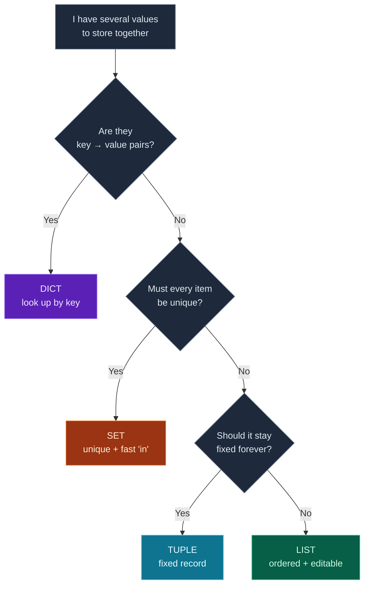

So far every variable has held **one** value — a number, a piece of text, a true/false. But real programs juggle *many* values at once: a list of prices, a contact book, the words in a sentence, the fields of a user profile. For that, Python gives you **collections** — containers that hold many values under a single name.

Today you'll meet all four built-in collections — **lists**, **tuples**, **sets**, and **dictionaries** — learn the handful of operations you'll use every day, and (most importantly) develop a feel for *which one to reach for when*. Then you'll build a small **contact book** that uses all four together. Dictionaries in particular are the single most important collection for AI work — the JSON data you'll get back from LLMs and APIs later in this series is, in Python, just nested dictionaries and lists.

> **Following along from Day 2?** This builds directly on it. Keep trying every snippet in the REPL (`python3` / `python`) or a scratch file as you read — that's how it sticks. Nothing here needs extra packages.

---

## The big picture: four containers

Here's the whole day in one table. Don't memorize it — by the end it'll make sense, and you can come back to it as a reference.

| Collection | Written with | Ordered? | Changeable? | Duplicates? | Best for |
|---|---|---|---|---|---|
| **list** | `[ ]` | yes | yes | yes | an ordered, editable sequence |
| **tuple** | `( )` | yes | **no** | yes | a fixed record that shouldn't change |
| **set** | `{ }` | no | yes | **no** | unique items + fast "is it in here?" |
| **dict** | `{key: value}` | yes\* | yes | keys unique | looking things up by a label (key) |

\*Dictionaries remember the order you inserted keys (since Python 3.7). Sets do not — don't rely on their order.

"Changeable" has a proper name in Python: **mutable** (can be changed after creation) vs **immutable** (can't). Lists, sets and dicts are mutable; tuples are immutable. Let's take them one at a time.

---

## Lists: ordered and editable

A **list** is an ordered, changeable sequence. You write it with square brackets `[ ]`, items separated by commas. It's the collection you'll use most.

```python
fruits = ["apple", "banana", "cherry"]
```

### Reading items by position (indexing)

Each item has a position number called its **index**, and — this catches everyone out at first — **counting starts at 0**, not 1. So the first item is `fruits[0]`. **Negative** indexes count from the end, so `fruits[-1]` is the last item:

```python
fruits = ["apple", "banana", "cherry"]
print(fruits[0])    # apple  (first)
print(fruits[2])    # cherry (third)
print(fruits[-1])   # cherry (last, counting from the end)
```

**Output:**

```text
apple
cherry
cherry
```

You can also grab a **slice** — a range of items — with `start:stop`, where `stop` is *not included*:

```python
print(fruits[0:2])  # items at index 0 and 1, but NOT 2
```

**Output:**

```text
['apple', 'banana']
```

### Changing a list

Because lists are mutable, you can add, remove, and replace items. These are the methods you'll use constantly:

```python
fruits = ["apple", "banana", "cherry"]
print(len(fruits))          # 3  — how many items

fruits.append("date")       # add to the END
fruits.insert(1, "blueberry")  # insert at index 1
print(fruits)

fruits.remove("banana")     # remove by value
last = fruits.pop()         # remove AND return the last item
print(fruits, "| popped:", last)

fruits[0] = "apricot"       # replace the item at index 0
print(fruits)

print("cherry" in fruits)   # membership test -> True/False
```

**Output:**

```text
3
['apple', 'blueberry', 'banana', 'cherry', 'date']
['apple', 'blueberry', 'cherry'] | popped: date
['apricot', 'blueberry', 'cherry']
True
```

Quick tour: **`append`** adds to the end, **`insert`** puts an item at a specific position, **`remove`** deletes the first matching value, **`pop`** removes the last item *and hands it back* to you, and assigning to `fruits[0]` replaces an item in place. The **`in`** keyword asks "is this value present?" and gives you a boolean.

---

## Tuples: fixed records

A **tuple** looks like a list but uses round brackets `( )` — and the key difference is that it's **immutable**: once created, you can't change it. That sounds like a limitation, but it's exactly what you want for data that *shouldn't* change: a coordinate, a date, a fixed pair of related values.

```python
point = (3, 4)
print(point[0], point[1])   # read by index, just like a list
```

**Output:**

```text
3 4
```

A lovely tuple trick is **unpacking** — pulling the values straight into separate variables in one line:

```python
point = (3, 4)
x, y = point     # x gets 3, y gets 4
print(x, y)
```

**Output:**

```text
3 4
```

> **The one-item gotcha:** to make a tuple with a single value, you need a trailing comma — `(5,)`. Without the comma, `(5)` is just the number `5` in parentheses, not a tuple:
> ```python
> print(type((5,)))   # <class 'tuple'>
> print(type((5)))    # <class 'int'>
> ```

Why use a tuple instead of a list? Two reasons: it signals "this is a fixed record, don't change it," and that immutability lets tuples be used in places lists can't — like keys in a dictionary or members of a set (more on why in the errors section).

---

## Sets: unique items

A **set** holds **unique** values — duplicates are automatically removed — and it's *unordered* (it doesn't track position). You write it with curly braces `{ }`. Sets shine for two jobs: removing duplicates, and answering "is this in the collection?" extremely fast.

```python
nums = {1, 2, 2, 3, 3, 3}   # duplicates collapse
print(nums)                 # {1, 2, 3}
nums.add(4)
print(3 in nums)            # fast membership test -> True
```

**Output:**

```text
{1, 2, 3}
True
```

The fastest way to **remove duplicates** from a list is to pass it to `set()`:

```python
print(set([1, 1, 2, 2, 3]))  # {1, 2, 3}
```

Sets also do the maths you learned in school — combine, overlap, subtract:

```python
a = {1, 2, 3}
b = {3, 4, 5}
print(a | b)   # union: everything in either set
print(a & b)   # intersection: only what's in BOTH
print(a - b)   # difference: in a but not b
```

**Output:**

```text
{1, 2, 3, 4, 5}
{3}
{1, 2}
```

> **Heads-up:** an empty `{}` is an empty **dictionary**, not a set — that's a historical quirk. For an empty set you must write `set()`. We'll flag this again in the errors section.

---

## Dictionaries: look things up by name

A **dictionary** (`dict`) stores **key → value** pairs. Instead of looking items up by a position number, you look them up by a meaningful **key** — usually a string. This is the collection that maps most naturally onto real-world data ("this person → that phone number") and onto the JSON you'll handle constantly in AI work.

```python
person = {"name": "Ada", "age": 36}
print(person["name"])   # look up the value for key "name"
```

**Output:**

```text
Ada
```

You add or update a value just by assigning to a key, and remove one with `del`:

```python
person = {"name": "Ada", "age": 36}
person["city"] = "London"   # add a new key
person["age"] = 37          # update an existing key
print(person)
del person["city"]          # remove a key
print(person)
```

**Output:**

```text
{'name': 'Ada', 'age': 37, 'city': 'London'}
{'name': 'Ada', 'age': 37}
```

### Looking up safely with `.get()`

If you ask for a key that doesn't exist with `person["email"]`, Python **crashes** with a `KeyError`. When you're not sure a key is there, use **`.get()`**, which returns a default instead of crashing:

```python
person = {"name": "Ada", "age": 37}
print(person.get("email", "n/a"))   # key missing -> default
print("name" in person)             # `in` checks the KEYS
print(list(person.keys()))          # all keys
print(list(person.values()))        # all values
```

**Output:**

```text
n/a
True
['name', 'age']
['Ada', 37]
```

Two things to lock in: **`.get(key, default)`** is the safe way to read a possibly-missing key, and **`in`** on a dictionary checks its **keys** (not its values). `.keys()` and `.values()` hand you all the keys or all the values — useful for the listing you'll do in the project.

---

## Which one should I use?

When you have several values to store, this decision tree picks the right container. It's the practical heart of today.



**Reading this diagram:**

Start at the top grey box and follow the arrows down, answering each question — the **grey diamonds** are the decisions, and the four coloured boxes at the bottom are the answers.

The **first question** is the most important: *are your values key → value pairs?* If each piece of data has a natural label — a name pointing to a phone number, a setting pointing to its value — the answer is yes, and you take the branch to the **purple DICT** box. Dictionaries are the default for labelled data.

If it's not key → value, the **second question** asks whether *every item must be unique*. If duplicates make no sense (a set of tags, a collection of unique IDs) and you'll often ask "is X in here?", you land on the **orange SET** box.

If duplicates and order are fine, the **third question** decides between the two sequence types: *should this collection stay fixed forever?* If it represents a fixed record that shouldn't be edited — a coordinate, a constant pair — choose the **cyan TUPLE** (immutable). Otherwise, you want the **green LIST** — ordered and freely editable, the everyday workhorse.

The takeaway: **dict for labelled lookups, set for uniqueness, tuple for fixed records, list for everything else.** When in doubt, a list is almost always a safe starting point — you can always switch later.

---

## Build it: a contact book

Now let's use all four in one program. A contacts app is a perfect fit: the contacts themselves are a **dict** (name → number), an ordered **favorites** list is a **list**, a **blocked** collection should hold unique entries so it's a **set**, and the app's name and version are a fixed record, so a **tuple**.

Create **`contact_book.py`** in a `day-03` folder and paste the whole thing:

```python
# contact_book.py — store and look up contacts using all four collections.

# Immutable app info — a TUPLE (fixed, can't be changed by accident)
app_info = ("Contact Book", 1.0)

# The main store — a DICT mapping name -> phone number
contacts = {
    "Ada": "555-0100",
    "Linus": "555-0142",
    "Grace": "555-0199",
}

# An ordered priority list — a LIST (order matters, duplicates allowed)
favorites = ["Grace", "Ada"]

# Unique blocked entries — a SET (no duplicates, fast membership checks)
blocked = {"Spam Caller", "Telemarketer"}

print(f"{app_info[0]} v{app_info[1]}")
print(f"You have {len(contacts)} contacts.\n")

# Add a contact — just assign to a new key
contacts["Margaret"] = "555-0125"

# Look one up SAFELY with .get() and a default (no crash if missing)
name = input("Look up a contact by name: ")
phone = contacts.get(name, "not found")
print(f"\n{name}: {phone}")

# Membership test with `in`
print(f"Is '{name}' blocked? {name in blocked}")
print(f"Is '{name}' a favorite? {name in favorites}")

# All current names (dict keys become a list)
print(f"\nAll contacts ({len(contacts)}): {list(contacts)}")
print(f"Favorites in order: {favorites}")
```

**Run it** (`python3 contact_book.py` / `python contact_book.py`) and type a name to look up — try `Ada`:

```text
Contact Book v1.0
You have 3 contacts.

Look up a contact by name: Ada

Ada: 555-0100
Is 'Ada' blocked? False
Is 'Ada' a favorite? True

All contacts (4): ['Ada', 'Linus', 'Grace', 'Margaret']
Favorites in order: ['Grace', 'Ada']
```

Try looking up a name that isn't there (like `Bob`) — thanks to `.get(name, "not found")`, it prints `Bob: not found` instead of crashing. That's the safe-lookup habit paying off.

### Understanding the code

Every collection earns its place:

- **`app_info = ("Contact Book", 1.0)`** — a **tuple**, because the app's name and version are a fixed record. We read it with `app_info[0]` and `app_info[1]`.
- **`contacts = { ... }`** — a **dict**, the natural shape for "name → phone." We add with `contacts["Margaret"] = ...` and read safely with `contacts.get(name, "not found")`.
- **`favorites = [ ... ]`** — a **list**, because favorites have an *order* (top favorite first) and could repeat.
- **`blocked = { ... }`** — a **set**, because a blocked entry should appear only once and we want a fast `in` check.
- **`list(contacts)`** turns the dict's keys into a list of names for display. (Showing each contact on its own neat line needs a **loop** — that's tomorrow.)

One small program, four collections, each chosen for the right reason. That instinct — "what shape does this data want to be?" — is what today is really about.

---

## Common errors and how to fix them

**1. `IndexError: list index out of range`**
You asked for a position that doesn't exist, e.g. `["a", "b"][5]`. Remember indexes start at `0`, so a 2-item list only has indexes `0` and `1`. Check the length with `len(...)`; the last valid index is always `len(...) - 1` (or just use `[-1]` for the last item).

**2. `KeyError: 'z'`**
You looked up a dictionary key that isn't there with `d["z"]`. Either the key is misspelled, or it genuinely doesn't exist. Use **`d.get("z", default)`** to get a fallback instead of a crash, or test first with `"z" in d`. This is the single most common dict mistake — `.get()` is your friend.

**3. `TypeError: 'tuple' object does not support item assignment`**
You tried to change a tuple, e.g. `t[0] = 9`. Tuples are **immutable** — that's the whole point of them. If you need to change the data, you wanted a **list** (`[ ]`) instead. (Relatedly, `t.append(3)` fails with `AttributeError: 'tuple' object has no attribute 'append'` for the same reason.)

**4. `TypeError: unhashable type: 'list'`**
You tried to put a **list** inside a **set**, or use a list as a **dict key** — e.g. `{[1, 2]}`. Only *immutable* values can be set members or dict keys, because Python needs them to stay constant. Use a **tuple** instead: `{(1, 2)}` works fine. (This is one of the best practical reasons tuples exist.)

**5. `{}` made a dict when I wanted a set**
Writing `tags = {}` gives you an empty **dictionary**, not a set — a long-standing quirk. For an empty set, write `tags = set()`. (A `{ }` with items, like `{1, 2}`, *is* a set; only the empty case is ambiguous.)

**6. My set "lost" the order / I can't index it**
Sets are **unordered**, so `my_set[0]` fails and the items may print in a different order than you added them. If order matters, use a **list**. If you need both uniqueness *and* order, deduplicate into a set, then convert back: `list(set(items))` (note this still doesn't preserve original order — for that you'd loop, which is Day 4).

> **Reading tip:** `IndexError` = a position that doesn't exist (lists); `KeyError` = a key that doesn't exist (dicts); `TypeError: unhashable` = you used a changeable value where Python needs a fixed one. Matching the error to the collection tells you almost everything.

---

## Recap — what you can do now

You've added Python's core data structures to your toolkit:

- ✅ **Lists** `[ ]` — ordered, editable; indexing (from `0`), negative indexes, slicing, and `append`/`insert`/`remove`/`pop`.
- ✅ **Tuples** `( )` — immutable fixed records, unpacking (`x, y = point`), and the one-item comma `(5,)`.
- ✅ **Sets** `{ }` — unique, unordered; deduping with `set(...)`, fast `in`, and union/intersection/difference.
- ✅ **Dictionaries** `{key: value}` — the workhorse for labelled data; `[key]` access, the safe `.get(key, default)`, `keys()`/`values()`, and `in` checking keys.
- ✅ A real **contact book** that picks the right collection for each job.
- ✅ The instinct for **which collection to reach for** — the decision tree.

### Day 3 cheat sheet

| Want to… | Do this | Works on |
|---|---|---|
| Get an item by position | `seq[0]`, `seq[-1]` | list, tuple |
| Get a slice | `seq[1:3]` | list, tuple |
| Add to the end | `lst.append(x)` | list |
| Insert at a position | `lst.insert(i, x)` | list |
| Remove by value / by position | `lst.remove(x)` / `lst.pop()` | list |
| Add an item | `s.add(x)` / `d[key] = v` | set / dict |
| Remove duplicates | `set(lst)` | list → set |
| Look up safely | `d.get(key, default)` | dict |
| All keys / values | `d.keys()` / `d.values()` | dict |
| Count items | `len(x)` | all four |
| Is it present? | `x in coll` | all four |

---

## Coming up on Day 4

You now have containers full of data — but to *do* something with every item (print each contact on its own line, total a list of prices, find matches), you need to **loop**. Tomorrow is **loops and conditionals**: `for` and `while` loops to walk through your collections, and `if`/`elif`/`else` to make decisions. You'll upgrade the contact book into a real menu-driven app you can interact with again and again. This is where your programs come alive.

You've learned to *store* data. Next, we learn to *process* it. See the full roadmap on the [Python for AI Engineering series page](/series/python-for-ai-engineering).

**See you on Day 4.** 🐍
