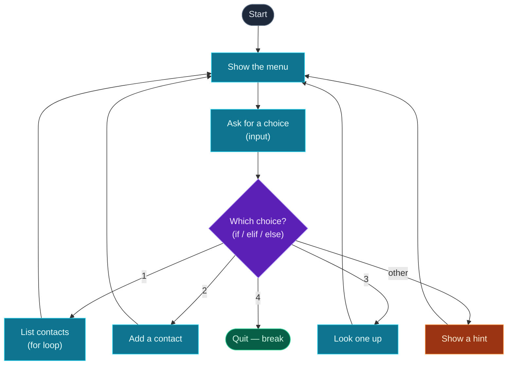

Every program you've written so far runs straight down the page — top to bottom, once, and then it's done. Real software doesn't work like that. It **makes decisions** ("if the user is logged in, show the dashboard") and it **repeats work** ("for every contact, print a line"). Those two abilities — **conditionals** and **loops** — are together called *control flow*, and they're what turn a script into a program.

Today you'll learn `if`/`elif`/`else` to make decisions, the `and`/`or`/`not` logic that powers them, and the two kinds of loops — `for` (do something for each item) and `while` (keep going until a condition changes). Then you'll combine all of it to rebuild the contact book from Day 3 into a proper **menu-driven app** that loops, takes commands, and runs until you choose to quit.

> **Following from Day 3?** This is the day everything starts to click — your programs become interactive and alive. Type the examples as you go (REPL or a scratch file). One new thing matters more than usual today: **indentation**. Read the next section carefully and you'll avoid the most common beginner error.

---

## First: indentation is how Python sees structure

In many languages, blocks of code are wrapped in `{ }` braces. **Python uses indentation instead** — the spaces at the start of a line. A line ending in a colon `:` starts a block, and the lines *indented underneath* belong to that block:

```python
if True:
    print("this line is INSIDE the if")
    print("so is this one")
print("this line is OUTSIDE — back at the left margin")
```

**Output:**

```text
this line is INSIDE the if
so is this one
this line is OUTSIDE — back at the left margin
```

The standard is **4 spaces** per level. The good news: in VS Code, after you type a line ending in `:` and press Enter, it indents for you automatically. The rule to remember: **colon, then indent.** Get the indentation wrong and Python stops with an `IndentationError` (we'll see it in the errors section) — it's not being fussy, it genuinely uses those spaces to understand your code.

---

## Conditionals: making decisions

A conditional runs a block **only if** a condition is true. The condition is any expression that comes out `True` or `False` — usually a comparison (you met these on Day 2: `==`, `!=`, `>`, `<`, `>=`, `<=`).

### `if` / `elif` / `else`

```python
score = 75

if score >= 90:
    print("A")
elif score >= 80:
    print("B")
elif score >= 70:
    print("C")
else:
    print("F")
```

**Output:**

```text
C
```

Python checks each condition **from the top**, runs the **first** block whose condition is `True`, and skips the rest. `score` is 75: it's not `>= 90`, not `>= 80`, but it *is* `>= 70`, so it prints `C` and stops checking. `elif` (short for "else if") lets you chain as many alternatives as you like; the final `else` is the catch-all that runs when nothing above matched. You can have an `if` on its own, an `if`/`else`, or a full `if`/`elif`/`else` chain — `elif` and `else` are optional.

### Combining conditions: `and`, `or`, `not`

Real decisions often depend on more than one thing. The **logical operators** combine booleans:

- **`and`** — true only if **both** sides are true
- **`or`** — true if **either** side is true
- **`not`** — flips true to false and vice-versa

```python
temp = 25
print(temp > 20 and temp < 30)   # both true?  -> True
print(temp < 0 or temp > 100)    # either true? -> False
print(not temp > 20)             # flip (temp > 20) -> False
```

**Output:**

```text
True
False
False
```

You can also use the `in` keyword from Day 3 directly as a condition — it reads almost like English:

```python
name = "Ada"
if name in ["Ada", "Grace"]:
    print("known contact")
```

**Output:**

```text
known contact
```

---

## `for` loops: do something for each item

A **`for` loop** runs a block once for *each item* in a collection. This is where Day 3's lists and dicts come alive. The shape is `for <variable> in <collection>:` — each time around, the variable holds the next item:

```python
for fruit in ["apple", "banana", "cherry"]:
    print(fruit)
```

**Output:**

```text
apple
banana
cherry
```

The loop variable (`fruit`) is yours to name; it takes each value in turn. You can loop over a **string** (character by character) and over a **dictionary** too. Looping a dict gives you its **keys** by default; use `.items()` to get key *and* value together:

```python
scores = {"Ada": 90, "Linus": 80}

for name in scores:            # keys by default
    print(name)

for name, score in scores.items():   # key AND value
    print(f"{name} scored {score}")
```

**Output:**

```text
Ada
Linus
Ada scored 90
Linus scored 80
```

### Counting with `range()`

When you want to repeat something a set number of times — or loop over numbers — use **`range()`**. `range(n)` gives you `0` up to but **not including** `n`; `range(start, stop)` gives `start` up to but not including `stop`:

```python
for i in range(3):       # 0, 1, 2
    print(i)

for i in range(1, 4):    # 1, 2, 3
    print(i)
```

**Output:**

```text
0
1
2
1
2
3
```

### The accumulator pattern

A loop that builds up a result — a running total, a count, a combined string — is one of the most useful patterns you'll ever write:

```python
total = 0
for price in [10, 20, 30]:
    total = total + price    # add each price to the running total
print(total)
```

**Output:**

```text
60
```

Start with an empty result (`0`), update it once per item, and read it after the loop. You'll reuse this shape constantly.

---

## `while` loops: repeat until something changes

A **`for`** loop runs once per item in a known collection. A **`while`** loop is different: it keeps repeating **as long as a condition stays true**, however many times that takes. Use it when you don't know the number of repetitions in advance:

```python
count = 3
while count > 0:
    print(count)
    count = count - 1    # move toward making the condition false
print("liftoff")
```

**Output:**

```text
3
2
1
liftoff
```

The critical line is `count = count - 1`. Each pass moves `count` closer to `0`; once `count > 0` becomes false, the loop ends. **If you forget to change the variable, the condition never becomes false and the loop runs forever** — an *infinite loop*. (More on escaping one in the errors section.)

### `break` and `continue`

Two keywords give you finer control inside any loop:

- **`break`** — stop the loop immediately and move on.
- **`continue`** — skip the rest of *this* pass and jump to the next item.

```python
for n in range(1, 6):       # 1, 2, 3, 4, 5
    if n == 3:
        continue            # skip 3
    if n == 5:
        break               # stop entirely at 5
    print(n)
```

**Output:**

```text
1
2
4
```

`3` is skipped by `continue`; `4` prints; at `5` the `break` ends the loop before printing. These two combined with `while True:` give us the classic **menu loop** — an intentionally endless loop that we `break` out of when the user chooses "Quit." That's exactly what the project uses.

---

## The shape of a menu loop

Before building it, picture the flow. This is the skeleton of almost every interactive command-line tool:



**Reading this diagram:**

Follow the arrows from the top. The dark **Start** box is where the program begins. It flows into the cyan **"Show the menu"** and **"Ask for a choice"** boxes — these are the actions that run every time around the loop: print the options, then read what the user types with `input()`.

The purple **diamond** is the decision — the `if`/`elif`/`else` chain. Based on the choice, exactly one branch is taken: choices `1`, `2`, and `3` go to the three cyan **action** boxes (list, add, look up), `4` goes to the green **"Quit"** box, and anything else goes to the orange **"Show a hint"** box that gently corrects the user.

Now the most important part — the **loop**. Notice that every action box except "Quit" has an arrow going **back up to "Show the menu."** That backward arrow *is* the loop: after doing a task, the program returns to the top and shows the menu again, ready for the next command. This is the `while True:` cycle drawn as a picture.

Only **one** path escapes the cycle: choosing `4` reaches the green **"Quit"** box, which is the `break` — the single exit that ends the loop and the program. The takeaway: a menu app is just *one decision wrapped in a loop*, repeating until a deliberate `break` lets it out.

---

## Build it: a menu-driven contact book

Time to bring Day 3's contact book to life. Instead of running once, it will loop — showing a menu, doing what you ask, and coming back for more until you quit. Create **`contact_book.py`** in a `day-04` folder and paste the whole thing:

```python
# contact_book.py — a menu-driven contact book (Day 4: loops & conditionals)

contacts = {
    "Ada": "555-0100",
    "Linus": "555-0142",
    "Grace": "555-0199",
}

print("=== Contact Book ===")

while True:
    print("\nMenu:")
    print("  1. List all contacts")
    print("  2. Add a contact")
    print("  3. Look up a contact")
    print("  4. Quit")

    choice = input("Choose an option (1-4): ")

    if choice == "1":
        if len(contacts) == 0:
            print("No contacts yet.")
        else:
            print(f"\nYou have {len(contacts)} contacts:")
            for name, phone in contacts.items():
                print(f"  - {name}: {phone}")

    elif choice == "2":
        name = input("Name: ")
        phone = input("Phone: ")
        contacts[name] = phone
        print(f"Saved {name}.")

    elif choice == "3":
        name = input("Name to look up: ")
        if name in contacts:
            print(f"{name}: {contacts[name]}")
        else:
            print(f"{name} not found.")

    elif choice == "4":
        print("Goodbye!")
        break

    else:
        print("Please enter a number from 1 to 4.")
```

**Run it** (`python3 contact_book.py` / `python contact_book.py`). It keeps looping until you choose `4`. Here's a full session — listing contacts, adding Margaret, looking up two names, mistyping, then quitting (the menu reprints every loop; it's abbreviated as `Menu: …` after the first to save space):

```text
=== Contact Book ===

Menu:
  1. List all contacts
  2. Add a contact
  3. Look up a contact
  4. Quit
Choose an option (1-4): 1

You have 3 contacts:
  - Ada: 555-0100
  - Linus: 555-0142
  - Grace: 555-0199

Menu: …
Choose an option (1-4): 2
Name: Margaret
Phone: 555-0125
Saved Margaret.

Menu: …
Choose an option (1-4): 3
Name to look up: Margaret
Margaret: 555-0125

Menu: …
Choose an option (1-4): 3
Name to look up: Bob
Bob not found.

Menu: …
Choose an option (1-4): 9
Please enter a number from 1 to 4.

Menu: …
Choose an option (1-4): 4
Goodbye!
```

You just built a program you can actually *use* — and it doesn't stop until you tell it to.

### Understanding the code

Every idea from today is in here:

- **`while True:`** — an intentionally endless loop. `True` is always true, so it repeats forever… until a `break` stops it. This is the standard "keep going until the user quits" pattern.
- **The menu `print`s and `input()`** run at the top of every loop, so the user always sees the options and gets asked again.
- **`if choice == "1": … elif … else:`** — the decision that routes each choice to its action. Note we compare to `"1"` *as text*, because `input()` always returns a string (Day 2!).
- **`for name, phone in contacts.items():`** — the `for` loop that prints every contact on its own line. The nested `if len(contacts) == 0:` handles the empty case gracefully.
- **`if name in contacts:`** — membership test (Day 3) deciding whether the lookup succeeds.
- **`break`** — the one and only exit, reached only when the user types `4`. The final `else` catches everything invalid.

Look back at the diagram — every box and arrow is now a piece of real code you wrote.

---

## Common errors and how to fix them

**1. `IndentationError: expected an indented block after 'if' statement on line 1`**
You wrote a line ending in `:` but didn't indent the line beneath it. Every `if`, `for`, `while`, `elif`, `else` must be followed by an **indented** block (4 spaces). Indent the body and you're set. Mixing tabs and spaces causes this too — let VS Code insert spaces (it does by default).

**2. `SyntaxError: expected ':'`**
You forgot the colon at the end of an `if`, `for`, `while`, or `else` line — e.g. `for i in range(3)` instead of `for i in range(3):`. Every block-opening line ends in `:`. Add it.

**3. `SyntaxError: invalid syntax. Maybe you meant '==' or ':=' instead of '='?`**
You used a single `=` (assign) where you meant `==` (compare): `if x = 5:`. Conditions compare, so use `==`. Python even guesses the fix for you — a great example of reading the full error message.

**4. My program is stuck / frozen (an infinite loop)**
A `while` loop whose condition never becomes false runs forever — usually because you forgot to change the variable inside it (like leaving out `count = count - 1`), or a `while True:` with no reachable `break`. It's not a crash, just an endless loop. **To stop it, press `Ctrl + C`** in the terminal — that interrupts the running program. Then fix the loop so the condition can eventually end (or so a `break` is reachable).

**5. `RuntimeError: dictionary changed size during iteration`**
You added or removed keys from a dictionary *while looping over it*. Python won't let you change a collection's size mid-loop. The fix: loop over a **copy** of the keys — `for k in list(d):` — or collect your changes in a separate list and apply them after the loop.

**6. `TypeError: 'int' object is not iterable`**
You tried to loop over something that isn't a collection, like `for x in 5:`. You can only loop over iterable things — lists, tuples, sets, dicts, strings, and `range(...)`. If you want to count, wrap the number in `range()`: `for x in range(5):`.

> **Reading tip:** `IndentationError` and `SyntaxError` are *structure* problems — Python couldn't even understand the code, so check colons and indentation first. `RuntimeError` and `TypeError` happen while the code runs, and the message usually names exactly what went wrong.

---

## Recap — what you can do now

Your programs can now think and repeat:

- ✅ **Indentation & blocks** — the colon-then-indent rule that gives Python its structure.
- ✅ **Conditionals** — `if`/`elif`/`else`, comparisons, and `and`/`or`/`not` logic.
- ✅ **`for` loops** — over lists, strings, and dicts (with `.items()`), plus `range()` and the accumulator pattern.
- ✅ **`while` loops** — condition-based repetition, and the `while True:` + `break` menu pattern.
- ✅ **`break` and `continue`** — fine control over any loop.
- ✅ A real, **menu-driven contact book** that runs until you quit.

### Day 4 cheat sheet

| Want to… | Write |
|---|---|
| Decide | `if cond:` / `elif cond:` / `else:` |
| Combine conditions | `a and b`, `a or b`, `not a` |
| Loop over items | `for item in collection:` |
| Loop over a dict | `for k, v in d.items():` |
| Repeat N times | `for i in range(N):` |
| Repeat while true | `while condition:` |
| Loop forever, exit on cue | `while True:` … `break` |
| Skip one / stop early | `continue` / `break` |
| Running total | `total = 0` then `total += x` in a loop |
| Stop a stuck program | press `Ctrl + C` |

*(That `total += x` is a shortcut for `total = total + x` — handy and common.)*

---

## Coming up on Day 5

Your contact book works, but it's all one long block of code. As programs grow, you need to break them into reusable, named pieces — and that's what **functions** are. Tomorrow you'll learn to define your own functions with `def`, pass them **arguments**, get values back with `return`, and refactor the contact book so each menu action (list, add, look up) becomes its own clean, testable function. It's the single biggest step toward writing code that scales.

You've learned to control the flow. Next, we learn to organize it. See the full roadmap on the [Python for AI Engineering series page](/series/python-for-ai-engineering).

**See you on Day 5.** 🐍
