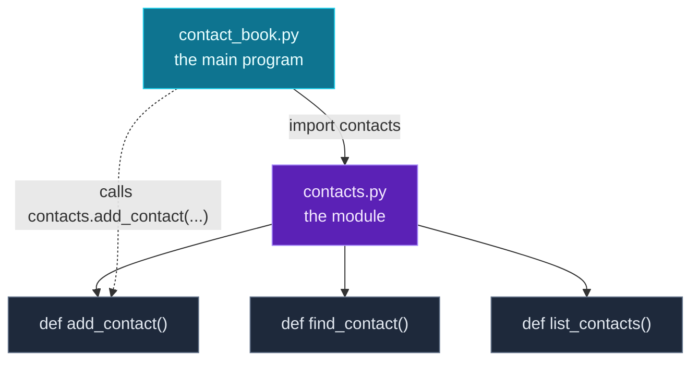

Your contact book is now a tidy set of functions (Day 5) — but they all still live in one file, jammed together with the menu loop. Real projects don't work that way. They spread code across **many files**, each with one clear responsibility, and pull in code that other people wrote. Today you learn how Python organises code at any size — and it's the final piece of the foundations.

Three connected ideas: **scope** (where a variable can be seen), **modules** (how to split code into separate `.py` files), and **imports** (how to use code from another file — your own *or* Python's enormous built-in library). Then you'll split the contact book into a reusable `contacts.py` module and a clean `contact_book.py` program — exactly how professional Python is structured.

> **This completes Module 1.** After today you'll have the full toolkit of Python basics — variables, collections, control flow, functions, and now structure. From Day 7 we start *applying* it (comprehensions, data handling, and onward toward AI). Type the examples as you go.

---

## Scope: where a variable lives

On Day 5 you saw that variables created inside a function are *local* to it. Let's make the rule precise. A variable's **scope** is the region of code where it's visible. There are two you care about now:

- **Local scope** — names created *inside* a function. They exist only while that function runs.
- **Global scope** — names created at the top level of your file (not inside any function). They're visible everywhere in that file.

A function can **read** a global variable:

```python
message = "hello from the top level"   # global

def show():
    print(message)                     # reads the global — fine

show()
```

**Output:**

```text
hello from the top level
```

But a local variable does **not** leak back out:

```python
def f():
    x = 10              # local to f
    print("inside f, x =", x)

f()
# print(x)   # would fail: x doesn't exist out here
```

**Output:**

```text
inside f, x = 10
```

This isolation is a *feature*: each function gets its own private workspace, so a variable named `name` in one function can't accidentally stomp on a `name` in another. It's a big part of why functions make large programs safe to work on.

### Reassigning a global (and why to avoid it)

Reading a global from inside a function works. But if you try to *reassign* one, Python assumes you meant to make a new local — unless you explicitly say `global`:

```python
count = 0

def increment():
    global count        # "I mean the global count"
    count = count + 1

increment()
increment()
print("count =", count)
```

**Output:**

```text
count = 2
```

The `global` keyword works, but lean on it sparingly. Functions that quietly reach out and modify globals are hard to follow and hard to test. **The cleaner pattern is the one you already know: take values in as parameters and hand results back with `return`.** You'll see this in today's project — the functions receive the contact book as an argument instead of reaching for a global.

> **A quick note on built-ins.** Names like `print`, `len`, `range`, and `int` live in a third scope — the *built-in* scope — which is always available. That's why you never have to import them. (Avoid naming your own variables `list`, `dict`, `sum`, etc. — doing so hides the built-in of the same name.)

---

## Modules: code in separate files

A **module** is simply a Python file. Any `.py` file you write *is* a module, and you can pull its functions and variables into another file with **`import`**. This is how you split a growing program into focused pieces.

Say you have a file `contacts.py` with a function `add_contact`. From another file in the same folder, you bring it in:

```python
import contacts                 # load the whole module

contacts.add_contact(book, "Ada", "555-0100")   # use it via module.name
```

After `import contacts`, everything defined in `contacts.py` is available with a `contacts.` prefix. That prefix is a feature — it tells the reader exactly where `add_contact` comes from.

There are a few import styles, and you'll use all of them:

```python
import math                  # 1) whole module — call as math.sqrt(...)
from math import sqrt        # 2) one name — call it directly as sqrt(...)
import math as m             # 3) with an alias — call as m.sqrt(...)
```

```python
print(math.sqrt(25))   # style 1
print(sqrt(25))        # style 2
print(m.pi)            # style 3
```

**Output:**

```text
5.0
5.0
3.141592653589793
```

Use `import module` when you want the clarity of the prefix, `from module import name` when you'll use one thing a lot, and `as` to shorten long names (you'll see `import pandas as pd` constantly later in this series).

> **Naming gotcha.** Don't give a variable the same name as a module you imported. If you write `import contacts` and then also make a variable called `contacts`, the variable *replaces* the module and `contacts.add_contact(...)` breaks. That's why today's project names its dictionary `phone_book`, not `contacts`.

---

## The `if __name__ == "__main__":` idiom

Here's a subtlety that confuses every newcomer the first time. **When you import a module, Python runs all of its top-level code** — not just the `def`s, but any loose statements too. Usually you don't want a file's "run the program" code to fire merely because someone imported it.

The fix is a standard guard you'll see in nearly every Python program:

```python
def main():
    print("the program runs here")

if __name__ == "__main__":
    main()
```

Python sets a special variable `__name__` in every file. When you **run a file directly** (`python contact_book.py`), its `__name__` is the string `"__main__"`. When the same file is **imported** by another, its `__name__` is the module's name instead. So `if __name__ == "__main__":` means *"only do this when I'm the program being run, not when I'm being imported."* Put your startup code there, and your file works both as a runnable program and as an importable module.

---

## The standard library: batteries included

Python ships with a huge collection of ready-made modules — the **standard library** — covering maths, randomness, dates, files, the web, and much more. You import them exactly like your own modules; nothing to install. A taste:

```python
import math
print(math.sqrt(16))                 # 4.0
print(math.ceil(4.2), math.floor(4.8))  # round up / down

import random
random.seed(42)                      # makes the "random" result repeatable
print(random.randint(1, 6))          # a dice roll: 1–6
print(random.choice(["heads", "tails"]))

import datetime
d = datetime.date(2026, 6, 21)
print(d, "→ year", d.year)
```

**Output:**

```text
4.0
5 4
6
heads
2026-06-21 → year 2026
```

`random.seed(42)` is worth noting: seeding the random generator makes it produce the *same* sequence every run — invaluable when you want reproducible results, which matters a lot in data and AI work. There are hundreds more modules; you'll meet `json`, `os`, and `pathlib` on Day 15, and `asyncio` later in the series.

> **Looking ahead — pip.** Beyond the standard library, the Python community has published hundreds of thousands of **third-party packages** (Pydantic, httpx, NumPy, Pandas — all coming in this series). You install them with `pip` and then `import` them exactly like any other module. We give virtual environments and `pip` their own full day on **Day 16**.

---

## How a program and its module fit together

Here's the shape of today's project — a program file and a module file, connected by `import`:



**Reading this diagram:**

There are two files, shown as two coloured boxes. The **cyan box** at the top is `contact_book.py` — the *program* you actually run. The **purple box** is `contacts.py` — the *module*, a reusable toolbox of functions.

The solid arrow from the program to the module is labelled **`import contacts`**. When the program runs, that line loads the module file once — and from then on, everything inside it is available under the `contacts.` prefix.

The three **grey boxes** hanging off the module are the functions it provides: `add_contact`, `find_contact`, and `list_contacts`. They live in the module, not in the program.

The **dotted arrow** from the program down to `add_contact` shows the program *using* one of those functions — `contacts.add_contact(...)`. The data (the phone book) is passed in as an argument and the result comes back via `return`, exactly the clean parameter-and-return style from Day 5.

The takeaway: **the module is a self-contained toolbox; the program imports it and calls its tools.** Split this way, `contacts.py` could be reused by a completely different program tomorrow — and each file stays small enough to understand at a glance.

---

## Build it: split the contact book into a module + a program

Now the payoff. We'll separate the contact book into two files in the **same folder**: `contacts.py` (the reusable functions) and `contact_book.py` (the program that uses them).

**File 1 — `contacts.py`** (the module). Notice it has *no* menu, no input, no top-level run code — it's pure, reusable functions, each taking the book as a parameter:

```python
# contacts.py — reusable contact-book functions, living in their own MODULE.

def list_contacts(book):
    if len(book) == 0:
        print("No contacts yet.")
        return
    print(f"\nYou have {len(book)} contacts:")
    for name, phone in book.items():
        print(f"  - {name}: {phone}")

def add_contact(book, name, phone):
    book[name] = phone
    return len(book)

def find_contact(book, name):
    return book.get(name)
```

**File 2 — `contact_book.py`** (the program). It imports the module and wires the functions into the menu:

```python
# contact_book.py — the main program. It IMPORTS the functions from contacts.py
import contacts

# Named phone_book (not "contacts") so it doesn't clash with the module name.
phone_book = {
    "Ada": "555-0100",
    "Linus": "555-0142",
    "Grace": "555-0199",
}

def show_menu():
    print("\nMenu:")
    print("  1. List all contacts")
    print("  2. Add a contact")
    print("  3. Look up a contact")
    print("  4. Quit")

def main():
    print("=== Contact Book ===")
    while True:
        show_menu()
        choice = input("Choose an option (1-4): ")
        if choice == "1":
            contacts.list_contacts(phone_book)
        elif choice == "2":
            name = input("Name: ")
            phone = input("Phone: ")
            total = contacts.add_contact(phone_book, name, phone)
            print(f"Saved {name}. You now have {total} contacts.")
        elif choice == "3":
            name = input("Name to look up: ")
            phone = contacts.find_contact(phone_book, name)
            if phone is None:
                print(f"{name} not found.")
            else:
                print(f"{name}: {phone}")
        elif choice == "4":
            print("Goodbye!")
            break
        else:
            print("Please enter a number from 1 to 4.")

if __name__ == "__main__":
    main()
```

**Run the program** (not the module): `python3 contact_book.py` / `python contact_book.py`. It behaves just like Day 5 — same session, menu abbreviated as `Menu: …` after the first:

```text
=== Contact Book ===

Menu:
  1. List all contacts
  2. Add a contact
  3. Look up a contact
  4. Quit
Choose an option (1-4): 1

You have 3 contacts:
  - Ada: 555-0100
  - Linus: 555-0142
  - Grace: 555-0199

Menu: …
Choose an option (1-4): 2
Name: Margaret
Phone: 555-0125
Saved Margaret. You now have 4 contacts.

Menu: …
Choose an option (1-4): 3
Name to look up: Margaret
Margaret: 555-0125

Menu: …
Choose an option (1-4): 3
Name to look up: Bob
Bob not found.

Menu: …
Choose an option (1-4): 9
Please enter a number from 1 to 4.

Menu: …
Choose an option (1-4): 4
Goodbye!
```

Identical behaviour — but the *structure* is now professional. The data-handling logic lives in a clean, reusable module; the program just orchestrates it.

### Understanding the code

- **`import contacts`** at the top of the program loads `contacts.py` (it must be in the same folder). Every function is then reachable as `contacts.list_contacts(...)`, `contacts.add_contact(...)`, etc.
- **The module takes data as parameters.** `add_contact(book, name, phone)` receives the phone book rather than reaching for a global — so `contacts.py` knows nothing about *which* program uses it. That's what makes it reusable.
- **`phone_book`, not `contacts`.** The dictionary is deliberately named `phone_book` so it doesn't shadow the imported `contacts` module. (Name it `contacts` and `contacts.add_contact(...)` would break — the naming gotcha in action.)
- **`if __name__ == "__main__": main()`** runs the program only when you execute `contact_book.py` directly. If another file ever did `import contact_book`, the menu would *not* spring to life uninvited.

You now have the exact file layout real Python projects use — and on Day 16 you'll formalise it further with a project folder and a virtual environment.

---

## Common errors and how to fix them

**1. `ModuleNotFoundError: No module named 'contacts'`**
Python can't find the module you imported. Two usual causes: a **typo** in the name (`import contactz`), or you're running the program from a **different folder** than the module. For your own modules, keep the `.py` files in the same folder and run the program from there. (For installed packages, the cause is usually "not pip-installed yet" — Day 16.)

**2. `AttributeError: module 'math' has no attribute 'squareroot'`**
The module exists, but you asked for a function it doesn't have — usually a typo or wrong name (`math.squareroot` instead of `math.sqrt`). Check the spelling, or look up the module's real function names.

**3. `ImportError: cannot import name 'sqrtt' from 'math'`**
With `from math import sqrtt`, you tried to import a name that isn't in the module. Same fix as above — correct the name (`sqrt`). Python often appends a helpful `Did you mean: 'sqrt'?`.

**4. `NameError: name 'math' is not defined`**
You used `math.sqrt(...)` but only did `from math import sqrt` — that style imports *just* `sqrt`, not the `math` name. Either call it bare (`sqrt(...)`), or switch to `import math` and use `math.sqrt(...)`. Pick one style per name and stay consistent.

**5. `AttributeError: 'int' object has no attribute 'sqrt'`**
You shadowed a module with a variable: `import math`, then later `math = 5`, then `math.sqrt(4)` — now `math` is the number `5`, not the module. Rename the variable. (This is the naming gotcha again — the reason the project uses `phone_book`.)

**6. My module's code runs when I import it**
You imported a file that has top-level run code (a loop, a `print`, an `input`) not protected by a guard — so it executed on import. Wrap that startup code in `if __name__ == "__main__":` so it only runs when the file is executed directly.

> **Reading tip:** `ModuleNotFoundError` = Python can't find the *file/package*; `ImportError`/`AttributeError` = it found the module but not the *name* inside it. That one distinction points you straight at the fix.

---

## Recap — Module 1 complete 🎉

That's the foundations done. Over six days you've gone from installing Python to writing structured, multi-file programs:

- ✅ **Scope** — local vs global, reading globals, the `global` keyword (and why `return` is usually better), and built-ins.
- ✅ **Modules** — any `.py` file is one; `import` it and use its names.
- ✅ **Import styles** — `import module`, `from module import name`, `import module as alias` — and the naming gotcha.
- ✅ **`if __name__ == "__main__":`** — run-as-program vs import-as-module.
- ✅ **The standard library** — `math`, `random`, `datetime`, and the hundreds more that ship with Python.
- ✅ A **two-file contact book** structured like a real project.

### Day 6 cheat sheet

| Want to… | Write |
|---|---|
| Import a whole module | `import contacts` |
| Use something from it | `contacts.add_contact(...)` |
| Import one name | `from math import sqrt` |
| Import with a short alias | `import pandas as pd` |
| Guard your run code | `if __name__ == "__main__":` |
| Square root / round up / down | `math.sqrt(x)` / `math.ceil(x)` / `math.floor(x)` |
| Random int / pick | `random.randint(a, b)` / `random.choice(seq)` |
| Make randomness repeatable | `random.seed(42)` |
| Today's date | `datetime.date.today()` |

---

## Coming up on Day 7 — a new module begins

Foundations: complete. Starting tomorrow we get *Pythonic* — writing the short, expressive code that Python is loved for. **Day 7 is list and dictionary comprehensions**: turning multi-line loops that build lists and dicts into single, readable lines. You'll take loops like the ones you wrote this week and compress them into elegant one-liners — a skill you'll use in almost every data and AI script from here on.

You've built the foundation. Now we start building *up*. See the full roadmap on the [Python for AI Engineering series page](/series/python-for-ai-engineering).

**See you on Day 7.** 🐍
