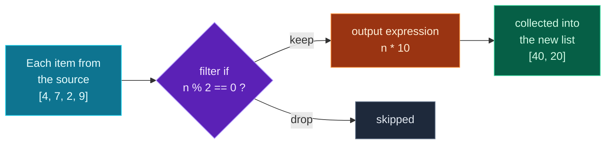

Welcome to **Module 2 — Pythonic Data Handling**. The foundations are behind you; now we learn the moves that make Python *feel* like Python. First up, and one of the most beloved features in the language: **comprehensions**.

All week you've written loops that build up a list — start with an empty list, loop, `append`. It's a pattern so common that Python has a one-line shorthand for it. A **comprehension** lets you build a new list (or dictionary, or set) from an existing collection in a single, readable expression — often filtering and transforming at the same time. Master this and your data code gets dramatically shorter and clearer. It's also the bridge into real data work: filtering and reshaping records like these is most of what you do before feeding data to any model or API.

> **Module 2 begins here.** You've got all the basics — loops, conditionals, functions, dicts. Today we combine them into something elegant. Type every example; comprehensions click fastest when you *see* them produce output. (This and the coming days are member lessons — the free preview was Days 1–4.)

---

## From a loop to a comprehension

Here's the loop you've written a dozen times this week — build a list of squares:

```python
squares = []
for n in range(1, 6):
    squares.append(n * n)
print(squares)
```

**Output:**

```text
[1, 4, 9, 16, 25]
```

A **list comprehension** says the exact same thing in one line:

```python
squares = [n * n for n in range(1, 6)]
print(squares)
```

**Output:**

```text
[1, 4, 9, 16, 25]
```

Read it left to right, almost like English: *"`n * n`, for each `n` in `range(1, 6)`."* The whole thing is wrapped in `[ ]` because it builds a **list**. It has two parts:

- **the output expression** — `n * n`, what to put in the new list for each item;
- **the for-clause** — `for n in range(1, 6)`, where the items come from.

That's the core shape: `[expression for item in iterable]`. No empty list, no `.append`, no extra lines — and once your eye adjusts, it's easier to read, not harder.

---

## Filtering: the `if` clause

Add an `if` at the **end** and the comprehension keeps only the items that match — filtering as it builds:

```python
nums = [4, 7, 2, 9, 5, 1, 8]
evens = [n for n in nums if n % 2 == 0]
print(evens)
```

**Output:**

```text
[4, 2, 8]
```

Each `n` is tested against `n % 2 == 0` (the remainder trick from Day 2); only the ones that pass make it into the result. The shape is now `[expression for item in iterable if condition]`. You can transform and filter at once — here, the names of in-stock items, uppercased:

```python
words = ["hello", "world", "python"]
print([w.upper() for w in words])     # transform every item
print([len(w) for w in words])        # a different transform
```

**Output:**

```text
['HELLO', 'WORLD', 'PYTHON']
[5, 5, 6]
```

---

## Two kinds of `if` — don't mix them up

This is the one part that trips people up, so let's be explicit. There are **two** places an `if` can appear, and they mean different things:

1. **Filter `if`** — at the **end**, *decides whether to include* the item. It has no `else`:
   ```python
   [n for n in nums if n > 0]          # keep only positives
   ```
2. **Conditional expression** — at the **start** (in the output expression), *chooses what value to produce* for every item. It must have an `else`:
   ```python
   [n if n > 0 else 0 for n in nums]   # replace negatives with 0, keep all
   ```

The difference: the filter `if` *drops* items; the conditional expression *keeps all items but transforms* them. See it run:

```python
nums = [-3, 5, -1, 8]
clamped = [n if n > 0 else 0 for n in nums]
print(clamped)
```

**Output:**

```text
[0, 5, 0, 8]
```

Every item stays (four in, four out), but negatives became `0`. **Rule of thumb: `if` *before* the `for` needs an `else` (it's choosing a value); `if` *after* the `for` has no `else` (it's filtering).** Putting an `else` on a filter `if` is a syntax error (you'll see it below).

---

## How a comprehension processes your data

A comprehension is really a little assembly line. Picture each item flowing through it:



**Reading this diagram:**

This is the comprehension `[n * 10 for n in source if n % 2 == 0]` drawn as a pipeline, read left to right — it's the journey of every item in the source list.

The **cyan box** on the left is the source — the `for n in source` part. Each item enters the line one at a time: `4`, then `7`, then `2`, then `9`.

The **purple diamond** is the **filter `if`** — `if n % 2 == 0`. Each item is tested. `4` and `2` are even, so they take the **keep** path. `7` and `9` are odd, so they follow the **drop** path to the grey **"skipped"** box and never appear in the result.

The items that survive reach the **orange box** — the **output expression**, `n * 10` (the part written *before* the `for`). This transforms each kept item: `4` becomes `40`, `2` becomes `20`.

The **green box** on the right collects those transformed values into the new list: `[40, 20]`.

The takeaway: a comprehension is **source → filter → transform → collect**, all in one line. Reading any comprehension is just finding those parts: the `for` (source), the trailing `if` (filter), and the leading expression (transform).

---

## Dictionary comprehensions

The same idea builds **dictionaries** — just use `{ }` and give a `key: value` pair as the output. This is enormously useful for building lookup tables:

```python
names = ["Ada", "Linus", "Grace"]
name_lengths = {name: len(name) for name in names}
print(name_lengths)
```

**Output:**

```text
{'Ada': 3, 'Linus': 5, 'Grace': 5}
```

A classic move is **swapping keys and values** — loop over `.items()` (Day 4) and put the value first:

```python
prices = {"apple": 3, "banana": 1}
flipped = {v: k for k, v in prices.items()}
print(flipped)
```

**Output:**

```text
{3: 'apple', 1: 'banana'}
```

Dictionary comprehensions take a filter `if` too, exactly like lists. You'll lean on these constantly when reshaping the JSON-style data that APIs and AI models return — turning a list of records into a `name → value` lookup is an everyday task.

---

## Set comprehensions and generator expressions (two quick bonuses)

A **set comprehension** uses `{ }` with a single value (no colon) and automatically removes duplicates (Day 3):

```python
words = ["hi", "hello", "hi", "hey", "hello"]
print({len(w) for w in words})     # the distinct lengths
```

**Output:**

```text
{2, 3, 5}
```

And if you use **parentheses** — or pass a comprehension straight into a function like `sum()`, `max()`, or `any()` — you get a **generator expression**: it produces values one at a time without building a whole list in memory, which is efficient for large data:

```python
print(sum(n * n for n in range(1, 4)))   # 1 + 4 + 9, no list built
```

**Output:**

```text
14
```

You'll meet generators properly later; for now, just know `sum(x for x in data if ...)` is a clean, memory-light way to total things up.

---

## When *not* to use a comprehension

Comprehensions are for *simple* transformations. If you find yourself nesting two or three of them, adding several conditions, or squinting to read your own line — **stop and use a regular `for` loop instead.** A clear five-line loop beats a clever one-liner nobody can decipher. The goal is readability, not brevity for its own sake. Use comprehensions where they make code *clearer*; reach for a loop when the logic gets involved.

---

## Build it: a data-cleanup script

Time to use comprehensions on realistic data. Here's a list of product records — exactly the shape you'll get back from APIs and databases (a list of dictionaries). We'll filter, transform, and reshape it. Create **`data_cleanup.py`** in a `day-07` folder:

```python
# data_cleanup.py — transform raw data with comprehensions (Day 7)

# Raw data: a list of product dicts — the shape APIs and JSON return.
products = [
    {"name": "Keyboard", "price": 45.0, "in_stock": True},
    {"name": "Mouse", "price": 25.0, "in_stock": False},
    {"name": "Monitor", "price": 220.0, "in_stock": True},
    {"name": "Cable", "price": 8.0, "in_stock": True},
    {"name": "Webcam", "price": 60.0, "in_stock": False},
]

# 1) List comprehension: pull out just the names
names = [p["name"] for p in products]
print("All products:", names)

# 2) Filter: only the in-stock ones (the `if` at the end keeps matches)
available = [p["name"] for p in products if p["in_stock"]]
print("In stock:", available)

# 3) Transform: a 10% discount on every price, rounded to 2 decimals
discounted = [round(p["price"] * 0.9, 2) for p in products]
print("Discounted prices:", discounted)

# 4) Filter + transform together: in-stock names under $50
affordable = [p["name"] for p in products if p["in_stock"] and p["price"] < 50]
print("Affordable & in stock:", affordable)

# 5) Dict comprehension: a name -> price lookup table
price_lookup = {p["name"]: p["price"] for p in products}
print("Price of Monitor:", price_lookup["Monitor"])

# 6) Dict comprehension with a filter: only the in-stock items
in_stock_prices = {p["name"]: p["price"] for p in products if p["in_stock"]}
print("In-stock price list:", in_stock_prices)

# 7) A summary: sum the value of in-stock items (a generator expression)
total_value = sum(p["price"] for p in products if p["in_stock"])
print(f"Total in-stock value: ${total_value:.2f}")
```

**Run it** (`python3 data_cleanup.py` / `python data_cleanup.py`):

```text
All products: ['Keyboard', 'Mouse', 'Monitor', 'Cable', 'Webcam']
In stock: ['Keyboard', 'Monitor', 'Cable']
Discounted prices: [40.5, 22.5, 198.0, 7.2, 54.0]
Affordable & in stock: ['Keyboard', 'Cable']
Price of Monitor: 220.0
In-stock price list: {'Keyboard': 45.0, 'Monitor': 220.0, 'Cable': 8.0}
Total in-stock value: $273.00
```

Look how much each line does. Without comprehensions, every one of those would be three or four lines with an empty collection and an `append`. With them, the *intent* is right there on one line.

### Understanding the code

- **`[p["name"] for p in products]`** — for each product dict `p`, pull out its `"name"`. The output expression reaches *into* each dictionary with `p["name"]`.
- **`if p["in_stock"]`** — a filter; `p["in_stock"]` is already `True`/`False`, so no comparison is needed. Only in-stock products survive.
- **`[p["name"] for p in products if p["in_stock"] and p["price"] < 50]`** — filter *and* transform: combine two conditions with `and` (Day 4), then output just the name.
- **`{p["name"]: p["price"] for p in products}`** — a dict comprehension turning the list of records into a `name → price` lookup, so `price_lookup["Monitor"]` is instant.
- **`sum(p["price"] for p in products if p["in_stock"])`** — a generator expression fed straight to `sum()`; it adds up in-stock prices without building an intermediate list.

This filter-and-reshape pattern is the bread and butter of data work — and you'll do exactly this to LLM and API responses later in the series.

---

## Common errors and how to fix them

**1. `SyntaxError: invalid syntax` (on a comprehension with `if ... else` at the end)**
You put an `else` on a *filter* `if`: `[n for n in nums if n > 0 else 0]`. A trailing filter `if` can't have an `else`. If you want to *transform* (keep all items, choosing a value), move it to the front: `[n if n > 0 else 0 for n in nums]`. If you want to *filter* (drop items), keep it at the end with no `else`: `[n for n in nums if n > 0]`. (This is the two-kinds-of-`if` rule from above.)

**2. `NameError: name 'x' is not defined` (after a comprehension)**
The loop variable inside a comprehension is **private to it** — it doesn't exist afterwards. `[x*x for x in range(3)]` then `print(x)` fails. If you need the values later, store the *result* of the comprehension in a variable and use that.

**3. `ValueError: too many values to unpack (expected 2)`**
In a dict comprehension you wrote `for k, v in some_dict` and forgot `.items()`. Looping a dict directly gives its **keys** only, so Python can't unpack each key into `k, v`. Add `.items()`: `{k: v for k, v in some_dict.items()}`.

**4. `TypeError: 'int' object is not iterable`**
You put something that isn't a collection after `for ... in` — like `[x for x in 5]`. Comprehensions iterate over collections (lists, dicts, strings, `range(...)`). To count, use `range`: `[x for x in range(5)]`.

**5. `KeyError: 'price'`**
Inside the output expression you reached for a dictionary key that some record doesn't have — `[p["price"] for p in items]` when a `p` has no `"price"`. Either ensure every record has the key, or read it safely with `.get()`: `[p.get("price", 0) for p in items]` (the Day 3 habit, now inside a comprehension).

**6. "It works, but I can't read it anymore"**
Not a crash — a smell. If a comprehension has nested loops, multiple conditions, or a complicated expression, it's doing too much. Rewrite it as a plain `for` loop. Readable beats clever, every time.

> **Reading tip:** to debug any comprehension, mentally split it into its three parts — the leading **expression** (what), the **`for`** (source), and the trailing **`if`** (filter). Most comprehension errors are one of those three in the wrong place.

---

## Recap — what you can do now

You can now reshape data the Pythonic way:

- ✅ **List comprehensions** — `[expr for item in iterable]`, replacing build-up loops.
- ✅ **Filtering** — a trailing `if` to keep only matching items.
- ✅ **The two kinds of `if`** — filter (`if` at the end, no `else`) vs conditional expression (`if/else` at the front).
- ✅ **Dict comprehensions** — `{k: v for ...}` to build lookups, swap keys/values, and filter.
- ✅ **Set comprehensions & generator expressions** — dedupe, and memory-light totals with `sum(... for ...)`.
- ✅ **Judgement** — when a loop is the clearer choice.
- ✅ A **data-cleanup script** that filters and reshapes real-world records.

### Day 7 cheat sheet

| Want to… | Write |
|---|---|
| Transform a list | `[f(x) for x in items]` |
| Filter a list | `[x for x in items if cond]` |
| Filter + transform | `[f(x) for x in items if cond]` |
| Choose a value per item | `[a if cond else b for x in items]` |
| Build a dict | `{k: v for k, v in pairs}` |
| Dict from a list | `{x["id"]: x for x in records}` |
| Swap keys/values | `{v: k for k, v in d.items()}` |
| Distinct values | `{x for x in items}` |
| Memory-light total | `sum(x for x in items if cond)` |

---

## Coming up on Day 8

Today's data was one level deep — a list of flat dictionaries. But real API and AI responses are **nested**: dictionaries inside lists inside dictionaries, several layers down (exactly what JSON looks like). Tomorrow you'll learn to navigate and safely pull values out of **nested, JSON-style data** — reaching into deep structures without crashing on a missing key, and combining it with the comprehensions you just learned. It's the skill that makes working with any real API or LLM output feel easy.

You've learned to reshape flat data. Next, we go deep. See the full roadmap on the [Python for AI Engineering series page](/series/python-for-ai-engineering).

**See you on Day 8.** 🐍
