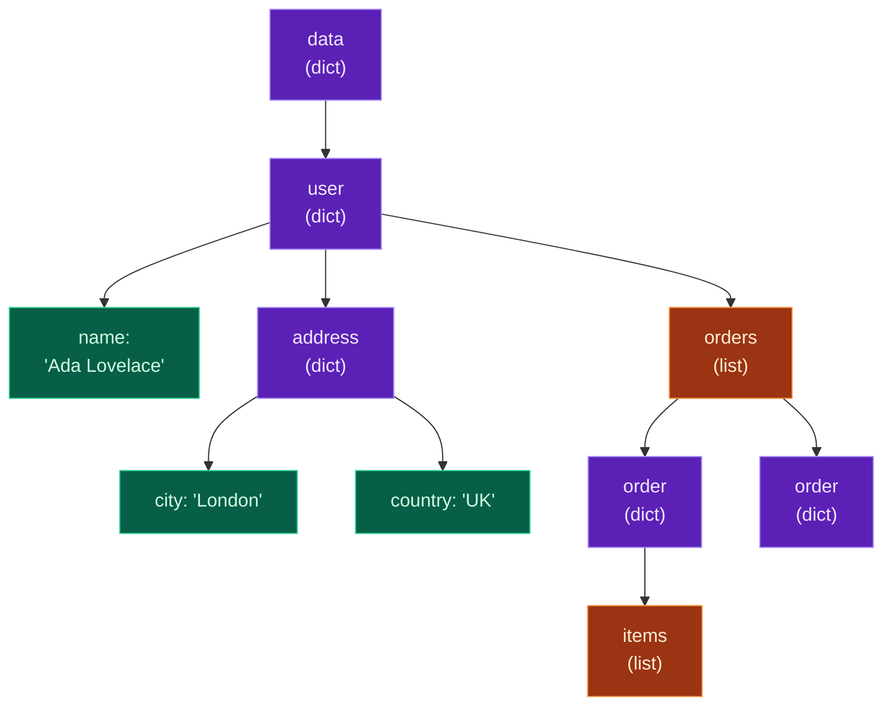

Yesterday's data was *flat* — a list of simple dictionaries, one level deep. But the data you'll actually meet in the wild is **nested**: dictionaries inside lists inside dictionaries, several layers down. That's exactly what an API sends back, what a database returns, and what an LLM gives you when you ask for structured output. If you can confidently navigate nested data, working with any real service stops feeling scary.

Today you'll learn to **reach into** deep structures, do it **safely** so a missing key doesn't crash your program, **iterate** over nested data, and use Python's **`json`** module to turn JSON text into Python objects and back. Then you'll build a parser for a realistic, nested API response — the single most common task in real-world and AI Python.

> **A member lesson (Module 2 continues).** You've got dicts, lists, loops, and comprehensions — today we point all of them at *deep* data. Type the examples; nested data is far less intimidating once you've poked at it yourself.

---

## What nested data looks like

"Nested" just means a value inside a collection is *itself* a collection. A dictionary's value can be another dictionary, or a list, and those can contain more dictionaries — as deep as needed:

```python
data = {
    "user": {
        "name": "Ada",
        "address": {"city": "London", "zip": "EC1"},
        "hobbies": ["chess", "coding"],
    }
}
```

Here `data` is a dict whose `"user"` value is *another* dict, whose `"address"` value is *yet another* dict, and whose `"hobbies"` value is a list. This is the natural shape of real information — a user *has an* address, *has* orders, each order *has* items. Everything you learned about dicts and lists still applies; you just apply it repeatedly, one layer at a time.

---

## Reaching in: chained access

To get a deep value, you stack the access operators — one `[ ]` per layer, left to right:

```python
print(data["user"]["name"])              # into user, then name
print(data["user"]["address"]["city"])   # user → address → city
print(data["user"]["hobbies"][0])        # user → hobbies → first item
```

**Output:**

```text
Ada
London
chess
```

Read `data["user"]["address"]["city"]` as a path: start at `data`, step into `"user"`, then into `"address"`, then read `"city"`. Mixing dict keys (strings) and list indexes (numbers) is fine — `["hobbies"][0]` steps into the list, then takes its first item. Each `[ ]` peels back one layer.

---

## Safe access: surviving missing keys

Chained access is great — until a key isn't there. Then it **crashes** with a `KeyError`:

```python
print(data["user"]["phone"])   # KeyError: 'phone' — there is no phone
```

Real data is messy: fields are optional, APIs change, an LLM omits something. The robust approach uses **`.get()`** with a default at each layer (Day 3), so a missing key yields a fallback instead of an exception:

```python
city = data.get("user", {}).get("address", {}).get("city", "unknown")
print(city)                                            # London

phone = data.get("user", {}).get("phone", "n/a")
print(phone)                                           # n/a
```

**Output:**

```text
London
n/a
```

The trick is the `{}` default at each step: `data.get("user", {})` returns the user dict if present, or an **empty dict** if not — and you can safely call `.get()` again on an empty dict (it just returns the *next* default). That's what keeps the chain from blowing up.

> **The pitfall to avoid:** `data.get("user").get("name")` *without* the `{}` default. If `"user"` is missing, the first `.get` returns `None`, and `None.get(...)` raises `AttributeError: 'NoneType' object has no attribute 'get'`. Always pass the `{}` default on intermediate steps. (We'll see this exact error below.)

---

## A map of the nesting

It helps to picture nested data as a **tree**. Here's the structure from today's project — a user with an address and a list of orders:



**Reading this diagram:**

Read it top to bottom — it's the *shape* of the data, with each box a value and each arrow a step you take with `[ ]`.

The **purple boxes** are **dictionaries** (key → value collections): `data` at the top, then `user`, `address`, and each individual `order`. The **orange boxes** are **lists** (ordered sequences): `orders` (a list of order dicts) and `items` (a list of product names). The **green boxes** are **leaf values** — the actual strings and numbers you're usually after, like `name` and `city`.

To get a value, you walk the tree from the top. `data["user"]["address"]["city"]` traces Root → user → address → city — four boxes, three `[ ]` steps — landing on the green `'London'`. The **branching at `orders`** is the important bit: it's a list, so it holds *several* order dictionaries, and each of those branches again into its own `items` list. That's why deep data needs *loops* — to walk every branch — which is exactly the next step.

The takeaway: **purple = dict (access by key), orange = list (access by index or loop over it), green = the value you want.** Every nested-access path is just a route down this tree.

---

## Iterating nested data

When a structure branches into lists, you loop. Combine the loops and comprehensions from this week to pull data out of every branch. A particularly handy move is the **nested comprehension** that *flattens* — gathering items from across many sub-lists into one:

```python
orders = [
    {"id": 1, "items": ["a", "b"]},
    {"id": 2, "items": ["c"]},
]

all_items = [item for order in orders for item in order["items"]]
print(all_items)
```

**Output:**

```text
['a', 'b', 'c']
```

Read the two `for`s left to right, outer first: *"for each `order` in `orders`, then for each `item` in that order's `items`, collect `item`."* It's the same as a loop inside a loop, written on one line. This flatten pattern — many records, each with a sub-list, combined into one list — comes up constantly with API and AI data.

---

## JSON: the language data travels in

So far we've typed our nested data as Python. But data arriving from the internet comes as **JSON** (JavaScript Object Notation) — a plain-text format that looks almost identical to Python dicts and lists. It's *the* universal format for APIs, web data, config files, and structured LLM output. The good news: it maps onto Python types almost one-to-one.

| JSON | Python |
|---|---|
| object `{ }` | `dict` |
| array `[ ]` | `list` |
| string `"..."` | `str` |
| number | `int` / `float` |
| `true` / `false` | `True` / `False` |
| `null` | `None` |

JSON arrives as **text** (a string), so you must **parse** it into Python objects before you can use it — and convert back to text to send it out. Python's built-in **`json`** module does both:

```python
import json

# Python object -> JSON text (a string), with json.dumps ("dump string")
obj = {"name": "Ada", "age": 36, "member": True, "nickname": None}
text = json.dumps(obj)
print(text)
print(type(text).__name__)

# JSON text -> Python object, with json.loads ("load string")
parsed = json.loads('{"city": "London", "pop": 9000000, "capital": true}')
print(parsed["city"], parsed["pop"], parsed["capital"])
print(type(parsed).__name__)
```

**Output:**

```text
{"name": "Ada", "age": 36, "member": true, "nickname": null}
str
London 9000000 True
dict
```

Notice the conversions: Python's `True` became JSON's `true`, and `None` became `null`. And once parsed, `parsed` is a normal dict you access exactly as you've learned. For readable output, add `indent=2`:

```python
print(json.dumps({"a": 1, "b": [1, 2]}, indent=2))
```

**Output:**

```text
{
  "a": 1,
  "b": [
    1,
    2
  ]
}
```

Remember the pair: **`loads`** = JSON text **in**, Python object out; **`dumps`** = Python object in, JSON text **out**. (The `s` is for "string".)

---

## Build it: parse a nested API response

Let's put it all together on a realistic payload — a user with a nested address and a list of orders, each order holding its own list of items. This is precisely the shape of real API and AI responses. Create **`parse_response.py`** in a `day-08` folder:

```python
# parse_response.py — navigate nested, JSON-style data (Day 8)
import json

# A realistic API response, as a JSON string (what you'd get over the web).
raw = '''
{
  "user": {
    "name": "Ada Lovelace",
    "address": {"city": "London", "country": "UK"},
    "orders": [
      {"id": 101, "total": 59.0, "items": ["Keyboard", "Cable"]},
      {"id": 102, "total": 220.0, "items": ["Monitor"]},
      {"id": 103, "total": 33.0, "items": ["Mouse", "Cable"]}
    ]
  }
}
'''

# 1) Parse the JSON text into Python objects (dicts + lists)
data = json.loads(raw)

# 2) Reach into the nested structure with chained keys
user = data["user"]
print("Name:", user["name"])
print("City:", user["address"]["city"])

# 3) Safe access for a field that might be missing
phone = user.get("phone", "not provided")
print("Phone:", phone)

# 4) Loop over the nested list of orders
print(f"\n{user['name']} has {len(user['orders'])} orders:")
for order in user["orders"]:
    print(f"  Order #{order['id']}: ${order['total']:.2f} ({len(order['items'])} items)")

# 5) Comprehensions over nested data
order_ids = [order["id"] for order in user["orders"]]
print("\nOrder IDs:", order_ids)

# every item across ALL orders (a nested comprehension that flattens)
all_items = [item for order in user["orders"] for item in order["items"]]
print("All items:", all_items)

total_spent = sum(order["total"] for order in user["orders"])
print(f"Total spent: ${total_spent:.2f}")

# 6) Build a summary and turn it back into pretty JSON text
summary = {
    "customer": user["name"],
    "city": user["address"]["city"],
    "order_count": len(user["orders"]),
    "total_spent": total_spent,
}
print("\nSummary as JSON:")
print(json.dumps(summary, indent=2))
```

**Run it** (`python3 parse_response.py` / `python parse_response.py`):

```text
Name: Ada Lovelace
City: London
Phone: not provided

Ada Lovelace has 3 orders:
  Order #101: $59.00 (2 items)
  Order #102: $220.00 (1 items)
  Order #103: $33.00 (2 items)

Order IDs: [101, 102, 103]
All items: ['Keyboard', 'Cable', 'Monitor', 'Mouse', 'Cable']
Total spent: $312.00

Summary as JSON:
{
  "customer": "Ada Lovelace",
  "city": "London",
  "order_count": 3,
  "total_spent": 312.0
}
```

You just took raw JSON text, parsed it, navigated several layers, summarised across a nested list, and produced clean JSON back out — the full round trip.

### Understanding the code

- **`json.loads(raw)`** turns the JSON *string* into Python objects. After this, `data` is an ordinary nested dict — everything downstream is plain dict/list work.
- **`user["address"]["city"]`** walks two layers down (the green leaf on our tree). **`user.get("phone", "not provided")`** safely handles the field that isn't there.
- **`for order in user["orders"]:`** loops the nested list; inside, `order['id']` and `len(order['items'])` reach into each order dict.
- **`[item for order in user["orders"] for item in order["items"]]`** is the flatten — every item across every order, in one list.
- **`sum(order["total"] for order in user["orders"])`** totals the nested values with a generator expression (Day 7).
- **`json.dumps(summary, indent=2)`** turns your Python summary back into pretty JSON text — ready to save to a file (Day 15) or send to another service.

This parse → navigate → summarise → emit flow is the backbone of working with any API, and you'll reuse it almost verbatim when you start calling LLMs later in the series.

---

## Common errors and how to fix them

**1. `KeyError: 'phone'`**
You reached for a key that isn't in the dictionary at that level — common with optional fields in real data. Use `.get("phone", default)` instead of `["phone"]` when a key might be absent, or check `if "phone" in user:` first.

**2. `TypeError: string indices must be integers, not 'str'`**
You went one layer too deep — you treated a *string* (or number) as if it were a dictionary. E.g. `user["address"]["city"]` when `address` is actually the string `"London"`, not a dict. Print the intermediate value (`print(user["address"])`) to see what type you really have, and stop indexing once you hit a plain value.

**3. `TypeError: list indices must be integers or slices, not str`**
You indexed a **list** with a string key, like `orders["id"]`. Lists are accessed by position (`orders[0]`) or looped over (`for o in orders:`). You probably meant to loop the list and read `o["id"]` from each dict inside it.

**4. `json.decoder.JSONDecodeError: Expecting property name enclosed in double quotes`**
`json.loads(...)` got text that isn't valid JSON — usually single quotes instead of double, a trailing comma, or unquoted keys. JSON requires **double quotes** around all keys and string values. Fix the text (or, if it's your own data, build a Python object and use `json.dumps` to produce valid JSON).

**5. `AttributeError: 'NoneType' object has no attribute 'get'`**
A chained `.get()` where a middle step returned `None`: `data.get("user").get("name")` when `"user"` is missing. Give each intermediate `.get()` an empty-dict default: `data.get("user", {}).get("name", "?")`.

**6. `TypeError: Object of type set is not JSON serializable`**
`json.dumps(...)` can only serialise JSON-compatible types (dict, list, str, int, float, bool, None). A **set** (or a custom object, a `datetime`, etc.) isn't one of them. Convert it first — e.g. turn a set into a list: `json.dumps({"tags": list(my_set)})`.

> **Reading tip:** for nested-data bugs, `print()` the value at each layer as you descend (`print(type(x), x)`). The moment a layer isn't the dict or list you expected is the moment the path went wrong.

---

## Recap — what you can do now

You can navigate the data that real services actually send:

- ✅ **Nested structures** — dicts and lists inside each other, any depth.
- ✅ **Chained access** — `data["a"]["b"][0]`, one `[ ]` per layer.
- ✅ **Safe access** — `.get("k", {})` chains that don't crash on missing keys (and the `None.get` pitfall).
- ✅ **Iterating deep data** — loops and the flattening nested comprehension.
- ✅ **JSON** — the JSON ↔ Python type map, `json.loads` (text → objects) and `json.dumps` (objects → text, with `indent`).
- ✅ A **parser for a realistic nested API response**, end to end.

### Day 8 cheat sheet

| Want to… | Write |
|---|---|
| Reach a deep value | `data["user"]["address"]["city"]` |
| Index into a nested list | `data["user"]["orders"][0]` |
| Safe deep access | `data.get("user", {}).get("city", "?")` |
| Loop a nested list | `for o in data["orders"]:` |
| Flatten sub-lists | `[i for o in orders for i in o["items"]]` |
| JSON text → Python | `json.loads(text)` |
| Python → JSON text | `json.dumps(obj)` |
| Pretty JSON | `json.dumps(obj, indent=2)` |

---

## Coming up on Day 9

You can now reach into any data structure. Day 9 is about **reshaping whole collections**: **sorting, filtering, mapping, and reducing** — ordering data by any key (sort a list of records by price or name), keeping only what matches, transforming every element, and boiling a collection down to a single value. These four operations, plus the comprehensions and nested access from this module, are the complete toolkit for wrangling data before it ever reaches a model.

You've learned to read deep data. Next, we learn to reorder and summarise it. See the full roadmap on the [Python for AI Engineering series page](/series/python-for-ai-engineering).

**See you on Day 9.** 🐍
