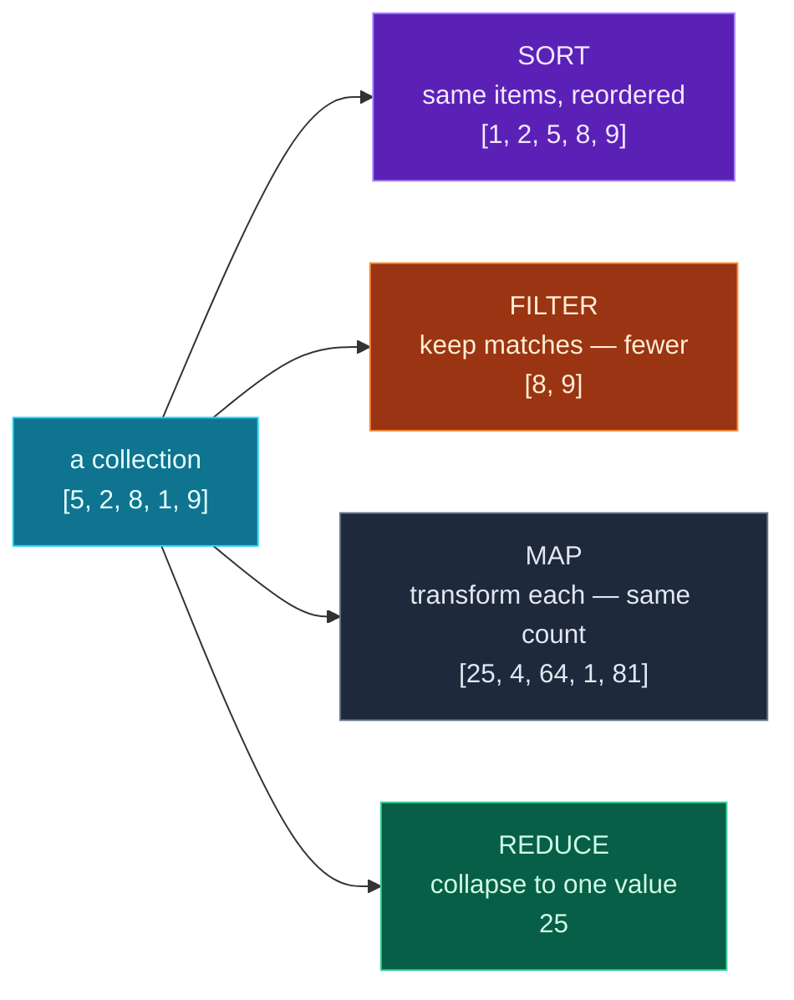

Almost everything you do with a collection of data is one of four operations: put it in **order** (sort), keep only what you want (**filter**), transform every element (**map**), or boil it down to a single answer (**reduce**). Master these four and you can wrangle any dataset — which is exactly what you do before feeding data to a model or an API.

Today rounds out **Module 2** with those four operations, the tiny **`lambda`** functions that power them, and a practical skill the screenshot rightly groups here: handling **`None`, optional values, and defaults** so real, messy data doesn't crash your program. Then you'll build a **leaderboard** that ranks players, computes statistics, and gracefully handles a missing score.

> **A member lesson (Module 2 finale).** You've got comprehensions and nested data; now we add ordering, summarising, and robustness. Type the examples — these operations are pure muscle memory once you've run them a few times.

---

## Sorting

Python sorts in two ways. **`sorted(x)`** returns a **new** sorted list and leaves the original alone. **`x.sort()`** sorts the list **in place** and returns `None`:

```python
nums = [5, 2, 8, 1, 9, 3]
print(sorted(nums))             # a new sorted list
print(sorted(nums, reverse=True))  # descending
print(nums)                     # original is unchanged

nums.sort()                     # sorts nums itself (returns None)
print(nums)
```

**Output:**

```text
[1, 2, 3, 5, 8, 9]
[9, 8, 5, 3, 2, 1]
[5, 2, 8, 1, 9, 3]
[1, 2, 3, 5, 8, 9]
```

Use `sorted()` when you want a sorted copy (the common case); use `.sort()` only when you genuinely want to reorder the original. `reverse=True` flips the direction.

### Sorting by something: the `key=`

By default Python sorts by the natural order of the items. To sort by *something else* — a string's length, a record's price — pass a **`key=`** function. Python calls it on each item and sorts by what it returns:

```python
words = ["pear", "fig", "banana"]
print(sorted(words))            # alphabetical (the default)
print(sorted(words, key=len))   # by length instead
```

**Output:**

```text
['banana', 'fig', 'pear']
['fig', 'pear', 'banana']
```

The first sort is alphabetical; the second orders by `len(word)` — `fig` (3), `pear` (4), `banana` (6). The `key` is the secret to sorting anything by anything.

---

## Lambda: tiny inline functions

To sort a list of *dictionaries* by a field, you need a key function that pulls out that field. You could write a `def`, but for a one-line throwaway there's a shorter tool: the **lambda**. A `lambda` is an anonymous function written inline — `lambda arguments: expression` — where the expression's value is automatically returned:

```python
double = lambda x: x * 2     # same as: def double(x): return x * 2
print(double(5))
```

**Output:**

```text
10
```

You rarely assign a lambda to a name like that (if you're naming it, just use `def`). Its real purpose is to be passed *into* another function — exactly what `key=` wants. Here's sorting records by a field:

```python
people = [
    {"name": "Ada", "age": 36},
    {"name": "Linus", "age": 24},
    {"name": "Grace", "age": 45},
]
by_age = sorted(people, key=lambda p: p["age"])
print([p["name"] for p in by_age])
```

**Output:**

```text
['Linus', 'Ada', 'Grace']
```

`lambda p: p["age"]` is a little function that takes a person `p` and returns their age — so the list sorts youngest to oldest. This `sorted(records, key=lambda r: r["field"])` pattern is one you'll use constantly.

---

## Filtering and mapping (two ways)

You already know how to **filter** (keep matching items) and **map** (transform every item) with comprehensions. There are also dedicated built-ins, `filter()` and `map()`, that do the same with a function:

```python
nums = [4, 7, 2, 9, 5]
print([n for n in nums if n > 4])              # filter, comprehension
print(list(filter(lambda n: n > 4, nums)))     # filter(), built-in

print([n * n for n in [1, 2, 3, 4]])           # map, comprehension
print(list(map(lambda n: n * n, [1, 2, 3, 4]))) # map(), built-in
```

**Output:**

```text
[7, 9, 5]
[7, 9, 5]
[1, 4, 9, 16]
[1, 4, 9, 16]
```

Both styles give the same result. **In modern Python, comprehensions are usually preferred** — they're more readable. But you'll see `map()` and `filter()` in lots of code (and other people's tutorials), so it's worth recognising them. One catch: `map()` and `filter()` return a lazy *iterator*, not a list, so you wrap them in `list(...)` to see the values (more on that in the errors section).

---

## Reducing: many values into one

**Reducing** collapses a whole collection down to a single value. You've met the most common reducers already — they're built right in:

```python
nums = [3, 7, 2, 8, 5]
print(sum(nums), max(nums), min(nums), len(nums))
```

**Output:**

```text
25 8 2 5
```

`max()` and `min()` also take a **`key=`**, so you can find the "biggest" by any measure — the longest word, the priciest product, the top-scoring player:

```python
print(max(["hi", "hello", "hey"], key=len))   # the longest word
```

**Output:**

```text
hello
```

For a *custom* reduction that isn't one of the built-ins — say, multiplying everything together — there's **`functools.reduce`**, which applies a two-argument function across the collection, carrying the running result:

```python
from functools import reduce
product = reduce(lambda a, b: a * b, [1, 2, 3, 4])   # ((1*2)*3)*4
print(product)
```

**Output:**

```text
24
```

In practice you'll reach for `sum`, `max`, `min`, `len` 95% of the time, and `reduce` only for the unusual case. But the *idea* — folding many values into one — is what "reduce" means everywhere in programming.

---

## The four operations at a glance

Here's how each operation changes a collection — the key is to notice what happens to the *shape*:



**Reading this diagram:**

The **cyan box** on the left is one starting collection, `[5, 2, 8, 1, 9]`. Each arrow shows what one of the four operations does to it — and the point is that each produces a differently *shaped* result.

**SORT** (purple) keeps every item but puts them in order: same five numbers, rearranged to `[1, 2, 5, 8, 9]`. The count never changes.

**FILTER** (orange) keeps only the items that pass a test — here, "greater than 5" — so you get *fewer* items: `[8, 9]`. Filtering can only shrink or keep the count, never grow it.

**MAP** (grey) transforms *every* item with the same rule — here, squaring — so the count stays the same but the values change: `[25, 4, 64, 1, 81]`.

**REDUCE** (green) is the odd one out: it combines all the items into a *single* value — here the sum, `25`. Many in, one out.

The takeaway — and a genuinely useful mental checklist: **sort reorders, filter shrinks, map transforms, reduce collapses.** When you face a data task, ask "which of these four am I doing?" and the right tool is obvious. Most real pipelines chain them: filter, then map, then reduce.

---

## Handling None, optional values, and defaults

Real data has holes — missing fields, blank values, `None`s. Code that ignores this crashes on the first imperfect record. A few robust habits:

**Defaults with `.get()`** (Day 3) — read a possibly-missing key without crashing:

```python
config = {"theme": "dark"}
print(config.get("font", "default"))   # key missing → the default
```

**The `or` fallback** — `a or b` gives `a` if it's "truthy", otherwise `b`. Handy for "use this, or a fallback" — but mind the trap: Python treats `0`, `""`, empty lists, and `None` all as **falsy**, so `or` replaces them too:

```python
print("" or "Anonymous")   # empty string is falsy → "Anonymous"
print(0 or 100)            # 0 is falsy → 100  (careful — a real 0 gets replaced!)
```

**Output:**

```text
default
Anonymous
100
```

So `score or 0` is fine (a missing score *should* become 0), but `score or 50` would wrongly turn a *real* score of `0` into `50`. When `0` or `""` are valid values, test explicitly with `if x is None:` instead of relying on `or`.

**Dropping `None`s** — filter them out before processing, using `is not None`:

```python
values = [1, None, 3, None, 5]
print([v for v in values if v is not None])
```

**Output:**

```text
[1, 3, 5]
```

(Use `is None` / `is not None` for `None` checks — not `== None`. `is` checks identity, which is the correct, idiomatic test for `None`.)

---

## Build it: a leaderboard

Let's combine all four operations — plus None-handling — on a list of player records, one of whom never played (a `None` score). Create **`leaderboard.py`** in a `day-09` folder:

```python
# leaderboard.py — sort, filter, map, reduce + handle missing data (Day 9)

players = [
    {"name": "Ada", "score": 92},
    {"name": "Linus", "score": 78},
    {"name": "Grace", "score": 88},
    {"name": "Alan", "score": 64},
    {"name": "Edsger", "score": None},   # didn't play — missing score
]

# A small helper: treat a missing/None score as 0
def score_of(player):
    return player["score"] or 0

# 1) SORT: highest score first (key= picks WHAT to sort by)
ranked = sorted(players, key=score_of, reverse=True)
print("Leaderboard:")
for rank, p in enumerate(ranked, start=1):
    print(f"  {rank}. {p['name']}: {score_of(p)}")

# 2) FILTER: only players who passed (score >= 70)
passed = [p["name"] for p in players if score_of(p) >= 70]
print("\nPassed:", passed)

# 3) MAP: transform each record into a label
labels = [f"{p['name']} ({score_of(p)})" for p in players]
print("Labels:", labels)

# 4) REDUCE: collapse the collection into single summary numbers
scores = [score_of(p) for p in players]
print(f"\nHighest: {max(scores)}")
print(f"Lowest:  {min(scores)}")
print(f"Average: {sum(scores) / len(scores):.1f}")

# top player overall, using max() with a key
top = max(players, key=score_of)
print(f"Top player: {top['name']}")
```

**Run it** (`python3 leaderboard.py` / `python leaderboard.py`):

```text
Leaderboard:
  1. Ada: 92
  2. Grace: 88
  3. Linus: 78
  4. Alan: 64
  5. Edsger: 0

Passed: ['Ada', 'Linus', 'Grace']
Labels: ['Ada (92)', 'Linus (78)', 'Grace (88)', 'Alan (64)', 'Edsger (0)']

Highest: 92
Lowest:  0
Average: 64.4
Top player: Ada
```

Four operations and robust None-handling, in one small, realistic script.

### Understanding the code

- **`score_of(player)`** centralises the None-handling: `player["score"] or 0` turns a missing score into `0`. Because it's a function, every operation below reuses the same rule — no repetition.
- **`sorted(players, key=score_of, reverse=True)`** — SORT by score, highest first. The `key` is our helper (you can pass any function, named or lambda).
- **`enumerate(ranked, start=1)`** is a bonus built-in: it pairs each item with a number, so `rank` counts `1, 2, 3…` as we loop — perfect for a ranked list.
- **`[p["name"] for p in players if score_of(p) >= 70]`** — FILTER to the players who passed.
- **`[f"{p['name']} ({score_of(p)})" for p in players]`** — MAP each record to a display label.
- **`max`, `min`, `sum`/`len`** — REDUCE the scores to summary stats; **`max(players, key=score_of)`** reduces to the single top record.

Notice the shape of real data work: define how to read a field safely *once*, then sort/filter/map/reduce freely. That discipline scales from five players to five million rows.

---

## Common errors and how to fix them

**1. `TypeError: '<' not supported between instances of 'str' and 'int'`**
You tried to sort a list of mixed types — Python can't compare a string to a number. Make the list uniform, or pass a `key=` that returns a comparable value (e.g. `key=str` to sort everything as text).

**2. `TypeError: '<' not supported between instances of 'NoneType' and 'int'`**
Same cause, with `None` in the mix — you sorted a list containing `None`. Either filter the `None`s out first (`[x for x in data if x is not None]`) or use a `key=` that substitutes a value, like `key=lambda x: x or 0`.

**3. `TypeError: 'NoneType' object is not subscriptable` (after `.sort()`)**
The classic trap: `result = mylist.sort()` sets `result` to `None`, because `.sort()` sorts in place and returns nothing. If you want a value back, use `sorted()`: `result = sorted(mylist)`.

**4. `print(map(...))` shows `<map object at 0x...>`**
Not an error — `map()` and `filter()` return a lazy iterator, not a list. Wrap it: `list(map(...))`. (Or just use a comprehension, which gives a list directly.)

**5. `KeyError: 'age'` (inside a `key=` function)**
Your sort/`max` key reached for a field some record doesn't have — `key=lambda p: p["age"]` when a record has no `"age"`. Use `.get` with a default in the key: `key=lambda p: p.get("age", 0)`.

**6. `TypeError: reduce() of empty iterable with no initial value`**
`functools.reduce` can't fold an *empty* collection unless you give it a starting value. Pass an initial value as the third argument: `reduce(lambda a, b: a + b, items, 0)`. (The built-ins are friendlier here: `sum([])` is `0`.)

> **Reading tip:** the `'<' not supported between …` message always means a sort (or `min`/`max`) tried to compare two things it can't order. The fix is almost always a `key=` that maps every item to a comparable value.

---

## Recap — Module 2 complete 🎉

You can now wrangle data like a Python pro:

- ✅ **Sorting** — `sorted()` vs `.sort()`, `reverse=`, and `key=` to sort by anything.
- ✅ **Lambda** — tiny inline functions, mainly for `key=`, `map`, and `filter`.
- ✅ **Filter & map** — comprehensions (preferred) and the `filter()`/`map()` built-ins.
- ✅ **Reduce** — `sum`/`max`/`min`/`len`, `max`/`min` with `key=`, and `functools.reduce`.
- ✅ **Robust data** — `.get` defaults, the `or` fallback (and its falsy trap), dropping `None`s, and `is None`.
- ✅ A **leaderboard** that ranks, filters, labels, and summarises real records.

Combined with Days 7–8, you now have the complete data-handling toolkit: comprehensions, nested access, and the four operations.

### Day 9 cheat sheet

| Want to… | Write |
|---|---|
| Sorted copy | `sorted(items)` |
| Sort in place | `items.sort()` |
| Descending | `sorted(items, reverse=True)` |
| Sort by a field | `sorted(recs, key=lambda r: r["x"])` |
| Inline function | `lambda x: x + 1` |
| Filter | `[x for x in items if cond]` |
| Map | `[f(x) for x in items]` |
| Reduce (common) | `sum/max/min/len(items)` |
| Biggest by measure | `max(items, key=len)` |
| Custom reduce | `reduce(fn, items, start)` |
| Safe default | `d.get("k", fallback)` |
| Drop None | `[x for x in items if x is not None]` |

---

## Coming up on Day 10 — a new module begins

Data handling: done. Next we change gears into one of the biggest ideas in programming. **Module 3 is Object-Oriented Python**, and Day 10 introduces **classes, objects, and methods** — defining your own *types* that bundle data and the functions that work on it together. Instead of passing a dictionary into `score_of(...)`, you'll create a `Player` object that *knows* its own score. It's how nearly all large Python — and every AI framework you'll touch — is organised.

You've mastered handling data. Next, we learn to *model* it. See the full roadmap on the [Python for AI Engineering series page](/series/python-for-ai-engineering).

**See you on Day 10.** 🐍
