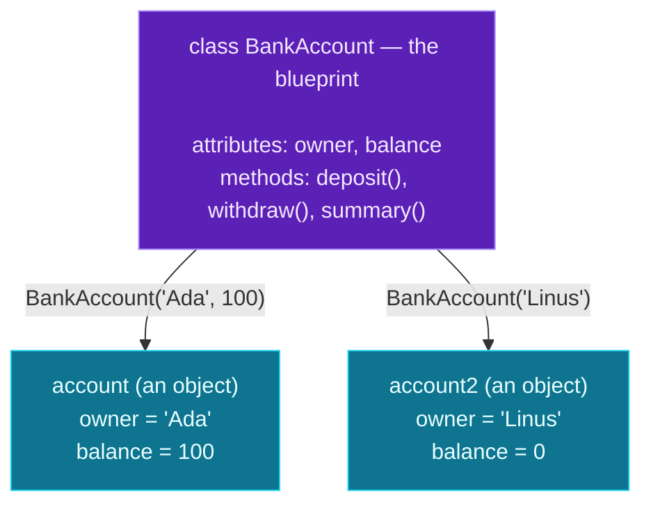

Welcome to **Module 3 — Object-Oriented Python**, one of the biggest ideas in all of programming. Up to now, your data (a dictionary) and the functions that act on it (`score_of(player)`) have lived *separately*. Object-oriented programming (OOP) bundles them together: you define a new **type** that carries both its own data *and* the functions that operate on that data.

The vocabulary is small and you'll meet it all today:

- a **class** is a blueprint for a new type (e.g. `BankAccount`);
- an **object** (or *instance*) is a specific thing built from that blueprint (Ada's account);
- **attributes** are the data an object holds (its balance);
- **methods** are functions that belong to the object (deposit, withdraw).

This matters enormously for AI work: every framework you'll touch is built this way. An LLM client, a model, a tokenizer, a chat message — they're all **objects** you create and call methods on. Today you build your first class: a `BankAccount` that knows its own balance and how to change it safely.

> **A member lesson — and a turning point.** OOP feels abstract for about ten minutes, then it clicks and you can't unsee it. Type every example. Once `self` makes sense (and it will), the rest is easy.

---

## Your first class

Here's a tiny, complete class. Read it, then we'll name every part:

```python
class Dog:
    def __init__(self, name):
        self.name = name

    def bark(self):
        return f"{self.name} says woof!"

d = Dog("Rex")        # create an object from the blueprint
print(d.name)         # read its attribute
print(d.bark())       # call its method
```

**Output:**

```text
Rex
Rex says woof!
```

Piece by piece:

- **`class Dog:`** defines a new type called `Dog` (class names use `CapWords` by convention). Everything indented under it belongs to the class.
- **`d = Dog("Rex")`** creates an **object** — an actual dog — from the blueprint. This is called *instantiating*; `d` is an **instance** of `Dog`.
- **`d.name`** reads an **attribute** — a piece of data stored on the object.
- **`d.bark()`** calls a **method** — a function that belongs to the object. Note the parentheses: it's a function call.

The two functions inside the class — `__init__` and `bark` — are methods. Let's understand the strange-looking `self` that both of them take.

---

## `self`: the object itself

Every method's first parameter is **`self`** — a reference to *the particular object the method is being called on*. When you write `d.bark()`, Python automatically passes `d` in as `self`. So inside `bark`, `self` *is* `d`, and `self.name` reads `d`'s name.

That's the whole secret: **`self` is how a method reaches the object's own data.** You never pass `self` yourself — Python fills it in from whatever is left of the dot. `d.bark()` becomes, behind the scenes, `Dog.bark(d)`.

Because `self` is the specific object, two different objects keep entirely separate data:

```python
a = Dog("Rex")
b = Dog("Bella")
print(a.name, b.name)
```

**Output:**

```text
Rex Bella
```

`a` and `b` are built from the same blueprint but are independent — `a.name` and `b.name` don't interfere. (You'll always name it `self`; it's a strong convention, not a keyword, but never call it anything else.)

---

## The constructor: `__init__`

The method named **`__init__`** (two underscores each side — say "dunder init") is the **constructor**. Python runs it automatically the moment you create an object, and its job is to set up the object's starting attributes. The arguments you pass when creating the object go straight to `__init__`:

```python
class Point:
    def __init__(self, x=0, y=0):     # defaults, like any function
        self.x = x
        self.y = y

    def distance_from_origin(self):
        return (self.x ** 2 + self.y ** 2) ** 0.5

p = Point(3, 4)
print(p.x, p.y)
print(p.distance_from_origin())
```

**Output:**

```text
3 4
5.0
```

When you write `Point(3, 4)`, Python creates a blank object and calls `__init__(self, 3, 4)`. The lines `self.x = x` and `self.y = y` store those values *on the object*, so they're available to every other method later (here, `distance_from_origin` reads `self.x` and `self.y`). `__init__` parameters can have defaults just like normal functions — `Point()` would use `x=0, y=0`.

**Rule of thumb: create *all* of an object's attributes in `__init__`.** That way every object is fully formed the instant it exists, and you never hit a "no such attribute" surprise later (an error we'll see below).

---

## Methods that change state

Methods don't just read data — they can change it. Because `self` refers to the live object, assigning to `self.something` updates that object:

```python
class Counter:
    def __init__(self):
        self.count = 0

    def increment(self):
        self.count += 1     # change the object's own data

c = Counter()
c.increment()
c.increment()
c.increment()
print(c.count)
```

**Output:**

```text
3
```

Each `increment()` call nudges *this* counter's `count` up by one. This is the heart of OOP: an object holds **state** (its attributes) and exposes **behavior** (its methods) that reads and updates that state. Your bank account works exactly this way.

---

## How a class and its objects relate

Here's the mental model — one blueprint, many independent objects:



**Reading this diagram:**

The **purple box** at the top is the **class** — `BankAccount`. It's a *blueprint*: it doesn't hold any actual balance itself, it just describes what *every* account will have (the attributes `owner` and `balance`) and what every account can *do* (the methods `deposit`, `withdraw`, `summary`). You write this once.

The two **cyan boxes** are **objects** — real accounts built from the blueprint. Each arrow is a constructor call: `BankAccount('Ada', 100)` runs `__init__` and produces `account`, an object whose `owner` is `'Ada'` and `balance` is `100`. `BankAccount('Linus')` produces a second, completely separate object (its balance defaulting to `0`).

The crucial idea: the two objects **share the same methods** (both can `deposit`) but have **their own attribute values**. Depositing into `account` changes only Ada's balance, never Linus's. When you call `account.deposit(50)`, `self` inside `deposit` refers to `account`; call `account2.deposit(20)` and `self` refers to `account2`. **One blueprint, many objects, each with its own data** — that's the takeaway, and it's why classes are so good at modelling many similar things.

---

## Build it: a BankAccount class

Let's build a class that holds state and protects it with validation — a bank account. Create **`bank_account.py`** in a `day-10` folder:

```python
# bank_account.py — your first class (Day 10: classes, objects & methods)

class BankAccount:
    """A simple bank account that tracks a balance."""

    def __init__(self, owner, balance=0):
        self.owner = owner          # attribute: who owns the account
        self.balance = balance      # attribute: the current balance

    def deposit(self, amount):
        if amount <= 0:
            print("Deposit must be positive.")
            return
        self.balance += amount
        print(f"Deposited ${amount:.2f}. New balance: ${self.balance:.2f}")

    def withdraw(self, amount):
        if amount > self.balance:
            print(f"Insufficient funds. Balance is ${self.balance:.2f}.")
            return
        self.balance -= amount
        print(f"Withdrew ${amount:.2f}. New balance: ${self.balance:.2f}")

    def summary(self):
        return f"{self.owner}'s account: ${self.balance:.2f}"


# --- using the class ---
account = BankAccount("Ada", 100)   # create an object (an instance)
print(account.summary())

account.deposit(50)
account.withdraw(30)
account.withdraw(500)               # too much — refused

# each object has its OWN data
account2 = BankAccount("Linus")     # balance defaults to 0
account2.deposit(20)

print(account.summary())
print(account2.summary())
```

**Run it** (`python3 bank_account.py` / `python bank_account.py`):

```text
Ada's account: $100.00
Deposited $50.00. New balance: $150.00
Withdrew $30.00. New balance: $120.00
Insufficient funds. Balance is $120.00.
Deposited $20.00. New balance: $20.00
Ada's account: $120.00
Linus's account: $20.00
```

Notice the last two lines: Ada's account ended at `$120` and Linus's at `$20`, completely independently — exactly what the diagram promised.

### Understanding the code

- **`class BankAccount:`** with a docstring describing it (the same docstring habit from Day 5, now on a class).
- **`__init__(self, owner, balance=0)`** sets up each new account's state. `balance` defaults to `0`, so `BankAccount("Linus")` works without a starting balance.
- **`self.owner` / `self.balance`** are the attributes — each object's private data.
- **`deposit` and `withdraw`** are methods that *change* state (`self.balance += amount`) but only after **validating** — a deposit must be positive, and you can't withdraw more than you have. This is a real win of OOP: the data and the rules that protect it live together, so nothing can change the balance without going through these checks.
- **`summary`** is a method that *returns* a value (rather than printing) — the caller decides what to do with it.
- **`account` and `account2`** are two independent objects from one class.

You've just bundled data and behaviour into a single, self-contained type — the core skill of OOP, and the pattern every Python library is built on.

---

## Common errors and how to fix them

**1. `TypeError: Dog.__init__() missing 1 required positional argument: 'name'`**
You created an object without an argument its constructor requires — `Dog()` when `__init__` needs `name`. Pass it: `Dog("Rex")`. (Give a parameter a default in `__init__`, like `balance=0`, to make it optional.)

**2. `AttributeError: 'Dog' object has no attribute 'age'`**
You read an attribute the object doesn't have — a typo, or one you never set. Check the spelling, and make sure it's assigned in `__init__` (`self.age = ...`).

**3. `TypeError: Dog.bark() takes 0 positional arguments but 1 was given`**
You forgot **`self`** in the method definition — `def bark():` instead of `def bark(self):`. Python automatically passes the object as the first argument, so every method needs `self` (or another first parameter) to receive it. Add `self`.

**4. `NameError: name 'name' is not defined` (inside a method)**
You referred to an attribute without the `self.` prefix — `return f"Hi {name}"` instead of `self.name`. Inside a method, the object's data is always reached through `self`. Python often even suggests `Did you mean: 'self.name'?`.

**5. `<bound method Dog.bark of ...>` printed instead of the result**
You forgot the parentheses — `d.bark` refers to the method itself; `d.bark()` *calls* it. Add `()` to run a method, even one that takes no arguments.

**6. `AttributeError: 'Cart' object has no attribute 'items'` (for an attribute you "did" create)**
You set the attribute inside *another method* rather than `__init__`, then accessed it before that method ran. Attributes only exist once assigned — so initialise everything an object needs in `__init__` (`self.items = []`), not lazily elsewhere.

> **Reading tip:** most class errors trace back to `self`. Missing `self` in a `def`, a missing `self.` prefix inside a method, or an attribute never set in `__init__` — check those three first.

---

## Recap — what you can do now

You've taken the leap into object-oriented Python:

- ✅ **Classes** — define your own types with `class Name:`.
- ✅ **Objects / instances** — create them by calling the class: `BankAccount("Ada", 100)`.
- ✅ **`__init__`** — the constructor that sets up each object's attributes (with defaults if you like).
- ✅ **Attributes** — per-object data stored on `self`.
- ✅ **Methods** — functions on the object that read and change its state, with `self` as the first parameter.
- ✅ **Independent instances** — many objects from one blueprint, each with its own data.
- ✅ A **BankAccount class** that bundles data with the rules that protect it.

### Day 10 cheat sheet

| Want to… | Write |
|---|---|
| Define a class | `class BankAccount:` |
| Add a constructor | `def __init__(self, owner):` |
| Store an attribute | `self.owner = owner` |
| Add a method | `def deposit(self, amount):` |
| Use an attribute in a method | `self.balance` |
| Create an object | `acc = BankAccount("Ada")` |
| Read an attribute | `acc.owner` |
| Call a method | `acc.deposit(50)` |
| Document a class | `"""docstring"""` under `class` |

---

## Coming up on Day 11

One class is useful; the real power of OOP shows when classes **relate** to each other. Tomorrow covers **inheritance and composition** — building a specialised class on top of a general one (a `SavingsAccount` that *is a* `BankAccount` but adds interest), and building classes *out of* other objects (an account that *has a* transaction history). These two patterns — "is-a" and "has-a" — are how you model anything, and they keep your code free of repetition.

You've learned to define a type. Next, we learn to relate types to each other. See the full roadmap on the [Python for AI Engineering series page](/series/python-for-ai-engineering).

**See you on Day 11.** 🐍
