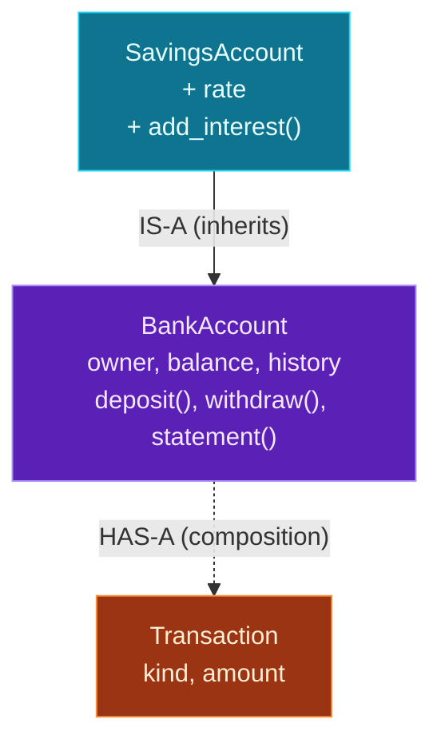

A single class is useful, but the real power of object-oriented programming appears when classes **relate** to one another. There are two fundamental ways to connect them, and almost all design comes down to choosing between them:

- **Inheritance** — an *"is-a"* relationship. A `SavingsAccount` **is a** `BankAccount`, so it gets everything an account has, then adds or changes a bit.
- **Composition** — a *"has-a"* relationship. A `BankAccount` **has a** transaction history — it's *built out of* other objects.

Today you'll learn both, plus the tools that make them work: `super()` for reusing a parent's code, method **overriding** to specialise behavior, `__str__` to control how objects print, and `isinstance()` to check types. Then you'll extend Day 10's bank account into a `SavingsAccount` that earns interest and keeps a history of `Transaction` objects — using *both* patterns together.

> **A member lesson.** This is where classes start to feel powerful. The "is-a vs has-a" question is one you'll ask constantly when designing code — including AI code, where, say, a custom agent *is an* `Agent` and *has a* list of tools.

---

## Inheritance: building on a parent class

**Inheritance** lets a new class (the *subclass* or *child*) take on all the attributes and methods of an existing one (the *parent* or *base*), then extend or change them. You declare it by putting the parent in parentheses: `class Dog(Animal):`.

```python
class Animal:
    def __init__(self, name):
        self.name = name
    def speak(self):
        return f"{self.name} makes a sound"

class Dog(Animal):          # Dog IS-A Animal
    def speak(self):        # override: replace the parent's version
        return f"{self.name} says woof"

class Cat(Animal):
    def speak(self):
        return f"{self.name} says meow"

print(Animal("thing").speak())
print(Dog("Rex").speak())
print(Cat("Bella").speak())
```

**Output:**

```text
thing makes a sound
Rex says woof
Bella says meow
```

`Dog` and `Cat` never define `__init__` — they **inherit** it from `Animal`, so `Dog("Rex")` just works. But each defines its own `speak`, which **overrides** the parent's — when you call `Dog(...).speak()`, Python uses the *most specific* version it can find. This is how you write a general class once and specialise it many ways without repeating the shared parts.

---

## `super()`: reusing the parent's code

Often a subclass wants to *add* to the parent rather than fully replace it. **`super()`** gives you access to the parent's version of a method. The most common use is in `__init__`, to let the parent set up its attributes before you add your own:

```python
class Vehicle:
    def __init__(self, brand):
        self.brand = brand

class Car(Vehicle):
    def __init__(self, brand, doors):
        super().__init__(brand)   # run Vehicle's __init__ first
        self.doors = doors        # then add Car's own attribute

c = Car("Toyota", 4)
print(c.brand, c.doors)
```

**Output:**

```text
Toyota 4
```

`super().__init__(brand)` calls the parent constructor, which sets `self.brand`; then the subclass adds `self.doors`. **Forgetting this call is a classic bug** — the parent's attributes never get set, and you crash later with "no such attribute" (we'll see it below). `super()` works for any method, not just `__init__` — it's how you *extend* behavior (do the parent's thing, then a bit more) instead of replacing it entirely.

---

## Composition: building out of other objects

**Composition** is the other relationship: instead of *being* a kind of something, an object *contains* other objects as attributes. A car **has an** engine:

```python
class Engine:
    def __init__(self, horsepower):
        self.horsepower = horsepower

class Auto:
    def __init__(self, brand):
        self.brand = brand
        self.engine = Engine(150)   # Auto HAS-AN Engine

car = Auto("Honda")
print(car.brand, car.engine.horsepower)
```

**Output:**

```text
Honda 150
```

`Auto` doesn't inherit from `Engine` — it *holds* one. You reach the engine's data by stepping through the attribute: `car.engine.horsepower`. Composition is how you assemble complex things from simpler, self-contained parts — and in today's project, an account *has a* list of `Transaction` objects.

---

## is-a or has-a? Choosing between them

The decision is usually answered by a plain-English sentence:

- If "**X is a kind of Y**" is true, reach for **inheritance** (`SavingsAccount` is a `BankAccount`; `Dog` is an `Animal`).
- If "**X has a Y**" or "**X is made of Y**" fits better, reach for **composition** (a car has an engine; an account has transactions).

A useful guideline you'll hear often: **"favor composition over inheritance."** Inheritance is powerful but rigid — deep family trees get tangled. Composition stays flexible. Use inheritance when there's a genuine "is-a" and you want to share behavior; use composition for "made of parts," which is more situations than beginners expect.

To check an object's type at runtime, use **`isinstance(object, Class)`** — it's `True` for the class *and* any parent in its family tree:

```python
print(isinstance(Dog("Rex"), Animal))   # True — a Dog is an Animal
print(isinstance(Cat("B"), Dog))         # False — a Cat is not a Dog
```

**Output:**

```text
True
False
```

---

## The two relationships, side by side

Here's today's design — inheritance going *up*, composition going *across*:



**Reading this diagram:**

Two different kinds of arrow connect three classes — and the arrow *style* tells you which relationship is which.

The **purple box** is `BankAccount`, the general base class with the owner, balance, history and the deposit/withdraw/statement behavior. The **cyan box**, `SavingsAccount`, points *up* to it with a solid **"IS-A"** arrow: that's **inheritance**. `SavingsAccount` automatically gets everything in the purple box — it can `deposit`, `withdraw`, and `statement` without redefining them — and adds just its own extras (`rate` and `add_interest()`). That's the economy of inheritance: write the common parts once in the parent, specialise in the child.

The **orange box**, `Transaction`, connects with a dotted **"HAS-A"** arrow: that's **composition**. A `BankAccount` doesn't *inherit* from `Transaction` — it *contains* them, holding a list of `Transaction` objects in its `history`. Each deposit or withdrawal creates one and appends it.

The takeaway: **solid "is-a" arrow = inheritance (share a parent's behavior); dotted "has-a" arrow = composition (hold other objects as parts).** Real designs use both at once — exactly as the project does.

---

## Build it: a SavingsAccount with a transaction history

This project uses both patterns: `SavingsAccount` **inherits** from `BankAccount`, and `BankAccount` **composes** a list of `Transaction` objects. Create **`accounts.py`** in a `day-11` folder:

```python
# accounts.py — inheritance & composition (Day 11)

class Transaction:
    """One entry in an account's history (a composition piece)."""
    def __init__(self, kind, amount):
        self.kind = kind          # "deposit", "withdraw", or "interest"
        self.amount = amount

    def __str__(self):
        return f"{self.kind}: ${self.amount:.2f}"


class BankAccount:
    def __init__(self, owner, balance=0):
        self.owner = owner
        self.balance = balance
        self.history = []         # HAS-A list of Transaction objects (composition)

    def deposit(self, amount):
        self.balance += amount
        self.history.append(Transaction("deposit", amount))

    def withdraw(self, amount):
        if amount > self.balance:
            print(f"Insufficient funds for {self.owner}.")
            return
        self.balance -= amount
        self.history.append(Transaction("withdraw", amount))

    def statement(self):
        print(f"\n{self.owner}'s statement (balance ${self.balance:.2f}):")
        for t in self.history:
            print(f"  - {t}")


class SavingsAccount(BankAccount):    # IS-A BankAccount (inheritance)
    def __init__(self, owner, balance=0, rate=0.05):
        super().__init__(owner, balance)   # let the parent set owner/balance/history
        self.rate = rate                   # plus a new attribute of its own

    def add_interest(self):                # a brand-new method
        interest = self.balance * self.rate
        self.balance += interest
        self.history.append(Transaction("interest", interest))


# --- using them ---
acc = BankAccount("Ada", 100)
acc.deposit(50)
acc.withdraw(30)
acc.statement()

savings = SavingsAccount("Linus", 1000, rate=0.10)
savings.deposit(200)        # inherited from BankAccount
savings.add_interest()      # its own method
savings.statement()         # inherited

print(f"\nIs savings a BankAccount? {isinstance(savings, BankAccount)}")
```

**Run it** (`python3 accounts.py` / `python accounts.py`):

```text
Ada's statement (balance $120.00):
  - deposit: $50.00
  - withdraw: $30.00

Linus's statement (balance $1320.00):
  - deposit: $200.00
  - interest: $120.00

Is savings a BankAccount? True
```

`savings` called `deposit` and `statement` (inherited from `BankAccount`) *and* `add_interest` (its own) — and its history is full of `Transaction` objects it composes. Both patterns, one small program.

### Understanding the code

- **`Transaction`** with a **`__str__`** method — when you `print` a transaction (or interpolate it in an f-string), Python calls `__str__`, so `print(f"  - {t}")` shows `deposit: $50.00` instead of a cryptic `<Transaction object at 0x...>`. Defining `__str__` makes your objects readable.
- **Composition** — `BankAccount` holds `self.history = []` and appends a `Transaction` on every operation. The account is *built out of* transactions.
- **Inheritance** — `class SavingsAccount(BankAccount):` gets `deposit`, `withdraw`, `statement`, and the `history` for free.
- **`super().__init__(owner, balance)`** — `SavingsAccount`'s constructor reuses the parent's setup (owner, balance, history), then adds its own `rate`. Without this call, `self.history` wouldn't exist and `deposit` would crash.
- **`add_interest`** — a method that only `SavingsAccount` has, specialising the base class.
- **`isinstance(savings, BankAccount)`** is `True` because of the is-a relationship.

---

## Common errors and how to fix them

**1. `AttributeError: 'Sub' object has no attribute 'name'`**
Your subclass defined its own `__init__` but **forgot `super().__init__(...)`**, so the parent never set up its attributes. Call `super().__init__(...)` at the top of the subclass constructor to inherit the parent's setup.

**2. `TypeError: Base.__init__() missing 1 required positional argument: 'name'`**
You called `super().__init__()` without the arguments the parent needs. Pass them through: `super().__init__(name)`. Match the parent's `__init__` signature.

**3. `TypeError: Sub.__init__() missing 1 required positional argument: 'age'`**
You created the subclass object without an argument its own `__init__` requires. Check the subclass constructor's parameters and supply them — remember a subclass often needs *more* arguments than its parent.

**4. `AttributeError: 'Animal' object has no attribute 'fly'`**
You called a method that neither the class nor any of its parents defines. Check the spelling, and confirm the method actually exists somewhere in the class's family tree (a child only inherits what its parents have).

**5. `AttributeError: 'Engine' object has no attribute 'horsepower'`**
With composition, you reached into a contained object for an attribute it doesn't have — often because that inner object's `__init__` didn't set it. Fix the *inner* class (`Engine`), not the outer one.

**6. My override *replaced* the parent's behavior when I wanted to *add* to it**
Not a crash — a design slip. Redefining a method in a subclass completely replaces the parent's version. If you meant to keep the parent's behavior *and* extend it, call `super().the_method(...)` inside your override and then do your extra work.

> **Reading tip:** subclass bugs are usually a missing or mismatched `super().__init__(...)`. If a subclass object is missing attributes it "should" have inherited, check that call first.

---

## Recap — what you can do now

You can now model relationships between types:

- ✅ **Inheritance** — `class Child(Parent):` to share and specialise behavior.
- ✅ **Overriding** — redefine a method in the child to change it.
- ✅ **`super()`** — reuse the parent's `__init__` and methods (extend, don't just replace).
- ✅ **Composition** — build a class out of other objects it *has*.
- ✅ **is-a vs has-a** — choosing the right relationship (and "favor composition").
- ✅ **`__str__`** and **`isinstance()`** — readable objects and runtime type checks.
- ✅ A **SavingsAccount** that inherits an account and composes a transaction history.

### Day 11 cheat sheet

| Want to… | Write |
|---|---|
| Inherit from a class | `class Savings(BankAccount):` |
| Call the parent constructor | `super().__init__(args)` |
| Extend a parent method | `super().method(args)` then more |
| Override a method | redefine it in the child |
| Compose another object | `self.engine = Engine(...)` |
| Reach a composed value | `car.engine.horsepower` |
| Control how it prints | `def __str__(self): return ...` |
| Check the type | `isinstance(obj, BankAccount)` |

---

## Coming up on Day 12

Writing `__init__` to copy each argument onto `self` gets repetitive fast — and Python has a tool that writes that boilerplate for you. Day 12 covers **dataclasses**: a clean, modern way to make classes that mostly just hold data (a single `@dataclass` decorator replaces a whole `__init__` and `__str__`). We'll also step back and answer the practical question the screenshot poses — **when to actually use OOP** versus a plain function or dictionary — and close Module 3. You'll model an AI-style `ChatMessage` and `Conversation` with almost no boilerplate.

You've learned to relate classes. Next, we learn to write them with far less code. See the full roadmap on the [Python for AI Engineering series page](/series/python-for-ai-engineering).

**See you on Day 12.** 🐍
