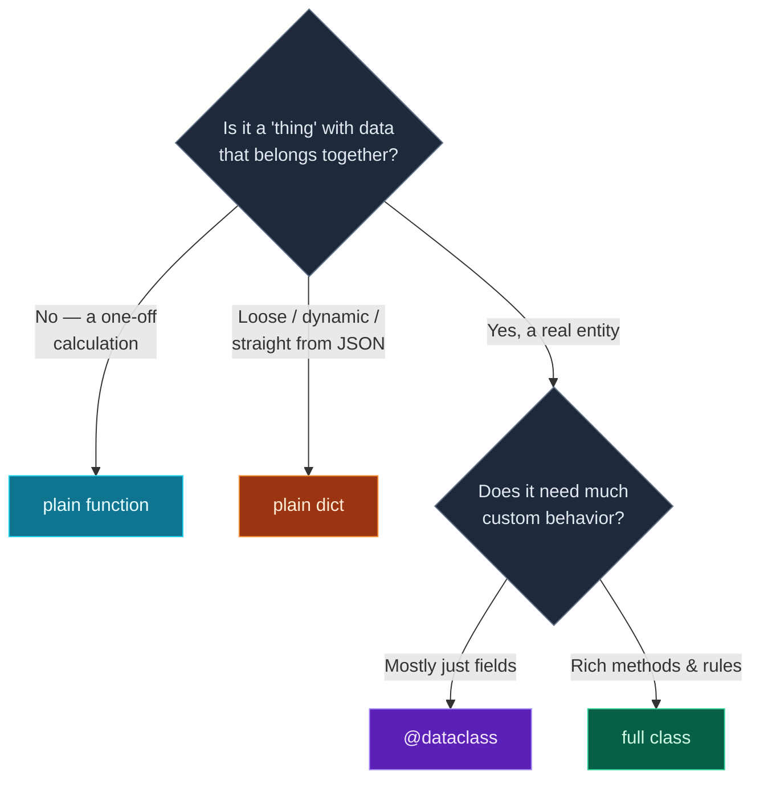

You've now written a few classes — and you may have noticed something tedious. A class that mostly just *holds data* still makes you write an `__init__` that copies every argument onto `self`, line by line, plus a `__str__` if you want it to print nicely. For data-heavy classes that's a lot of boilerplate for very little.

Python's answer is the **dataclass**: add one decorator, list your fields, and Python writes the `__init__`, a readable `__repr__`, and value-based `__eq__` *for you*. Today you'll learn dataclasses, meet the all-important **mutable-default** rule, and then step back for the practical question the screenshot poses — **when to use OOP at all** versus a plain function or a dictionary. This closes **Module 3**, and you'll model the exact `ChatMessage`/`Conversation` structures used to talk to LLMs.

> **A member lesson — Module 3 finale.** Dataclasses are how most modern Python represents structured data, and they're the on-ramp to Pydantic (Day 18), which AI code uses everywhere. Type along.

---

## The boilerplate problem

Here's an ordinary class that just stores two numbers:

```python
class PointPlain:
    def __init__(self, x, y):
        self.x = x
        self.y = y

p = PointPlain(3, 4)
print(p.x, p.y)
print(p)            # what does it look like?
```

**Output:**

```text
3 4
<__main__.PointPlain object at 0x1044a6570>
```

Two problems: the `__init__` is pure repetition (`self.x = x`, `self.y = y`…), and printing the object gives that useless `<...object at 0x...>`. For a class whose whole job is holding fields, that's all friction.

---

## `@dataclass`: let Python write it for you

Import `dataclass` and put `@dataclass` above the class. Then just **declare the fields** with a name and a type hint — no `__init__` needed:

```python
from dataclasses import dataclass

@dataclass
class Point:
    x: int
    y: int

p = Point(3, 4)
print(p.x, p.y)
print(p)            # a readable repr, for free
```

**Output:**

```text
3 4
Point(x=3, y=4)
```

That `@dataclass` line generated the constructor (`Point(3, 4)` just works), a clean `__repr__` (`Point(x=3, y=4)`), and an `__eq__` that compares by **value**. The `x: int` syntax is a **type hint** — it documents that `x` should be an integer. (Type hints get their own day on Day 17; in a dataclass they're required to declare a field, and they double as documentation.)

The free `__eq__` is genuinely useful — two dataclass objects with the same field values are equal, which a plain class doesn't give you:

```python
print(Point(3, 4) == Point(3, 4))            # True  — same values
print(PointPlain(3, 4) == PointPlain(3, 4))  # False — different objects
```

**Output:**

```text
True
False
```

---

## Defaults — and the mutable-default rule

Fields can have defaults, just like function parameters:

```python
from dataclasses import dataclass

@dataclass
class Config:
    debug: bool = False
    level: str = "info"

print(Config())
print(Config(debug=True))
```

**Output:**

```text
Config(debug=False, level='info')
Config(debug=True, level='info')
```

But there's one rule you **must** know. You cannot use a *mutable* default — a list, dict, or set — directly. This is an error:

> Illustration only — do not paste.
> ```python
> @dataclass
> class Cart:
>     items: list = []   # ValueError: mutable default ... use default_factory
> ```

Why? If Python allowed it, *every* `Cart` would share the *same one* list — a notorious bug. Dataclasses stop you and tell you to use **`field(default_factory=...)`** instead, which makes a fresh list for each object:

```python
from dataclasses import dataclass, field

@dataclass
class Cart:
    items: list = field(default_factory=list)

a = Cart()
b = Cart()
a.items.append("apple")
print("a:", a.items, "| b:", b.items)
```

**Output:**

```text
a: ['apple'] | b: []
```

`a` and `b` get **separate** lists, so adding to one doesn't touch the other. Any time a dataclass field defaults to a list, dict, or set, use `field(default_factory=list)` (or `dict`, or `set`).

You can still add your own methods to a dataclass — it's a normal class with the boilerplate pre-written. That's exactly what the project does.

> **A caution that matters later:** dataclass type hints are **not enforced** at runtime. `Point("hello", "world")` runs without complaint — the `int` hints are documentation, not validation. When you need data that's actually *checked* (incoming API and LLM data), that's **Pydantic**, on Day 18. Dataclasses structure your own data; Pydantic validates data from the outside world.

---

## When should you use OOP?

The screenshot asks the right question — not every problem needs a class. Here's the practical decision:



**Reading this diagram:**

Start at the top diamond and answer honestly about what you're modelling.

If it's **not really a "thing"** — just a one-off calculation with no state to keep — you don't need a class at all. A **plain function** (cyan) is the right tool. Don't wrap a single transformation in a class for ceremony's sake.

If the data is **loose, dynamic, or comes straight from JSON** — keys you don't fully control, varying shapes — a **plain dict** (orange) is often best. It's exactly what `json.loads` gives you (Day 8), and forcing it into a rigid class can fight the data.

If it *is* a real entity with fields that belong together, the second diamond decides *how much* class you need. **Mostly just holding fields?** A **`@dataclass`** (purple) — minimal code, free repr and equality. **Lots of custom behavior, validation, or control over how it's built?** A **full class** (green) with your own `__init__` and methods, like the `BankAccount`.

The takeaway: **function for one-off logic, dict for loose data, dataclass for structured records, full class for rich behavior.** Most real programs use all four. Reaching for the lightest tool that fits is a sign of good Python.

---

## Build it: model an AI conversation

LLM APIs (Claude, OpenAI, Gemini) all represent a conversation as a list of messages, each with a **role** (`system`, `user`, or `assistant`) and **content**. That's a perfect fit for dataclasses. Create **`chat.py`** in a `day-12` folder:

```python
# chat.py — model an AI conversation with dataclasses (Day 12)
from dataclasses import dataclass, field

@dataclass
class ChatMessage:
    role: str           # "system", "user", or "assistant"
    content: str

    def __str__(self):
        return f"[{self.role}] {self.content}"


@dataclass
class Conversation:
    title: str
    messages: list = field(default_factory=list)   # safe mutable default

    def add(self, role, content):
        self.messages.append(ChatMessage(role, content))

    def last(self):
        return self.messages[-1] if self.messages else None

    def turn_count(self):
        return len(self.messages)


# --- using them ---
chat = Conversation("Trip planning")
chat.add("system", "You are a helpful travel assistant.")
chat.add("user", "Suggest a 3-day plan for Kyoto.")
chat.add("assistant", "Day 1: Fushimi Inari and Gion...")

print(f"Conversation: {chat.title} ({chat.turn_count()} messages)")
for msg in chat.messages:
    print(f"  {msg}")

print(f"\nLast message: {chat.last()}")

# dataclasses give value equality and a readable repr for free
m1 = ChatMessage("user", "hi")
m2 = ChatMessage("user", "hi")
print(f"\nm1 == m2? {m1 == m2}")
print(f"repr: {m1!r}")
```

**Run it** (`python3 chat.py` / `python chat.py`):

```text
Conversation: Trip planning (3 messages)
  [system] You are a helpful travel assistant.
  [user] Suggest a 3-day plan for Kyoto.
  [assistant] Day 1: Fushimi Inari and Gion...

Last message: [assistant] Day 1: Fushimi Inari and Gion...

m1 == m2? True
repr: ChatMessage(role='user', content='hi')
```

You've modelled the exact structure you'll send to an LLM later in the series — with barely any boilerplate.

### Understanding the code

- **`@dataclass class ChatMessage`** declares two fields (`role`, `content`) — Python writes the constructor, so `ChatMessage("user", "hi")` works with no `__init__`.
- **`def __str__`** — a dataclass gives a `__repr__` for free, but we add a custom `__str__` so messages *print* as `[user] hi`. (Notice the difference at the end: `{msg}` uses our `__str__`; `{m1!r}` uses the auto-generated `__repr__`.)
- **`messages: list = field(default_factory=list)`** — the mutable-default rule in action: every new `Conversation` gets its own fresh list of messages.
- **Methods on a dataclass** — `add`, `last`, and `turn_count` are ordinary methods; a dataclass is a normal class with the boilerplate generated.
- **`m1 == m2` is `True`** — free value equality: two messages with the same role and content are equal.

This is composition (Day 11) too: a `Conversation` *has a* list of `ChatMessage` objects. Dataclasses just made both classes almost free to write.

---

## Common errors and how to fix them

**1. `ValueError: mutable default <class 'list'> for field items is not allowed: use default_factory`**
You gave a field a list/dict/set default directly (`items: list = []`). Use `field(default_factory=list)` instead so each object gets its own. This is the most common dataclass error — and the message tells you the exact fix.

**2. `TypeError: Msg.__init__() missing 1 required positional argument: 'content'`**
You created the object without a required field. Dataclass fields without defaults are required — pass all of them, or give the field a default.

**3. `TypeError: Msg.__init__() takes 2 positional arguments but 3 were given`**
You passed more values than there are fields. Match your call to the fields declared in the class (or add the missing field).

**4. `TypeError: non-default argument 'b' follows default argument`**
You declared a field *without* a default *after* one *with* a default. Just like function parameters, all defaulted fields must come last. Reorder so required fields are first.

**5. `@dataclass` did nothing / fields aren't recognised**
You forgot the `@dataclass` decorator above the class, or forgot to annotate a field with a type (`role` instead of `role: str`). A dataclass only treats *type-annotated* class variables as fields. Add the decorator and the `: type` on each field.

**6. Wrong types slipped through (no error at all)**
`ChatMessage(123, True)` runs fine even though the hints say `str`. Dataclasses don't validate types. If you need real validation of incoming data, that's **Pydantic** (Day 18) — for now, just be aware the hints are documentation, not a guarantee.

> **Reading tip:** nearly every dataclass error is about *fields* — a mutable default, a missing one, or field ordering. Read the message; dataclass errors are unusually specific about the fix.

---

## Recap — Module 3 complete 🎉

You've finished object-oriented Python:

- ✅ **`@dataclass`** — auto-generated `__init__`, `__repr__`, and value `__eq__`.
- ✅ **Fields with type hints** and **defaults**.
- ✅ **The mutable-default rule** — `field(default_factory=list)` for lists/dicts/sets.
- ✅ **Methods on dataclasses** — they're normal classes with the boilerplate written.
- ✅ **When to use what** — function vs dict vs dataclass vs full class.
- ✅ The caution that **dataclasses don't validate types** (Pydantic does — Day 18).
- ✅ An **AI `ChatMessage`/`Conversation`** model, almost boilerplate-free.

Across Module 3 you went from your first class, through inheritance and composition, to modern dataclasses and the judgement of when to use each.

### Day 12 cheat sheet

| Want to… | Write |
|---|---|
| Make a data class | `@dataclass` then list fields |
| Declare a field | `name: str` |
| Field with default | `level: str = "info"` |
| Mutable default | `items: list = field(default_factory=list)` |
| Add behavior | normal `def method(self):` |
| Free repr / equality | (automatic with `@dataclass`) |
| Custom print | `def __str__(self): ...` |
| Validate real input | use Pydantic (Day 18) |

---

## Coming up on Day 13 — a new module begins

You can model data cleanly now — but programs also have to cope when things go *wrong*: a missing file, bad input, a network hiccup, a key that isn't there. **Module 4 is Robust Code**, and Day 13 starts with **error handling**: `try`/`except` to catch problems gracefully instead of crashing, raising your own errors, and writing **custom exceptions** that say exactly what went wrong. It's the difference between a script and software people can rely on.

You've learned to model data. Next, we learn to handle failure. See the full roadmap on the [Python for AI Engineering series page](/series/python-for-ai-engineering).

**See you on Day 13.** 🐍
