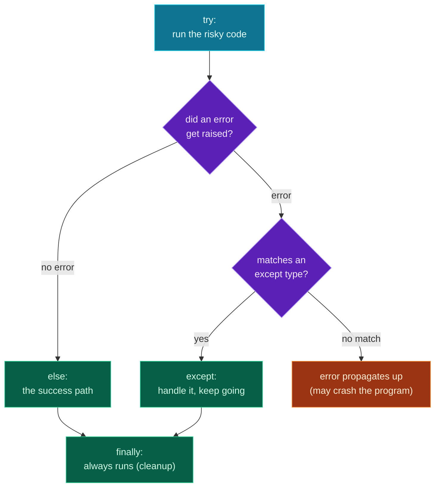

Welcome to **Module 4 — Robust Code**. Everything you've written so far assumes things go right. Real programs don't get that luxury: files go missing, users type letters where numbers belong, networks hiccup, an API returns something unexpected. The difference between a fragile script and software people can rely on is **how it handles failure**.

Today is **error handling**. You've *seen* plenty of errors (every "common errors" section!) — now you'll learn to **catch** them with `try`/`except` so your program recovers instead of crashing, **raise** your own errors to signal problems, and write **custom exceptions** that describe exactly what went wrong. You'll build a bank account that refuses bad transactions cleanly and keeps running through a stream of messy input.

> **A member lesson, Module 4 begins.** This is a genuine level-up: handling errors well is what separates beginner scripts from real software — and it's essential for the API and LLM calls coming later, where things fail all the time. Type along.

---

## `try` / `except`: catch instead of crash

When Python hits an error it can't handle, it **raises an exception** and — unless you catch it — the whole program stops. A `try`/`except` block lets you *attempt* risky code and *handle* the failure gracefully:

```python
try:
    x = int("not a number")   # this raises a ValueError
except ValueError:
    print("That wasn't a number!")
```

**Output:**

```text
That wasn't a number!
```

Python runs the `try` block; the moment something raises a `ValueError`, it jumps to the matching `except` block and runs that instead of crashing. After the `except`, the program carries on normally. That's the whole idea: *expect* that some things can fail, and decide what to do when they do.

### Catch the *specific* error, and read it

Always catch the **specific** exception type you expect (`ValueError`, `KeyError`, `FileNotFoundError`…), not everything. And you can capture the exception **object** with `as e` to see its message:

```python
try:
    x = int("abc")
except ValueError as e:
    print(f"Error: {e}")
```

**Output:**

```text
Error: invalid literal for int() with base 10: 'abc'
```

`e` is the exception itself; printing it shows Python's description of what went wrong — handy for logging and for showing the user a useful message.

---

## Handling different errors differently

A `try` can have several `except` blocks, each for a different error type — so you can respond appropriately to each:

```python
data = {"a": 1}
try:
    print(data["b"])
except KeyError:
    print("no such key")
except TypeError:
    print("wrong type")
```

**Output:**

```text
no such key
```

> **Avoid the bare `except:`.** Writing `except:` (or `except Exception:`) catches *everything* — including bugs you'd rather see, and even `Ctrl+C`. It hides the real problem behind a vague "something failed" and makes debugging miserable. Catch the specific types you actually expect; let the unexpected ones surface. (We'll show why in the errors section.)

---

## `else` and `finally`

Two optional clauses complete the picture. **`else`** runs only if the `try` block succeeded (no exception). **`finally`** runs *no matter what* — success, failure, or even a return — which makes it the place for cleanup (closing a file, releasing a resource):

```python
try:
    x = int("42")
except ValueError:
    print("bad input")
else:
    print(f"parsed {x}")        # only if no error
finally:
    print("cleanup always runs") # always, every time
```

**Output:**

```text
parsed 42
cleanup always runs
```

Use `else` for "the success path" (keeps it out of the `try`, so you only catch errors from the risky line), and `finally` for "do this regardless."

---

## `raise`: signalling your own errors

You don't only *catch* exceptions — you can **raise** them to signal that something is wrong in your own code. This is how a function says "you gave me something invalid" instead of silently doing the wrong thing:

```python
def set_age(age):
    if age < 0:
        raise ValueError("age cannot be negative")
    return age

try:
    set_age(-5)
except ValueError as e:
    print(f"Caught: {e}")
```

**Output:**

```text
Caught: age cannot be negative
```

`raise ValueError("...")` stops the function immediately and sends the error up to whoever called it — who can catch it. Raising errors early, with a clear message, is far better than letting bad data flow downstream and blow up somewhere confusing.

---

## Custom exceptions: errors that name themselves

Built-in exceptions (`ValueError`, `KeyError`…) are general. For your own program's specific problems, define a **custom exception** — a class that inherits from `Exception`. The body can be just `pass`; the *name* is the value:

```python
class TooColdError(Exception):
    pass

def check(temp):
    if temp < 0:
        raise TooColdError(f"{temp} degrees is freezing!")

try:
    check(-5)
except TooColdError as e:
    print(f"Caught custom: {e}")
```

**Output:**

```text
Caught custom: -5 degrees is freezing!
```

Custom exceptions pay off three ways: the name *documents* the failure (`InsufficientFundsError` says exactly what happened), callers can **catch that specific kind** and handle it differently from everything else, and your own errors are clearly distinct from Python's built-ins. This is the pattern every serious library uses — and the one your project uses now.

---

## The flow of `try` / `except` / `else` / `finally`



**Reading this diagram:**

Follow the flow from the top. The **cyan box** is the `try` block — your risky code runs here. Then the first **purple diamond** asks the key question: *did an error get raised?*

If **no error**, you take the left path to the green **`else`** box — the "success path," code that should run only when nothing went wrong. (If you have no `else`, the program just continues.)

If an **error** was raised, you go to the second **purple diamond**: *does it match one of your `except` types?* If **yes**, the matching green **`except`** block handles it and the program keeps going — crisis averted. If **no match**, you hit the orange **"propagates"** box: the error travels up to the calling code, and if nothing up there catches it either, the program crashes with a traceback.

Finally — literally — every path flows into the green **`finally`** box at the bottom. It runs **whether or not** there was an error, and even if one propagated. That's why `finally` is where cleanup goes: closing files, releasing resources, things that must happen regardless.

The takeaway: **`try` attempts, `except` catches what it recognises, `else` is the clean-success path, and `finally` always runs.** Catch what you expect; let the truly unexpected propagate so you find out about it.

---

## Build it: a bank account that refuses bad transactions

Let's make a robust account that raises **custom exceptions** for its own rules, and a driver loop that catches them and keeps going through messy input. Create **`safe_bank.py`** in a `day-13` folder:

```python
# safe_bank.py — error handling & custom exceptions (Day 13)

class InsufficientFundsError(Exception):
    """Raised when a withdrawal exceeds the balance."""
    pass

class InvalidAmountError(Exception):
    """Raised when an amount is zero or negative."""
    pass


class Account:
    def __init__(self, owner, balance=0):
        self.owner = owner
        self.balance = balance

    def withdraw(self, amount):
        if amount <= 0:
            raise InvalidAmountError(f"Amount must be positive, got {amount}.")
        if amount > self.balance:
            raise InsufficientFundsError(
                f"Cannot withdraw ${amount:.2f}; balance is ${self.balance:.2f}."
            )
        self.balance -= amount
        return self.balance


def parse_amount(text):
    """Turn user text into a number, or raise a clear ValueError."""
    try:
        return float(text)
    except ValueError:
        raise ValueError(f"'{text}' is not a number.")


# --- driving it with try/except ---
account = Account("Ada", 100)

requests = ["30", "abc", "500", "-10", "50"]
for text in requests:
    try:
        amount = parse_amount(text)
        balance = account.withdraw(amount)
        print(f"Withdrew ${amount:.2f}. Balance: ${balance:.2f}")
    except InsufficientFundsError as e:
        print(f"Declined: {e}")
    except InvalidAmountError as e:
        print(f"Declined: {e}")
    except ValueError as e:
        print(f"Bad input: {e}")

print(f"\nFinal balance: ${account.balance:.2f}")
```

**Run it** (`python3 safe_bank.py` / `python safe_bank.py`):

```text
Withdrew $30.00. Balance: $70.00
Bad input: 'abc' is not a number.
Declined: Cannot withdraw $500.00; balance is $70.00.
Declined: Amount must be positive, got -10.0.
Withdrew $50.00. Balance: $20.00

Final balance: $20.00
```

Five requests, three of them broken — and the program handled every one and kept running, ending at the correct `$20.00`. *That's* robustness.

### Understanding the code

- **`InsufficientFundsError` / `InvalidAmountError`** — custom exceptions (subclasses of `Exception`) named for the exact problems this account can have.
- **`withdraw` `raise`s** the right exception with a clear message when a rule is broken, instead of returning a bad result or printing and limping on.
- **`parse_amount`** catches Python's cryptic `ValueError` and **re-raises** a friendlier one — turning `invalid literal for int()...` into `'abc' is not a number.`
- **The driver loop** wraps each request in `try`, with a separate `except` for each failure type — so a bad number, an overdraft, and a negative amount each get their own clear message, and none of them stops the loop.
- **The program continues** through every error. No single bad input can crash it — the hallmark of code you can trust.

---

## Common errors and how to fix them

**1. `TypeError: exceptions must derive from BaseException`**
You tried to `raise` something that isn't an exception — like a string (`raise "oops"`) or a class that doesn't inherit from `Exception`. Raise an actual exception: `raise ValueError("oops")`, and make custom exceptions inherit from `Exception` (`class MyError(Exception):`).

**2. `SyntaxError: expected 'except' or 'finally' block`**
A `try:` block must be followed by at least one `except` (or a `finally`). A lone `try` is incomplete — add the `except` clause that handles what might go wrong.

**3. My `except` didn't catch the error (the program still crashed)**
You caught the *wrong type* — e.g. `except KeyError:` when the code actually raised a `ValueError`. An `except` only catches the type you name (and its subclasses). Read the traceback's last line for the *actual* type and catch that one.

**4. A bare `except:` is hiding my real bug**
`except:` (or `except Exception:`) swallows everything, so a typo or logic bug gets reported as your generic "something failed" message and you can't tell what really happened. Catch specific types; if you must catch broadly, at least log the exception (`except Exception as e: print(e)`) so you can see it.

**5. `except` order matters — a broad clause shadows a specific one**
If you put `except Exception:` *before* `except ValueError:`, the broad one catches first and the specific block never runs. Order your `except` clauses **most specific first**, general last.

**6. Catching an exception just to silently `pass`**
`except SomeError: pass` makes errors vanish without a trace — a future-you nightmare. If you truly want to ignore something, comment *why*. Usually you should at least log it or handle it meaningfully.

> **Reading tip:** the last line of a traceback names the exception type and message — that's exactly what to put in your `except` (the type) and what `as e` gives you (the message). Errors tell you how to catch them.

---

## Recap — what you can do now

Your programs can now survive the unexpected:

- ✅ **`try`/`except`** — catch errors and recover instead of crashing.
- ✅ **Specific exceptions** + `as e` to read the message (and why bare `except:` is bad).
- ✅ **Multiple `except`** blocks — handle each failure type differently, specific first.
- ✅ **`else`/`finally`** — the success path, and guaranteed cleanup.
- ✅ **`raise`** — signal problems in your own code with clear messages.
- ✅ **Custom exceptions** — `class XError(Exception)` that name and document failures.
- ✅ A **robust bank account** that validates transactions and runs through messy input.

### Day 13 cheat sheet

| Want to… | Write |
|---|---|
| Attempt risky code | `try:` |
| Handle a specific error | `except ValueError:` |
| See the message | `except ValueError as e:` |
| Run on success only | `else:` |
| Always run (cleanup) | `finally:` |
| Signal an error | `raise ValueError("msg")` |
| Define your own | `class MyError(Exception): pass` |
| Raise your own | `raise MyError("msg")` |

---

## Coming up on Day 14

Catching errors is half of robustness; the other half is *seeing what your program is doing* — especially when something goes wrong and you can't just stare at the code. Tomorrow covers **logging and debugging**: replacing scattered `print()` calls with Python's proper `logging` module (with levels like INFO, WARNING, ERROR), reading a traceback like a map, and practical techniques for finding bugs fast. It's how you diagnose problems in code that's too big to hold in your head.

You've learned to handle failure. Next, we learn to *observe* and diagnose it. See the full roadmap on the [Python for AI Engineering series page](/series/python-for-ai-engineering).

**See you on Day 14.** 🐍
